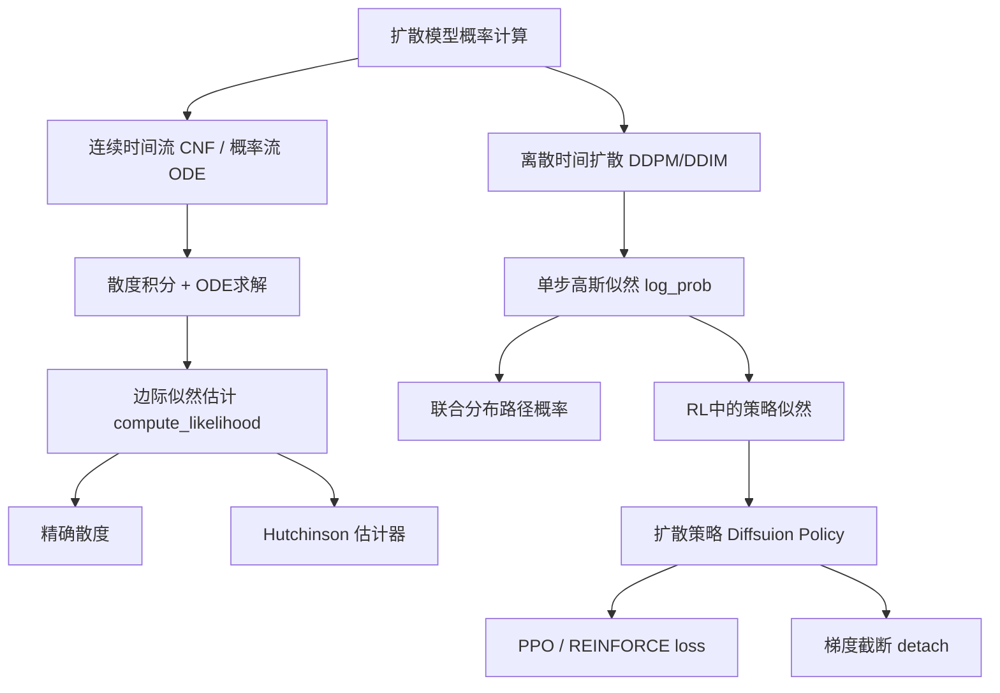

## 技术文档

| 文档版本 | 日期 | 作者 | 说明 |
|---------|------|------|------|
| 1.0 | 2026-06-09 | AI Assistant | 初版，整合扩散模型概率计算与RL应用 |

---

## 总览

### 文档目的

本文档系统阐述**扩散模型（Diffusion Models）中概率密度计算的核心方法**，以及这些方法在**强化学习（Reinforcement Learning, RL）**中的典型应用。重点分析两种实际代码实现：

1. **离散时间扩散模型的单步高斯对数似然**（`log_prob` 函数）
2. **连续归一化流的边际似然估计**（`compute_likelihood` 函数）

并解释它们如何支撑扩散策略（Diffusion Policy）的训练与推理。

### 知识结构图



### 各部分作用与关联

| 模块 | 作用 | 关联 |
|------|------|------|
| **单步高斯似然** | 计算条件转移概率 \(\log p(x_{t-1} \mid x_t)\) | 构建联合分布，用于RL路径似然 |
| **联合分布累加** | 将多个条件概率相乘（对数求和） | 作为策略的近似似然（有偏但实用） |
| **ELBO估计** | 通过正向路径采样估计边际似然的下界 | 评估生成质量，非RL主流 |
| **连续流似然** | 精确计算边际概率 \(\log p(x_0)\) | 生成模型评估，概率流ODE |
| **Hutchinson估计器** | 无偏估计散度，避免高维雅可比计算 | CNF中高效计算似然 |
| **扩散策略** | 用扩散模型表示动作分布 | 需要计算动作的对数概率用于策略梯度 |

### 优缺点与适用场景对比

| 方法 | 优点 | 缺点 | 适用场景 |
|------|------|------|----------|
| 单步高斯似然（累加） | 计算快、可直接微分 | 仅给出联合分布，非边际似然 | RL策略梯度、采样路径评估 |
| ELBO估计 | 理论上界，无偏估计（期望意义） | 需采样正向路径，方差大 | 模型测试、似然比较 |
| 连续流似然（精确散度） | 精确边际似然 | 计算复杂度 \(O(d)\)，高维不可行 | 低维数据、可解释性要求高 |
| 连续流似然（Hutchinson） | 计算复杂度 \(O(1)\)，无偏 | 估计方差，需多次平均 | 高维图像、点云、分子生成 |

---

## 第一章 扩散模型中的概率基础

### 1.1 扩散模型的概率视角

扩散模型定义两个随机过程：

- **正向过程**：从数据 \(x_0\) 出发，逐步添加高斯噪声，直至变为纯噪声 \(x_T \sim \mathcal{N}(0, I)\)。该过程是固定的马尔可夫链：
  \[
  q(x_{1:T} \mid x_0) = \prod_{t=1}^T q(x_t \mid x_{t-1}), \quad q(x_t \mid x_{t-1}) = \mathcal{N}(\sqrt{1-\beta_t}\,x_{t-1}, \beta_t I)
  \]

- **逆向过程**：从噪声 \(x_T\) 出发，逐步去噪生成数据。该过程由参数化模型学习：
  \[
  p_\theta(x_{0:T}) = p(x_T) \prod_{t=1}^T p_\theta(x_{t-1} \mid x_t)
  \]
  通常假设 \(p_\theta(x_{t-1} \mid x_t) = \mathcal{N}(\mu_\theta(x_t, t), \sigma_t^2 I)\)。

### 1.2 训练目标：变分下界（ELBO）

对数边际似然 \(\log p_\theta(x_0)\) 难以直接计算，转而最大化证据下界：

\[
\log p_\theta(x_0) \ge \mathbb{E}_{q(x_{1:T} \mid x_0)}\left[ \log p(x_T) + \sum_{t=1}^T \log \frac{p_\theta(x_{t-1} \mid x_t)}{q(x_t \mid x_{t-1}, x_0)} \right]
\]

在 DDPM 中，ELBO 可简化成简单的 MSE 损失（预测噪声）。而在需要精确似然的场景（如评估生成质量），ELBO 可作为下界估计。

### 1.3 DDIM 的确定性逆向

DDIM 将逆向过程改为非马尔可夫形式，允许**确定性采样**（\(\eta=0\)）：
\[
x_{t-1} = \sqrt{\bar{\alpha}_{t-1}} \cdot \hat{x}_0(x_t, t) + \sqrt{1 - \bar{\alpha}_{t-1} - \sigma_t^2} \cdot \epsilon_\theta(x_t, t)
\]
此时，从 \(x_T\) 到 \(x_0\) 的映射是确定的，因此可以通过变量变换公式计算边际似然（需计算雅可比行列式）。

---

## 第二章 离散时间扩散的单步对数似然（`log_prob`）

### 2.1 计算公式

给定逆向转移 \(p(x_{t-1} \mid x_t) = \mathcal{N}(\mu, \sigma^2 I)\)，其对数概率密度为（逐元素）：

\[
\log p(x_{t-1} = x \mid x_t) = -\frac{(x - \mu)^2}{2\sigma^2} - \log \sigma - \frac{1}{2}\log(2\pi)
\]

对于多维数据（如图像 \(H \times W\)），假设各维度独立同方差，总似然为各元素之和：

\[
\log p(x_{t-1} \mid x_t) = \sum_{h=1}^H \sum_{w=1}^W \left[ -\frac{(x_{h,w} - \mu_{h,w})^2}{2\sigma^2} - \log \sigma - \frac{1}{2}\log(2\pi) \right]
\]

### 2.2 代码实现解析

```python
std_dev_t_mul = torch.clip(std_dev_t, min=0.1)
log_prob = (
    -((prev_sample.detach() - prev_sample_mean) ** 2) / (2 * (std_dev_t_mul**2))
    - torch.log(std_dev_t_mul)
    - torch.log(torch.sqrt(2 * torch.as_tensor(math.pi)))
)
log_prob = log_prob.sum(dim=(-2, -1))   # 对 H, W 维度求和
```

#### 关键变量解释

| 变量 | 含义 | 来源 |
|------|------|------|
| `prev_sample` | 采样得到的 \(x_{t-1}\) | 通过 DDIM 采样公式从 \(x_t\) 生成 |
| `prev_sample_mean` | 高斯分布的均值 \(\mu\) | 由 DDIM 公式计算：\(\mu = \sqrt{\bar{\alpha}_{t-1}} \hat{x}_0 + \sqrt{1 - \bar{\alpha}_{t-1} - \sigma_t^2} \epsilon_\theta\) |
| `std_dev_t` | 理论标准差 \(\sigma_t\) | 由噪声调度和参数 \(\eta\) 决定：\(\sigma_t = \eta \sqrt{(1-\bar{\alpha}_{t-1})/(1-\bar{\alpha}_t)} \sqrt{1-\bar{\alpha}_t/\bar{\alpha}_{t-1}}\) |
| `std_dev_t_mul` | 实际使用的标准差 | `torch.clip(std_dev_t, min=0.1)` 防止数值不稳定 |

#### 特别设计：`detach()`

```python
(prev_sample.detach() - prev_sample_mean)
```

- **作用**：切断 `prev_sample` 的梯度，只让 `prev_sample_mean` 参与反向传播。
- **原因**：在 RL 中，`prev_sample` 是采样动作（随机变量），直接对其求导会引入高方差且违反策略梯度定理。通常需要将采样路径视为常数，只优化模型输出的均值/方差。此设计等价于**重参数化技巧**的反向应用——梯度不流过采样节点。

### 2.3 使用场景

1. **扩散模型训练（标准DDPM）**：通常不直接使用该似然，而是用噪声预测损失。似然主要用于评估或RL。
2. **强化学习中的扩散策略**：
   - 将整个去噪链视为生成动作的过程。
   - 计算每一步的 `log_prob` 并累加，得到**路径概率** \(\sum_{t=1}^T \log p(x_{t-1} \mid x_t) + \log p(x_T)\)。
   - 该路径概率作为策略的对数似然 \(\log \pi(a|s)\)（近似）用于策略梯度。

### 2.4 联合分布 vs 边际分布

累加 `log_prob` 得到的是**联合分布** \(\log p(x_{0:T})\)，而非边际分布 \(\log p(x_0)\)。在RL中，使用联合分布作为策略似然是一种**有偏估计**，但因为：

- 采样路径是固定的随机过程（如 Langevin 动力学）
- 策略梯度定理在扩展状态空间（包括中间变量）上仍然成立（参见 **Stochastic Computation Graphs** 理论）

实际中，许多扩散策略工作（如 Diffusion Policy, IDQL）直接使用联合分布，并取得良好效果。

---

## 第三章 连续归一化流似然计算（`compute_likelihood`）

### 3.1 基本原理

连续归一化流（CNF）定义一个常微分方程：
\[
\frac{dx}{dt} = v(x(t), t)
\]
其中 \(v\) 是参数化的速度场（神经网络）。概率密度沿流线演化满足**连续性方程**（无扩散的福克-普朗克方程）：
\[
\frac{\partial p_t}{\partial t} = -\nabla \cdot (p_t \, v)
\]
由此导出**瞬时变量变换公式**：
\[
\frac{d}{dt} \log p_t(x(t)) = -\nabla \cdot v(x(t), t)
\]

积分得：
\[
\log p_1(x_1) = \log p_0(x_0) - \int_0^1 \nabla \cdot v(x(t), t) dt
\]

反向积分（从 \(1\) 到 \(0\)）：
\[
\log p_1(x_1) = \log p_0(x_0) + \int_1^0 \nabla \cdot v(x(t), t) dt
\]

### 3.2 反向ODE与扩展状态

为同时求解轨迹和累积散度，定义扩展状态：
\[
y(t) = [x(t), a(t)], \quad \frac{da}{dt} = \nabla \cdot v(x(t), t)
\]
初始条件：\(x(1) = x_1,\ a(1) = 0\)。积分到 \(t=0\) 后，\(a(0) = \int_1^0 \nabla \cdot v \, dt\)。

最终对数似然：
\[
\log p_1(x_1) = \log p_0(x_0) + a(0)
\]

### 3.3 散度计算：精确 vs Hutchinson

#### 精确散度
\[
\nabla \cdot v = \sum_{i=1}^d \frac{\partial v_i}{\partial x_i}
\]
对速度场的每个输出分量分别求梯度，再取对角线和。需要 \(d\) 次自动微分，复杂度 \(O(d)\)。

#### Hutchinson 无偏估计器

**原理**：对于任意方阵 \(A\)，\(\mathrm{tr}(A) = \mathbb{E}_{z \sim p(z)}[z^\top A z]\)，其中 \(\mathbb{E}[zz^\top] = I\)。常用 \(z_i \sim \text{Rademacher}\)（\(\pm1\) 等概率）。

应用于散度：
\[
\nabla \cdot v = \mathrm{tr}(J_v) = \mathbb{E}_{z}[z^\top J_v z]
\]

**算法步骤**：
1. 采样 \(z \sim \text{Rademacher}\)，形状与 \(x\) 相同。
2. 计算标量 \(f = v(x)^\top z\)。
3. 计算梯度 \(g = \nabla_x f = J_v^\top z\)。
4. 估计值 \(\hat{d} = z^\top g = z^\top J_v z\)。

只需两次自动微分（一次 \(v\)，一次 \(g\)），与维度 \(d\) 无关。

**代码实现**（来自 `compute_likelihood`）：
```python
z = (torch.randn_like(x_1) < 0) * 2.0 - 1.0   # Rademacher
ut_dot_z = torch.einsum("ij,ij->i", ut.flatten(1), z.flatten(1))
grad_ut_dot_z = gradient(ut_dot_z, xt)
div = torch.einsum("ij,ij->i", grad_ut_dot_z.flatten(1), z.flatten(1))
```

### 3.4 ODE求解器

使用 `torchdiffeq.odeint` 进行数值积分：
- 支持固定步长（`step_size`）或自适应（如 `dopri5`）。
- 时间网格必须从 \(1.0\) 到 \(0.0\)（反向）。
- 返回所有中间状态，可分析轨迹。

### 3.5 与扩散模型的联系

扩散模型的**概率流ODE**（Song et al., 2021）将逆向扩散过程转化为确定性的ODE：
\[
dx = \left[ f(x,t) - \frac{1}{2} g(t)^2 \nabla_x \log p_t(x) \right] dt
\]
其中分数函数 \(\nabla_x \log p_t(x)\) 可由扩散模型（如DDPM）估计。此时，计算边际似然即可用上述连续流方法，这正是 `compute_likelihood` 的典型应用。

---

## 第四章 扩散模型在强化学习中的应用

### 4.1 扩散策略（Diffusion Policy）架构

**问题**：传统高斯策略表达能力有限，无法拟合多模态动作分布。扩散策略用扩散模型直接表示动作分布：
\[
\pi(a|s) = p_\theta(a_0 | s)
\]
其中 \(a_0\) 是去噪过程的最终输出（动作），条件信息 \(s\) 作为额外输入注入到噪声预测网络。

### 4.2 动作采样过程

1. 从标准高斯采样 \(a_T \sim \mathcal{N}(0, I)\)。
2. 从 \(t=T\) 到 \(t=1\) 执行 DDIM 逆向步骤，得到 \(a_0\)。
3. 输出 \(a_0\) 作为动作。

采样过程可看作一个可微分的计算图（使用重参数化），因此可以端到端优化。

### 4.3 对数似然在RL中的使用

策略梯度方法（如REINFORCE、PPO）需要计算 \(\nabla \log \pi(a|s)\)。在扩散策略中，有两种选择：

#### 选项A：使用联合分布的对数概率（累加 `log_prob`）

```python
log_prob_sum = 0
for t in reversed(range(1, T+1)):
    mu, sigma = model(x_t, t, s)
    x_{t-1} = sample(mu, sigma)
    log_prob_sum += log_gaussian(x_{t-1}, mu, sigma)
log_prob_sum += log_prob_prior(x_T)   # 通常是常数，可忽略
```

将这个 `log_prob_sum` 视为 \(\log \pi(a|s)\)，用于计算策略梯度。

**优点**：实现简单，每一步都可微分（除了`detach`处）。  
**缺点**：不是真正的边际似然，但在实践中往往足够。

#### 选项B：使用ELBO或概率流ODE计算精确边际似然

计算量较大，通常只在评估阶段使用，而非训练。

### 4.4 梯度处理与 `detach`

回顾 `log_prob` 代码：
```python
(prev_sample.detach() - prev_sample_mean)
```

这等价于：
\[
\nabla_{\theta} \log p(x_{t-1}|x_t) = \frac{x_{t-1} - \mu}{\sigma^2} \nabla_{\theta} \mu
\]
因为 `detach` 阻止了 \(\nabla x_{t-1}\) 的传播。这符合策略梯度定理的要求：**只有策略的参数（均值/方差）应被优化，采样结果视为随机变量而非参数函数**。

如果没有 `detach`，梯度会流过采样节点，相当于对重参数化路径也进行更新，可能导致高方差和不稳定。因此，`detach` 是保证策略梯度正确性的关键。

### 4.5 与标准RL损失结合

在PPO中，通常计算：
\[
L = \mathbb{E}\left[ \min\left( r(\theta) A, \text{clip}(r(\theta), 1-\epsilon, 1+\epsilon) A \right) \right]
\]
其中 \(r(\theta) = \frac{\pi_\theta(a|s)}{\pi_{\text{old}}(a|s)}\)。这里需要计算新旧策略下动作的对数概率之比。因此，`log_prob` 是直接输入到PPO loss中的。

---

## 第五章 总结与对比

| 概念 | 离散时间扩散（单步） | 连续时间流（CNF） |
|------|---------------------|-------------------|
| 概率对象 | 条件转移 \(p(x_{t-1}\mid x_t)\) | 边际似然 \(p_1(x_1)\) |
| 计算方式 | 解析高斯公式 | 数值ODE积分 + 散度 |
| 复杂度 | \(O(1)\) 每步 | \(O(\text{NFE} \cdot C_{\text{div}})\) |
| 散度估计 | 不涉及 | 精确或Hutchinson |
| 在RL中的角色 | 用于构建路径似然 | 较少用于RL（计算重） |
| 典型代码 | `log_prob` 函数 | `compute_likelihood` 函数 |

### 最终建议

- 若需要**快速训练扩散策略**，使用联合分布累加 `log_prob` 即可。
- 若需要**评估生成模型的对数似然**（作为指标），使用连续流方法（概率流ODE + Hutchinson）最为准确。
- 在RL实现中，务必使用 `detach()` 阻止梯度流过采样节点，遵循策略梯度定理。

---

## 附录：完整可运行代码示例

### A.1 模拟扩散单步对数似然计算

```python
import torch
import math

def log_gaussian(x, mu, sigma):
    """
    x, mu, sigma: torch.Tensor of same shape
    returns scalar log probability summed over last two dims (H,W)
    """
    sigma = torch.clip(sigma, min=0.1)  # 稳定数值
    log_prob = -((x - mu) ** 2) / (2 * sigma**2) - torch.log(sigma) - 0.5 * math.log(2 * math.pi)
    return log_prob.sum(dim=(-2, -1))  # 对H,W求和

# 模拟数据
batch, C, H, W = 4, 3, 32, 32
prev_sample = torch.randn(batch, C, H, W)
prev_sample_mean = torch.randn(batch, C, H, W)
std_dev_t = torch.tensor([0.2])  # 理论标准差

logp = log_gaussian(prev_sample, prev_sample_mean, std_dev_t)
print(f"Log probability shape: {logp.shape}")  # [4]
```

### A.2 简单PPO策略更新片段（伪代码）

```python
# 假设已采样 batch 数据
with torch.no_grad():
    old_log_probs = diffusion_policy.get_log_prob(actions, states).detach()

# 更新策略
for _ in range(ppo_epochs):
    new_log_probs = diffusion_policy.get_log_prob(actions, states)
    ratio = torch.exp(new_log_probs - old_log_probs)
    surr1 = ratio * advantages
    surr2 = torch.clamp(ratio, 1-eps, 1+eps) * advantages
    policy_loss = -torch.min(surr1, surr2).mean()
    # ... 价值损失、熵正则等
```

---

## 参考文献

1. Ho et al., "Denoising Diffusion Probabilistic Models", NeurIPS 2020.
2. Song et al., "Score-Based Generative Modeling through Stochastic Differential Equations", ICLR 2021.
3. Chen et al., "Neural Ordinary Differential Equations", NeurIPS 2018.
4. Janner et al., "Diffusion Policies for Robot Learning", CoRL 2022.
5. Hutchinson, "A stochastic estimator of the trace of the influence matrix for Laplacian smoothing splines", 1989.
6. Schulman et al., "Proximal Policy Optimization Algorithms", arXiv 2017.

--- 

**文档结束**