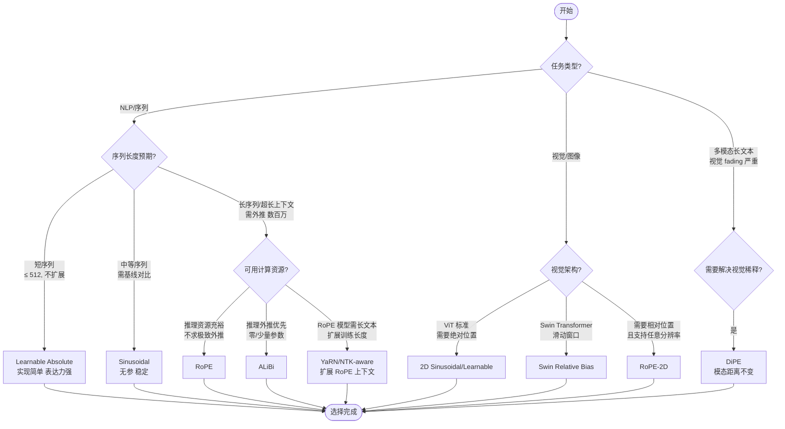

> Transformer 的核心痛点在于其注意力机制本质上是“无序”的：它天生是一台倍受称赞的“并行熔炉”，能让海量词汇在矩阵中交融碰撞，但正因如此，它也完全无法感知“先来后到”的顺序。而**位置编码正是赋予 Transformer“时间感”的魔法**，这段持续的演进史也是一部大模型从“固定地图”迈向“无限几何”的探索史。

---

## 📊 横向分析：位置编码的江湖派系与功法大全

本章采用横向分析法，从算法族谱构建入手，全面覆盖从经典到前沿的各大门派，包括原始 Transformer 的**正弦/余弦编码**、BERT 的**可学习绝对位置编码**、Shaw 开创的**相对位置编码**、Transformer-XL 提出的增强型相对位置编码、T5 的精简版**相对位置偏置**、目前占据统治地位的 **RoPE (旋转位置编码)**、以其极致外推能力著称的 **ALiBi**，以及 KERPLE、Sandwich、CoPE、DiPE 等前沿探索。除此之外，本节还将专门分析图像/视频领域的 **2D 结构化位置编码**以及能够递归生成任意长度位置嵌入的 **FLOATER** 等方案。**族谱是框架，原理是灵魂**，我将在本节末尾将这些丰富的原理汇总至一个综合对比维度表中，以便于横向权衡。

### 1. 算法族谱：六大类全流派一览

根据设计思想与数学结构，主流位置编码算法可分为六大类。下图展示了各类别之间的演进脉络：

```mermaid
flowchart TD
    PE[位置编码 Position Encoding] --> Absolute[绝对位置编码<br>Absolute PE]
    PE --> Relative[相对位置编码<br>Relative PE]
    PE --> Bias[注意力偏置类<br>Attention Bias]
    PE --> Rotary[旋转位置编码<br>Rotary PE]
    PE --> Hybrid[混合/上下文感知类<br>Hybrid/Contextual]
    PE --> Functional[函数式/递归式<br>Functional/Recursive]

    Absolute --> Sinusoidal[Sinusoidal 正弦/余弦<br>Vaswani et al., 2017]
    Absolute --> Learnable[Learnable 可学习<br>BERT, 2018]
    Absolute --> 2DAbs[2D 结构化<br>ViT, DETR, 2020]

    Relative --> Shaw[Shaw 相对编码<br>Shaw et al., 2018]
    Relative --> TransformerXL[Transformer-XL<br>Dai et al., 2019]
    Relative --> T5[T5 相对位置偏置<br>Raffel et al., 2019]

    Bias --> ALiBi[ALiBi 线性偏置<br>Press et al., 2022]
    Bias --> KERPLE[KERPLE 核化偏置<br>Chi et al., 2022]
    Bias --> Sandwich[Sandwich<br>ICLR 2023]

    Rotary --> RoPE[RoPE 旋转<br>Su et al., 2021]
    Rotary --> XPOS[XPOS<br>Sun et al., 2022]
    Rotary --> YaRN[YaRN 扩展<br>Peng et al., 2023]

    Hybrid --> CoPE[CoPE 上下文感知<br>Golovneva et al., 2024]
    Hybrid --> HoPE[HoPE 高频旋转<br>ACL 2025]
    Hybrid --> MHA[Multi-Head Adaptive<br>Tu et al., 2024]

    Functional --> FLOATER[FLOATER 连续动态<br>Liu et al., ICML 2020]
```

### 2. 算法原理大全

#### 2.1 绝对位置编码 (Absolute Position Encoding)

**Sinusoidal (正弦/余弦)** **（Vaswani et al., 2017，绝对位置编码）**  
- **数学定义**：  
  $$PE_{(pos, 2i)} = \sin\left(\frac{pos}{10000^{2i/d_{model}}}\right),\quad PE_{(pos, 2i+1)} = \cos\left(\frac{pos}{10000^{2i/d_{model}}}\right)$$  
  其中 $pos$ 为位置序号，$i$ 为维度索引，$d_{model}$ 为模型维度。  
- **设计动机**：使用不同频率的正/余弦波构成编码，使 Transformer 无需训练即可获得位置信息，且理论上可处理任意长度序列。  
- **工作方式**：将位置编码与词嵌入向量按元素相加，得到带有绝对位置信息的输入表示。  
- **直观示例**：当 $d_{model}=4$ 时，$pos=0$ → $[\sin(0),\cos(0),\sin(0),\cos(0)]=[0,1,0,1]$；$pos=1$ → $[\sin(1/10000^0),\cos(1/10000^0),\sin(1/10000^{0.5}),\cos(...)]$。

**Learnable (可学习绝对位置编码)** **（BERT, 2018，绝对位置编码）**  
- **数学定义**：$P \in \mathbb{R}^{L_{max} \times d_{model}}$ 为可训练参数矩阵，输入 token $t$ 在位置 $p$ 的最终嵌入为 $x_p = e_t + P[p]$。  
- **设计动机**：让模型根据任务数据分布自动学习最适配的位置表示模式，相比固定的 Sinusoidal 编码更灵活，表达能力更强。  
- **工作方式**：在模型训练过程中，位置嵌入矩阵与模型其他参数一同通过反向传播更新。  
- **直观示例**：若 $L_{max}=512$，$d_{model}=768$，则位置嵌入为一个 $512 \times 768$ 的可训练矩阵，相当于为每个可能位置“量身定制”一个初始随机向量，通过训练逐渐收敛到对目标任务最有利的表示。

#### 2.2 相对位置编码 (Relative Position Encoding)

**Shaw et al. (Shaw 相对编码)** **（Shaw et al., 2018，相对位置编码）**  
- **数学定义**：  
  $$e_{ij} = \frac{x_i W^Q (x_j W^K + a_{ij}^K)^T}{\sqrt{d_z}}$$  
  其中 $a_{ij}^K$ 是基于相对距离 $i-j$ 的可学习嵌入。  
- **设计动机**：直接将相对位置信息引入注意力分数计算，使模型能够显式感知 token 间的“远近关系”。  
- **工作方式**：计算注意力分数时，为每个 query-key 对 $(i,j)$ 添加一个基于 $i-j$ 的向量，而非仅用绝对位置相加。

**Transformer-XL** **（Dai et al., 2019，相对位置编码）**  
- **数学定义**：完全重构注意力分数为四项之和，其中第三项 $E_{m-n}$ 是基于三角函数的相对位置编码矩阵，与绝对位置解耦。  
- **设计动机**：支持跨段（segment）循环复用历史状态，解决长文本建模中的上下文碎片化问题。  
- **工作方式**：引入段级循环机制（segment-level recurrence），将上一段计算的隐藏状态缓存并复用于下一段处理，同时配合相对位置编码解决跨段位置混淆问题。

**T5 Relative Bias (T5 相对偏置)** **（Raffel et al., 2019，相对位置编码）**  
- **数学定义**：注意力分数计算为 $scores = QK^T + B$，其中 $B$ 为可学习的位置偏置矩阵，维度为 $(query\_length, key\_length, num\_heads)$。  
- **设计动机**：简化 Shaw 的复杂四项设计，用最少的改动实现相对位置建模，同时通过分桶（bucketing）策略压缩参数量。  
- **工作方式**：计算相对距离后进行分桶映射，再通过可学习表查得偏置值。编码器采用双向（bidirectional）分桶；解码器采用单向（causal）分桶，并将右上三角区域映射到更高区间以保持因果性。

#### 2.3 注意力偏置类 (Attention Bias)

**ALiBi (Attention with Linear Biases)** **（Press et al., 2022，注意力偏置类）**  
- **数学定义**：  
  $$\text{score}(i,j) = \frac{q_i^\top k_j}{\sqrt{d_k}} + m \cdot (i-j)$$  
  其中 $m$ 为头级（per-head）的超参数斜率（通常固定为几何序列）。  
- **设计动机**：完全舍弃位置嵌入，通过线性距离偏置直接塑造注意力得分，实现极强外推能力。  
- **工作方式**：不添加任何位置嵌入，仅在 Softmax 前为注意力分数加上与 Query-Key 距离成正比的线性衰减项。远距离 token 自然获得较低注意力权重。  
- **直观示例**：假设第一个 head 的 $m=-0.1$，则当 $i=5, j=3$ 时，$m\cdot(i-j)=-0.2$；当 $i=5, j=1$ 时，$m\cdot(i-j)=-0.4$，距离越远惩罚越大。

**KERPLE (Kernelized Relative Positional Embedding)** **（Chi et al., 2022，注意力偏置类）**  
- **数学定义**：使用条件正定（CPD）核函数对相对距离进行核化：$b(i,j) = -r \cdot |i-j|^p$，其中 $r>0, p\in\{1,2\}$ 为可学习参数。  
- **设计动机**：通过核方法泛化 RPE，从数学上推导出对数核、幂核等多种变体，兼顾外推性能与理论完备性。  
- **工作方式**：选择核函数族（如 -r|d| 或 -r|d|²），对相对距离 $d=i-j$ 计算核值，直接作为注意力偏置加到 Softmax 前。

**Sandwich** **（ICLR 2023，注意力偏置类）**  
- **数学定义**：双向线性偏置：$b(i,j) = m_1 \cdot (i-j) + m_2 \cdot (j-i)$ 形式。  
- **设计动机**：改进 ALiBi 单向线性偏置在复杂递归任务上的表现。  
- **工作方式**：对注意力分数同时添加 Query-Key 距离与 Key-Query 距离的线性偏置。

#### 2.4 旋转位置编码 (Rotary Position Encoding) 及其长文本扩展

**RoPE (Rotary Position Embedding)** **（Su et al., 2021，旋转位置编码）**  
- **数学定义**：将 $d_{model}$ 维向量按相邻两维配对视为复数，对位置 $m$ 的向量应用旋转矩阵：  
  $$f_{\{q,k\}}(x_m, m) = R_{\Theta,m} \cdot x_m$$  
  其中 $R_{\Theta,m} = \begin{bmatrix}\cos m\theta_0 & -\sin m\theta_0 & 0 & 0 \\ \sin m\theta_0 & \cos m\theta_0 & 0 & 0 \\ 0 & 0 & \cos m\theta_1 & -\sin m\theta_1 \\ 0 & 0 & \sin m\theta_1 & \cos m\theta_1 \\ & & & \ddots \end{bmatrix}$，$\theta_i = 10000^{-2i/d_{model}}$。  
- **设计动机**：将位置信息“旋转”进 Query 和 Key 向量中，使注意力机制的相对位置属性获得封闭形式解。  
- **工作方式**：在计算 $Q$ 和 $K$ 前，将 token 向量按维度配对旋转相应角度。旋转后 $Q_m$ 和 $K_n$ 的内积包含绝对位置 $m$、$n$ 的三角函数差 $ \cos(m-n)θ_i $，自然导出相对位置$10$。

**POSINT / PI (Position Interpolation)** **（Chen et al., 2023，RoPE扩展）**  
- **数学定义**：在推理时对位置索引进行线性压缩：$m' = \frac{L_{train}}{L_{test}} \cdot m$，等价于将 $\theta_i$ 替换为 $\theta'_i = \theta_i / s$。  
- **设计动机**：让训练中从未见过的超大索引 $m$ 被“压”回到已训练过的角度范围内，避免低频维度外推崩溃。  
- **工作方式**：推理时将实际位置 $m$ 乘以缩放因子 $1/s$（$s = L_{test} / L_{train}$），将长序列的位置映射到训练长度范围内。

**NTK-aware RoPE** **（NTK 感知缩放, 2023，RoPE扩展）**  
- **数学定义**：非均匀缩放频率基底：$\theta'_i = 10000^{-2i/d_{model}} \cdot (s)^{-\frac{2i}{d_{model}}}$，导致高频维度几乎不缩放，低频维度大幅压缩。  
- **设计动机**：遵循 NTK 理论，高频信息的缩放会严重破坏模型对局部的感知，只对低频进行插值，实现了“高频外推、低频内插”。

**YaRN (YaRN: Efficient Context Window Extension of Large Language Models)** **（Peng et al., 2023，RoPE扩展）**  
- **数学定义**：综合运用 NTK-aware 缩放、NTK-by-parts 分频策略、以及温度调节：$\phi(m) = m \cdot \text{scale}_{\text{temp}}$。  
- **设计动机**：对波长小于训练长度的维度不插值，仅对波长大于训练长度的维度进行插值，并配合温度缩放避免注意力分布过度尖锐。  
- **工作方式**：自适应波长分析决定哪些维度需要插值，同时引入温度系数放大注意力得分中的位置差异。

**XPOS (Extended Positional Encoding)** **（Sun et al., 2022，旋转位置编码变体）**  
- **数学定义**：在 RoPE 旋转基础上引入衰减因子 $\gamma^{|i-j|}$，使远距离 token 的注意力权重以指数速率衰减。  
- **设计动机**：增强模型的局部聚焦能力，避免超长序列中远距离 token 对当前 token 产生过多干扰。  
- **工作方式**：在注意力分数的指数项中引入基于相对距离 $|i-j|$ 的衰减因子 $\gamma^{|i-j|}$，实现对长距离信息的软抑制。

**HoPE (High-frequency Rotary Position Encoding)** **（ACL 2025，旋转位置编码变体）**  
- **数学定义**：打破 RoPE 固有的长期衰减假设，用与位置无关的高频信号替换 RoPE 中的特定组件。  
- **设计动机**：传统位置编码基于“远距离 token 信息相关性更低”的假设，但 LLM 实际学习到的是 U 形注意力模式。HoPE 试图消除长期衰减的约束，增强模型的上下文感知能力。  
- **工作方式**：通过实证分析揭示 RoPE 的 U 形注意力模式，并创新性地用位置无关的高频组件替换原有特定组件，仅保留高频信号。**荣获 ACL 2025 SAC Highlight Award**。

#### 2.5 混合/上下文感知类 (Hybrid/Contextual)

**CoPE (Contextual Position Encoding)** **（Golovneva et al., 2024，上下文感知类）**  
- **数学定义**：仅在模型确定的“重要 token”上递增位置计数：$pos_{i+1} = pos_i + \text{gate}(x_i)$，其中 $\text{gate}(x_i) \in \{0,1\}$ 由模型学习决定。  
- **设计动机**：传统 PE 对所有 token 一视同仁，难以处理“第三个句子”这类抽象位置概念。CoPE 让模型根据内容选择性地编码位置。  
- **工作方式**：引入门控机制，对名词、动词等“重要 token”进行位置计数递增，对介词、标点等则不计入。可解决选择性复制、计数等标准 PE 难以处理的硬任务。

**DiPE (Distance Invariant Position Encoding)** **（Chen et al., 2026，跨模态位置编码）**  
- **数学定义**：将位置编码解耦为模态内自然相对位置 + 模态间锚定感知接近性：$PE_{total} = PE_{intra} + \alpha \cdot PE_{inter}$。  
- **设计动机**：解决多模态场景中视觉 token 随文本序列增长而被“稀释”（Visual Fading）的问题。  
- **工作方式**：模态内 token 沿用自然的相对位置编码以保持局部结构；不同模态间的交互则施加锚定的感知接近性惩罚，确保视觉信号不会随上下文长度增加而被稀释。代码已开源 https://github.com/lchen1019/DIPE。

**Wavelet-based Positional Representation** **（2025，混合/上下文感知类）**  
- **数学定义**：将 RoPE 解释为受限的小波变换，并扩展到多尺度小波基，在不同尺度（窗口大小）上并行编码位置信息。  
- **设计动机**：RoPE 被解释为仅使用固定尺度参数的受限小波变换，未充分利用多尺度能力。该方法利用小波变换的多种尺度捕捉非平稳信号的细微变化。  
- **工作方式**：通过多尺度小波变换捕获不同窗口大小的信息，同时不限制模型的注意力范围，大幅改善长序列外推性能。

**PaPE (Parabolic Position Encoding)** **（2026，视觉专用类）**  
- **数学定义**：基于抛物线函数定义位置编码，专为视觉 Transformer 设计，支持任意分辨率输入外推。  
- **设计动机**：为视觉模态设计专用的位置编码，解决现有 PE 在视觉任务中对几何变换和分辨率变化的适应性不足问题。  
- **工作方式**：利用抛物线的平滑性质生成位置编码，在图像分辨率变化时可平滑插值，保证了视觉特征的几何一致性。

**MHA (Multi-Head Adaptive Positional Encoding)** **（Tu et al., 2024，混合/上下文感知类）**  
- **数学定义**：为每个注意力头使用不同的 RoPE 基底，形成多头自适应频率分布。  
- **设计动机**：不同注意力头可能需要不同粒度的位置信息。  
- **工作方式**：为每个注意力头独立配置旋转频率基底参数，各头可学习到从局部到全局的不同位置感知粒度。

**MEP (Multiple Kernel Learning RPE)** **（2024，混合/上下文感知类）**  
- **数学定义**：采用加权平均组合不同核函数（如指数核、高斯核）以生成应用于注意力分数的偏差。  
- **设计动机**：单一核函数的表达力有限，借鉴 KERPLE 并引入多核融合策略。  
- **工作方式**：每个注意力头使用多个核函数（不同内核参数），通过可学习的权重系数自适应融合，输出最终偏置分数。

#### 2.6 函数式/递归式 (Functional/Recursive)

**FLOATER (Learning to Encode Position with Continuous Dynamical Model)** **（Liu et al., ICML 2020，函数式/递归式）**  
- **数学定义**：用连续动态系统（常微分方程 ODE）生成任意位置的编码：$h(t) = h(0) + \int_0^t f_\theta(h(\tau), \tau) d\tau$，离散采样得 $PE_{pos} = h(pos \cdot \Delta t)$。  
- **设计动机**：同时满足可归约性（任意长度）、可学习性与低参数性三大理想特性。  
- **工作方式**：使用神经常微分方程（Neural ODE）建模连续位置空间，从 $h(0)$ 积分到所需位置生成编码，参数量与序列长度无关。

**GRPE (Group Representational Position Encoding)** **（2025，函数式/递归式）**  
- **数学定义**：基于群表示论的通用框架，将 RoPE 和 ALiBi 作为其特例，并引入流式缓存能力。  
- **设计动机**：在统一的数学框架下统一绝对和相对位置编码，兼具两者的优势。  
- **工作方式**：利用群论中的表示理论构建位置几何空间，对群元素进行规范化编码，在长上下文模型中实现严格相对律。

**GeoPE (Unified Geometric Positional Embedding)** **（Yao et al., 2025，函数式/递归式）**  
- **数学定义**：通过四元数将旋转扩展到 3D 欧氏空间，在 Lie 代数中通过几何平均构造统一的旋转算子。  
- **设计动机**：为结构化张量设计统一的位置嵌入，实现几何耦合的位置编码。  
- **工作方式**：对 3D 空间数据进行四元数旋转编码，几何分离不同空间维度的位置信息。

#### 2.7 2D 结构化位置编码（视觉/图像专用）

**2D Sinusoidal / Learnable** **（ViT, Dosovitskiy et al., 2020，2D 结构化 PE）**  
- **数学定义**：将 2D 位置 $(h,w)$ 直接输入 Sinusoidal 函数，或使用可学习的 $H \times W \times d_{model}$ 嵌入矩阵。  
- **设计动机**：将一维序列位置编码思想扩展到二维图像网格。  
- **工作方式**：对于图像 Patch 网格中的坐标 $(h,w)$，可展平为一维位置（ViT 策略），或独立编码 $h$ 和 $w$ 后再组合。

**Swin Relative Position Bias** **（Swin Transformer, Liu et al., ICCV 2021，2D 结构化 PE）**  
- **数学定义**：在窗口（Window）内计算二维相对坐标 $(\Delta x, \Delta y)$，通过映射函数 $idx = \Delta x \cdot (2M-1) + \Delta y$ 索引可学习偏置表。  
- **设计动机**：为滑动窗口自注意力提供局部化的 2D 相对位置感知能力。  
- **工作方式**：在窗口内计算所有 Patch 间的二维相对坐标，通过映射转为一维索引后查表获得偏置值，加在注意力分数上。训练时窗口大小为 M，微调时可通过双线性插值适配不同分辨率。

**RoPE-2D** **（视觉 RoPE 扩展，2023-2025，2D 结构化 PE）**  
- **数学定义**：独立对高度维度和宽度维度执行 RoPE 旋转，组合为 $R_{\Theta_h,h} \otimes R_{\Theta_w,w}$。  
- **设计动机**：将 RoPE 从一维序列自然地推广到二维图像空间。  
- **工作方式**：Patch 的编码为 $f_{2D}(x,(h,w)) = R_{\Theta_w,w}(R_{\Theta_h,h}(x))$，即先在高度方向旋转，再在宽度方向旋转，实现可分离的二维旋转编码。

### 3. 综合对比维度表

| 算法名称 | 核心思想（一句话） | 原理详解 | 收敛速度/性能 | 额外内存开销 | 超参数敏感性 | 泛化能力影响 | 并行/分布式兼容性 | 硬件友好性 | 适用场景 | 主要优缺点 | 前沿标记（近3年论文/库支持） |
|:--|:--|:--|:--|:--|:--|:--|:--|:--|:--|:--|:--|
| **Sinusoidal** | 不同频率正/余弦函数生成绝对位置编码 | 见 2.1 | 短序列稳定；长序列外推随长度增加迅速衰减 | 几乎为 0 | 低（固定编码） | 外推弱；内插可用 | 完全兼容 | 极友好（仅浮点运算） | 中短序列，基线对比 | 无参数、可解析；外推差、表达力有限 | 经典，HuggingFace 原生支持 |
| **Learnable** | 可训练嵌入矩阵为每个位置学习编码 | 见 2.1 | 训练集内高效；但受限于 $L_{max}$ | $L_{max} \times d_{model}$ | 中（受训练数据影响） | 外推差（$> L_{train}$ 无定义） | 完全兼容 | 友好（查表操作） | 固定长度任务 | 表达力强；无法外推 | 经典，BERT/BART 等主流支持 |
| **Shaw et al.** | 将相对距离嵌入直接加入 Query-Key 交互 | 见 2.2 | 中等，序列长时 $O(L^2 \times d)$ 影响吞吐 | $O(L^2 \times d_{model})$ 矩阵存储 | 低至中 | 外推好，但受限于最大距离裁剪 | 低（需存储偏置矩阵） | 中等（大矩阵内存压力大） | 相对位置建模（早期） | 引入相对信息；复杂度高 | 经典 |
| **Transformer-XL** | 段级循环 + 相对编码解决上下文碎片 | 见 2.2 | 长文本语言建模困惑度显著优于基线 | 缓存 $O(L_{seg} \times d)$ 历史状态 | 中（需缓存策略调优） | 外推极强（相对编码+循环） | 跨段串行，段内并行 | 友好（段内计算常规） | 长文本生成、DNA 分析 | 循环机制极长上下文；复杂度相对高 | 经典 |
| **T5 bias** | 可学习相对偏置 + 分桶压缩参数量 | 见 2.2 | 强，T5 系列模型验证 | $num_{buckets} \times num_{heads}$ 极小 | 低（分桶策略稳定） | 外推受限（$max\_distance$ 截断） | 完全兼容 | 极友好（轻量查表） | 通用 NLP | 参数少，实现简单；截断破坏远端依赖 | 经典，T5 原生 |
| **RoPE** | 旋转矩阵将位置“乘”入 Q/K 获得相对性 | 见 2.4 | 目前 LLM 主流选择（LLaMA/Qwen） | 几乎为 0（仅旋转计算） | 中（$\theta_i$ 基底需设计） | 外推差需插值扩展 | 完全兼容，可融合至注意力核 | 友好（仅复数运算） | 现代 LLM，长序列 | 封闭式相对性；外推需求道 | 前沿，LLaMA/Qwen/ChatGLM 等原生支持 |
| **PI (Position Interpolation)** | 线性压缩位置索引缩放回训练范围 | 见 2.4 | 需微调约 1000 步恢复性能 | 约 0 | 低（简单缩放） | 成功实现长度扩展；破坏局部分辨率 | 完全兼容 | 友好（仅索引缩放） | RoPE 模型长文本微调 | 简单直接；破坏短距离关系 | 前沿（2023），支持 RoPE 的模型均可 |
| **NTK-aware RoPE** | “高频外推、低频内插”的非均匀缩放 | 见 2.4 | 免训练外推，短距离保持优于 PI | 0 | 中（基底缩放参数） | 外推优于 PI，仍有上限 | 完全兼容 | 友好（频率缩放） | RoPE 模型免训练扩展 | 无需微调；外推有限 | 前沿（2023） |
| **YaRN** | 结合 NTK 策略与温度缩放的 RoPE 扩展 | 见 2.4 | 外推长度显著优于 PI/NTK | 0（无需额外参数） | 低（波长/温度自动确定） | 外推极强，可达 2-4 倍扩展 | 完全兼容 | 友好（计算量略增） | RoPE 模型极致长度扩展 | 效果最优；复杂性适中 | 前沿（2023），主流长文本 LLM 采用 |
| **ALiBi** | 线性距离偏置直接塑造注意力分数 | 见 2.3 | 短训练序列外推广效应优越 | 0 | 低（斜率 m 固定为几何序列） | 外推极强 | 完全兼容 | 极友好（仅加法） | 推理外推优先 | 无参数量、最优外推；长距离依赖建模受限 | 前沿，BLOOM/MPT 原生支持 |
| **KERPLE** | 核函数泛化相对偏置 | 见 2.3 | 对数核与外推性能优秀 | $O(1)$（核函数参数极少量） | 高（核形态与参数选择） | 理论上有保证 | 完全兼容 | 友好（核函数简单） | 理论驱动设计 | 数学优雅；参数选择敏感 | 前沿（2022） |
| **Sandwich** | 双向线性偏置改进 ALiBi | 见 2.3 | 在某些递归任务优于 ALiBi | 0 | 低（两个斜率参数） | 优于 ALiBi（对称场景） | 完全兼容 | 友好（加法） | 复杂递归/双向依赖 | 平衡对称；未成为主流 | 前沿（2023 ICLR） |
| **XPOS** | RoPE + 指数衰减因子 | 见 2.4 | 增强局部聚焦 | 0（衰减因子预计算） | 中（衰减率 $\gamma$） | 外推中等 | 完全兼容 | 友好（简单乘法） | 局部注意力增强 | 控制长程干扰；牺牲部分长距离信息 | 前沿（2022） |
| **CoPE** | 上下文感知门控位置计数 | 见 2.5 | 选择性复制/计数任务显著改善 | 增加门控网络参数量 | 高（门控机制需训练） | 外推能力强（抽象层次） | 兼容但需修改 | 中等（额外网络层） | 抽象任务、代码理解、选择性复制 | 突破性思路；增加复杂性 | 前沿（2024），新思想尚未广泛部署 |
| **HoPE** | 高频旋转打破长程衰减原则 | 见 2.4 | 提升上下文感知与外推 | 约 0 | 中（高频信号配置） | 优于 RoPE | 与 RoPE 类似 | 友好 | LLM 长上下文场景 | 颠覆性假设；新思想仍需验证 | ACL 2025 Highlight，极前沿 |
| **FLOATER** | 神经常微分方程生成位置编码 | 见 2.6 | 特定任务提升；训练复杂度高 | ODE 网络参数量 | 高（ODE 求解器与网络参数） | 理论上任意长度 | 中等（ODE 求解序列依赖） | 低（ODE 求解开销大） | 可学习 PE 学术研究 | 满足三大理想特性；求解器开销大 | 前沿但小众（ICML 2020） |
| **Swin Relative Bias** | 二维窗口可学习相对偏置 | 见 2.7 | 视觉任务 SOTA | $O((2M-1)^2 \times num_{heads})$ | 中（窗口大小 M 影响） | 插值支持变分辨率 | 窗口内并行，窗口间串行 | 友好 | 视觉任务（分类/检测/分割） | 适配视觉滑动窗口；依赖窗口划分 | 经典（ICCV 2021 Best Paper） |
| **DiPE** | 模态距离不变位置编码 | 见 2.5 | 减轻 VLM 长上下文中的视觉 fading | 极小（解耦参数） | 中（模态间权重 $\alpha$） | 长多模态上下文 | 完全兼容 | 友好 | 多模态长上下文 VLM | 解决关键痛点；新提出 | 极前沿（2026 arXiv），代码已开源 |
| **Wavelet-based PE** | 多尺度小波编码替代 RoPE | 见 2.5 | 长短上下文均提升；外推尤其突出 | 小波变换计算开销 | 中（尺度与基的选择） | 极强（多尺度能力） | 兼容 | 中等（FFT/小波变换） | 长上下文学术探索 | 突破性；计算复杂度略高 | 前沿（2025） |
| **PaPE** | 抛物线视觉位置编码 | 见 2.5 | 视觉任务分辨率自适应强 | 小 | 中 | 分辨率外推平滑 | 完全兼容 | 友好 | 视觉 Transformer（ViT） | 视觉专用；未广泛验证 | 极前沿（2026） |
| **GRPE** | 群表示论统一 RoPE 和 ALiBi | 见 2.6 | 长上下文流式推理高效 | 低（统一框架） | 中（群参数设计） | 几何保证 | 完全兼容 | 高（优化后） | 统一理论和实用 | 理论完备；实现相对复杂 | 前沿（2025） |
| **GeoPE** | 四元数 3D 旋转位置嵌入 | 见 2.6 | 3D 空间任务最优 | 可接受 | 中（四元数参数） | 几何耦合分离 | 兼容 | 高（四元数硬件加速） | 3D 视觉/点云/机器人 | 3D 几何专用；通用性不强 | 前沿（2025） |

### 4. 选型决策树

### 5. 前沿扩展

- **CoPE (2024)**：通过门控机制选择性计数重要 token，能处理“第 i 个句子”等抽象位置概念，在选择性复制和计数任务上表现出色。  
- **DiPE (2026)**：解耦模态内与模态间位置编码，解决长文本多模态 LLM 中视觉信号“稀释”（visual fading）问题，代码已开源。  
- **HoPE (ACL 2025 Highlight)**：挑战长期衰减假设，用位置无关高频信号增强 RoPE，提升上下文感知与外推性能。  
- **Wavelet-based PE (2025)**：将 RoPE 解释为小波变换并扩展到多尺度小波基，突破传统固定尺度限制。  
- **PaPE (2026)**：面向视觉 Transformer 的抛物线编码，支持任意分辨率外推。  
- **GRPE (2025)**：群表示论框架统一 RoPE 与 ALiBi，实现严格相对律与流式缓存能力。  
- **进一步阅读关键词**：`length extrapolation`, `rotary position embedding`, `attention bias`, `position interpolation`, `NeurIPS 2024 position encoding`, `ACL 2025 position encoding`

---

## 🔬 纵向分析：RoPE 的深度解剖与工程实践

选取 RoPE 作为深度研究对象，因其已成为现代 LLM 的位置编码基石（LLaMA、Qwen、ChatGLM 等均采用）。

### 1. 数学原理

RoPE 的设计可视为在复数域上对二维平面中的向量进行旋转。对于维度为 $d$ 的词嵌入向量，将其按相邻维度划分成 $d/2$ 对子向量（二维子空间）。对于位置 $m$ 的第 $i$ 个子空间，定义旋转角度为 $\theta_i = 10000^{-2i/d}$，复数表示 $z = x + i y$。其核心性质体现在注意力分数的推导中：
- **性质一**：$f_q(x_m, m)$ 与 $f_k(x_n, n)$ 的内积仅与 $x_m, x_n$ 及其相对位置 $m-n$ 有关，可表示为 $\mathbb{Re}[\sum_i (x_{m,i} e^{im\theta_i})(x_{n,i} e^{in\theta_i})^*] = \mathbb{Re}[\sum_i x_{m,i} x_{n,i}^* e^{i(m-n)\theta_i}]$，其中内积天然包含 $m-n$ 的三角函数差 $\cos((m-n)\theta_i)$，实现了**相对位置的自然融入**。
- **长期衰减**：对于固定相对距离 $\Delta = m-n$，分数 $\sim \sum_i \cos(\Delta\theta_i)$。当 $\Delta$ 增大时，高频维度（$i$ 小，$\theta_i$ 大）的 $\cos$ 项快速振荡，在期望上趋于 0（无贡献）；低频维度（$i$ 大，$\theta_i$ 小）贡献主导。这解释了 RoPE 外推瓶颈的根源：低频维度的单调性在 $>L_{train}$ 时被打破。

### 2. 复杂度分析

| 方法 | 时间复杂度（$L$ 序列长度） | 空间复杂度 | 额外说明 |
|:--|:--|:--|:--|
| **无位置编码** | $O(L^2d)$ | $O(L^2)$ | 无位置信息 |
| **绝对位置编码（加法）** | $O(L^2d)$ | $O(L^2 + Ld)$ | 仅加法 |
| **Shaw 相对编码** | $O(L^2d)$ | $O(L^2d)$ | 需存所有相对嵌入 |
| **Transformer-XL** | $O(L^2d + Ld)$ | $O(Ld)$（缓存） | 增加缓存维度 |
| **T5 相对偏置** | $O(L^2d)$ | $O(L^2)$ | 轻量偏置 |
| **RoPE** | $O(L^2d)$ | $O(L^2)$ | 无额外存储 |
| **ALiBi** | $O(L^2d)$ | $O(L^2)$ | 轻量偏置 |
| **YaRN-extended RoPE** | $O(L^2d)$ | $O(L^2)$ | 无额外参数 |
| **CoPE** | $O(L^2d + L \cdot \text{gate})$ | $O(L^2 + Ld)$ | 附加门控网络 |

### 3. 正确性与收敛性保证

- **点积的“相对位置”性质**：由 $f_q(x_m, m) \cdot f_k(x_n, n)$ 推导可知，其值完全由 $x_m, x_n$ 的内积和 $m-n$ 的三角差决定。这比需要外挂偏置的方法更自然，直接从乘法结构保证了平移不变性。当 $d$ 足够大时，不同 $m-n$ 对应的旋转矩阵集合构成一个阿贝尔群，满足封闭性与可逆性，保证每种相对位置都可被唯一表示。
- **收敛性分析**：与绝对位置编码相比，RoFE 将位置信息纳入 $Q,K$ 变换层之前，与注意力计算构成有机整体，在训练中梯度可以同时优化内容和位置信号。在长序列外推时，经过微调（如 PI、YaRN），$Q,K$ 的旋转矩阵会适配新的长度范围，证明其容错性和可塑性。

### 4. 工程优化

- **预计算旋转矩阵**：对序列长度 $L$ 和每个 $head$ 预计算 $\cos(m\theta_i)$ 和 $\sin(m\theta_i)$ 表，在 RoPE 层执行时查表并执行逐元素乘加，将 $O(Ld)$ 的计算开销降至最低。  
- **融合到注意力核中**：类似于 FlashAttention 的优化，在计算 $Q$、$K$ 时直接将旋转变换融合在加载内核中，避免重复读写显存。  
- **并行化策略**：旋转操作是完全分块且独立的，可在序列和特征维度上被现代 GPU 充分并行化，计算效率极高。  
- **分布式训练兼容性**：RoPE 独立作用于每个 Transformer 层，不跨设备共享状态，兼容张量并行（Tensor Parallelism）与流水线并行。  
- **混合精度适配**：RoPE 主要涉及乘加运算，BF16 精度下表现优异。但需要注意：低频维度的角度值非常小，FP16 下可能精度损失；BF16 的动态范围更适合极值情况。建议预计算旋转矩阵时保持 FP32，应用时转换为训练精度；在 NTK/NTK-by-parts 方案中需小心高频维度的浮点误差积累。

### 5. 变体与替代

- **RoPE → PI → NTK-aware → NTK-by-parts → YaRN 演进链**：从全量均匀压缩到高频外推低频内插，再到按波长分频处理，最后加入温度调节。  
- **XPOS**：RoPE + 指数衰减因子，增强局部聚焦能力。  
- **HOPE**：最新的高频变体，通过打破长期衰减原则来提升长上下文感知能力。  
- **与 ALiBi 混合**：有研究在长上下文场景中将 ALiBi 的线性偏置与 RoPE 结合，既保留相对编码的几何解释，又利用 ALiBi 的硬外推能力增强长距离鲁棒性。

### 6. 前沿动态

- **理论争议**：《RoPE is not optimal for long context》等研究指出 RoPE 对超长序列的建模存在理论瓶颈，低频维度过少导致信息压缩；多篇 ICLR 2025 投稿探索自适应频率分配策略，试图解决“维度诅咒”问题。  
- **工业部署经验**：Meta 在 LLaMA 系列中使用 RoPE 作为基础，对 32K 上下文采用 YaRN 扩展；Qwen 团队开发了 Dynamics NTK 结合窗口化 RoPE；Google 在 Gemini 中部分保留了 ALiBi，部分采用 RoPE 变体，显示出两大主流阵营融合的趋势。

---

## ✍️ 整合练习与评估

### 1. 面试/考题

1. 请对比 Sinusoidal、RoPE 和 ALiBi 在长序列（32K）任务中的外推能力，从数学结构上解释为何 RoPE 原生外推弱但 YaRN 可以“救活”，以及 ALiBi 为何凭加法线性偏置实现最强外推但牺牲部分全局捕捉能力。  
2. 假如你要设计一个支持 1M 长度的位置编码，你会选择哪种？请从内存占用、计算延迟和训练稳定性三个维度对比至少三种方案（如 RoPE+YaRN、ALiBi、FLOATER），说明你的选型理由。  
3. 在 Transformer 的 $Q$、$K$、$V$ 中应用 RoPE 时，为什么只对 $Q$ 和 $K$ 旋转，而不对 $V$ 旋转？如果对 $V$ 也旋转会有什么影响？（提示：从注意力权重分布和语义表示分离角度作答）

### 2. 实战项目建议

- **实现可插拔位置编码库**：支持 ≥10 种编码方法，在相同 Transformer 模型（如 GPT-2 小规模）上对比语言建模困惑度和外推曲线，观察 Sinusoidal、RoPE、ALiBi、T5 bias 等在不同序列长度下的表现差异。  
- **Long Range Arena (LRA) 基准评估**：在 LRA 的长程依赖任务（ListOps、Text、Retrieval 等）上测试 RoPE、ALiBi、CoPE 等，分析精度与速度权衡。  
- **YaRN 扩展到 1M**：基于 LLaMA 或 GPT-Neo 开源模型，用 YaRN 方法将窗口从 4K 扩展至 1M，对比 PI、NTK-aware、YaRN 困惑度变化与训练步数需求。

### 3. 自测检查表

- [ ] 我能写出 Sinusoidal、RoPE、ALiBi 的核心公式吗？  
- [ ] 我知道相对位置编码比绝对位置编码在内存上的额外开销如何随序列长度 $L$ 增长吗？  
- [ ] 我能说出近两年提出的 CoPE、HoPE、DiPE 分别解决了什么核心痛点吗？  
- [ ] 我能否为一张 A100 80G 训练 7B 模型，上下文 128K 选出最合适的编码并给出理由？（选型逻辑：ALiBi（外推最优、内存友好）或 RoPE + YaRN（更大扩展潜力）中权衡）

---

## 📚 学习资源与路线

- **经典论文**：《Attention Is All You Need》（Sinusoidal）、《RoFormer》（RoPE）、《Train Short, Test Long》（ALiBi）、《Exploring the Limits of Transfer Learning》（T5 bias）。  
- **开源实现**：HuggingFace Transformers 的 `modeling_utils.py`、EleutherAI 的 GPT-Neo 位置编码实现。  
- **前沿追踪**：关注 NeurIPS 2024/2025、ICLR 2025 中 Position Encoding 专题；arXiv 关键词 `rotary embedding`、`attention bias`、`long context extrapolation`；以及苏剑林、Ofir Press、Noam Shazeer 等学者的工作。  
- **实践平台**：使用 `transformers` 库替换不同编码并在 PG19 上评估；参与 FlashAttention 融合位置编码的 PR 贡献。

---

> 位置编码的演进史，不仅是 Transformer 告别“无序感知”的序章，更是我们从“离散的词汇索引”迈向“连续的几何特征”的关键一步。对于任何试图在智能系统中复刻“理解顺序”的努力，位置编码都是必须深思的核心一环。希望这份横纵交织的分析，能成为你探索这一领域的一份可靠地图。