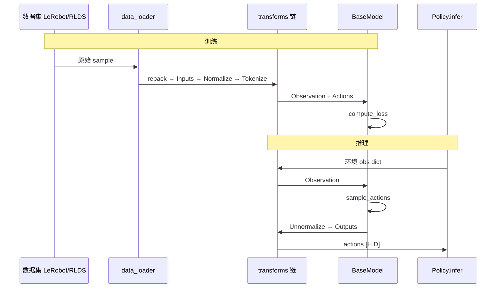

# 第 1 章：系统架构总览

## 1.1 项目定位

openpi 是 Physical Intelligence 开源的**机器人视觉-语言-动作（VLA）**栈：提供预训练 checkpoint、JAX/Flax 训练与推理、可选 PyTorch 路径、LeRobot/RLDS 数据接入，以及通过 WebSocket 的远程策略服务。

本章说明代码如何组织、数据如何流经各层，以及训练与推理两条主路径的差异。

## 1.2 仓库目录与边界

```text
openpi/
├── src/openpi/                 # 核心库
│   ├── models/                 # VLA 模型与骨干网络
│   ├── models_pytorch/         # PyTorch π₀ 实现 + HF 补丁
│   ├── policies/               # 推理策略与各机器人 I/O 适配
│   ├── training/               # 配置、数据加载、检查点、优化
│   ├── transforms.py           # 通用数据变换
│   ├── serving/                # WebSocket 策略服务器
│   └── shared/                 # 下载、归一化、图像工具、类型
├── packages/openpi-client/     # 轻量客户端（机器人侧）
├── scripts/                    # train / serve / norm_stats 入口
└── examples/                   # 各平台评测与数据转换
```

**边界原则**：

- `models/` 只关心 `Observation` → loss / `sample_actions`，不感知具体机器人键名。
- `policies/` 与 `transforms.py` 负责「数据集/环境 dict」与模型输入之间的映射。
- `training/config.py` 用声明式 `TrainConfig` 把模型、数据、优化器、权重加载绑在一起。
- `openpi-client` 不依赖 JAX，可在机器人控制机上单独安装。

## 1.3 核心类型：`Observation` 与 `Actions`

定义于 `src/openpi/models/model.py`。

### `ModelType`（枚举）

| 成员 | 值 | 对应类 |
|------|-----|--------|
| `PI0` | `"pi0"` | `Pi0`（`pi05=False`） |
| `PI05` | `"pi05"` | `Pi0`（`pi05=True`） |
| `PI0_FAST` | `"pi0_fast"` | `Pi0FAST` |

### 常量

- `IMAGE_KEYS`：默认三路相机 `base_0_rgb`, `left_wrist_0_rgb`, `right_wrist_0_rgb`（π₀-FAST 配置中可能为 `base_0_rgb`, `base_1_rgb`, `wrist_0_rgb`）。
- `IMAGE_RESOLUTION`：`(224, 224)`。

### `Observation` 字段

| 字段 | 形状 | 说明 |
|------|------|------|
| `images` | `dict[str, float[*b,h,w,3]]` | 训练/推理内部为 `[-1,1]` float32 |
| `image_masks` | `dict[str, bool[*b]]` | 该路相机是否有效 |
| `state` | `float[*b, s]` | 本体感觉（关节等），常 pad 到 `action_dim` |
| `tokenized_prompt` | `int[*b, l]` | π₀/π₀.₅/FAST 均需（FAST 含动作 token） |
| `tokenized_prompt_mask` | `bool[*b, l]` | 有效 token 掩码 |
| `token_ar_mask` | `int[*b, l]` | 仅 FAST：自回归块边界 |
| `token_loss_mask` | `bool[*b, l]` | 仅 FAST：参与 CE 的 token |

**`from_dict`**：将嵌套 dict（transform 输出）转为结构体；`uint8` 图像自动映射到 `[-1,1]`；PyTorch `uint8` 会 permute 为 NCHW 再归一化。

**`to_dict`**：逆变换，键名 `images` → `image`。

### `Actions`

类型别名：`float[*b, ah, ad]`，即 `[batch, action_horizon, action_dim]`。

### `preprocess_observation(rng, observation, *, train, image_keys, image_resolution)`

**作用**：模型内部的最后一步图像处理（与 `transforms.ResizeImages` 互补）。

**训练时增强**（`train=True`）：

- 非 wrist 相机：随机裁剪 95%、旋转 ±5°。
- 全部：ColorJitter。
- 使用 `augmax`，在 `[-1,1]` 与 `[0,1]` 间切换。

**推理**：仅必要时 resize 到 224×224；缺省 `image_mask` 填全 True。

### `BaseModelConfig`（抽象配置）

| 方法/字段 | 说明 |
|-----------|------|
| `action_dim`, `action_horizon`, `max_token_len` | 动作与语言维度超参 |
| `model_type` | 抽象属性 |
| `create(rng)` | 构造未训练模型 |
| `load(params)` | 从纯 dict 恢复 NNX 模型 |
| `load_pytorch(train_config, path)` | 加载 `PI0Pytorch` + safetensors |
| `inputs_spec(batch_size)` | 返回 `(Observation, Actions)` 的 shape/dtype 结构 |
| `fake_obs` / `fake_act` | 全 1 占位，用于 init |

### `BaseModel`（抽象模块）

| 方法 | 说明 |
|------|------|
| `compute_loss(rng, observation, actions, train=False)` | 训练损失，π₀ 返回 per-step 向量 `[*b, ah]` |
| `sample_actions(rng, observation, **kwargs)` | 推理采样动作块 |

### `restore_params(params_path, ...)`

从 Orbax 检查点或 `gs://` 路径恢复 JAX 参数树；自动去掉 NNX 的 `"value"` 后缀键。

## 1.4 端到端数据流



### Transform 链顺序（`create_trained_policy`）

**输入**（顺序执行）：

1. `repack_transforms.inputs`（可选，环境键名）
2. `InjectDefaultPrompt`
3. `data_transforms.inputs`（如 `LiberoInputs`）
4. `Normalize`
5. `model_transforms.inputs`（`ResizeImages`, `TokenizePrompt` 等）

**输出**（`compose` 顺序执行；`Group.push` 时 outputs 插在**前面**，故语义上为逆序还原）：

1. `model_transforms.outputs`（如 `ExtractFASTActions`）
2. `Unnormalize`
3. `data_transforms.outputs`
4. `repack_transforms.outputs`

## 1.5 训练 vs 推理路径

| 阶段 | 入口 | 关键组件 |
|------|------|----------|
| JAX 训练 | `scripts/train.py` | `TrainConfig`, `create_data_loader`, `train_step`, Orbax |
| PyTorch 训练 | `scripts/train_pytorch.py` | `PI0Pytorch`, DDP, safetensors |
| 本地推理 | `policy_config.create_trained_policy` | `Policy.infer` |
| 远程推理 | `scripts/serve_policy.py` | `WebsocketPolicyServer` |
| 归一化统计 | `scripts/compute_norm_stats.py` | `shared/normalize.py` |

训练循环（JAX）要点：

1. `init_train_state`：创建模型、optax 优化器、可选 EMA、FSDP sharding。
2. `_load_weights_and_validate`：从 PaliGemma 或 checkpoint 部分加载。
3. `train_step`：`nnx.value_and_grad` → `compute_loss` 均值 → `optax.apply_updates`。
4. 周期性 `save_state`：params、opt_state、assets 内 norm_stats。

## 1.6 JAX 与 PyTorch 双后端

检测逻辑（`policy_config.create_trained_policy`）：检查点目录存在 `model.safetensors` 则为 PyTorch，否则加载 `params/`（JAX）。

| 能力 | JAX | PyTorch |
|------|-----|---------|
| π₀ / π₀.₅ | ✓ | ✓ |
| π₀-FAST | ✓ | ✗ |
| FSDP / LoRA / EMA | ✓ | ✗ |
| `torch.compile` 推理 | — | ✓（config 可设 `pytorch_compile_mode`） |

PyTorch 需将 `models_pytorch/transformers_replace/` 覆盖安装到 `transformers` 包（AdaRMS、精度、KV cache 行为），见根目录 README。

## 1.7 外部依赖关系

```text
                    ┌─────────────┐
                    │   LeRobot   │
                    └──────┬──────┘
                           │
    ┌──────────────┐       │       ┌──────────────┐
    │ RLDS/dlimp   │───────┼───────│  HuggingFace │
    │ (可选 TF)    │       │       │  FAST tokenizer│
    └──────────────┘       ▼       └──────────────┘
                    ┌─────────────┐
                    │ data_loader │
                    └──────┬──────┘
                           ▼
              ┌────────────────────────┐
              │ JAX/Flax NNX 或 PyTorch │
              │ SigLIP + Gemma + Head   │
              └────────────────────────┘
```

## 1.8 本章与其他章节关系

- 模型算法细节 → [02-models-flow-matching.md](./02-models-flow-matching.md)、[03-models-pi0-fast.md](./03-models-pi0-fast.md)
- 变换与加载 → [04-data-pipeline.md](./04-data-pipeline.md)
- 训练配置与检查点 → [05-training-system.md](./05-training-system.md)
- 推理与服务 → [06-inference-policy-serving.md](./06-inference-policy-serving.md)
