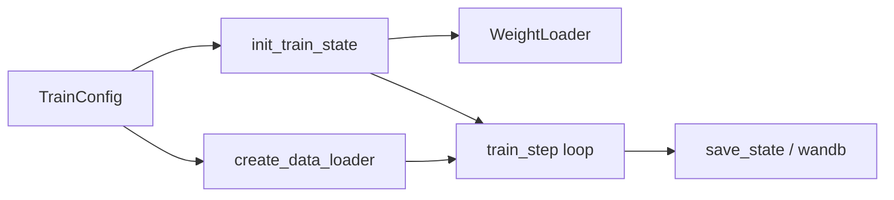

# 第 5 章：训练系统

源码：`scripts/train.py`、`training/config.py`、`optimizer.py`、`sharding.py`、`checkpoints.py`、`weight_loaders.py`、`utils.py`。

## 5.1 训练入口

| 脚本 | 后端 | 说明 |
|------|------|------|
| `scripts/train.py` | JAX/Flax NNX | 完整功能：FSDP、LoRA 冻结、EMA、FAST |
| `scripts/train_pytorch.py` | PyTorch | π₀/π₀.₅ DDP，safetensors 保存 |
| `scripts/compute_norm_stats.py` | — | 生成 `norm_stats.json` |

JAX 训练主循环：`init_train_state` → 数据迭代 → `train_step` → 定期 `save_state`。

## 5.2 配置体系（`training/config.py`）

### `AssetsConfig`

| 字段 | 说明 |
|------|------|
| `assets_dir` | 资产根目录（含 norm_stats） |
| `asset_id` | 子目录名，如 `trossen` / `droid` |

可从预训练 checkpoint **复用** norm_stats（`assets_base_dir` 指向 base 模型）。

### `DataConfig`

核心字段：`repo_id`、`asset_id`、`norm_stats`、`use_quantile_norm`、`repack_transforms`、`data_transforms`、`model_transforms`、`action_sequence_keys`、`prompt_from_task`、`rlds_data_dir` 等。

`DataConfigFactory.create(assets_dirs, model_config)` 生成最终 `DataConfig`。

### `ModelTransformFactory`

按 `model_type` 注入：

- π₀/π₀.₅：`ResizeImages` + `TokenizePrompt`
- π₀-FAST：`TokenizeFASTInputs`；输出侧 `ExtractFASTActions`

### 数据集工厂（节选）

| 类 | 用途 |
|----|------|
| `FakeDataConfig` | 随机数据冒烟 |
| `SimpleDataConfig` | 通用 LeRobot |
| `LeRobotAlohaDataConfig` | ALOHA 键名 + delta actions |
| `LeRobotLiberoDataConfig` | LIBERO |
| `RLDSDroidDataConfig` | RLDS 大规模 DROID |
| `LeRobotDROIDDataConfig` | LeRobot 格式 DROID |

`get_config(name)` / `cli()`（tyro）解析命名配置，如 `pi05_libero`、`pi0_fast_droid`。

### `TrainConfig`（主要字段）

| 字段 | 说明 |
|------|------|
| `name` / `project_name` / `exp_name` | 实验标识 |
| `model` | `Pi0Config` 或 `Pi0FASTConfig` |
| `weight_loader` | 初始化权重来源 |
| `data` | `DataConfigFactory` |
| `batch_size` | 全局 batch |
| `num_train_steps` | 总步数 |
| `lr_schedule` | `CosineDecaySchedule` 等 |
| `optimizer` | `AdamW` / `SGD` |
| `ema_decay` | 可选 EMA |
| `freeze_filter` / `trainable_filter` | NNX 参数过滤 |
| `fsdp_devices` | FSDP 设备数 |
| `checkpoint_dir` | Orbax 根目录 |
| `save_interval` / `log_interval` | 步频 |
| `wandb_enabled` | 日志 |
| `seed` | 随机种子 |

内置数十个 `TrainConfig` 预设（`config.py` 底部 `_CONFIGS` 列表），覆盖微调与 RoboArena/Polaris 变体。

## 5.3 训练状态（`training/utils.py`）

### `TrainState`

| 字段 | 说明 |
|------|------|
| `step` | 全局步 |
| `params` | `nnx.State` |
| `model_def` | `nnx.GraphDef` |
| `tx` | optax 变换 |
| `opt_state` | 优化器状态 |
| `ema_decay` / `ema_params` | 指数滑动平均 |

### 工具

- `tree_to_info` / `array_tree_to_info`：日志打印参数树形状。

## 5.4 优化器（`training/optimizer.py`）

### 学习率

**`CosineDecaySchedule`**：`warmup_steps` 线性升温 → `peak_lr` → 余弦衰减至 `decay_lr`，总长 `total_steps`。

**`RsqrtDecaySchedule`**：warmup 后按 \(lr \propto 1/\sqrt{step}\) 衰减。

### 优化器

**`AdamW`**：`b1,b2,eps,weight_decay,clip_gradient_norm`；通过 `create_optimizer` 与 schedule 组合为 `optax` 链。

**`SGD`**：动量 SGD 变体。

## 5.5 分布式分片（`training/sharding.py`）

| API | 作用 |
|-----|------|
| `make_mesh(num_fsdp_devices)` | 构建 2D mesh：batch × fsdp |
| `set_mesh` / 上下文 | 全局 mesh 供 activation 约束 |
| `activation_sharding_constraint` | 中间激活按 batch 维分片 |
| `fsdp_sharding(pytree, mesh)` | 对 `TrainState` 各数组选择 `NamedSharding`（大矩阵分片，小张量复制） |

`fsdp_devices=1` 时退化为单卡复制。

## 5.6 权重加载（`weight_loaders.py`）

### `WeightLoader` 协议

`load(params_shape) -> loaded_subset`

### 实现

| 类 | 行为 |
|----|------|
| `NoOpWeightLoader` | 空，全随机初始化 |
| `CheckpointWeightLoader` | 从 Orbax `params` 子树加载；`missing_regex` 允许部分缺失 |
| `PaliGemmaWeightLoader` | 从 `gs://openpi-assets/.../paligemma` 加载视觉+LLM 预训练 |

`_merge_params`：将加载权重与当前 `ShapeDtypeStruct` 合并，未匹配处保留初始化。

训练启动时 `_load_weights_and_validate` 校验 shape/dtype 一致。

## 5.7 检查点（`training/checkpoints.py`）

| 函数 | 说明 |
|------|------|
| `initialize_checkpoint_dir` | 创建目录、写 `config` json、处理 resume |
| `save_state` | Async Orbax：train_state、params、assets（norm_stats） |
| `restore_state` | 恢复训练 |
| `load_norm_stats` | 从 assets 读归一化 |

自定义 `CallbackHandler` 支持训练回调序列化。

## 5.8 `train_step` 逻辑（`scripts/train.py`）

```text
1. 取 batch (observation, actions)
2. nnx.value_and_grad(compute_loss_mean)
3. optax.apply_updates 更新 trainable_filter 参数
4. 可选 EMA 更新 ema_params
5. 返回 metrics: loss, grad_norm, param_norm
```

`compute_loss` 对 π₀ 为 flow MSE 均值；对 FAST 为 token CE。

冻结参数通过 `freeze_filter` 转为 bfloat16 且不参与 `trainable_filter` 梯度。

## 5.9 LoRA 微调

`Pi0Config.get_freeze_filter()` + `gemma.*_lora` variant：

- 仅 LoRA 低秩矩阵可训练
- 基座 Gemma/SigLIP 冻结

见 `models/lora.py`：`LoRAConfig`、`Einsum`、`FeedForward` 包装。

## 5.10 训练流程图



## 5.11 运行示例

```bash
# 计算归一化（微调前必做）
uv run scripts/compute_norm_stats.py --config-name pi05_libero

# JAX 微调
uv run scripts/train.py pi05_libero --exp-name my_run --overwrite

# 从 checkpoint 恢复
uv run scripts/train.py pi05_libero --exp-name my_run --resume
```

## 5.12 章节边界

- 模型损失定义 → [02](./02-models-flow-matching.md)、[03](./03-models-pi0-fast.md)
- 推理加载同一 checkpoint → [06](./06-inference-policy-serving.md)
