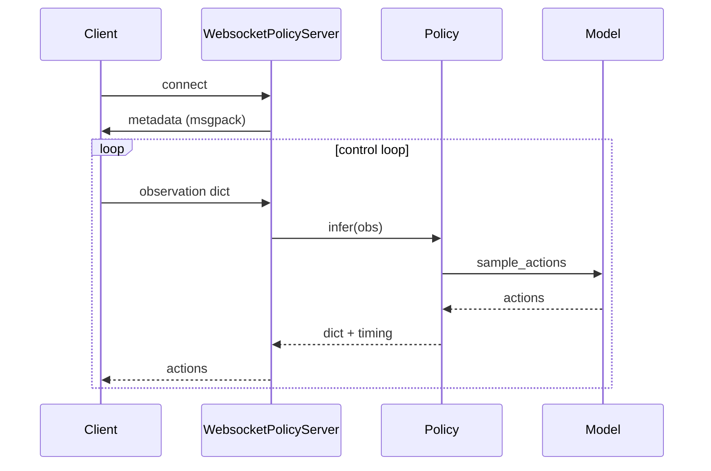

# 第 6 章：推理、策略与服务

源码：`policies/policy.py`、`policies/policy_config.py`、`serving/websocket_policy_server.py`、`scripts/serve_policy.py`。

## 6.1 推理栈分层

```text
环境观测 dict
    → input transforms（repack / *Inputs / Normalize / Tokenize）
    → Observation.from_dict
    → model.sample_actions
    → output transforms（Unnormalize / *Outputs / ExtractFAST）
    → { "actions", "state", "policy_timing" }
```

## 6.2 `create_trained_policy`（`policy_config.py`）

```python
def create_trained_policy(
    train_config: TrainConfig,
    checkpoint_dir: str | pathlib.Path,
    *,
    repack_transforms: transforms.Group | None = None,
    sample_kwargs: dict | None = None,
    default_prompt: str | None = None,
    pytorch_device: str | None = None,
) -> Policy
```

### 执行步骤

1. **解析检查点**：`download.maybe_download`；检测 `model.safetensors` → PyTorch，否则 JAX `params/`。
2. **加载 norm_stats**：`checkpoints.load_norm_stats(assets_dir, data_config.asset_id)`。
3. **组装变换**（与训练 `DataConfig` 一致）：
   - inputs: `repack` → `InjectDefaultPrompt` → `data_transforms.inputs` → `Normalize` → `model_transforms.inputs`
   - outputs: `model_transforms.outputs` → `Unnormalize` → `data_transforms.outputs` → `repack.outputs`
4. **加载模型**：
   - JAX：`restore_params` + `model.load`
   - PyTorch：`model.load_pytorch` + `to(device)`
5. 返回 `Policy(model, transforms, output_transforms, sample_kwargs, is_pytorch=...)`。

`sample_kwargs` 可传 `num_steps`（flow）、`max_decoding_steps`（FAST）等。

## 6.3 类 `Policy`

### 构造参数

| 参数 | 说明 |
|------|------|
| `model` | `BaseModel` 或 `PI0Pytorch` |
| `rng` | JAX 随机键（PyTorch 忽略） |
| `transforms` / `output_transforms` | 输入/输出链 |
| `sample_kwargs` | 传给 `sample_actions` |
| `metadata` | 附带给客户端的元数据 |
| `pytorch_device` | 如 `cuda:0` |
| `is_pytorch` | 后端标志 |

### `infer(obs, *, noise=None) -> dict`

1. 深拷贝 `obs` → `_input_transform`
2. 加 batch 维；JAX 用 `jnp.asarray` + `split(rng)`；PyTorch 用 `torch.from_numpy`
3. 可选 `noise`：形状 `(H,D)` 或 `(1,H,D)`，用于 flow 采样初值或可复现性
4. `Observation.from_dict` → `sample_actions` → 去 batch
5. `_output_transform` → 附加 `policy_timing.infer_ms`

### `metadata` 属性

服务端可通过 WebSocket 首包下发给客户端。

## 6.4 类 `PolicyRecorder`

包装任意 `BasePolicy`，每步 `infer` 将 `inputs`/`outputs` 扁平化保存为 `step_*.npy`，用于调试与回归对比。

## 6.5 WebSocket 服务（`serving/websocket_policy_server.py`）

### `WebsocketPolicyServer`

| 方法/行为 | 说明 |
|-----------|------|
| `__init__(policy, host, port, metadata)` | 持有 `Policy` |
| `serve_forever()` | asyncio 事件循环 |
| 连接握手 | 首条 msgpack：server `metadata` |
| 请求/响应 | 客户端发观测 dict → 服务端 `policy.infer` → 返回动作 dict |
| 健康检查 | `GET /healthz` 返回 200（`_health_check`） |

使用 `websockets` 库；numpy 数组经 `openpi_client.msgpack_numpy` 编解码。

### 启动

```bash
uv run scripts/serve_policy.py policy:checkpoint \
  --policy.config=pi05_libero \
  --policy.dir=gs://openpi-assets/checkpoints/pi05_libero
```

`scripts/serve_policy.py` 还支持 `policy:default` 等 tyro 子命令。

## 6.6 推理时序



## 6.7 Flow 推理调参

| 参数 | 默认 | 影响 |
|------|------|------|
| `num_steps` | 10 | 去噪步数 ↑ → 质量略升、延迟升 |
| `noise` | 随机高斯 | 固定可复现轨迹 |

## 6.8 FAST 推理注意

`Pi0FAST.sample_actions` 返回 **token**；必须经 `ExtractFASTActions` 才得到 `[H,D]`。`create_trained_policy` 已在 output 链自动挂载。

## 6.9 与客户端关系

机器人侧使用 `openpi-client` 的 `WebsocketClientPolicy` + `ActionChunkBroker`，见 [08-client-runtime.md](./08-client-runtime.md)。

部署说明见 [../remote_inference.md](../remote_inference.md)。

## 6.10 本地推理示例（完整）

```python
from openpi.training import config as _config
from openpi.policies import policy_config
from openpi.shared import download
import numpy as np

cfg = _config.get_config("pi05_libero")
ckpt = download.maybe_download("gs://openpi-assets/checkpoints/pi05_libero")
policy = policy_config.create_trained_policy(
    cfg, ckpt, sample_kwargs={"num_steps": 10}
)

obs = {
    "observation/image": np.zeros((224, 224, 3), dtype=np.uint8),
    "observation/wrist_image": np.zeros((224, 224, 3), dtype=np.uint8),
    "observation/state": np.zeros(8, np.float32),
    "prompt": "pick up the cup",
}
result = policy.infer(obs)
print(result["actions"].shape, result["policy_timing"])
```

## 6.11 章节边界

- 变换与 norm → [04-data-pipeline.md](./04-data-pipeline.md)
- 模型 `sample_actions` 算法 → [02](./02-models-flow-matching.md)、[03](./03-models-pi0-fast.md)
