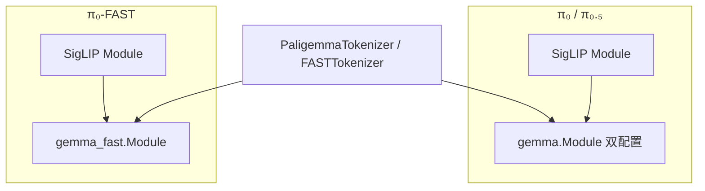

# 第 7 章：骨干网络与分词器

源码：`models/gemma.py`、`gemma_fast.py`、`siglip.py`、`lora.py`、`tokenizer.py`、`models/utils/fsq_tokenizer.py`。

## 7.1 视觉骨干：SigLIP（`siglip.py`）

π 系列使用 **SigLIP So400m/14** 变体（`variant="So400m/14"`），将每路相机图像编码为 **token 序列**（非单全局向量），供 LLM 交叉注意力。

### 主要组件

| 类/函数 | 作用 |
|---------|------|
| `posemb_sincos_2d` | 2D 正弦位置编码 |
| `MlpBlock` | MLP 子层 |
| `Encoder1DBlock` | Transformer encoder 块 |
| `Encoder` | 堆叠 encoder 块 |
| `MAPHead` | Multihead Attention Pooling（部分变体） |
| `_Module` | 完整 ViT：patch embed → encoder → 可选 head |
| `Module(...)` | 工厂函数，按 `num_classes`/`variant` 构造 |
| `decode_variant` | 解析 variant 字符串 |

### 在 π₀ 中的调用

`Pi0.embed_prefix` → `PaliGemma.img(obs.images[cam])` → 输出 shape 约为 `[B, num_patches, width]`，展平为视觉 token。

图像在进入 SigLIP 前已在 `[-1,1]`（`Observation.from_dict`）或经 `preprocess_observation` 增强。

## 7.2 双塔 Gemma（`gemma.py`）— π₀ / π₀.₅

`PaliGemma` 的 `llm` 为 **单次 forward 处理两路 Gemma 配置**：

- **configs[0]**：PaliGemma 2B（前缀：图像+语言）
- **configs[1]**：Action Expert 300M（后缀：状态+动作）

### `Config` / `get_config(variant)`

`variant` 如 `gemma_2b`、`gemma_300m`、`gemma_2b_lora`；控制 `width`、`depth`、`mlp_dim`、`num_heads`、`head_dim`、`lora_configs`。

### 模块级 API

| 类 | 作用 |
|----|------|
| `RMSNorm` | 根均方归一化；π₀.₅ 支持 **adaRMS**（`cond` 向量调制 scale/shift） |
| `Embedder` | 词嵌入 + 可选 `embed_only` |
| `Attention` | 多头注意力；支持 `kv_cache` 解码模式 |
| `FeedForward` | GeGLU 风格 FFN；可挂 LoRA |
| `Block` | Attention + FFN + residual |
| `Module` | 完整堆叠；`__call__(embedded, mask, positions, adarms_cond, decode, kv_cache)` |

### 辅助函数

- `_apply_rope`：旋转位置编码
- `_name`：层命名
- `_gated_residual`：门控残差（adaRMS 路径）

### 与 π₀ 的衔接

- Prefix 与 suffix **拼接**后一次传入 `llm`；`adarms_cond` 仅作用于 action expert 层（π₀.₅）。
- 推理时 prefix 先 `decode=True` 填 cache，suffix 逐步去噪只走 expert 路径。

## 7.3 单塔 Gemma Fast（`gemma_fast.py`）— π₀-FAST

为自回归解码优化，API 与 `gemma.py` 类似但 **单配置**：

| 类 | 说明 |
|----|------|
| `get_config(variant)` | 通常 `gemma_2b` |
| `Einsum` / `RMSNorm` / `Embedder` / `Attention` / `Block` / `Module` | 结构平行于 gemma.py |
| `Module.__call__` | 支持 `pre_logits` 仅算隐藏态，再乘 `embedder` 转置得 logits（省显存） |

`_apply_rope` 与 decode 路径供 `Pi0FAST.sample_actions` 逐步生成。

## 7.4 LoRA（`lora.py`）

### `LoRAConfig`

- `rank`、`alpha`、作用矩阵模式

### `Einsum` / `FeedForward`

在选定 einsum 上增加低秩分支 \(W + BA\)，冻结主权重时仅训练 LoRA。

与 `get_freeze_filter()` 配合：匹配 `.*lora.*` 为可训练，其余 LLM 权重冻结。

## 7.5 分词器（`tokenizer.py`）

### `PaligemmaTokenizer`

| 方法 | 说明 |
|------|------|
| `__init__(max_len=48)` | 下载 SentencePiece `paligemma_tokenizer.model` |
| `tokenize(prompt, state=None)` | 返回 `(tokens, mask)` |

**π₀**（`state is None`）：`encode(prompt) + encode("\n")` 作为 answer 起始。

**π₀.₅**（提供 `state`）：  
`Task: {prompt}, State: {256-bin digits};\nAction: ` 全文 encode。

超长截断并 `logging.warning`。

### `FASTTokenizer`

| 方法 | 说明 |
|------|------|
| `__init__(max_len, fast_tokenizer_path)` | PaliGemma SP + HF `physical-intelligence/fast` |
| `tokenize(prompt, state, actions)` | 返回四元组：tokens, mask, ar_mask, loss_mask |
| `_act_tokens_to_paligemma_tokens` | FAST id → PaliGemma 词表尾部 |
| `extract_actions(tokens, ...)` | 推理：decode 字符串 → FAST decode → `[H,D]` |

训练时 `actions` 非空，postfix 参与 loss；推理时 `actions=None`，仅 prefix。

### `BinningTokenizer`（遗留/实验）

将动作逐维 digitize 后直接写入文本，不经过 FAST 压缩。

### `FSQTokenizer`

使用 `models/utils/fsq_tokenizer.py` 中 **FSQ（Finite Scalar Quantization）** 神经网络编解码动作，再映射到 PaliGemma token；用于研究向量化动作表示。

## 7.6 FSQ 动作编解码（`models/utils/fsq_tokenizer.py`）

| 类 | 作用 |
|----|------|
| `FsqCodebook` | FSQ 码本 |
| `LookupFreeQuantization` / `LfqCodebookOutput` | LFQ 量化 |
| `ResNetDownBlock` / `ResNetUpBlock` | 时序卷积下/上采样 |
| `CrossAttentionLayer` | 交叉注意力 |
| `TokenizerEncoderDecoder` | 编码器-解码器包装 |
| `FsqAttentionTokenizer` | 完整 FSQ attention tokenizer |
| `make_block_causal_attention_matrix` | 块因果 mask |
| `GeGLU` | 激活 |
| `sinusoidal_pe_init` | 位置编码初始化 |

与 `FSQTokenizer` 类配合，非 π₀/FAST 主路径默认组件。

## 7.7 ViT 遗留（`vit.py`）

Flax ViT 实现（`VisionTransformer` 等），供 Big Vision 风格实验；**π₀ 生产路径使用 SigLIP**，非 `vit.py`。

## 7.8 模块依赖图

## 7.9 概念补充

**adaRMS（Adaptive RMSNorm）**：将 flow 时间步嵌入为向量，调制 RMSNorm 的 scale/bias，使动作专家在不同去噪阶段使用不同归一化，而不把 time 简单拼接到 token（π₀ 做法）。

**PaliGemma 词表尾部**：FAST 动作 token 映射到 `vocab_size - 128 - fast_id`，避开特殊符号区。

## 7.10 章节边界

- Flow / FAST 如何调用这些模块 → [02](./02-models-flow-matching.md)、[03](./03-models-pi0-fast.md)
- Transform 如何调用 Tokenizer → [04-data-pipeline.md](./04-data-pipeline.md)
