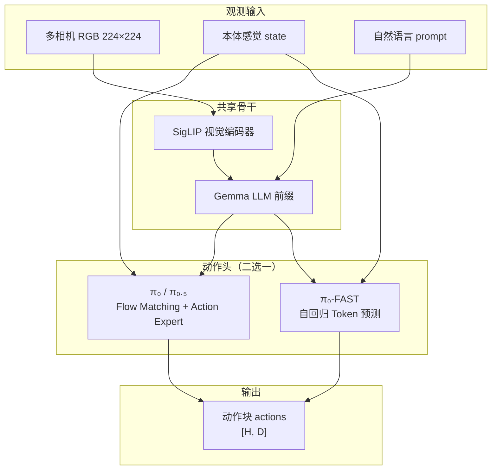

# openpi 技术文档索引

本文档集对 [openpi](https://github.com/Physical-Intelligence/openpi) 代码库中的算法、模块与数据流做**从总览到局部**的完整技术解读，覆盖 `src/openpi`、`packages/openpi-client` 与 `scripts/` 中的核心实现。

## 阅读路径

| 章节 | 文件 | 内容概要 |
|------|------|----------|
| 0 | 本页 | 文档索引、知识地图、模型族对比 |
| 1 | [01-architecture-overview.md](./01-architecture-overview.md) | 系统架构、目录结构、端到端数据流、JAX/PyTorch 双后端 |
| 2 | [02-models-flow-matching.md](./02-models-flow-matching.md) | π₀ / π₀.₅：Flow Matching、注意力掩码、`Pi0` 全 API |
| 3 | [03-models-pi0-fast.md](./03-models-pi0-fast.md) | π₀-FAST：自回归动作 token、FAST 分词、`Pi0FAST` 全 API |
| 4 | [04-data-pipeline.md](./04-data-pipeline.md) | 变换管道、`Observation`、数据加载、归一化统计 |
| 5 | [05-training-system.md](./05-training-system.md) | 训练配置、优化器、FSDP、检查点、权重加载 |
| 6 | [06-inference-policy-serving.md](./06-inference-policy-serving.md) | `Policy`、`create_trained_policy`、WebSocket 服务 |
| 7 | [07-backbone-tokenizers.md](./07-backbone-tokenizers.md) | Gemma、SigLIP、LoRA、各类 Tokenizer |
| 8 | [08-client-runtime.md](./08-client-runtime.md) | `openpi-client`、ActionChunkBroker、Runtime 循环 |

## 已有运维文档（非算法向）

- [remote_inference.md](../remote_inference.md) — 远程推理部署
- [norm_stats.md](../norm_stats.md) — 归一化统计与动作空间定义
- [docker.md](../docker.md) — Docker 安装

---

## 知识地图（总览）

openpi 实现三类 **Vision-Language-Action (VLA)** 模型，共享「视觉编码器 + 语言模型前缀 + 动作头」的 PaliGemma 式结构，在**动作生成范式**上分为两条路线：



### 三条模型路线对比

| 维度 | π₀ (`Pi0`, `pi05=False`) | π₀.₅ (`Pi0`, `pi05=True`) | π₀-FAST (`Pi0FAST`) |
|------|--------------------------|---------------------------|---------------------|
| **动作建模** | 连续 Flow Matching（速度场回归） | 同 π₀，但 timestep 经 adaRMS 注入 | 离散 FAST token + 交叉熵 |
| **状态输入** | 连续 `state_proj` → suffix token | 离散化后写入 prompt 文本 | 离散化写入 prefix 文本 |
| **训练损失** | MSE\((v_t, u_t)\)  per horizon step | 同左 | Token CE（仅 postfix） |
| **推理** | Euler 积分 `num_steps` 步（默认 10） | 同左 | 自回归解码至 EOS |
| **典型 `action_horizon`** | 50 | 50 | 32 |
| **典型 `max_token_len`** | 48 | 200 | 250 |
| **PyTorch 支持** | 是 | 是 | 否（仅 JAX） |
| **适用场景** | 通用操作、需平滑轨迹 | 开放世界、语言跟随更强 | DROID 等需快速推理、语言指令 |

### 模块职责与关联

```text
scripts/train.py          ──► TrainConfig ──► data_loader + Pi0/Pi0FAST
scripts/serve_policy.py   ──► Policy ──► websocket_policy_server
policy_config.py          ──► 组装 transforms + 加载 checkpoint
transforms.py             ──► 机器人/数据集键名 → Observation 字典
policies/*_policy.py      ──► 各平台 *Inputs / *Outputs 映射
openpi-client             ──► 机器人端 WebSocket + 动作块逐步执行
```

**训练路径**：LeRobot / RLDS 原始样本 → `repack` → `*Inputs` → `Normalize` → `Tokenize*` → `Observation` + `Actions` → `compute_loss` → Orbax 检查点。

**推理路径**：环境观测 dict → 同上输入变换 → `sample_actions` → `Unnormalize` → `*Outputs` → 机器人指令；可选 `ActionChunkBroker` 将 `[H,D]` 块拆成逐步控制。

### 设计取舍

- **Flow Matching（π₀/π₀.₅）**：单次前向可预测整段动作块，推理需多步去噪；轨迹连续、适合高频控制。
- **自回归 FAST（π₀-FAST）**：与 LLM 训练一致，推理串行解码；与 PaliGemma 词表共享，便于大规模预训练，但延迟随 token 数增长。
- **π₀.₅ 知识绝缘**（训练侧在预训练完成，本仓库仅 flow head）：状态进语言通道、adaRMS 条件化，减轻视觉-语言与动作专家之间的表征干扰，利于开放世界泛化。
- **双后端**：JAX 为完整功能路径（FSDP、LoRA、EMA、FAST）；PyTorch 便于 LIBERO 等生态，需 `transformers_replace` 补丁。

---

## 快速可运行示例

### 本地推理（需 GPU 与已下载 checkpoint）

```python
from openpi.training import config as _config
from openpi.policies import policy_config
from openpi.shared import download
import numpy as np

config = _config.get_config("pi05_libero")
checkpoint_dir = download.maybe_download("gs://openpi-assets/checkpoints/pi05_libero")
policy = policy_config.create_trained_policy(config, checkpoint_dir)

# 构造与 LiberoInputs 一致的假观测（uint8 图像 + state + prompt）
example = {
    "observation/image": np.zeros((224, 224, 3), dtype=np.uint8),
    "observation/wrist_image": np.zeros((224, 224, 3), dtype=np.uint8),
    "observation/state": np.zeros(8, dtype=np.float32),
    "prompt": "pick up the cup",
}
out = policy.infer(example)
print(out["actions"].shape)  # (action_horizon, action_dim)
```

### 启动策略服务

```bash
uv run scripts/serve_policy.py policy:checkpoint \
  --policy.config=pi05_libero \
  --policy.dir=gs://openpi-assets/checkpoints/pi05_libero
```

---

## 符号约定

| 符号 | 含义 |
|------|------|
| \(B\) | batch size |
| \(H\) | `action_horizon` 动作步数 |
| \(D\) | `action_dim` 动作维度 |
| \(L\) | `max_token_len` 语言序列长度 |
| \(t \in (0,1]\) | Flow Matching 时间（代码中 \(t=1\) 为纯噪声，\(t=0\) 为数据；与部分论文记号相反，见 `pi0.py` 注释） |

---

*文档生成自 openpi 源码分析；与上游 README 及 `docs/norm_stats.md` 互补。*
