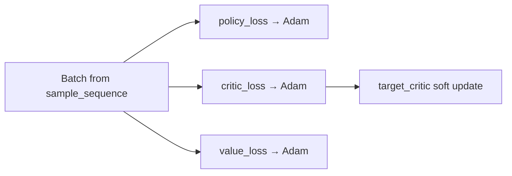
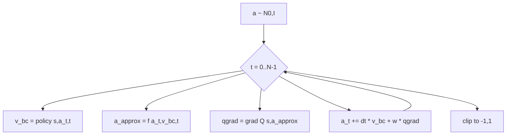

# 01 — 算法总览与问题设定

## 1. 问题设定：离线强化学习

给定固定离线数据集 $\mathcal{D} = \{(s_i, a_i, r_i, s'_i)\}$，目标是在**不与环境在线交互**（或极少交互）的情况下，学习策略 $\pi(a|s)$，使其期望回报高于行为策略（数据收集策略）。

本仓库动作空间归一化到 $[-1, 1]$，观测与动作维度由环境决定；OGBench 实验常用 **action chunking**（$H=5$ 步动作块拼接为一个大向量）。

### 1.1 为什么用生成式策略（Flow / Diffusion）？

传统高斯 actor 难以表达多模态行为分布。Flow Matching 用连续归一化流（CNF）思想：从噪声 $a_0 \sim \mathcal{N}(0,I)$ 沿速度场积分到数据动作 $a_1$：

$$
\frac{da}{dt} = v_\theta(s, a, t), \quad t: 0 \to 1
$$

推理时用 Euler 离散（`denoise_steps` 步）：

$$
a_{t+\Delta t} = a_t + v_\theta(s, a_t, t)\,\Delta t, \quad \Delta t = 1/N
$$

**优点**：表达力强、采样稳定、与 BC 目标自然契合。  
**缺点**：推理需多步；若要用 RL 优化 actor，易出现 BPTT 穿过去噪链或 OOD Q 查询问题。

---

## 2. 方法分类

本仓库实现三类离线 RL 范式：

```
                    离线 RL 方法
                         │
         ┌───────────────┼───────────────┐
         ▼               ▼               ▼
    训练时 Actor-RL   测试时 Guidance   纯模仿 / 值函数
    (联合优化)        (推理时改进)      (无策略改进)
         │               │               │
    FQL, EDP,      QGF, QFQL,         BC, IQL
    QAM, CFGRL,    GradStep,
    IQL, SAC...    RobustQ
```

### 2.1 训练时 vs 测试时（本论文核心对比轴）

| 维度 | 训练时方法 | 测试时方法（QGF 族） |
|------|-----------|---------------------|
| Actor 是否接受 RL 梯度 | 是 | **否**（BC 仅 flow matching） |
| Critic 训练 | 与 actor 耦合或交替 | IQL，独立 |
| 策略改进发生阶段 | 训练 | **推理** |
| 典型超参 | `alpha`, `bc_weight` | `guidance_weight` |
| 检查点复用 | 各方法独立 | 共享 BC+IQL 底座 |

### 2.2 各方法定位速查

| Agent | 文件 | `support_guidance` | 一句话 |
|-------|------|-------------------|--------|
| **QGF** | `agents/qgf.py` | True | BC flow + IQL；推理时 Q 梯度引导，单步 Euler 近似干净动作 |
| **QFQL** | `qgf.py` + `denoised_action_approx=noisy` | True | 在噪声 $a_t$ 上直接求 $\nabla Q$（有偏基线） |
| **QGF-Jacobian** | `qgf.py` + `apply_jacobian=True` | True | 对 Euler 近似做链式法则 |
| **GradStep** | `agents/grad_step.py` | False | 先去噪，再在干净动作空间做梯度上升 |
| **RobustQ** | `agents/robust_q.py` | False* | 训练噪声条件 Q_robust(s,a_t,t)，推理用其梯度 |
| **CFGRL** | `agents/cfgrl.py` | True | 条件流 + classifier-free guidance 式插值 |
| **FQL** | `agents/fql.py` | False | 蒸馏多步 flow 为一步策略并最大化 Q |
| **EDP** | `agents/edp.py` | False | 训练时用单步近似最大化 Q + BC 正则 |
| **QAM** | `agents/qam.py` | False | Adjoint matching，无 BPTT 的 Q 感知流训练 |
| **BC** | `agents/bc.py` | False | 纯 flow matching |
| **IQL** | `agents/iql.py` | False | 高斯 actor + IQL（AWR / DDPG+BC） |

\*RobustQ 实现中 `sample_actions` 未暴露 `guidance_weight` 参数，使用配置项 `cfg`（见 06 章说明）。

---

## 3. QGF 端到端流程

### 3.1 训练阶段（`QGFAgent.update`）

每个 batch 依次更新三个模块（**独立** `apply_loss_fn`，非联合反向）：

1. **Policy** — `policy_loss`：Flow Matching BC
2. **Critic** — `critic_loss`：IQL TD 目标
3. **Value** — `value_loss`：期望分位回归
4. **Target critic** — 软更新 `tau`



### 3.2 推理阶段（`QGFAgent.sample_actions`）



### 3.3 与论文实验脚本的对应

| 实验 | 脚本 | 说明 |
|------|------|------|
| 训练 BC+IQL 共享底座 | `scripts/bc_iql_train.py` | `agent=qgf.py`，`guidance_weights=0.0` |
| QGF 测试时评估 | `scripts/exp_qgf_test_time_eval.py` | 加载 checkpoint，`one_euler_step_approx` |
| QFQL 基线 | `scripts/exp_qfql_test_time_eval.py` | `denoised_action_approx=noisy` |
| Jacobian 变体 | `scripts/exp_qgf_jacobian_test_time_eval.py` | `apply_jacobian=True` |

---

## 4. Action Chunking 与 n-step

当 `action_chunking=True` 且 `horizon_length=H`：

- **策略输出维度**：$H \times d_a$ 的拼接向量
- **Critic 输入**：同样拼接的 $H$ 步动作
- **TD 目标**：$r_{\text{cum}} + \gamma^H V(s_{t+H})$，其中 $r_{\text{cum}}$ 由 `sample_sequence` 累积
- **评估**：`evaluation.run_episodes` 维护 per-env 动作队列，每 $H$ 步才重新采样

详见 [09-data-training-evaluation.md](./09-data-training-evaluation.md)。

---

## 5. 方法优缺点与适用场景

### 5.1 QGF（测试时引导）

**优点**
- 训练简单稳定（BC + IQL，无 actor RL）
- 同一 checkpoint 可通过 `guidance_weight` 扫参做 test-time scaling
- 单步 Euler 近似使 Q 梯度在「近干净动作」上评估，降低 OOD 与方差

**缺点**
- 推理每步需额外 `jax.grad(Q)`，比纯 BC 慢
- `guidance_weight` 需验证集调参
- 丢弃 Jacobian 时是对真实链式法则的有偏近似

**适用**：已有高质量 BC flow、且有 IQL/Q 估计；希望在**不改训练**的前提下提升策略。

### 5.2 训练时 Q 感知方法（FQL / EDP / QAM）

**优点**：推理与 BC 同速（FQL 一步；EDP/QAM 标准 denoise）  
**缺点**：超参敏感、训练不稳定风险更高  
**适用**：可接受更长训练调参、追求推理效率的生产场景。

### 5.3 CFGRL（Classifier-Free Guidance RL）

**优点**：引导信号来自**额外训练**的条件流，而非显式 Q 梯度  
**缺点**：需 advantage 加权训练条件分支  
**适用**：希望 guidance 与 BC 速度场在同一网络内参数化。

---

## 6. 配置与 CLI 要点

`main.py` 通过 `--agent=agents/qgf.py` 加载配置，任意字段可覆盖：

```bash
MUJOCO_GL=egl python main.py \
  --agent=agents/qgf.py \
  --agent.denoised_action_approx=one_euler_step_approx \
  --agent.apply_jacobian=False \
  --agent.action_chunking=True \
  --agent.horizon_length=5 \
  --env_name=cube-triple-play-singletask-task1-v0 \
  --ogbench_dataset_dir=$OGBENCH_DATA_DIR/cube-triple-play-100m-v0/ \
  --offline_steps=500000 \
  --guidance_weights=0.004,0.008,0.01,0.02,0.04,0.06,0.08,0.1,0.12
```

`--eval_only` + `--restore_path` 可在不训练的情况下仅跑测试时引导评估。
