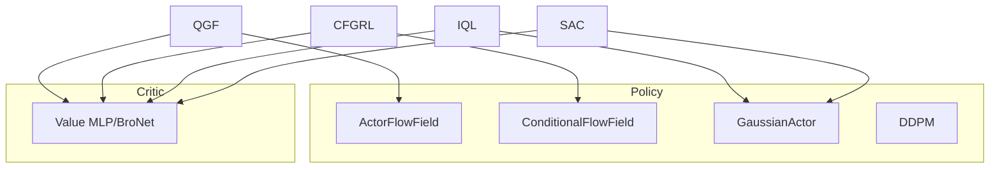

# 08 — 网络结构与基础模块

## 1. 本章边界

- **涵盖**：`utils/networks.py`、`utils/flax_utils.py`、`utils/diffusion.py`、`utils/activation.py`、与 agent 相关的 `agents/common.py`
- **不涵盖**：各 agent 的训练逻辑（见 04、07 章）

---

## 2. `utils/networks.py` 模块地图

```
networks.py
├── default_init / ensemblize
├── MLP
├── BroNet
├── LogParam
├── TransformedWithMode
├── timestep_embedding / embed_time
├── ActorFlowField          ← QGF / BC / EDP policy
├── ConditionalFlowField    ← CFGRL
├── GaussianActor           ← IQL / SAC
└── Value                   ← Q(s,a) / V(s)
```

---

## 3. 工具函数

### 3.1 `default_init(scale=1.0)`

Xavier 均匀初始化，`variance_scaling(scale, "fan_avg", "uniform")`。用于 MLP / BroNet 的 Dense 层。

### 3.2 `ensemblize(cls, num_qs, ...)`

用 `nn.vmap` 将模块复制 `num_qs` 份，**参数独立**（`split_rngs={"params": True}`）。  
用于 Twin-Q：`Value(num_ensembles=2)` 输出 shape `(2, batch)`。

---

## 4. `MLP`

| 属性 | 默认 | 说明 |
|------|------|------|
| `hidden_dims` | — | 各隐层宽度 |
| `activation` | gelu | 激活 |
| `activate_final` | False | 最后一层是否激活 |
| `layer_norm` | False | 除最后一层外是否 LN |

倒数第二层通过 `sow("intermediates", "feature", x)` 保存特征（可供扩展头使用）。

**前向**：逐层 `Dense → [LN] → activation`，最后一层通常无激活（critic 输出标量时 `hidden_dims` 末尾含 `1`）。

---

## 5. `BroNet`

来自 [BRO 论文](https://arxiv.org/pdf/2405.16158) 的 critic 架构：残差块 + LayerNorm，适合放大 Q 网络容量。

| 属性 | 说明 |
|------|------|
| `num_blocks` | 残差块数量 |
| `hidden_dim` | 隐层宽度 |

结构：`Dense → LN → act → [ResBlock×N] → Dense(1)`。

**使用**：`Value(network_class="BroNet", network_kwargs={num_blocks, hidden_dim})`。

---

## 6. `LogParam`

可学习标量 $\alpha = \exp(\text{log\_value})$。**SAC** 用其作为熵系数温度。

```python
class LogParam(nn.Module):
    def __call__(self):
        log_value = self.param("log_value", init_fn=lambda k: jnp.log(init_value))
        return jnp.exp(log_value)
```

---

## 7. `TransformedWithMode`

`distrax.Transformed` 子类，增加 `.mode()`：经 bijector 变换后的众数。用于 `GaussianActor` 的 `tanh_squash` 分布。

---

## 8. 时间嵌入

### 8.1 `timestep_embedding(t, emb_size=16, max_period=10000)`

将 $t \in [0,1]$ 先缩放到 `[0, max_period]`，再做正弦/余弦编码（Transformer 经典形式）。

### 8.2 `embed_time(t, time_embedding)`

| 模式 | 行为 |
|------|------|
| `"sinusoidal"` | 调用 `timestep_embedding` |
| `"raw"` | `t` 作为 `(B,1)` 拼接 |

`ActorFlowField` 默认 `"sinusoidal"`；`BCAgent.FlowMatchingPolicy` 内联了相同正弦编码。

---

## 9. `ActorFlowField`（QGF 策略核心）

```python
def __call__(self, obs, noised_action, t=None, is_encoded=False):
    parts = [obs, noised_action]
    if t is not None:
        parts.append(embed_time(t, self.time_embedding))
    x = jnp.concatenate(parts, axis=-1)
    return Dense(action_dim)(MLP(x))
```

| 输入 | 形状 | 含义 |
|------|------|------|
| `obs` | `(B, obs_dim)` | 状态 |
| `noised_action` | `(B, action_dim)` | 流中间动作 $a_t$ |
| `t` | `(B,)` | 流时间 |

| 输出 | 形状 | 含义 |
|------|------|------|
| `v` | `(B, action_dim)` | 速度场 |

可选 `encoder`：视觉任务可先编码 `obs`（`is_encoded=True` 跳过再编码）。

---

## 10. `ConditionalFlowField`（CFGRL）

输入：`[obs, noised_action, t_embedding, is_positive_embedding]`  
其中 `is_positive` 为 `{0,1}`，经 `nn.Embed(2, 32)` 嵌入，用于 classifier-free guidance 训练。

---

## 11. `GaussianActor`（IQL / SAC）

输出 `distrax` 分布；支持：

| 选项 | 说明 |
|------|------|
| `tanh_squash` | 动作压到 $(-1,1)$ |
| `state_dependent_std` | 方差由网络输出 |
| `const_std` | 全局可学习 `log_stds` |
| `temperature` | 采样时缩放 std |

**方法**：`__call__(observations, temperature=1.0) → distribution`

---

## 12. `Value`（Q 与 V 共用）

```python
def __call__(self, observations, actions=None):
    inputs = [observations] if actions is None else [observations, actions]
    x = jnp.concatenate(inputs, axis=-1)
    return self.value_net(x).squeeze(-1)
```

- `actions=None` → $V(s)$
- `actions` 给定 → $Q(s,a)$，ensemble 时 shape `(num_qs, B)`

`network_class`：`"MLP"` 或 `"BroNet"`。

---

## 13. `utils/flax_utils.py`

### 13.1 `target_update(model, target_model, tau)`

$$
\theta_{\text{target}} \leftarrow \tau \theta + (1-\tau)\theta_{\text{target}}
$$

QGF 对 `critic` 使用；SAC/FQL 对 `ModuleDict` 内 `target_critic` 使用。

### 13.2 `expectile_loss(diff, expectile)`

$$
\ell(\delta) = \begin{cases}\tau\delta^2 & \delta>0\\ (1-\tau)\delta^2 & \delta\le 0\end{cases}
$$

IQL value 回归用。

### 13.3 `supply_rng(f, rng)`

包装 `sample_actions` 等，每次调用自动 `split` PRNG。

### 13.4 `ModuleDict`

多子网络容器（FQL、SAC）：`network.select("critic")(obs, actions)`。

初始化：`network_def.init(rng, critic=(ex_obs, ex_act), actor=(ex_obs,), ...)`。

### 13.5 `TrainState`

| 字段 | 作用 |
|------|------|
| `step` | 优化步计数 |
| `apply_fn` / `model_def` | Flax apply |
| `params` | 参数 pytree |
| `tx` / `opt_state` | Optax 优化器 |

| 方法 | 作用 |
|------|------|
| `__call__(*args, params=None)` | 前向；`params=None` 用当前参数且 **stop grad**（默认） |
| `apply_gradients(grads)` | Optax 更新 |
| `apply_loss_fn(loss_fn)` | `jax.grad(loss_fn)(params)` + 记录 grad 统计 |
| `select(name)` | ModuleDict 子模块 partial |
| `create(model_def, params, tx)` | 工厂 |

### 13.6 `save_agent` / `restore_agent` / `restore_params`

- `save_agent`：`flax.serialization.to_state_dict(agent)` → `params_{epoch}.pkl`
- `restore_agent`：整 agent 恢复
- `restore_params`：按模块名（如 `policy`, `critic`）部分恢复，兼容不同 checkpoint 布局

---

## 14. `utils/diffusion.py`（DDPM 基线）

用于 `iql_diffusion`、DAC/QSM 等 **扩散** 策略，与 Flow Matching 并行存在。

| 符号 | 说明 |
|------|------|
| `cosine_beta_schedule` | 余弦噪声日程 |
| `vp_beta_schedule` | VP 日程 |
| `FourierFeatures` | 可学习/固定傅里叶时间特征 |
| `DDPM` | `(s, a, time) → noise_pred`，结构：time→cond，再 `[a,s,cond]→reverse` |

Flow 路径（QGF）用 `ActorFlowField` 预测 **速度**；DDPM 预测 **噪声** $\epsilon$。

---

## 15. `agents/common.py`

### `get_flat_batch(batch, config)`

从 `sample_sequence` 输出提取 critic/value 所需字段（见 [03-iql-critic-value.md](./03-iql-critic-value.md)）。

### `aggregate_q(qs, config)`

`jnp.min` 或 `jnp.mean`，axis=0（ensemble 维）。

---

## 16. `SACAgent` 网络用法（`agents/sac.py`）

`create` 构建 `ModuleDict`：

| 子模块 | 类型 | 输入 |
|--------|------|------|
| `critic` | `Value(2)` | obs, action |
| `target_critic` | 深拷贝 critic | 同上 |
| `actor` | `GaussianActor` | obs |
| `alpha` | `LogParam` | 无 |

### SAC 方法清单

| 方法 | 功能 |
|------|------|
| `critic_loss` | TD：$r + \gamma(\min Q' - \alpha\log\pi))$（可选 `backup_entropy`） |
| `actor_loss` | $\mathbb{E}[\alpha\log\pi - Q] + \alpha\_loss + w_{bc}\|a-\pi\|^2$ |
| `total_loss` | critic + actor |
| `target_update` | 软更新 target_critic |
| `update` | 联合反向 |
| `sample_actions` | 高斯采样 + clip |
| `create` | 初始化 ModuleDict |
| `get_config` | 超参 |

**用途**：在线微调（RLPD）；`bc_loss_weight>0` 时带 BC 正则。

---

## 17. 架构关系图



---

## 18. 可运行示例：单独前向

```python
import jax
import jax.numpy as jnp
from utils.networks import ActorFlowField, Value, MLP

key = jax.random.PRNGKey(0)
B, obs_dim, act_dim = 4, 10, 7

policy = ActorFlowField(
    hidden_dims=(256, 256),
    action_dim=act_dim,
    mlp_kwargs=dict(activation=jax.nn.gelu, layer_norm=True),
)
critic = Value(
    network_class="MLP",
    network_kwargs=dict(hidden_dims=(256, 256), layer_norm=True),
    num_ensembles=2,
)

obs = jnp.zeros((B, obs_dim))
a = jnp.zeros((B, act_dim))
t = jnp.zeros((B,))

pkey, ckey = jax.random.split(key)
p_params = policy.init(pkey, obs, a, t)["params"]
c_params = critic.init(ckey, obs, a)["params"]

v = policy.apply({"params": p_params}, obs, a, t)
qs = critic.apply({"params": c_params}, obs, a)
print(v.shape, qs.shape)  # (4, 7)  (2, 4)
```
