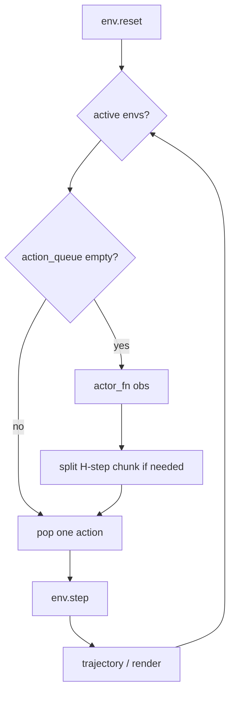

# 09 — 数据、训练主循环与评估

## 1. 本章边界

- **涵盖**：`utils/datasets.py`、`main.py` 训练/评估流程、`utils/evaluation.py`、实验脚本 `scripts/`
- **不涵盖**：单 agent 损失细节（见 02–07 章）

---

## 2. 数据集：`Dataset`

**基类**：`FrozenDict` 子类，字段至少含 `observations`, `actions`, `rewards`, `masks`, `terminals`, `next_observations`。

### 2.1 核心方法

| 方法 | 功能 |
|------|------|
| `create(freeze=True, **fields)` | 从 dict 构造，可选冻结数组 |
| `get_random_idxs(num)` | 均匀随机索引 |
| `sample(batch_size, idxs=None)` | 单步 transition batch；支持 `frame_stack`、`p_aug` 图像增广 |
| `sample_sequence(batch_size, H, discount)` | **n-step / action chunking** 序列 batch |
| `get_subset(idxs)` | 子集；可选 `return_next_actions` |
| `augment(batch, keys)` | 随机裁剪增广 |
| `save` / `load` | 持久化 |

### 2.2 派生属性

- `terminal_locs` / `initial_locs`：episode 边界，用于 frame stack
- `size`：数据集长度

### 2.3 `sample_sequence` 算法详解

对每条序列起点 `idx`，长度 `H`：

1. **actions[i]** = `dataset.actions[idx+i]`
2. **observations**（batch 级）= 起点 `obs[idx]`（仅初始 obs 用于 QGF policy/critic 的 `observations` 键）
3. **next_observations[i]** = 沿序列推进，episode 结束后 **冻结** 在最后有效 next_obs
4. **rewards[i]** = 累积折扣回报  
   $R_i = \sum_{j=0}^{i} \gamma^j r_{idx+j} \cdot \text{valid}_j$
5. **valid[i]** = 前步未终止则为 1，否则 0
6. **masks** = 与 bootstrap 相关的折扣掩码（与终止/截断一致）

返回张量形状：

| 键 | 形状 |
|----|------|
| `observations` | `(B, obs_dim)` |
| `actions` | `(B, H, action_dim)` |
| `next_observations` | `(B, H, obs_dim)` |
| `rewards` | `(B, H)` |
| `masks`, `valid`, `terminals` | `(B, H)` |

**与 IQL 衔接**：`get_flat_batch` 取 `rewards[..., -1]`、`next_obs[..., -1, :]`、`actions` 展平为 Q 输入。

### 2.4 `sparsify_dataset`

稠密奖励 → 稀疏：非零奖励变为 $-1$，零保持 $0$（OGBench 稀疏任务）。

---

## 3. `ReplayBuffer`

继承 `Dataset`，环形缓冲：

| 方法 | 功能 |
|------|------|
| `create(example_transition, size)` | 空缓冲 |
| `create_from_initial_dataset(dict, size)` | 用离线数据初始化 |
| `add_transition(t)` | 在线追加 |
| `sample` / `sample_sequence` | 同 Dataset |

`main.py` 在线阶段：  
- `balanced_sampling=True`：一半离线 `train_dataset`，一半 `replay_buffer`  
- 否则：离线数据本身扩展为 replay buffer

---

## 4. `main.py` 主流程

### 4.1 启动流程

```
main()
  → _setup_experiment()     # 实验名、save_dir
  → _setup_data()           # 环境、数据集、replay、example_batch
  → _setup_agents()         # agents[agent_name].create(...)
  → setup_wandb
  → [eval_only 分支] 或 训练循环
```

### 4.2 `_setup_data` 要点

| 场景 | 行为 |
|------|------|
| `ogbench_dataset_dir` | 加载 100M npz 切片；`dataset_replace_interval` 轮换 |
| 否则 | `make_env_and_datasets`（D4RL / Robomimic 等） |
| `eval_vecenv_size > 1` | `AsyncVectorEnv` 并行评估 |
| `example_batch` | `train_dataset.sample(1)` 用于 agent 维度推断 |

### 4.3 离线训练循环（`i <= offline_steps`）

```python
batch = train_dataset.sample_sequence(
    batch_size, sequence_length=horizon_length, discount=discount
)
agent, update_info = agent.update(batch)
```

大 OGBench 集每隔 `dataset_replace_interval` 换 npz 文件并 `gc.collect()`。

### 4.4 在线微调（`i > offline_steps`）

1. **Action chunking**：维护 `action_queue`，空时调用 `sample_actions` 填满 H 步
2. QGF 在线探索：`guidance_weight=online_explorative_guidance_weight`
3. `replay_buffer.add_transition(...)`
4. 稀疏奖励：`sparse` 时用 `_remap_sparse_env_reward`
5. `agent.update` 于 replay 数据

### 4.5 日志与 checkpoint

| 间隔 | 行为 |
|------|------|
| `log_interval` | 训练指标 + 可选 `val_dataset.total_loss` |
| `eval_interval` | `_evaluate_agent`；对 `bfn_values` 中每个 rejection_sampling |
| `save_interval` | `save_agent` |
| 在线 | 可选保存 replay buffer |

### 4.6 `_evaluate_agent`

- 若 `support_guidance` 且 `guidance_weights` 非空 → `eval_with_test_time_guidance`（扫 $w$）
- 否则 → `eval_standard`（单向量 env 或 vec env）

### 4.7 `eval_only` 模式

```bash
python main.py --eval_only --restore_path=... --restore_epoch=500000 ...
```

仅加载 checkpoint 评估，不训练。

---

## 5. 评估：`utils/evaluation.py`

### 5.1 辅助函数

| 函数 | 功能 |
|------|------|
| `supply_rng` | 同 flax_utils |
| `flatten` | 嵌套 dict 展平为 metric 键 |
| `_is_test_time_guidance_agent` | `getattr(agent, "support_guidance", False)` |
| `SingleEnvBatchAdapter` | 单 env 包装为 `num_envs=1` |
| `_maybe_concat_goal_to_obs` | OGBench goal-conditioned：拼接 `state‖goal` |
| `_vector_infos_to_list` | Gymnasium vector env info 拆成 per-env list |
| `_prepare_actor` | 绑定 `guidance_weight` / `rejection_sampling` |

### 5.2 `run_episodes`

统一 rollout 逻辑（单 env / 向量 env）：



**Action chunking**：`horizon_length>1` 时，一次 `sample_actions` 得到 `(H·d_a)`，reshape 为 H 步入队。

### 5.3 `eval_standard`

- `num_eval_episodes` 必须被 `vec_eval_env.num_envs` 整除
- 聚合 `episode.return`、`episode.length`、`success` 等
- 可选 `num_video_episodes` 渲染

### 5.4 `eval_with_test_time_guidance`

对 `guidance_weights` 列表中每个 $w$：

1. 跑完整 `eval_standard`
2. 记录 `evaluation_guidance_weight_{w}/episode_return`
3. 汇总：`evaluation/episode.return` = **所有 w 中最大回报**
4. `evaluation/best_guidance_weight` = 达到最大回报的 $w$

**含义**：验证集上选最优测试时引导强度，而非训练超参。

---

## 6. 实验脚本 `scripts/`

| 脚本 | 用途 |
|------|------|
| `bc_iql_train.py` | 生成 sbatch：训练共享 BC+IQL（QGF agent，`guidance_weights=0`） |
| `exp_qgf_test_time_eval.py` | QGF 测试时评估 |
| `exp_qfql_test_time_eval.py` | `denoised_action_approx=noisy` |
| `exp_qgf_jacobian_test_time_eval.py` | `apply_jacobian=True` |
| `exp_grad_step_test_time_eval.py` | GradStep |
| `exp_robust_q.py` | RobustQ 训练+评估 |
| `exp_cfgrl.py` | CFGRL |
| `exp_fql.py` / `exp_edp.py` / `exp_qam.py` | 训练时基线 |
| `exp_qgf_train_test.py` | 训练+测试一体 |
| `generate.py` | `SbatchGenerator` 集群任务生成 |

### 6.1 典型 QGF 实验命令

**训练底座**（与 `bc_iql_train.py` 一致）：

```bash
MUJOCO_GL=egl python main.py \
  --agent=agents/qgf.py \
  --env_name=cube-triple-play-singletask-task1-v0 \
  --ogbench_dataset_dir=$OGBENCH_DATA_DIR/cube-triple-play-100m-v0/ \
  --offline_steps=500000 \
  --guidance_weights=0.0 \
  --agent.action_chunking=True \
  --agent.horizon_length=5
```

**仅测试时评估**：

```bash
MUJOCO_GL=egl python main.py \
  --eval_only \
  --restore_path=/path/to/run/dir \
  --restore_epoch=500000 \
  --guidance_weights=0.004,0.01,0.04,0.08,0.12 \
  --agent.denoised_action_approx=one_euler_step_approx
```

---

## 7. Agent 加载机制

`main.py` 通过 `importlib` 加载 `--agent=agents/qgf.py`：

- 模块需提供 `create(seed, ex_observations, ex_actions, config)` 与 `get_config()`
- `agents/__init__.py` 或注册表映射 `agent_name` → 模块

配置合并：`FLAGS.agent` 为 `ml_collections.ConfigDict`，CLI 可 `--agent.field=value` 覆盖。

---

## 8. 关键 CLI 标志

| Flag | 含义 |
|------|------|
| `--offline_steps` / `--online_steps` | 离线 / 在线步数 |
| `--guidance_weights` | 逗号分隔，测试时扫 $w$ |
| `--bfn_values` | Best-of-N 的 K 列表 |
| `--agent.horizon_length` | H |
| `--agent.action_chunking` | 是否展平 H 步动作 |
| `--sparse` | 稀疏奖励 |
| `--dataset_replace_interval` | OGBench 切片轮换 |
| `--online_explorative_guidance_weight` | 在线探索用 $w$ |

---

## 9. 端到端数据流图

```
OGBench .npz / D4RL
       ↓
  Dataset / ReplayBuffer
       ↓
 sample_sequence(B, H, γ)
       ↓
 ┌─────┴─────┐
 │ batch     │
 │ obs, act  │
 │ r, mask   │
 └─────┬─────┘
       ↓
 agent.update  ──→  checkpoint (params_*.pkl)
       ↓
 agent.sample_actions(guidance_weight=w)
       ↓
 run_episodes → episode.return / success
```

---

## 10. 与 Action Chunking 的评估一致性

训练时 critic 见 **整块** $a_{t:t+H-1}$；环境每步只执行其中 **一步**。  
`run_episodes` 的 `action_queues` 保证：

- 每 H 步（或队列空时）调用一次策略
- 与 `main.py` 在线循环的 `action_queue` 逻辑一致

避免训练/评估在时间上不对齐。

---

## 11. 调试清单

1. `example_batch["actions"].shape` 是否为 `(B, H, d_a)` 或 `(B, d_a)`
2. `config.action_dim` 是否在 `create` 后写入
3. 评估时 `policy_observation_dim` 是否与训练拼接 goal 一致
4. `eval_episodes % eval_vecenv_size == 0`
5. QGF 测试时确认 `support_guidance=True` 且传了 `guidance_weights`
