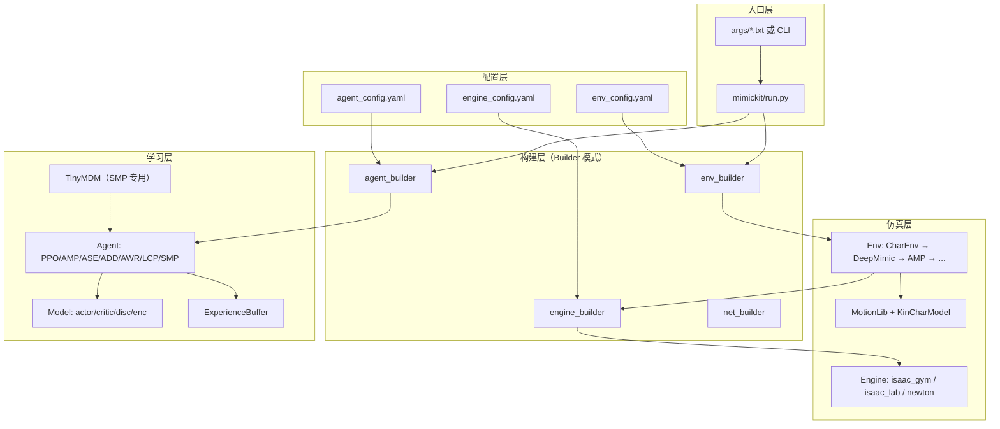

# 第一章：总体架构与知识结构

## 1.1 项目定位

MimicKit 是一个**轻量级、物理驱动的运动模仿强化学习框架**，用于训练人形、四足、SMPL 等关节角色的运动控制器。设计原则：

- **最小依赖**：核心 RL 逻辑约 2000 行，模拟器可插拔
- **并行优先**：面向 Isaac Gym 数千并行环境优化
- **YAML 驱动**：引擎、环境、算法三层配置解耦

官方综述论文：[MimicKit: A Reinforcement Learning Framework for Motion Imitation and Control](https://arxiv.org/abs/2510.13794)（Peng, 2025）

功能更丰富的同类框架：[ProtoMotions](https://github.com/NVlabs/ProtoMotions)

---

## 1.2 系统架构总览



### 1.2.1 数据流（单步）

1. **Reset**：`MotionLib` 采样动作片段与时间 → 设置参考姿态
2. **Obs**：`CharEnv._compute_obs()` 构建本体感知 + 相位 + 目标姿态特征
3. **Action**：Agent 归一化 obs → Actor 网络 → 高斯采样 → 反归一化 → PD 位置目标
4. **Step**：`Engine.set_cmd()` → 物理子步 → 接触/终止检测
5. **Reward**：DeepMimic 跟踪误差 **或** 判别器/SMP 奖励 **或** 任务奖励（加权求和）
6. **Train**：缓冲区记录轨迹 → TD(λ) 优势 → PPO/AWR 更新 + 判别器/编码器

---

## 1.3 模块划分与职责

| 包路径 | 职责 | 关键类 |
|--------|------|--------|
| `mimickit/run.py` | 训练/测试入口、多进程启动 | `main()`, `run()` |
| `mimickit/anim/` | 运动数据 I/O、运动学树、FK | `Motion`, `MotionLib`, `KinCharModel` |
| `mimickit/engines/` | 物理模拟抽象与后端实现 | `Engine`, `IsaacGymEngine` |
| `mimickit/envs/` | RL 环境、奖励、观测、终止 | `DeepMimicEnv`, `AMPEnv` |
| `mimickit/learning/` | 算法、模型、训练基础设施 | `PPOAgent`, `AMPAgent` |
| `mimickit/util/` | 日志、四元数数学、多进程 | `torch_util`, `mp_util` |
| `data/` | 配置、资产、动作、模型 | YAML + `.pkl` + `.xml/.urdf` |
| `tools/` | 数据转换、扩散训练、绘图 | `train_tinymdm.py` |

---

## 1.4 继承体系

### 1.4.1 Agent 继承树

```
BaseAgent
├── PPOAgent ──┬── AMPAgent ──┬── ASEAgent
│              │              ├── ADDAgent
│              │              └── (判别器变体)
│              ├── SMPAgent
│              └── LCPAgent
├── AWRAgent
└── DummyAgent
```

### 1.4.2 Model 继承树

```
BaseModel
├── PPOModel ──┬── AMPModel ──┬── ASEModel
│              │              └── ADDModel
│              ├── SMPModel
│              └── LCPModel
└── AWRModel
```

### 1.4.3 Environment 继承树

```
BaseEnv
└── SimEnv
    └── CharEnv
        ├── DeepMimicEnv
        │   ├── AMPEnv
        │   │   ├── ASEEnv
        │   │   ├── ADDEnv
        │   │   └── SMPEnv
        │   │       ├── TaskLocationEnv
        │   │       ├── TaskSteeringEnv
        │   │       └── TaskDodgeballEnv
        │   └── StaticObjectsEnv
        ├── ViewMotionEnv
        └── CharDofTestEnv
```

**设计模式**：新算法通过继承扩展 PPO/AMP，复用训练循环而非重写；LCP 作为 Wrapper 可叠加到任意 PPO Agent。

---

## 1.5 七种算法对比

| 算法 | 论文 | RL 基座 | 模仿机制 | 是否需要参考动作 | 典型场景 |
|------|------|---------|---------|----------------|---------|
| **DeepMimic+PPO** | [TOG 2018](https://xbpeng.github.io/projects/DeepMimic/) | PPO | 逐帧姿态跟踪奖励 | 是（单片段或数据集） | 精确复现单个技能 |
| **AWR** | [arXiv 2019](https://arxiv.org/abs/1910.00177) | 优势加权回归 | 同 DeepMimic 奖励 | 是 | 离策略、样本效率实验 |
| **AMP** | [TOG 2021](https://xbpeng.github.io/projects/AMP/) | PPO + 判别器 | GAN 式运动风格奖励 | 是（数据集） | 风格化 locomotion、任务+模仿 |
| **ASE** | [TOG 2022](https://xbpeng.github.io/projects/ASE/) | AMP + 编码器 | 潜变量 z 条件策略 | 是（数据集） | 可复用技能嵌入、多技能 |
| **ADD** | [SIGGRAPH Asia 2025](https://xbpeng.github.io/projects/ADD/) | AMP 变体 | 差分判别器 | 是 | 更稳定的对抗模仿 |
| **LCP** | [IROS 2025](https://xbpeng.github.io/projects/LCP/) | PPO Wrapper | Lipschitz 平滑约束 | 可选 | 平滑人形/机器人行走 |
| **SMP** | [SIGGRAPH 2026](https://xbpeng.github.io/projects/SMP/) | PPO + 扩散先验 | Score-Matching 奖励 | 先验训练时需要 | 无动作数据任务策略、GSI |

### 1.5.1 优缺点与适用场景

#### DeepMimic + PPO

- **优点**：实现简单、单片段模仿精度高、奖励信号直接
- **缺点**：需精确参考动作、泛化到新动作需重训或数据集
- **适用**：武术、翻滚等**固定技能**复现

#### AWR

- **优点**：离策略、可重复利用历史样本
- **缺点**：本项目主要用于与 PPO 对比实验
- **适用**：研究离策略模仿学习

#### AMP

- **优点**：无需逐帧对齐、可混合任务奖励、风格自然
- **缺点**：判别器训练不稳定、需大量动作数据集
- **适用**：locomotion 数据集训练、**任务+风格**平衡

#### ASE

- **优点**：潜空间可复用、支持多技能切换
- **缺点**：训练复杂度高、需调 diversity/encoder 权重
- **适用**：持盾战斗、多技能库

#### ADD

- **优点**：差分输入更关注"与参考的差距"，训练更稳定
- **缺点**：需同时提供 agent/demo 配对观测
- **适用**：替代 AMP 的稳定方案

#### LCP

- **优点**：策略对观测变化平滑、减少抖动
- **缺点**：`lcp_weight` 需针对任务调参
- **适用**：G1 等**真实机器人**部署前的平滑控制

#### SMP

- **优点**：先验可复用、任务训练**无需动作数据**（配合 GSI）
- **缺点**：两阶段训练（先训扩散先验）
- **适用**：location/steering/dodgeball 等**纯任务**控制

---

## 1.6 支持的角色与资产格式

| 角色 | 资产格式 | 解析器 | 示例配置 |
|------|---------|--------|---------|
| Humanoid | `.xml` (MJCF) | `MJCFCharModel` | `deepmimic_humanoid_env.yaml` |
| Humanoid+剑盾 | `.xml` | `MJCFCharModel` | `ase_humanoid_sword_shield_env.yaml` |
| Unitree G1 | `.urdf` | `URDFCharModel` | `deepmimic_g1_env.yaml` |
| Unitree Go2 | `.urdf` | `URDFCharModel` | `deepmimic_go2_env.yaml` |
| SMPL | `.xml` | `MJCFCharModel` | `deepmimic_smpl_env.yaml` |
| Pi Plus | `.urdf` | `URDFCharModel` | `deepmimic_pi_plus_env.yaml` |

---

## 1.7 依赖关系

### Python 包（`requirements.txt`）

| 包 | 用途 |
|----|------|
| `torch>=1.9.1` | 神经网络与训练 |
| `gymnasium` | 观测/动作空间定义 |
| `numpy`, `pyyaml` | 数组与配置 |
| `diffusers>=0.36.0` | SMP 的 DDPM/DDIM 调度器 |
| `tensorboardX`, `wandb` | 训练日志 |
| `matplotlib`, `moviepy`, `pyglet` | 绘图与视频 |

### 外部模拟器（单独安装）

- **Isaac Gym**（默认，GPU 并行）
- **Isaac Lab**（Isaac Sim，USD 资产）
- **Newton**（替代物理引擎）

---

## 1.8 与章节文档的对应关系

| 架构组件 | 详细文档 |
|---------|---------|
| 配置与 `run.py` | [02-config-and-workflow](02-config-and-workflow.md) |
| `anim/` 包 | [03-animation-module](03-animation-module.md) |
| `engines/` 包 | [04-physics-engines](04-physics-engines.md) |
| `envs/` 包 | [05-environments](05-environments.md) |
| `learning/` 基础设施 | [06-learning-core](06-learning-core.md) |
| 各算法 | [07](07-algorithm-deepmimic-ppo.md)–[13](13-algorithm-smp.md) |
| 工具链 | [14-tools-and-data](14-tools-and-data.md) |

---

[← 返回索引](TECHNICAL_INDEX.md) | [下一章：配置与流程 →](02-config-and-workflow.md)
