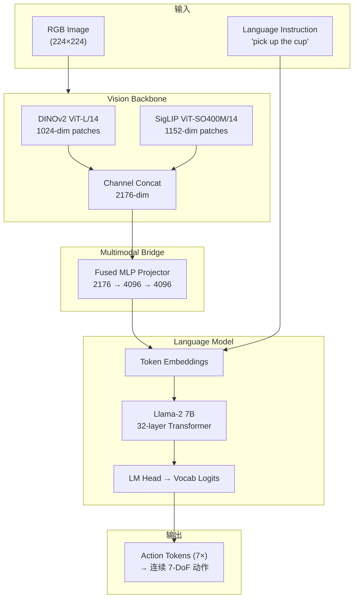

# 01 — 架构总览

## 1. 什么是 OpenVLA？

OpenVLA（Open Vision-Language-Action Model）是一个**开源通用机器人操作策略**，核心思想是：

> 将在互联网规模图文数据上预训练的 VLM，进一步在百万级机器人演示轨迹上微调，使其能够根据**单帧 RGB 图像 + 自然语言指令**，直接输出**低层机器人控制动作**（如末端执行器 7-DoF delta）。

这与传统机器人学习方法形成对比：

| 方法类别 | 代表 | 输入 | 输出 | 泛化能力 |
|----------|------|------|------|----------|
| **行为克隆 (BC)** | Diffusion Policy | 图像 + 状态 | 连续动作 | 局限于训练分布 |
| **Transformer BC** | RT-1, Octo | 图像 + 语言 | 离散/连续动作 | 跨 embodiment 中等 |
| **VLA (OpenVLA)** | 本文 | 图像 + 语言 | 离散 action tokens → 连续动作 | 跨 970K 轨迹、多机器人 |
| **VLA + 高效微调** | OpenVLA + LoRA/OFT | 同上 | 同上 | 目标域少量 demo 即可适配 |

---

## 2. 整体架构

OpenVLA 建立在 **Prismatic VLM** 框架之上，继承其三组件架构并增加动作预测头（实为 LLM 词表末尾 token 映射）：



### 2.1 各模块职责

| 模块 | 源码位置 | 作用 |
|------|----------|------|
| **Vision Backbone** | `prismatic/models/backbones/vision/` | 提取图像 patch 特征（倒数第二层） |
| **Projector** | `prismatic/util/nn_utils.py` | 将视觉特征投影到 LLM embedding 空间 |
| **LLM Backbone** | `prismatic/models/backbones/llm/` | 多模态自回归建模，生成 action tokens |
| **ActionTokenizer** | `prismatic/vla/action_tokenizer.py` | 连续动作 ↔ 离散 token 双向映射 |
| **OpenVLA Wrapper** | `prismatic/models/vlas/openvla.py` | 推理封装：prompt 构建 + 反归一化 |
| **HF 集成** | `prismatic/extern/hf/` | HuggingFace AutoClasses 兼容层 |
| **数据管道** | `prismatic/vla/datasets/` | RLDS → 训练 batch 转换 |
| **训练策略** | `prismatic/training/strategies/` | FSDP 分布式训练 |

---

## 3. 知识结构图

```
OpenVLA 知识体系
├── 理论基础
│   ├── Vision Transformer (ViT) — 视觉表征
│   ├── Causal Language Modeling — 自回归生成
│   ├── Multimodal Fusion (LLaVA-style) — 视觉 token 插入
│   └── Behavior Cloning — 模仿学习
├── 模型架构
│   ├── Prismatic VLM (预训练基座)
│   ├── Action Discretization (256-bin uniform)
│   └── Quantile Normalization (BOUNDS_Q99)
├── 数据工程
│   ├── RLDS / TFDS 格式
│   ├── Open X-Embodiment 混合采样
│   └── 图像增强 (random crop 90%)
├── 训练系统
│   ├── PyTorch FSDP (全量训练)
│   ├── LoRA / PEFT (高效微调)
│   └── BF16 Mixed Precision + Flash Attention
└── 部署与评估
    ├── HuggingFace transformers 推理
    ├── REST API (FastAPI)
    └── Bridge / LIBERO 基准
```

---

## 4. 模块间关联

### 4.1 训练路径（Prismatic 原生）

```
vla-scripts/train.py
    ├── prismatic/conf/vla.py          # VLAConfig 实验配置
    ├── prismatic/models/load.py       # load_vla() 加载 checkpoint
    ├── prismatic/vla/materialize.py   # get_vla_dataset_and_collator()
    └── prismatic/training/          # FSDP 训练循环
            └── base_strategy.py     # run_vla_training()
```

### 4.2 推理路径（HuggingFace）

```
transformers AutoClasses
    ├── OpenVLAConfig              # 模型配置 + norm_stats
    ├── PrismaticProcessor         # 图像预处理 + tokenization
    └── OpenVLAForActionPrediction # predict_action()
            └── PrismaticForConditionalGeneration.forward()
```

### 4.3 微调路径（LoRA）

```
vla-scripts/finetune.py
    ├── HuggingFace AutoModelForVision2Seq
    ├── PEFT LoRA (target_modules=all-linear)
    └── RLDSDataset (单数据集)
```

---

## 5. 方案对比与适用场景

### 5.1 基础 VLM 选择

| VLM | Vision | LLM | 特点 | 适用场景 |
|-----|--------|-----|------|----------|
| `siglip-224px+7b` | SigLIP | Vicuña v1.5 | 轻量、快速迭代 | 开发调试、Bridge 单数据集 |
| `prism-dinosiglip-224px+7b` | DINOv2 + SigLIP 融合 | Llama-2 7B | **旗舰配置**，更强视觉 | 大规模 OXE 预训练、生产部署 |

**DINO-SigLIP 融合的优势**（Prismatic 论文结论）：
- DINOv2 提供强空间/几何特征
- SigLIP 提供语义对齐特征
- 通道拼接 (channel concat) 比单 backbone 泛化更好

### 5.2 训练策略对比

| 策略 | 脚本 | GPU 需求 | 可训练参数 | 适用场景 |
|------|------|----------|------------|----------|
| **FSDP 全量微调** | `train.py` | 8× A100 80GB | 全部 7.5B | 分布偏移大、追求最优性能 |
| **LoRA 微调** | `finetune.py` | 1× A100 80GB | ~0.1% (rank=32) | 资源有限、目标域 demo ~100 条 |
| **冻结 Vision + 训练 LLM** | `train.py` (stage=vla-train) | 中等 | LLM + Projector | 视觉已足够、加速训练 |
| **Sandwich 训练** | `train.py` (stage=vla-sandwich-train) | 中等 | Vision + Projector + LLM 末层 | 平衡视觉适配与 LLM 稳定性 |

### 5.3 动作表示对比

| 方法 | OpenVLA 默认 | FAST | OFT |
|------|-------------|------|-----|
| 动作类型 | 离散 256-bin | 离散压缩 token | 连续动作 |
| Token 数/步 | 7 (action dim) | 1-2 (压缩) | N/A |
| 推理速度 | 中等 (~7 步 decode) | 快 (~15×) | 快 (~25-50×) |
| 精度 | 高 | 中等 | 高 |
| 本仓库支持 | ✅ 原生 | ❌ (外部项目) | ❌ (外部项目) |

> FAST: [Physical Intelligence, 2025](https://www.physicalintelligence.company/research/fast)  
> OFT: [OpenVLA-OFT, 2025](https://openvla-oft.github.io/)

---

## 6. 训练阶段 (Stage) 详解

OpenVLA 复用 Prismatic VLM 的分阶段冻结策略，由 `PrismaticVLM.freeze_backbones(stage)` 控制：

| Stage | Vision | Projector | LLM | 用途 |
|-------|--------|-----------|-----|------|
| `align` | ❄️ 冻结 | 🔥 训练 | ❄️ 冻结 | VLM 预训练：对齐视觉-语言 |
| `finetune` / `vla-train` | ❄️ 冻结 | 🔥 训练 | 🔥 训练 | **VLA 默认**：在 OXE 上训练 |
| `full-finetune` / `vla-full-train` | 🔥 训练 | 🔥 训练 | 🔥 训练 | 全参数 VLA 微调 |
| `vla-sandwich-train` | 🔥 训练 | 🔥 训练 | ❄️ 冻结 (末层 🔥) | 视觉适配 + LLM 微调 |
| `vla-last-layer-train` | ❄️ 冻结 | ❄️ 冻结 | 末层 🔥 | 极轻量适配 |

---

## 7. 多模态序列构造

OpenVLA 采用 **LLaVA 风格**的 early fusion：在 `<BOS>` token 之后插入全部视觉 patch embeddings。

```
序列布局:
[BOS] [patch_1] [patch_2] ... [patch_N] [INST] What action... [/INST] [action_tok_1] ... [action_tok_7] [EOS]
  ↑         ↑ 视觉 tokens (N ≈ 256×2 for DINO-SigLIP)              ↑ 仅这些 token 计算 loss
```

**Loss 计算**：Cross-Entropy，仅对 action token 位置（及可选 EOS）计算，`IGNORE_INDEX = -100` 屏蔽其余位置。

数学表达：

$$
\mathcal{L} = -\frac{1}{|T_a|} \sum_{t \in T_a} \log P_\theta(a_t \mid I, \ell, a_{<t})
$$

其中 $I$ 为图像，$\ell$ 为语言指令，$T_a$ 为 action token 位置集合，$a_t$ 为第 $t$ 个 action token。

---

## 8. 优缺点分析

### 优点

1. **简单可扩展**：复用成熟 VLM + 标准 LM 训练，无需设计专用 action head
2. **语言条件化**：天然支持自然语言指令，受益于 LLM 预训练
3. **跨 embodiment 泛化**：970K 轨迹、22+ 数据集混合训练
4. **开源生态完整**：HF Hub 权重、LoRA 微调、REST 部署、仿真评估
5. **模块化设计**：Vision/LLM/Projector 可独立替换

### 缺点

1. **推理延迟**：自回归生成 7 个 token，无 action chunking
2. **动作精度受离散化限制**：256-bin 均匀离散，高维动作空间可能有量化误差
3. **依赖 Llama-2 许可**：预训练模型受 Llama Community License 约束
4. **域迁移需微调**：零样本仅在训练分布内表现好，新机器人/场景需 ~100 demo
5. **控制频率敏感**：训练数据 ~5-10Hz，高频率控制需降采样

---

## 9. 与相关工作的关系

```
                    ┌──────────────┐
                    │  LLaVA/Prismatic VLM  │
                    │  (图文理解)    │
                    └──────┬───────┘
                           │ 微调：动作 → token
                    ┌──────▼───────┐
                    │   OpenVLA    │◀─── Open X-Embodiment 数据
                    │  (VLA 策略)   │
                    └──────┬───────┘
              ┌────────────┼────────────┐
              ▼            ▼            ▼
         LoRA 微调     REST 部署    LIBERO 评估
         (目标域)      (真机集成)   (仿真基准)
```

---

## 10. 下一步阅读

- 深入 VLM 架构 → [02-vision-language-model.md](./02-vision-language-model.md)
- 理解动作离散化 → [03-action-tokenization-and-prediction.md](./03-action-tokenization-and-prediction.md)
- 数据准备 → [04-data-pipeline-rlds.md](./04-data-pipeline-rlds.md)
