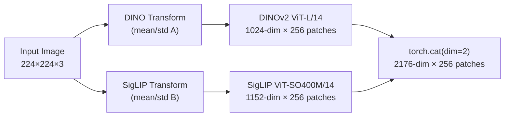
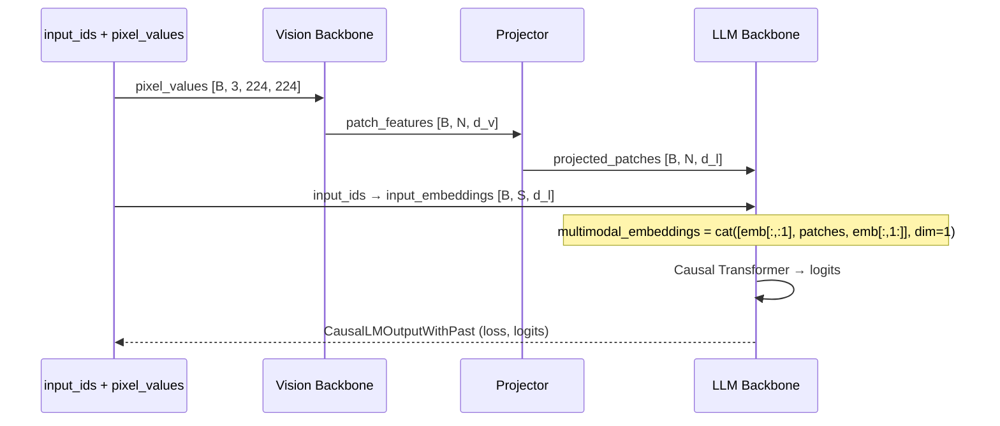

# 02 — 视觉-语言模型 (Prismatic VLM)

## 1. 概述

OpenVLA 的基座是 **Prismatic VLM**（`PrismaticVLM`），定义于 `prismatic/models/vlms/prismatic.py`。它将预训练的 Vision Transformer 与预训练的 LLM 通过轻量 **Projector** 连接，实现多模态理解。

**关键概念**：
- **Vision Backbone**：将图像编码为 patch-level 特征序列
- **Projector (Adapter)**：维度对齐层，将视觉特征映射到 LLM embedding 空间
- **LLM Backbone**：Causal Transformer，执行多模态自回归建模

> 参考论文：[Prismatic VLMs: Investigating the Design Space of Visually-Conditioned Language Models](https://arxiv.org/abs/2402.07817)

---

## 2. Vision Backbone

### 2.1 支持的 Backbone 类型

| ID | 模型 | embed_dim | 源码 |
|----|------|-----------|------|
| `clip-vit-l-336px` | CLIP ViT-L/14 @ 336px | 1024 | `clip_vit.py` |
| `siglip-vit-so400m-224px` | SigLIP ViT-SO400M/14 | 1152 | `siglip_vit.py` |
| `dinov2-vit-l-14` | DINOv2 ViT-L/14 | 1024 | `dinov2_vit.py` |
| `dinosiglip-vit-so-224px` | DINOv2 + SigLIP 融合 | 2176 | `dinosiglip_vit.py` |

OpenVLA-7B 使用 **`dinosiglip-vit-so-224px`**（DINO-SigLIP 融合）。

### 2.2 DINO-SigLIP 融合架构

源码：`prismatic/models/backbones/vision/dinosiglip_vit.py`



**为什么融合两个 ViT？**

| Backbone | 预训练目标 | 擅长 |
|----------|-----------|------|
| DINOv2 | 自监督 (iBOT + DINO) | 空间结构、几何、物体边界 |
| SigLIP | 图文对比学习 (Sigmoid Loss) | 语义对齐、语言相关视觉特征 |

Prismatic 论文通过系统实验发现：**通道拼接 (channel concatenation)** 优于单 backbone 或 late fusion。

**特征提取层**：两个 ViT 均取 **倒数第二层 (second-to-last layer)** 的 patch tokens（不含 CLS），通过 monkey-patch `forward()` 实现：

```python
# dinosiglip_vit.py 核心逻辑
self.dino_featurizer.forward = unpack_tuple(
    partial(self.dino_featurizer.get_intermediate_layers, n={len(self.dino_featurizer.blocks) - 2})
)
```

对于 ViT-L（24 blocks），$n = 22$，输出 256 个 patch tokens（$224/14 = 16$，$16^2 = 256$）。

### 2.3 Vision Transformer 原理

ViT 将图像分割为固定大小的 patch 并线性投影：

$$
\mathbf{z}_0 = [\mathbf{x}_{\text{class}}; \mathbf{x}_p^1 \mathbf{E}; \ldots; \mathbf{x}_p^N \mathbf{E}] + \mathbf{E}_{\text{pos}}
$$

经过 $L$ 层 Transformer：

$$
\mathbf{z}'_l = \text{MSA}(\text{LN}(\mathbf{z}_{l-1})) + \mathbf{z}_{l-1}
$$
$$
\mathbf{z}_l = \text{MLP}(\text{LN}(\mathbf{z}'_l)) + \mathbf{z}'_l
$$

OpenVLA 使用 $\mathbf{z}_{L-1}$（倒数第二层）的 patch tokens（去掉 CLS）作为视觉特征。

> 参考：[An Image is Worth 16x16 Words (ViT)](https://arxiv.org/abs/2010.11929)  
> DINOv2: [Oquab et al., 2023](https://arxiv.org/abs/2304.07193)  
> SigLIP: [Zhai et al., 2023](https://arxiv.org/abs/2303.15343)

### 2.4 图像预处理策略

| 策略 | 说明 | 适用 |
|------|------|------|
| `resize-naive` | 直接 resize 到目标尺寸 | 快速实验 |
| `resize-crop` | TIMM 默认 center crop | SigLIP 默认 |
| `letterbox` | 保持宽高比，填充到正方形 | **OpenVLA 默认** |

Letterbox 避免图像变形，用均值颜色填充：

```python
# processing_prismatic.py
def letterbox_pad_transform(image, padding_fill_value):
    (w, h), max_wh = image.size, max(image.size)
    horizontal_pad = int((max_wh - w) / 2)
    vertical_pad = int((max_wh - h) / 2)
    return TVF.pad(image, padding, fill=padding_fill_value)
```

DINO-SigLIP 融合时，**同一张图像分别用各自的 transform** 处理，返回 dict：

```python
{"dino": tensor_dino, "siglip": tensor_siglip}  # 各 [3, 224, 224]
```

HF 版本中通道拼接为 `[bsz, 6, 224, 224]`（两个 3-channel 图像 stack）。

---

## 3. Projector (视觉-语言桥接)

### 3.1 架构类型

定义于 `prismatic/util/nn_utils.py`：

| arch_specifier | 结构 | 参数量级 |
|----------------|------|----------|
| `linear` | $\text{Linear}(d_v, d_l)$ | 最小 |
| `gelu-mlp` | $\text{Linear} \to \text{GELU} \to \text{Linear}$ | 中等 |
| `fused-gelu-mlp` | $\text{Linear}(d_v, 4d_v) \to \text{GELU} \to \text{Linear}(4d_v, d_l) \to \text{GELU} \to \text{Linear}(d_l, d_l)$ | 较大 |

OpenVLA-7B（DINO-SigLIP 融合）使用 **`fused-gelu-mlp`**：

$$
\mathbf{h} = \text{GELU}(\mathbf{W}_1 \mathbf{x} + \mathbf{b}_1), \quad \mathbf{h} \in \mathbb{R}^{4 \cdot d_v}
$$
$$
\mathbf{h}' = \text{GELU}(\mathbf{W}_2 \mathbf{h} + \mathbf{b}_2), \quad \mathbf{h}' \in \mathbb{R}^{d_l}
$$
$$
\mathbf{y} = \mathbf{W}_3 \mathbf{h}' + \mathbf{b}_3, \quad \mathbf{y} \in \mathbb{R}^{d_l}
$$

其中 $d_v = 2176$（融合视觉维度），$d_l = 4096$（Llama-2 7B hidden size）。

### 3.2 为什么需要 Projector？

Vision Backbone 和 LLM 的 embedding 空间不同：
- ViT patch features 来自视觉预训练目标
- LLM token embeddings 来自文本预训练

Projector 是 VLM 训练的第一阶段（`align` stage）主要训练对象，学习跨模态对齐。

> 类似设计见 LLaVA: [Visual Instruction Tuning](https://arxiv.org/abs/2304.08485) 中的 MLP projector。

---

## 4. LLM Backbone

### 4.1 支持的 LLM

| ID | 模型 | hidden_size | 源码 |
|----|------|-------------|------|
| `llama2-7b-pure` | Llama-2 7B | 4096 | `llama2.py` |
| `vicuna-v15-7b` | Vicuña v1.5 7B | 4096 | (via llama2) |
| `mistral-7b-v0.1` | Mistral 7B | 4096 | `mistral.py` |
| `phi-2-3b` | Phi-2 3B | 2560 | `phi.py` |

OpenVLA-7B 使用 **Llama-2 7B** + `LLaMa2ChatPromptBuilder`。

### 4.2 Causal Language Modeling

LLM 使用标准 Causal Self-Attention，带因果 mask：

$$
\text{Attention}(\mathbf{Q}, \mathbf{K}, \mathbf{V}) = \text{softmax}\left(\frac{\mathbf{Q}\mathbf{K}^\top}{\sqrt{d_k}} + \mathbf{M}\right)\mathbf{V}
$$

其中 $\mathbf{M}_{ij} = -\infty$ if $j > i$（因果 mask）。

训练目标（VLA 模式下仅 action tokens）：

$$
\mathcal{L}_{\text{CE}} = -\sum_{t} \mathbb{1}[y_t \neq -100] \cdot \log P(y_t \mid y_{<t}, \mathbf{E}_{\text{mm}})
$$

### 4.3 Prompt 格式

OpenVLA 使用 Llama-2 Chat 模板（`llama2_chat_prompter.py`）：

```
<s>[INST] <<SYS>>
You are a helpful language and vision assistant...
<</SYS>>

What action should the robot take to {instruction}? [/INST] {action_tokens}</s>
```

v0.1 版本使用 Vicuña 格式：

```
A chat between a curious user and an artificial intelligence assistant...
USER: What action should the robot take to {instruction}? ASSISTANT: {action_tokens}
```

**推理时的特殊 token**：Llama tokenizer 在 `:` 后需插入空 token (ID=29871) 以匹配训练分布。

---

## 5. 多模态 Forward 流程

核心逻辑在 `PrismaticVLM.forward()`（`prismatic.py` 第 312-481 行）：



**关键实现细节**：

1. **视觉 token 插入位置**：`<BOS>` 之后、文本 token 之前
2. **Labels 处理**：视觉 patch 位置设为 `IGNORE_INDEX=-100`，不参与 loss
3. **KV Cache 推理**：首步处理完整 multimodal 序列，后续步仅传入新 token（`input_ids.shape[1]==1`）
4. **混合精度**：BF16 autocast，Vision Backbone 可选 FP32（full-finetune 时）

```python
# prismatic.py 核心拼接逻辑
multimodal_embeddings = torch.cat([
    input_embeddings[multimodal_indices, :1, :],   # BOS token
    projected_patch_embeddings,                     # N 个视觉 patch
    input_embeddings[multimodal_indices, 1:, :],   # 剩余文本 token
], dim=1)
```

---

## 6. FSDP 分布式包装

`PrismaticVLM.get_fsdp_wrapping_policy()` 定义三层 FSDP 包装：

1. **Vision Backbone**：按 ViT Block 包装
2. **LLM Backbone**：按 Transformer Layer 包装
3. **Projector**：整体包装

使用 `_or_policy` 合并，未覆盖的模块归入 root FSDP instance。

---

## 7. HuggingFace 移植

`prismatic/extern/hf/modeling_prismatic.py` 提供 HF 兼容实现：

| 原生类 | HF 类 |
|--------|-------|
| `PrismaticVLM` | `PrismaticForConditionalGeneration` |
| `OpenVLA` | `OpenVLAForActionPrediction` |
| Vision Backbone | `PrismaticVisionBackbone` |
| Projector | `PrismaticProjector` |

主要差异：
- HF 版使用 `AutoModelForCausalLM.from_config()` 加载 LLM
- 融合 backbone 的 pixel_values 为 6-channel tensor
- 不支持从头训练（仅推理和 LoRA 微调）

---

## 8. 可运行示例：理解多模态序列长度

```python
"""计算 OpenVLA-7B 的多模态序列长度"""
# DINO-SigLIP @ 224px: 每个 ViT 输出 256 patches, 融合后仍为 256 patches
num_patches = 256  # (224/14)^2

# Prompt token 数 (近似)
prompt_tokens = 50  # "What action should the robot take to ..."

# Action tokens
action_dim = 7

# 总序列长度
total_seq_len = 1 + num_patches + prompt_tokens + action_dim + 1  # BOS + patches + prompt + actions + EOS
print(f"Multimodal sequence length: {total_seq_len}")  # ≈ 315

# LLM 需要处理的 embedding 序列
print(f"Vision tokens: {num_patches}")
print(f"Text + action tokens: {prompt_tokens + action_dim + 1}")
```

---

## 9. 参考文献与开源项目

| 资源 | 链接 |
|------|------|
| Prismatic VLMs 论文 | https://arxiv.org/abs/2402.07817 |
| Prismatic VLMs 代码 | https://github.com/TRI-ML/prismatic-vlms |
| LLaVA | https://github.com/haotian-liu/LLaVA |
| DINOv2 | https://github.com/facebookresearch/dinov2 |
| SigLIP (TIMM) | https://github.com/huggingface/pytorch-image-models |
| Llama-2 | https://github.com/meta-llama/llama |
| Flash Attention | https://github.com/Dao-AILab/flash-attention |

---

## 10. 下一章

→ [03-action-tokenization-and-prediction.md](./03-action-tokenization-and-prediction.md)：动作如何离散化为 token 并自回归生成
