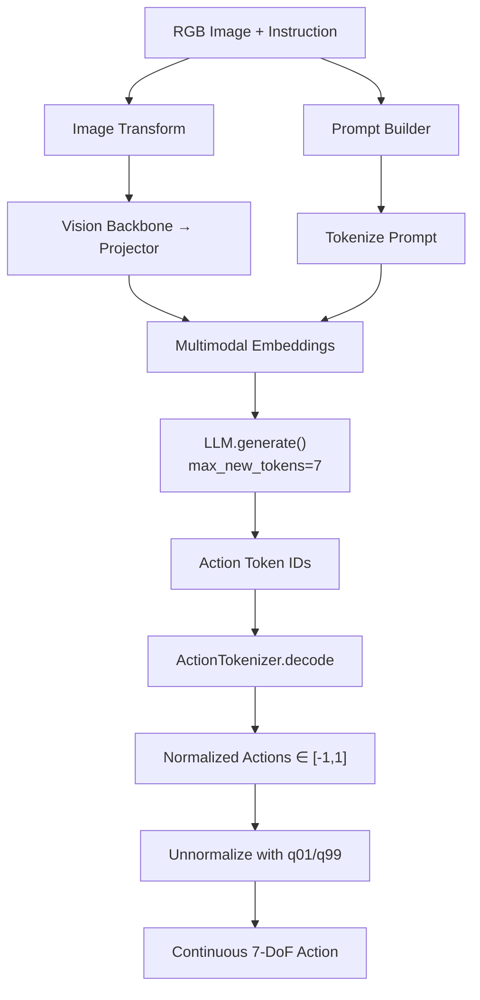

# 03 — 动作离散化与预测

## 1. 核心思想

OpenVLA 将机器人控制问题转化为 **语言建模问题**：

> 给定图像 $I$ 和指令 $\ell$，自回归预测动作 token 序列 $\mathbf{a} = (a_1, \ldots, a_D)$，其中 $D$ 为动作维度（通常 7-DoF）。

这与 RT-1/Octo 的离散动作类似，但 OpenVLA 的创新在于 **复用 LLM 词表末尾的 token** 作为动作 token，无需扩展词表或添加专用 action head。

---

## 2. ActionTokenizer 原理

源码：`prismatic/vla/action_tokenizer.py`

### 2.1 为什么需要 ActionTokenizer？

| 问题 | 解决方案 |
|------|----------|
| LLM 输出离散 token，动作为连续向量 | 均匀分 bin 离散化 |
| 不同数据集动作范围不同 | 先归一化到 $[-1, 1]$，推理时反归一化 |
| 如何映射到 LLM token | 使用词表**最后 256 个 token** |

### 2.2 离散化（连续 → token）

**Step 1: 均匀分 bin**

在 $[\text{min\_action}, \text{max\_action}] = [-1, 1]$ 上创建 $B=256$ 个等间距边界：

$$
\text{bins} = \text{linspace}(-1, 1, 256)
$$

Bin 中心（用于反离散化）：

$$
c_i = \frac{\text{bins}_i + \text{bins}_{i+1}}{2}, \quad i = 0, \ldots, 254
$$

**Step 2: 量化**

对归一化动作 $a \in [-1, 1]$：

$$
d = \text{digitize}(a, \text{bins}) \in \{1, \ldots, 256\}
$$

**Step 3: 映射到 LLM token ID**

关键设计——使用词表**末尾** token（BPE 词表中使用频率最低的 token）：

$$
\text{token\_id} = \text{vocab\_size} - d
$$

```python
# action_tokenizer.py
self.bins = np.linspace(min_action, max_action, self.n_bins)          # 256 边界
self.bin_centers = (self.bins[:-1] + self.bins[1:]) / 2.0            # 255 中心
self.action_token_begin_idx = int(self.tokenizer.vocab_size - (self.n_bins + 1))

def __call__(self, action: np.ndarray) -> str:
    action = np.clip(action, a_min=-1.0, a_max=1.0)
    discretized_action = np.digitize(action, self.bins)
    return self.tokenizer.decode(list(self.tokenizer.vocab_size - discretized_action))
```

**为什么用词表末尾？**

BPE tokenizer 按频率排序，末尾 token 在预训练文本中极少出现，"借用"它们作为动作 token 对语言能力的干扰最小。

### 2.3 反离散化（token → 连续）

```python
def decode_token_ids_to_actions(self, action_token_ids: np.ndarray) -> np.ndarray:
    discretized_actions = self.tokenizer.vocab_size - action_token_ids
    discretized_actions = np.clip(discretized_actions - 1, a_min=0, a_max=self.bin_centers.shape[0] - 1)
    return self.bin_centers[discretized_actions]
```

**边界情况处理**：
- `digitize` 返回 $[1, 256]$，减 1 后为 $[0, 255]$
- 索引 255 会越界（仅 255 个 bin center），通过 clip 到 $[0, 254]$

### 2.4 量化误差分析

256-bin 均匀离散化在 $[-1, 1]$ 上的分辨率：

$$
\Delta = \frac{2}{255} \approx 0.0078
$$

对于归一化空间，最大量化误差为 $\Delta/2 \approx 0.0039$。

反归一化到真实动作空间 $[q_{01}, q_{99}]$ 后，第 $i$ 维误差：

$$
\epsilon_i \leq \frac{\Delta}{2} \cdot (q_{99}^{(i)} - q_{01}^{(i)})
$$

---

## 3. 动作归一化与反归一化

### 3.1 归一化方案

OpenVLA 默认使用 **BOUNDS_Q99**（`NormalizationType.BOUNDS_Q99`）：

$$
\hat{a}_i = \text{clip}\left(2 \cdot \frac{a_i - q_{01}^{(i)}}{q_{99}^{(i)} - q_{01}^{(i)} + \epsilon} - 1, \;-1, \;1\right)
$$

其中 $q_{01}, q_{99}$ 为数据集第 $i$ 维动作的 1% 和 99% 分位数。

**为什么用分位数而非 min/max？**
- 鲁棒性：排除 outlier 轨迹
- 跨数据集混合：不同机器人动作范围差异大

**Mask 机制**：某些维度可能无效（如 min==max 的 padding 维度），通过 mask 跳过归一化：

```python
mask = action_norm_stats.get("mask", np.ones_like(q01, dtype=bool))
actions = np.where(
    mask,
    0.5 * (normalized_actions + 1) * (action_high - action_low) + action_low,
    normalized_actions,  # 不归一化的维度保持原值
)
```

### 3.2 反归一化（推理时）

$$
a_i = \frac{\hat{a}_i + 1}{2} \cdot (q_{99}^{(i)} - q_{01}^{(i)}) + q_{01}^{(i)}
$$

实现于 `OpenVLA.predict_action()` 和 `OpenVLAForActionPrediction.predict_action()`。

### 3.3 dataset_statistics.json

训练时自动保存（`save_dataset_statistics()`），推理时加载：

```json
{
  "bridge_orig": {
    "action": {
      "q01": [-0.05, -0.05, -0.05, -0.25, -0.25, -0.25, 0.0],
      "q99": [0.05, 0.05, 0.05, 0.25, 0.25, 0.25, 1.0],
      "mask": [true, true, true, true, true, true, true]
    }
  }
}
```

**`unnorm_key`**：多数据集训练时需指定使用哪套统计量（如 `"bridge_orig"`）。

---

## 4. 7-DoF 动作空间

OpenVLA 默认 7 维动作（BridgeData V2 / WidowX）：

| 维度 | 含义 | 类型 |
|------|------|------|
| 0-2 | $\Delta x, \Delta y, \Delta z$ | 末端执行器位置增量 |
| 3-5 | $\Delta roll, \Delta pitch, \Delta yaw$ | 末端执行器姿态增量 |
| 6 | gripper | 夹爪开合 (0=关, 1=开) |

**Gripper 特殊处理**（数据管道中）：
- `binarize_gripper_actions()`：将连续 gripper 值二值化
- 某些数据集使用 `rel2abs_gripper_actions()` 转换相对→绝对

---

## 5. 推理流程

### 5.1 完整 Pipeline



### 5.2 源码 walkthrough

```python
# openvla.py - predict_action()
def predict_action(self, image, instruction, unnorm_key=None, **kwargs):
    # 1. 构建 prompt
    prompt_builder.add_turn(role="human", message=f"What action should the robot take to {instruction.lower()}?")
    
    # 2. Tokenize + 插入空 token (ID=29871)
    input_ids = tokenizer(prompt_text, ...).input_ids
    
    # 3. 图像预处理
    pixel_values = image_transform(image)
    
    # 4. 自回归生成 7 个 action token
    generated_ids = super().generate(
        input_ids=input_ids,
        pixel_values=pixel_values,
        max_new_tokens=self.get_action_dim(unnorm_key),  # = 7
        **kwargs
    )
    
    # 5. 提取 action tokens 并反离散化
    predicted_action_token_ids = generated_ids[0, -7:]
    normalized_actions = self.action_tokenizer.decode_token_ids_to_actions(...)
    
    # 6. 反归一化
    actions = 0.5 * (normalized_actions + 1) * (q99 - q01) + q01
    
    return actions  # np.ndarray, shape (7,)
```

### 5.3 生成参数

| 参数 | 推荐值 | 说明 |
|------|--------|------|
| `do_sample` | `False` | 贪心解码，确定性策略 |
| `max_new_tokens` | 7 (action_dim) | 动作维度 |
| `temperature` | N/A (greedy) | 采样时可用 |

---

## 6. 训练时的 Loss 与指标

### 6.1 Cross-Entropy Loss

仅对 action token 位置（和可选 EOS）计算：

```python
# datasets.py - RLDSBatchTransform
labels[: -(len(action) + 1)] = IGNORE_INDEX  # -100
```

### 6.2 评估指标

| 指标 | 计算方式 | 意义 |
|------|----------|------|
| **Action Token Accuracy** | token 精确匹配率 | 离散预测正确率 |
| **L1 Loss** | 反离散化后的连续动作 L1 距离 | 实际控制精度 |
| **CE Loss** | 标准交叉熵 | 训练损失 |

```python
# base_strategy.py - run_vla_training()
action_preds = output.logits[:, num_patches:-1].argmax(dim=2)
action_gt = batch["labels"][:, 1:]
mask = action_gt > action_tokenizer.action_token_begin_idx

action_accuracy = (action_preds == action_gt)[mask].float().mean()
continuous_pred = action_tokenizer.decode_token_ids_to_actions(action_preds[mask])
continuous_gt = action_tokenizer.decode_token_ids_to_actions(action_gt[mask])
l1_loss = F.l1_loss(continuous_pred, continuous_gt)
```

---

## 7. 可运行示例

### 7.1 ActionTokenizer 单元测试

```python
"""演示 ActionTokenizer 的离散化-反离散化循环"""
import numpy as np
from transformers import AutoTokenizer

# 模拟 ActionTokenizer 逻辑（无需 GPU）
class SimpleActionTokenizer:
    def __init__(self, vocab_size=32000, n_bins=256):
        self.vocab_size = vocab_size
        self.n_bins = n_bins
        self.bins = np.linspace(-1, 1, n_bins)
        self.bin_centers = (self.bins[:-1] + self.bins[1:]) / 2.0

    def encode(self, action):
        action = np.clip(action, -1, 1)
        d = np.digitize(action, self.bins)
        return self.vocab_size - d

    def decode(self, token_ids):
        d = self.vocab_size - token_ids
        d = np.clip(d - 1, 0, len(self.bin_centers) - 1)
        return self.bin_centers[d]

# 测试
tokenizer = SimpleActionTokenizer()
original_action = np.array([0.5, -0.3, 0.0, 0.1, -0.8, 0.2, 1.0])
token_ids = tokenizer.encode(original_action)
reconstructed = tokenizer.decode(token_ids)

print(f"Original:      {original_action}")
print(f"Token IDs:     {token_ids}")
print(f"Reconstructed: {reconstructed}")
print(f"Max error:     {np.max(np.abs(original_action - reconstructed)):.4f}")
# Max error ≈ 0.0039 (half bin width)
```

### 7.2 完整推理示例（需 GPU + 模型权重）

```python
"""OpenVLA 推理示例 - 来自 README"""
from transformers import AutoModelForVision2Seq, AutoProcessor
from PIL import Image
import torch
import numpy as np

# 加载模型
processor = AutoProcessor.from_pretrained("openvla/openvla-7b", trust_remote_code=True)
vla = AutoModelForVision2Seq.from_pretrained(
    "openvla/openvla-7b",
    attn_implementation="flash_attention_2",
    torch_dtype=torch.bfloat16,
    low_cpu_mem_usage=True,
    trust_remote_code=True,
).to("cuda:0")

# 准备输入
image = Image.fromarray(np.random.randint(0, 255, (256, 256, 3), dtype=np.uint8))
prompt = "In: What action should the robot take to pick up the red cup?\nOut:"

inputs = processor(prompt, image).to("cuda:0", dtype=torch.bfloat16)
action = vla.predict_action(**inputs, unnorm_key="bridge_orig", do_sample=False)

print(f"Predicted action (7-DoF): {action}")
# 输出示例: [0.012, -0.003, 0.045, 0.0, 0.0, 0.01, 0.99]
#            dx     dy      dz     dr    dp    dyaw  gripper
```

---

## 8. 与其他动作表示方法对比

| 方法 | 动作表示 | Token 数 | 优点 | 缺点 |
|------|----------|----------|------|------|
| **OpenVLA (256-bin)** | 词表末尾 token | = action_dim (7) | 简单、无需改架构 | 量化误差、推理慢 |
| **RT-1** | 256-bin 离散 | 7 | 类似方法 | 专用 tokenizer |
| **Octo** | 离散 token | 可变 | 跨 embodiment | 非 LLM 架构 |
| **Diffusion Policy** | 连续向量 | N/A | 高精度 | 无语言条件 |
| **FAST** | 压缩离散 token | 1-2 | 15× 加速 | 额外 tokenizer 训练 |
| **OFT** | 连续动作 | N/A | 25-50× 加速、高精度 | 需改微调 recipe |

---

## 9. 参考文献

| 论文 | 链接 | 相关内容 |
|------|------|----------|
| OpenVLA | https://arxiv.org/abs/2406.09246 | 动作 tokenization 设计 |
| RT-1 | https://arxiv.org/abs/2212.06817 | 离散动作 binning |
| FAST | https://www.physicalintelligence.company/research/fast | 高效动作 tokenization |
| OpenVLA-OFT | https://openvla-oft.github.io/ | 连续动作微调 |

---

## 10. 下一章

→ [04-data-pipeline-rlds.md](./04-data-pipeline-rlds.md)：训练数据如何从 RLDS 加载与预处理
