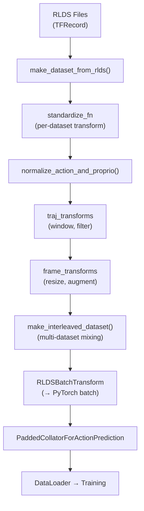

# 04 — 数据管道 (RLDS)

## 1. 概述

OpenVLA 的训练数据通过 **RLDS (Reinforcement Learning Datasets)** 格式加载，基于 TensorFlow Datasets (TFDS) 和 `dlimp` 库构建高效的数据管道。

**为什么用 RLDS 而非 PyTorch Dataset？**
- Open X-Embodiment 统一采用 RLDS 格式
- TFDS 支持大规模数据 sharding 和 streaming
- `dlimp` 提供高效的 trajectory-level 变换

> RLDS 规范: https://github.com/google-research/rlds  
> dlimp: https://github.com/kvablack/dlimp (OpenVLA fork: https://github.com/moojink/dlimp_openvla)

---

## 2. 数据格式

### 2.1 RLDS Trajectory 结构

每条 trajectory 是一个 episode（一次任务演示）：

```python
{
    "observation": {
        "image_primary": tf.Tensor[T, H, W, 3],    # 主相机 RGB 序列
        "image_secondary": ...,                      # 可选：第二相机
        "proprio": tf.Tensor[T, D_p],               # 可选：本体感知
    },
    "action": tf.Tensor[T, D_a],                    # 动作序列 (通常 D_a=7)
    "task": {
        "language_instruction": tf.Tensor[T,],       # 语言指令 (bytes)
    },
    "dataset_name": "bridge_orig",                  # 数据集标识
    "traj_metadata": {...},
}
```

其中 $T$ 为 trajectory 长度（时间步数）。

### 2.2 单步 Transition

OpenVLA 使用 `window_size=1, future_action_window_size=0`，即每步独立作为一个训练样本：

```python
{
    "observation": {"image_primary": [1, H, W, 3]},  # 当前帧
    "action": [1, 7],                                  # 当前步动作
    "task": {"language_instruction": b"pick up the cup"},
    "dataset_name": "bridge_orig",
}
```

**无 action chunking**：每步预测 1 个动作，不预测未来动作序列。

---

## 3. 数据管道架构



### 3.1 核心模块

| 模块 | 文件 | 职责 |
|------|------|------|
| `make_dataset_from_rlds` | `rlds/dataset.py` | 加载单个 RLDS 数据集 |
| `make_interleaved_dataset` | `rlds/dataset.py` | 多数据集加权混合 |
| `OXE_STANDARDIZATION_TRANSFORMS` | `rlds/oxe/transforms.py` | 各数据集标准化函数 |
| `OXE_DATASET_CONFIGS` | `rlds/oxe/configs.py` | 各数据集观测/动作配置 |
| `OXE_NAMED_MIXTURES` | `rlds/oxe/mixtures.py` | 预定义混合配方 |
| `RLDSBatchTransform` | `vla/datasets/datasets.py` | RLDS → 模型输入格式 |
| `RLDSDataset` | `vla/datasets/datasets.py` | PyTorch IterableDataset 封装 |

---

## 4. Open X-Embodiment 数据集

### 4.1 什么是 OXE？

[Open X-Embodiment (OXE)](https://robotics-transformer-x.github.io/) 是一个大规模机器人学习数据集集合：
- **22+ 数据集**，来自 **20+ 机构**
- **~970K 轨迹**，涵盖多种机器人 embodiment
- 统一 RLDS 格式

> 论文: [Padalkar et al., 2023](https://arxiv.org/abs/2310.08864)

### 4.2 预定义混合 (Mixtures)

定义于 `prismatic/vla/datasets/rlds/oxe/mixtures.py`：

| Mixture ID | 数据集数 | 用途 | 模型 |
|------------|----------|------|------|
| `bridge` | 1 | 快速调试 | 开发 |
| `oxe_magic_soup` | ~20 | Octo 风格混合 | openvla-v01-7b |
| `oxe_magic_soup_plus` | ~25 | 扩展混合 + DROID | openvla-7b |
| `oxe_magic_soup_plus_minus` | ~25 | 去掉部分低质量集 | openvla-7b (实际使用) |

**Magic Soup++ 主要数据集**（部分）：

| 数据集 | 采样权重 | 机器人 |
|--------|----------|--------|
| fractal20220817_data (RT-1) | 0.54 | Google Robot |
| kuka | 0.83 | Kuka Arm |
| bridge_orig | 1.0 | WidowX |
| taco_play | 2.0 | Franka |
| berkeley_autolab_ur5 | 2.0 | UR5 |
| droid | 0.06 | Franka (DROID) |
| ... | ... | ... |

**权重含义**：相对采样频率。权重 2.0 的数据集被采样的概率是权重 1.0 的 2 倍。

### 4.3 混合采样算法

```python
# make_interleaved_dataset 核心逻辑
# 1. 加载各数据集
datasets = [make_dataset_from_rlds(name, ...) for name, weight in mixture_spec]

# 2. 按权重采样
sample_weights = [w / sum(weights) for w in weights]
interleaved = dl.DLataset.sample_from_datasets(datasets, sample_weights)

# 3. Shuffle buffer
interleaved = interleaved.shuffle(shuffle_buffer_size)  # 默认 100K-1M
```

---

## 5. 数据预处理

### 5.1 标准化 (Standardization)

每个 OXE 数据集有独立的 `standardize_fn`（`transforms.py`），负责：
- 重命名观测/动作键
- 转换动作格式（相对→绝对、二值化 gripper 等）
- 过滤无效轨迹

示例（Bridge V2）：

```python
def bridge_orig_transform(trajectory):
    trajectory["observation"]["proprio"] = trajectory["observation"]["state"][:6]
    # ... gripper 二值化等
    return trajectory
```

### 5.2 动作归一化

使用 `normalize_action_and_proprio()`（`data_utils.py`）：

$$
\hat{a}_i = \text{clip}\left(\frac{2(a_i - q_{01}^{(i)})}{q_{99}^{(i)} - q_{01}^{(i)} + \epsilon} - 1, \;-1, \;1\right)
$$

统计量 $q_{01}, q_{99}$ 在数据集加载时自动计算并缓存。

**Gripper 二值化** (`binarize_gripper_actions`)：

```
连续 gripper → 0 (closed, <0.05) 或 1 (open, >0.95)
中间值 → 向后扫描，继承下一个确定状态
```

### 5.3 图像变换

| 阶段 | 操作 | 参数 |
|------|------|------|
| **Resize** | 缩放到模型输入尺寸 | 224×224 |
| **Augment (训练)** | RandomResizedCrop | scale=[0.9, 0.9] |
| | Color Jitter | brightness±0.2, contrast [0.8,1.2] |
| **Augment (评估)** | CenterCrop | 90% area → resize 224 |

训练增强配置（`datasets.py`）：

```python
if image_aug:
    rlds_config["frame_transform_kwargs"].update({
        "image_augment_kwargs": {
            "random_resized_crop": {"scale": [0.9, 0.9], "ratio": [1.0, 1.0]},
            "random_brightness": [0.2],
            "random_contrast": [0.8, 1.2],
            "random_saturation": [0.8, 1.2],
            "random_hue": [0.05],
        }
    })
```

**评估时的 Center Crop 原理**：

训练时 crop 90% 面积 → 评估时取 center 90% crop，保持分布一致：

```python
# crop_scale = 0.9
# 新尺寸 = sqrt(0.9) × 原尺寸 ≈ 0.949 × 原尺寸
new_size = sqrt(crop_scale) * original_size
```

---

## 6. Batch 转换

### 6.1 RLDSBatchTransform

将 RLDS numpy batch 转为 PyTorch 训练格式（`datasets.py`）：

```python
@dataclass
class RLDSBatchTransform:
    def __call__(self, rlds_batch):
        img = Image.fromarray(rlds_batch["observation"]["image_primary"][0])
        lang = rlds_batch["task"]["language_instruction"].decode().lower()
        action = rlds_batch["action"][0]

        # 构建对话 prompt
        conversation = [
            {"from": "human", "value": f"What action should the robot take to {lang}?"},
            {"from": "gpt", "value": self.action_tokenizer(action)},
        ]
        
        # Tokenize
        input_ids = tokenizer(prompt_builder.get_prompt(), ...)
        labels = list(input_ids)
        labels[:-(len(action)+1)] = IGNORE_INDEX  # 仅 action tokens 计 loss
        
        pixel_values = self.image_transform(img)
        return dict(pixel_values=pixel_values, input_ids=input_ids, labels=labels)
```

### 6.2 Collator

`PaddedCollatorForActionPrediction` 将变长序列 padding 到 batch：

```python
# 输出 batch 格式
{
    "input_ids":      LongTensor[B, max_seq_len],
    "attention_mask":  BoolTensor[B, max_seq_len],
    "pixel_values":   FloatTensor[B, C, H, W] 或 Dict,
    "labels":         LongTensor[B, max_seq_len],
    "dataset_names":  List[str],
}
```

---

## 7. 添加自定义数据集

### 7.1 步骤概览

1. **转换数据为 RLDS 格式** — 使用 [rlds_dataset_builder](https://github.com/kpertsch/rlds_dataset_builder)
2. **注册 dataset config** — `prismatic/vla/datasets/rlds/oxe/configs.py`
3. **编写 transform 函数** — `prismatic/vla/datasets/rlds/oxe/transforms.py`
4. **（可选）添加 mixture** — `prismatic/vla/datasets/rlds/oxe/mixtures.py`
5. **（可选）添加 VLAConfig** — `prismatic/conf/vla.py`

### 7.2 注册 Dataset Config 示例

```python
# configs.py
OXE_DATASET_CONFIGS["my_robot_dataset"] = {
    "image_obs_keys": {"primary": "image", "secondary": None, "wrist": None},
    "depth_obs_keys": {"primary": None, "secondary": None, "wrist": None},
    "state_obs_keys": ["EEF_state", None, "gripper_state"],
    "state_encoding": StateEncoding.POS_EULER,
    "action_encoding": ActionEncoding.EEF_POS,
}
```

### 7.3 编写 Transform 示例

```python
# transforms.py
def my_robot_dataset_transform(trajectory):
    # 标准化观测键名
    trajectory["observation"]["EEF_state"] = trajectory["observation"]["robot_state"][:, :6]
    trajectory["observation"]["gripper_state"] = trajectory["observation"]["robot_state"][:, 6:7]
    # 语言指令已存在于 trajectory["language_instruction"]
    return trajectory

OXE_STANDARDIZATION_TRANSFORMS["my_robot_dataset"] = my_robot_dataset_transform
```

### 7.4 下载 OXE 数据集

```bash
# 使用社区脚本下载
bash prepare_open_x.sh  # https://github.com/moojink/rlds_dataset_mod

# Bridge V2 需从官网下载（OXE 版本过时）
wget -r -nH --cut-dirs=4 --reject="index.html*" \
  https://rail.eecs.berkeley.edu/datasets/bridge_release/data/tfds/bridge_dataset/
mv bridge_dataset bridge_orig
```

---

## 8. TensorFlow/PyTorch 共存

OpenVLA 的数据管道运行在 TensorFlow 上，模型训练在 PyTorch 上：

```python
# dataset.py - 禁用 TF GPU，避免与 PyTorch 冲突
tf.config.set_visible_devices([], "GPU")
```

DataLoader 设置 `num_workers=0`（RLDS 自带并行）。

---

## 9. 数据统计与持久化

训练开始时自动计算并保存：

```python
# train.py
save_dataset_statistics(vla_dataset.dataset_statistics, run_dir)
# → run_dir/dataset_statistics.json
```

用于推理时动作反归一化。LoRA 微调同样保存此文件。

---

## 10. 可运行示例：检查 RLDS 数据集

```python
"""加载并检查 RLDS 数据集（需已下载 bridge_orig）"""
import tensorflow_datasets as tfds

# 列出可用 builder
builders = tfds.list_builders(data_dir="/path/to/datasets")
print("Available:", [b for b in builders if "bridge" in b])

# 加载数据集
ds = tfds.builder("bridge_orig", data_dir="/path/to/datasets").as_dataset(split="train")

for traj in ds.take(1):
    print("Keys:", traj.keys())
    print("Action shape:", traj["action"].shape)
    print("Image shape:", traj["observation"]["image_0"].shape)
    print("Language:", traj["language_instruction"][0].numpy())
```

---

## 11. 参考文献

| 资源 | 链接 |
|------|------|
| RLDS 格式规范 | https://github.com/google-research/rlds |
| Open X-Embodiment | https://arxiv.org/abs/2310.08864 |
| RLDS Dataset Builder | https://github.com/kpertsch/rlds_dataset_builder |
| BridgeData V2 | https://rail-berkeley.github.io/bridgedata/ |
| dlimp | https://github.com/kvablack/dlimp |
| TFDS | https://www.tensorflow.org/datasets |

---

## 12. 下一章

→ [05-training-and-fine-tuning.md](./05-training-and-fine-tuning.md)：如何在 OXE 上训练或 LoRA 微调
