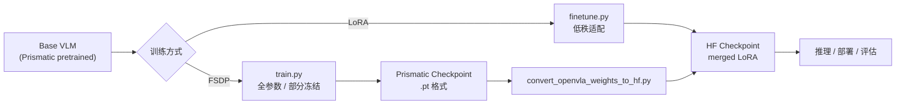

# 05 — 训练与微调

## 1. 训练路径概览

OpenVLA 提供两条训练路径：

| 路径 | 脚本 | 框架 | 场景 |
|------|------|------|------|
| **原生 FSDP 训练** | `vla-scripts/train.py` | Prismatic + FSDP | 从头预训练、全量微调 |
| **LoRA 微调** | `vla-scripts/finetune.py` | HuggingFace + PEFT | 目标域高效适配 |



---

## 2. FSDP 全量训练

### 2.1 入口与配置

```bash
torchrun --standalone --nnodes 1 --nproc-per-node 8 vla-scripts/train.py \
  --vla.type "prism-dinosiglip-224px+mx-oxe-magic-soup-plus" \
  --data_root_dir /path/to/datasets \
  --run_root_dir /path/to/runs \
  --wandb_project openvla \
  --wandb_entity your-entity
```

配置通过 `draccus` 管理，定义于 `prismatic/conf/vla.py`：

```python
@dataclass
class VLAConfig(ChoiceRegistry):
    vla_id: str                          # 实验唯一 ID
    base_vlm: Union[str, Path]           # 基座 VLM
    freeze_vision_backbone: bool         # 是否冻结视觉编码器
    freeze_llm_backbone: bool            # 是否冻结 LLM
    unfreeze_last_llm_layer: bool        # 是否解冻 LLM 最后一层
    data_mix: str                        # 数据集混合 ID
    shuffle_buffer_size: int             # Shuffle buffer 大小
    expected_world_size: int             # GPU 数量
    global_batch_size: int               # 全局 batch size
    per_device_batch_size: int           # 每 GPU batch size
    learning_rate: float                 # 学习率
    train_strategy: str                  # "fsdp-full-shard"
    ...
```

### 2.2 训练流程

```python
# train.py 核心流程
def train(cfg):
    # 1. 加载模型
    vlm = load_vla(checkpoint) if cfg.pretrained_checkpoint else load(cfg.vla.base_vlm)
    
    # 2. 确定训练 stage 并冻结/解冻
    vlm.freeze_backbones(stage)  # "vla-train" / "vla-full-train" / ...
    
    # 3. 创建数据集
    vla_dataset, action_tokenizer, collator = get_vla_dataset_and_collator(...)
    save_dataset_statistics(vla_dataset.dataset_statistics, run_dir)
    
    # 4. 初始化 FSDP 训练策略
    train_strategy = get_train_strategy("fsdp-full-shard", vlm, ...)
    train_strategy.run_setup(run_dir, n_train_examples)
    
    # 5. 训练循环
    train_strategy.run_vla_training(vla_dataset, collator, action_tokenizer, metrics)
```

### 2.3 FSDP 策略

`prismatic/training/strategies/fsdp.py` 实现 Fully Sharded Data Parallel：

**核心思想**：将模型参数、梯度、优化器状态分片到各 GPU，降低单卡显存。

$$
\text{Memory per GPU} \approx \frac{\text{Total Model Size}}{N_{\text{GPU}}} + \text{Activation Memory}
$$

**配置**：
- `ShardingStrategy.FULL_SHARD`：参数、梯度、优化器状态全分片
- `MixedPrecision`：BF16 参数 + FP32 梯度归约
- `BackwardPrefetch`：预取下一层参数，重叠通信与计算
- `limit_all_gathers=True`：限制并发 all-gather

**Flash Attention 2**：LLM 部分启用 `attn_implementation="flash_attention_2"`，降低 attention 的 $O(n^2)$ 显存。

> 参考：[PyTorch FSDP Tutorial](https://pytorch.org/tutorials/intermediate/FSDP_tutorial.html)  
> Flash Attention: [Dao et al., 2022](https://arxiv.org/abs/2205.14135)

### 2.4 训练超参数（OpenVLA-7B 预训练）

| 参数 | 值 | 说明 |
|------|-----|------|
| GPU | 64× | 8 节点 × 8 A100 |
| Global Batch Size | 2048 | |
| Per-Device Batch Size | 32 | |
| Learning Rate | 2e-5 | Constant (no warmup) |
| Weight Decay | 0.0 | |
| Max Grad Norm | 1.0 | 梯度裁剪 |
| Mixed Precision | BF16 | |
| Gradient Checkpointing | True | 节省显存 |
| Shuffle Buffer | 1M | OXE 混合 |
| Image Aug | True (90% crop) | |

### 2.5 VLA 训练循环

`base_strategy.py` 的 `run_vla_training()`：

```python
for batch in dataloader:  # IterableDataset, 无限循环
    with torch.autocast("cuda", dtype=bfloat16):
        output = vlm(input_ids, attention_mask, pixel_values, labels)
        loss = output.loss
    
    loss.backward()
    
    # 计算 action accuracy 和 L1 loss
    action_preds = output.logits[:, num_patches:-1].argmax(dim=2)
    action_accuracy = (action_preds == action_gt)[mask].float().mean()
    
    optimizer.step()
    lr_scheduler.step()
    optimizer.zero_grad()
    
    if step % save_interval == 0:
        save_checkpoint(...)
```

**注意**：
- VLA 训练不支持 gradient accumulation（`grad_accumulation_steps == 1`）
- RLDS IterableDataset 隐式 repeat，无需外层 epoch 循环
- `num_workers=0`（TFDS 自带并行）

### 2.6 Checkpoint 格式

```
run_dir/
├── config.yaml                    # 训练配置
├── config.json                    # JSON 格式配置
├── dataset_statistics.json        # 动作归一化统计
└── checkpoints/
    ├── step-002500-epoch-0-loss=1.2345.pt
    ├── step-005000-epoch-0-loss=0.9876.pt
    └── latest-checkpoint.pt       # 符号链接
```

Checkpoint 内容：

```python
{
    "model": {
        "vision_backbone": {...},
        "llm_backbone": {...},
        "projector": {...},
    },
    "optimizer": {...},
    "lr_scheduler": {...},
    "global_step": 5000,
    "epoch": 0,
}
```

---

## 3. LoRA 微调

### 3.1 LoRA 原理

Low-Rank Adaptation (LoRA) 在预训练权重旁添加低秩分解矩阵：

$$
\mathbf{W}' = \mathbf{W} + \Delta\mathbf{W} = \mathbf{W} + \mathbf{B}\mathbf{A}
$$

其中 $\mathbf{W} \in \mathbb{R}^{d \times k}$，$\mathbf{B} \in \mathbb{R}^{d \times r}$，$\mathbf{A} \in \mathbb{R}^{r \times k}$，$r \ll \min(d, k)$。

**参数量对比**（7B 模型，rank=32）：
- 全量微调：~7.5B 参数
- LoRA (all-linear, r=32)：~40M 参数（~0.5%）

> 论文: [Hu et al., 2021](https://arxiv.org/abs/2106.09685)

### 3.2 运行 LoRA 微调

```bash
torchrun --standalone --nnodes 1 --nproc-per-node 1 vla-scripts/finetune.py \
  --vla_path "openvla/openvla-7b" \
  --data_root_dir /path/to/datasets \
  --dataset_name bridge_orig \
  --run_root_dir /path/to/runs \
  --lora_rank 32 \
  --batch_size 16 \
  --learning_rate 5e-4 \
  --image_aug True \
  --max_steps 200000 \
  --save_steps 5000
```

### 3.3 LoRA 配置

```python
# finetune.py
lora_config = LoraConfig(
    r=32,                          # 秩
    lora_alpha=min(32, 16),       # 缩放因子
    lora_dropout=0.0,
    target_modules="all-linear",   # 所有 Linear 层
    init_lora_weights="gaussian",
)
vla = get_peft_model(vla, lora_config)
```

**Scaling**：LoRA 输出乘以 $\alpha / r$：

$$
\mathbf{h} = \mathbf{W}\mathbf{x} + \frac{\alpha}{r}\mathbf{B}\mathbf{A}\mathbf{x}
$$

### 3.4 LoRA 训练流程

1. 从 HF Hub 加载 OpenVLA 模型
2. 用 PEFT 包装 LoRA adapter
3. DDP 分布式训练（非 FSDP）
4. 保存 adapter → merge 到 base model → 保存完整 HF checkpoint

```python
# 保存时 merge LoRA
merged_vla = PeftModel.from_pretrained(base_vla, adapter_dir)
merged_vla = merged_vla.merge_and_unload()
merged_vla.save_pretrained(run_dir)
```

### 3.5 显存需求

| 配置 | 显存 | Batch Size |
|------|------|------------|
| LoRA r=32, BF16 | ~27 GB | 8 |
| LoRA r=32, BF16 | ~48 GB | 12 |
| LoRA r=32, BF16 | ~72 GB | 16 |
| LoRA r=32, 4-bit | ~16 GB | 8 (性能下降) |

---

## 4. 损失函数

### 4.1 Cross-Entropy Loss

标准 Causal LM loss，仅在 action token 位置计算：

$$
\mathcal{L} = -\frac{1}{|T_a|} \sum_{t \in T_a} \log P_\theta(a_t \mid I, \ell, \mathbf{a}_{<t})
$$

PyTorch 实现（`transformers` 内部）：

```python
loss = F.cross_entropy(
    shift_logits.view(-1, vocab_size),
    shift_labels.view(-1),
    ignore_index=-100,
)
```

### 4.2 辅助指标

| 指标 | 公式 | 用途 |
|------|------|------|
| Action Accuracy | $\frac{1}{|T_a|}\sum \mathbb{1}[\hat{a}_t = a_t]$ | 监控收敛 |
| L1 Loss | $\frac{1}{|T_a|}\sum |\text{decode}(\hat{a}_t) - \text{decode}(a_t)|$ | 连续动作精度 |

---

## 5. 全量微调 vs LoRA 选择指南

| 因素 | 推荐 FSDP 全量 | 推荐 LoRA |
|------|---------------|-----------|
| GPU 资源 | 8× A100 80GB | 1× A100 80GB |
| 数据量 | 大量 (>10K 轨迹) | 少量 (~100 demo) |
| 分布偏移 | 大（新 embodiment） | 小（同机器人新任务） |
| 最终性能 | 最优 | 通常足够 |
| 训练时间 | 长 | 短 (~hours) |
| 技术复杂度 | 高（FSDP 配置） | 低（HF + PEFT） |

---

## 6. 权重格式转换

Prismatic 原生 checkpoint (`.pt`) 需转换为 HF 格式才能用 `AutoModelForVision2Seq` 加载：

```bash
# 1. 创建符号链接
cd PRISMATIC_RUN_DIR/checkpoints
ln -s step-295000-epoch-40-loss=0.2200.pt latest-checkpoint.pt

# 2. 转换
python vla-scripts/extern/convert_openvla_weights_to_hf.py \
  --openvla_model_path_or_id PRISMATIC_RUN_DIR \
  --output_hf_model_local_path /path/to/hf_checkpoint
```

转换脚本映射：
- `vision_backbone` → `PrismaticVisionBackbone`
- `projector` → `PrismaticProjector`
- `llm_backbone` → `language_model`
- `norm_stats` → `OpenVLAConfig.norm_stats`

---

## 7. 恢复训练

```bash
torchrun ... vla-scripts/train.py \
  --pretrained_checkpoint runs/.../checkpoints/step-010000-epoch-20-loss=0.0160.pt \
  --is_resume True \
  --resume_step 10000 \
  --resume_epoch 20
```

---

## 8. 微调最佳实践

来自 README 的 Troubleshooting 指南：

### 8.1 Sanity Checks

1. **Replay demo 动作**：确认机器人能执行数据集中的动作
2. **Feed 训练图像 到模型**：确认 inference pipeline 与训练 metrics 一致

### 8.2 数据收集建议

| 建议 | 原因 |
|------|------|
| 控制频率 5-10Hz | OpenVLA 无 action chunking，高频数据效果差 |
| 避免 idle/pause 动作 | 模型可能在推理时"卡住" |
| 足够的场景覆盖 | 测试时的变化（初始位置等）需在数据中出现 |
| 一致的任务策略 | 减少 multi-modality，简化学习 |

### 8.3 常见训练问题

| 现象 | 可能原因 | 解决 |
|------|----------|------|
| Action accuracy 100% 但真机差 | 过拟合 / 推理 pipeline 不一致 | 检查 unnorm_key、图像预处理 |
| Loss 不下降 | 学习率过大 / 数据格式错误 | 降低 LR、检查 RLDS transform |
| OOM | Batch size 过大 | 减小 per_device_batch_size |
| TFDS 报错 | 版本不兼容 | `pip install tensorflow-datasets==4.9.3` |

---

## 9. 可运行示例

### 9.1 最小 Bridge 训练（Debug，1 GPU）

```bash
# 修改 vla.py 中 expected_world_size=1, per_device_batch_size=4
torchrun --standalone --nnodes 1 --nproc-per-node 1 vla-scripts/train.py \
  --vla.type "prism-dinosiglip-224px+mx-bridge" \
  --data_root_dir ./datasets \
  --run_root_dir ./runs \
  --image_aug False
```

### 9.2 LoRA 微调 LIBERO

```bash
torchrun --standalone --nnodes 1 --nproc-per-node 1 vla-scripts/finetune.py \
  --vla_path "openvla/openvla-7b" \
  --data_root_dir ./datasets \
  --dataset_name libero_spatial_no_noops \
  --run_root_dir ./runs \
  --lora_rank 32 \
  --batch_size 8 \
  --learning_rate 5e-4 \
  --image_aug True \
  --max_steps 10000
```

---

## 10. 参考文献

| 资源 | 链接 |
|------|------|
| OpenVLA 论文 | https://arxiv.org/abs/2406.09246 |
| LoRA | https://arxiv.org/abs/2106.09685 |
| FSDP | https://pytorch.org/docs/stable/fsdp.html |
| Flash Attention 2 | https://arxiv.org/abs/2307.08691 |
| PEFT 库 | https://huggingface.co/docs/peft |
| OpenVLA-OFT (推荐替代微调) | https://openvla-oft.github.io/ |

---

## 11. 下一章

→ [06-inference-and-deployment.md](./06-inference-and-deployment.md)：模型推理与服务部署
