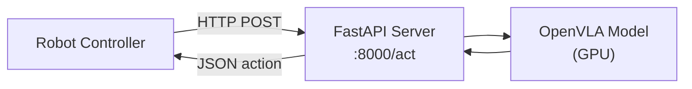

# 06 — 推理与部署

## 1. 推理路径概览

OpenVLA 提供三种推理接口：

| 接口 | 入口 | 依赖 | 场景 |
|------|------|------|------|
| **HuggingFace AutoClasses** | `AutoModelForVision2Seq` | transformers, timm | 通用 Python 推理 |
| **Prismatic 原生** | `OpenVLA.predict_action()` | prismatic 包 | FSDP checkpoint 直接推理 |
| **REST API** | `vla-scripts/deploy.py` | fastapi, uvicorn | 机器人系统集成 |

---

## 2. HuggingFace 推理

### 2.1 最小示例

```python
from transformers import AutoModelForVision2Seq, AutoProcessor
from PIL import Image
import torch

# 加载
processor = AutoProcessor.from_pretrained("openvla/openvla-7b", trust_remote_code=True)
vla = AutoModelForVision2Seq.from_pretrained(
    "openvla/openvla-7b",
    attn_implementation="flash_attention_2",  # 可选，需 flash_attn
    torch_dtype=torch.bfloat16,
    low_cpu_mem_usage=True,
    trust_remote_code=True,
).to("cuda:0")

# 推理
image = Image.open("robot_view.jpg").convert("RGB")
prompt = "In: What action should the robot take to pick up the red block?\nOut:"

inputs = processor(prompt, image).to("cuda:0", dtype=torch.bfloat16)
action = vla.predict_action(**inputs, unnorm_key="bridge_orig", do_sample=False)

print(f"Action (7-DoF): {action}")
# [dx, dy, dz, droll, dpitch, dyaw, gripper]
```

### 2.2 加载本地微调 Checkpoint

微调后的模型需注册 OpenVLA 到 HF AutoClasses（Hub 上的模型已自动注册）：

```python
from transformers import AutoConfig, AutoImageProcessor, AutoModelForVision2Seq, AutoProcessor
from prismatic.extern.hf.configuration_prismatic import OpenVLAConfig
from prismatic.extern.hf.modeling_prismatic import OpenVLAForActionPrediction
from prismatic.extern.hf.processing_prismatic import PrismaticImageProcessor, PrismaticProcessor

# 注册（本地 checkpoint 需要）
AutoConfig.register("openvla", OpenVLAConfig)
AutoImageProcessor.register(OpenVLAConfig, PrismaticImageProcessor)
AutoProcessor.register(OpenVLAConfig, PrismaticProcessor)
AutoModelForVision2Seq.register(OpenVLAConfig, OpenVLAForActionPrediction)

# 加载本地路径
processor = AutoProcessor.from_pretrained("/path/to/finetuned", trust_remote_code=True)
vla = AutoModelForVision2Seq.from_pretrained("/path/to/finetuned", ...).to("cuda:0")
```

### 2.3 Processor 详解

`PrismaticProcessor`（`processing_prismatic.py`）组合：
- **PrismaticImageProcessor**：图像 resize/letterbox/normalize
- **Tokenizer**：Llama-2 tokenizer

```python
inputs = processor(prompt, image)
# 返回:
# {
#     "input_ids": LongTensor[1, seq_len],
#     "attention_mask": LongTensor[1, seq_len],
#     "pixel_values": FloatTensor[1, 6, 224, 224],  # DINO-SigLIP: 6 channels
# }
```

### 2.4 predict_action 内部流程

`OpenVLAForActionPrediction.predict_action()`（`modeling_prismatic.py`）：

```python
def predict_action(self, input_ids, unnorm_key=None, **kwargs):
    # 1. 插入空 token (29871) 匹配训练格式
    if not torch.all(input_ids[:, -1] == 29871):
        input_ids = torch.cat([input_ids, torch.tensor([[29871]]).to(device)], dim=1)
    
    # 2. 自回归生成 action_dim 个 token
    generated_ids = self.generate(input_ids, max_new_tokens=self.get_action_dim(unnorm_key), **kwargs)
    
    # 3. 提取 action token IDs
    action_token_ids = generated_ids[0, -action_dim:]
    
    # 4. 反离散化
    discretized = self.vocab_size - action_token_ids
    discretized = clip(discretized - 1, 0, 254)
    normalized_actions = self.bin_centers[discretized]
    
    # 5. 反归一化
    stats = self.norm_stats[unnorm_key]["action"]
    actions = 0.5 * (normalized_actions + 1) * (stats["q99"] - stats["q01"]) + stats["q01"]
    
    return actions  # np.ndarray
```

### 2.5 量化推理（低显存）

```python
vla = AutoModelForVision2Seq.from_pretrained(
    "openvla/openvla-7b",
    load_in_8bit=True,   # 或 load_in_4bit=True
    torch_dtype=torch.bfloat16,
    trust_remote_code=True,
)
# 8-bit: ~8GB VRAM; 4-bit: ~5GB VRAM
# 注意: 量化可能影响动作精度
```

---

## 3. Prismatic 原生推理

适用于直接使用 `.pt` checkpoint（未经 HF 转换）：

```python
from prismatic.models import load_vla
from PIL import Image

vla = load_vla(
    "/path/to/checkpoint.pt",
    load_for_training=False,
)

image = Image.open("robot_view.jpg")
action = vla.predict_action(
    image,
    instruction="pick up the red block",
    unnorm_key="bridge_orig",
    do_sample=False,
)
```

`load_vla()` 自动加载：
- Vision Backbone + LLM + Projector 权重
- `dataset_statistics.json` 中的 norm_stats
- ActionTokenizer

---

## 4. REST API 部署

### 4.1 启动 Server

```bash
pip install uvicorn fastapi json-numpy

python vla-scripts/deploy.py \
  --openvla_path openvla/openvla-7b \
  --host 0.0.0.0 \
  --port 8000
```

### 4.2 架构



### 4.3 Client 调用

```python
import requests
import json_numpy
json_numpy.patch()
import numpy as np

# 从相机获取图像
image = np.array(camera.get_image())  # (H, W, 3) uint8

response = requests.post(
    "http://localhost:8000/act",
    json={
        "image": image,
        "instruction": "pick up the red cup",
        "unnorm_key": "bridge_orig",  # 可选
    },
)
action = response.json()  # np.ndarray (7,)
robot.execute(action)
```

### 4.4 Server 实现要点

```python
# deploy.py - OpenVLAServer
class OpenVLAServer:
    def __init__(self, openvla_path):
        self.processor = AutoProcessor.from_pretrained(openvla_path, trust_remote_code=True)
        self.vla = AutoModelForVision2Seq.from_pretrained(openvla_path, ...).to("cuda:0")
        
        # 微调模型：从本地加载 dataset_statistics
        if os.path.isdir(openvla_path):
            with open(Path(openvla_path) / "dataset_statistics.json") as f:
                self.vla.norm_stats = json.load(f)

    def predict_action(self, payload):
        image = payload["image"]
        instruction = payload["instruction"]
        prompt = get_openvla_prompt(instruction, self.openvla_path)
        inputs = self.processor(prompt, Image.fromarray(image).convert("RGB"))
        action = self.vla.predict_action(**inputs, unnorm_key=payload.get("unnorm_key"))
        return action
```

### 4.5 远程部署

```bash
# SSH 端口转发
ssh -L 8000:localhost:8000 user@gpu-server

# 或使用 ngrok
ngrok http 8000
```

---

## 5. 推理优化

### 5.1 Flash Attention 2

```python
vla = AutoModelForVision2Seq.from_pretrained(
    ...,
    attn_implementation="flash_attention_2",
)
```

- 降低 attention 显存：$O(n^2) \to O(n)$
- 加速长序列推理
- 需安装 `flash-attn==2.5.5`

### 5.2 KV Cache

生成时自动启用 KV Cache：
- 首步：完整 multimodal forward（图像 + prompt）
- 后续步：仅传入新 token + cached KV

7 步 action decode 中，首步最耗时（需处理 ~300 token 的多模态序列）。

### 5.3 Batch Inference

当前实现仅支持 batch_size=1。批量推理需修改 `prepare_inputs_for_generation()` 中的断言。

### 5.4 延迟分析

| 阶段 | 耗时 (A100) | 说明 |
|------|-------------|------|
| 图像预处理 | ~5ms | CPU |
| Vision Forward | ~20ms | 256 patches × 2 ViT |
| Prompt Forward | ~30ms | ~50 text tokens + 256 vision |
| Action Decode (×7) | ~7×5ms | 每步 1 token |
| **总计** | **~80ms** | ~12 Hz |

---

## 6. Prompt 格式对照

| 模型版本 | Prompt 格式 |
|----------|-------------|
| openvla-7b | `In: What action should the robot take to {instruction}?\nOut:` |
| openvla-v01-7b | `{SYSTEM_PROMPT} USER: What action should the robot take to {instruction}? ASSISTANT:` |

**必须匹配训练时的 prompt 格式**，否则性能显著下降。

---

## 7. unnorm_key 选择

| 场景 | unnorm_key | 说明 |
|------|------------|------|
| Bridge 零样本 | `"bridge_orig"` | 预训练包含 Bridge |
| 单数据集微调 | 数据集名称 | 如 `"libero_spatial_no_noops"` |
| 多数据集预训练 | 必须指定 | 如 `"fractal20220817_data"` |
| 仅一个数据集统计 | 可省略 | 自动选择 |

---

## 8. 完整推理 Pipeline 示意图

```
Camera Image (H×W×3)
    │
    ▼
┌─────────────────────────┐
│ Image Preprocessing      │
│ - Letterbox to 224×224   │
│ - DINO normalize         │
│ - SigLIP normalize       │
│ → pixel_values [1,6,224,224] │
└────────────┬────────────┘
             │
Instruction ─┤
             ▼
┌─────────────────────────┐
│ Prompt Construction    │
│ "In: What action... Out:" │
│ → input_ids [1, ~50]   │
└────────────┬────────────┘
             │
             ▼
┌─────────────────────────┐
│ Vision Backbone        │
│ DINOv2 + SigLIP → 256 patches │
│ Projector → LLM dim    │
└────────────┬────────────┘
             │
             ▼
┌─────────────────────────┐
│ LLM Autoregressive Gen │
│ Generate 7 action tokens│
│ (greedy decoding)      │
└────────────┬────────────┘
             │
             ▼
┌─────────────────────────┐
│ Action De-tokenization │
│ token IDs → bin centers│
│ → normalized [-1, 1]   │
└────────────┬────────────┘
             │
             ▼
┌─────────────────────────┐
│ Action Un-normalization│
│ [-1,1] → [q01, q99]    │
└────────────┬────────────┘
             │
             ▼
    Continuous 7-DoF Action
    [dx, dy, dz, dr, dp, dy, gripper]
```

---

## 9. 可运行示例：完整推理脚本

```python
#!/usr/bin/env python3
"""OpenVLA 完整推理示例 - 可直接运行（需 GPU + 模型下载）"""
import argparse
import numpy as np
import torch
from PIL import Image
from transformers import AutoModelForVision2Seq, AutoProcessor


def main():
    parser = argparse.ArgumentParser()
    parser.add_argument("--model", default="openvla/openvla-7b")
    parser.add_argument("--instruction", default="pick up the red block")
    parser.add_argument("--unnorm_key", default="bridge_orig")
    parser.add_argument("--image", default=None, help="Path to image (random if None)")
    args = parser.parse_args()

    device = "cuda:0" if torch.cuda.is_available() else "cpu"
    print(f"Device: {device}")

    # 加载模型
    print(f"Loading {args.model}...")
    processor = AutoProcessor.from_pretrained(args.model, trust_remote_code=True)
    vla = AutoModelForVision2Seq.from_pretrained(
        args.model,
        torch_dtype=torch.bfloat16,
        low_cpu_mem_usage=True,
        trust_remote_code=True,
    ).to(device)

    # 准备图像
    if args.image:
        image = Image.open(args.image).convert("RGB")
    else:
        print("Using random image (no --image specified)")
        image = Image.fromarray(np.random.randint(0, 255, (256, 256, 3), dtype=np.uint8))

    # 构建 prompt
    prompt = f"In: What action should the robot take to {args.instruction.lower()}?\nOut:"

    # 推理
    inputs = processor(prompt, image).to(device, dtype=torch.bfloat16)
    action = vla.predict_action(**inputs, unnorm_key=args.unnorm_key, do_sample=False)

    # 输出
    labels = ["dx", "dy", "dz", "droll", "dpitch", "dyaw", "gripper"]
    print(f"\nInstruction: {args.instruction}")
    print(f"Action (7-DoF):")
    for name, val in zip(labels, action):
        print(f"  {name:8s}: {val:+.4f}")


if __name__ == "__main__":
    main()
```

运行：

```bash
pip install -r requirements-min.txt
python inference_demo.py --instruction "put the spoon on the towel"
```

---

## 10. 参考文献

| 资源 | 链接 |
|------|------|
| HuggingFace 自定义模型 | https://huggingface.co/docs/transformers/custom_models |
| OpenVLA HF Hub | https://huggingface.co/openvla |
| FastAPI | https://fastapi.tiangolo.com/ |
| Flash Attention | https://github.com/Dao-AILab/flash-attention |

---

## 11. 下一章

→ [07-evaluation.md](./07-evaluation.md)：Bridge 真机与 LIBERO 仿真评估
