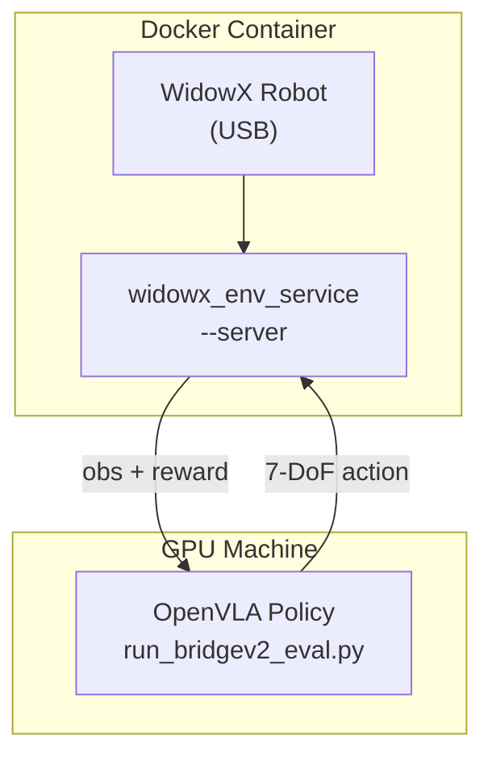

# 07 — 评估

## 1. 评估概览

OpenVLA 提供两套评估基准：

| 基准 | 环境 | 脚本 | 说明 |
|------|------|------|------|
| **BridgeData V2** | 真机 WidowX | `experiments/robot/bridge/run_bridgev2_eval.py` | 零样本 / 微调评估 |
| **LIBERO** | 仿真 MuJoCo | `experiments/robot/libero/run_libero_eval.py` | 微调后 sim benchmark |

---

## 2. BridgeData V2 真机评估

### 2.1 环境架构

Bridge 评估采用 **Server-Client** 架构：



### 2.2 设置步骤

**Step 1: 安装 WidowX 环境**

```bash
git clone https://github.com/rail-berkeley/bridge_data_robot.git
cd bridge_data_robot
pip install -e widowx_envs

git clone https://github.com/youliangtan/edgeml.git
pip install -e edgeml
```

**Step 2: 启动 Docker 容器**

```bash
cd bridge_data_robot
./generate_usb_config.sh
USB_CONNECTOR_CHART=$(pwd)/usb_connector_chart.yml docker compose up --build robonet
```

**Step 3: 启动 Robot Server**

```bash
docker compose exec robonet bash -lic "widowx_env_service --server"
```

**Step 4: 运行 OpenVLA 评估**

```bash
cd openvla
python experiments/robot/bridge/run_bridgev2_eval.py \
  --model_family openvla \
  --pretrained_checkpoint openvla/openvla-7b
```

### 2.3 评估流程

```python
# run_bridgev2_eval.py 核心逻辑
while not done:
    obs = env.get_observation()          # 从 robot server 获取图像
    action = get_vla_action(             # OpenVLA 推理
        vla, processor, obs, task_label,
        unnorm_key="bridge_orig",
    )
    obs, reward, done, info = env.step(action)  # 发送到 robot
```

### 2.4 动作空间

Bridge WidowX 7-DoF：
- 位置 delta (3D) + 姿态 delta (3D) + gripper (1D)
- 控制频率 ~5Hz
- `unnorm_key="bridge_orig"`

### 2.5 零样本 vs 微调

| 设置 | Checkpoint | 预期 |
|------|------------|------|
| 零样本 | `openvla/openvla-7b` | Bridge 分布内任务可用 |
| LoRA 微调 | 自定义 | 新任务需 ~100 demo |

---

## 3. LIBERO 仿真评估

### 3.1 LIBERO 基准

[LIBERO](https://libero-project.github.io/) 是终身机器人学习仿真基准，包含 4 个 task suite：

| Suite | 任务数 | 特点 |
|-------|--------|------|
| LIBERO-Spatial | 10 | 空间关系（左/右/前/后） |
| LIBERO-Object | 10 | 物体识别与操作 |
| LIBERO-Goal | 10 | 目标条件任务 |
| LIBERO-10 (Long) | 10 | 长 horizon 多步任务 |

每个 task 50 episodes，共 500 rollouts per suite。

### 3.2 OpenVLA 微调结果

| Method | Spatial | Object | Goal | Long | Average |
|--------|---------|--------|------|------|---------|
| Diffusion Policy (scratch) | 78.3% | **92.5%** | 68.3% | 50.5% | 72.4% |
| Octo (fine-tuned) | 78.9% | 85.7% | **84.6%** | 51.1% | 75.1% |
| **OpenVLA (fine-tuned)** | **84.7%** | 88.4% | 79.2% | **53.7%** | **76.5%** |

> 来源: [OpenVLA 论文 v2, Appendix E](https://arxiv.org/abs/2406.09246)

### 3.3 设置

```bash
# 安装 LIBERO
git clone https://github.com/Lifelong-Robot-Learning/LIBERO.git
cd LIBERO && pip install -e .

# 安装评估依赖
cd openvla
pip install -r experiments/robot/libero/libero_requirements.txt
```

### 3.4 预训练 Checkpoint

| Suite | HuggingFace Checkpoint |
|-------|----------------------|
| Spatial | [openvla/openvla-7b-finetuned-libero-spatial](https://huggingface.co/openvla/openvla-7b-finetuned-libero-spatial) |
| Object | [openvla/openvla-7b-finetuned-libero-object](https://huggingface.co/openvla/openvla-7b-finetuned-libero-object) |
| Goal | [openvla/openvla-7b-finetuned-libero-goal](https://huggingface.co/openvla/openvla-7b-finetuned-libero-goal) |
| Long | [openvla/openvla-7b-finetuned-libero-10](https://huggingface.co/openvla/openvla-7b-finetuned-libero-10) |

### 3.5 运行评估

```bash
# LIBERO-Spatial
python experiments/robot/libero/run_libero_eval.py \
  --model_family openvla \
  --pretrained_checkpoint openvla/openvla-7b-finetuned-libero-spatial \
  --task_suite_name libero_spatial \
  --center_crop True

# LIBERO-Object
python experiments/robot/libero/run_libero_eval.py \
  --pretrained_checkpoint openvla/openvla-7b-finetuned-libero-object \
  --task_suite_name libero_object \
  --center_crop True

# 其他 suite 类似，替换 checkpoint 和 task_suite_name
```

### 3.6 关键参数

| 参数 | 值 | 说明 |
|------|-----|------|
| `--center_crop True` | **必须** | 匹配训练时的 90% crop 增强 |
| `--num_trials_per_task` | 50 (默认) | 每 task 评估次数 |
| `--seed` | 7 (默认) | 随机种子 |
| `--use_wandb` | False (默认) | 是否记录 W&B |

### 3.7 Center Crop 原理

训练时使用 `random_resized_crop(scale=[0.9, 0.9])` → 评估时用 center 90% crop 保持一致：

```python
# openvla_utils.py - crop_and_resize()
crop_scale = 0.9
new_heights = sqrt(crop_scale)  # ≈ 0.949
# center crop 到 94.9% 面积，再 resize 到 224×224
```

### 3.8 评估流程

```python
# run_libero_eval.py 核心逻辑
for task in task_suite:
    for episode in range(num_trials_per_task):
        env.reset()
        obs = env.get_obs()
        done = False
        while not done:
            action = get_vla_action(
                vla, processor, obs, task.language,
                unnorm_key=..., center_crop=True,
            )
            obs, reward, done, info = env.step(action)
        success = info.get("success", False)
        log_result(task, episode, success)
```

---

## 4. 评估工具函数

### 4.1 get_vla() — 模型加载

`experiments/robot/openvla_utils.py`：

```python
def get_vla(cfg):
    AutoConfig.register("openvla", OpenVLAConfig)
    AutoModelForVision2Seq.register(OpenVLAConfig, OpenVLAForActionPrediction)
    
    vla = AutoModelForVision2Seq.from_pretrained(
        cfg.pretrained_checkpoint,
        attn_implementation="flash_attention_2",
        torch_dtype=torch.bfloat16,
        trust_remote_code=True,
    ).to(DEVICE)
    
    # 加载微调模型的 dataset_statistics
    stats_path = os.path.join(cfg.pretrained_checkpoint, "dataset_statistics.json")
    if os.path.isfile(stats_path):
        vla.norm_stats = json.load(open(stats_path))
    
    return vla
```

### 4.2 get_vla_action() — 动作生成

```python
def get_vla_action(vla, processor, base_vla_name, obs, task_label, unnorm_key, center_crop=False):
    image = Image.fromarray(obs["full_image"]).convert("RGB")
    
    if center_crop:
        image = center_crop_90(image)  # TF-based crop
    
    prompt = f"In: What action should the robot take to {task_label.lower()}?\nOut:"
    inputs = processor(prompt, image).to(DEVICE, dtype=torch.bfloat16)
    action = vla.predict_action(**inputs, unnorm_key=unnorm_key, do_sample=False)
    return action
```

---

## 5. 微调 LIBERO 数据集

### 5.1 下载修改版 LIBERO RLDS 数据

```bash
git clone git@hf.co:datasets/openvla/modified_libero_rlds
```

包含 4 个 suite 的 RLDS 格式数据（~10 GB）。

### 5.2 LoRA 微调

```bash
torchrun --standalone --nnodes 1 --nproc-per-node 1 vla-scripts/finetune.py \
  --vla_path "openvla/openvla-7b" \
  --data_root_dir /path/to/modified_libero_rlds \
  --dataset_name libero_spatial_no_noops \
  --run_root_dir ./runs \
  --lora_rank 32 \
  --batch_size 8 \
  --learning_rate 5e-4 \
  --image_aug True \
  --max_steps 50000
```

### 5.3 数据集修改说明

OpenVLA 论文对原始 LIBERO 数据集做了修改（见 Appendix E）：
- 去除 no-op 步骤（idle 动作）
- 调整 camera viewpoint
- 修改脚本: `experiments/robot/libero/regenerate_libero_dataset.py`

---

## 6. 评估指标

### 6.1 Success Rate

$$
\text{Success Rate} = \frac{\text{\# successful episodes}}{\text{\# total episodes}} \times 100\%
$$

- Bridge: 人工定义成功条件
- LIBERO: 环境内置 success detector

### 6.2 训练指标（辅助）

| 指标 | 公式 | 目标 |
|------|------|------|
| Action Token Accuracy | $\text{Acc} = \frac{\text{correct tokens}}{\text{total action tokens}}$ | >90% (微调) |
| L1 Loss | $\text{L1} = \frac{1}{D}\sum |a - \hat{a}|$ | <0.05 (normalized) |

**注意**：高 training accuracy 不保证高 eval success rate。务必做 sanity check（见 05 章）。

---

## 7. 评估环境要求

| 组件 | 版本 | 说明 |
|------|------|------|
| Python | 3.10.13 | 论文使用版本 |
| PyTorch | 2.2.0 | |
| transformers | 4.40.1 | |
| flash-attn | 2.5.5 | |
| GPU | NVIDIA A100 | 结果可能有 GPU 非确定性 |

---

## 8. 可运行示例：离线 Action 验证

无需真机/仿真，验证推理 pipeline 是否正确：

```python
"""Sanity check: 用训练集图像验证 action 复现"""
import json
import numpy as np
import tensorflow_datasets as tfds
from PIL import Image
from transformers import AutoModelForVision2Seq, AutoProcessor
import torch

# 加载模型
processor = AutoProcessor.from_pretrained("openvla/openvla-7b", trust_remote_code=True)
vla = AutoModelForVision2Seq.from_pretrained(
    "openvla/openvla-7b", torch_dtype=torch.bfloat16, trust_remote_code=True
).to("cuda:0")

# 加载一条 Bridge 数据
ds = tfds.load("bridge_orig", split="train[:1]", data_dir="/path/to/datasets")
for traj in ds:
    for t in range(min(5, traj["action"].shape[0])):
        img = Image.fromarray(traj["observation"]["image_0"][t].numpy())
        lang = traj["language_instruction"][t].numpy().decode()
        gt_action = traj["action"][t].numpy()
        
        prompt = f"In: What action should the robot take to {lang.lower()}?\nOut:"
        inputs = processor(prompt, img).to("cuda:0", dtype=torch.bfloat16)
        pred_action = vla.predict_action(**inputs, unnorm_key="bridge_orig")
        
        l1 = np.mean(np.abs(pred_action - gt_action))
        print(f"Step {t}: L1={l1:.4f}, GT={gt_action[:3]}, Pred={pred_action[:3]}")
```

---

## 9. 参考文献

| 资源 | 链接 |
|------|------|
| OpenVLA 论文 v2 | https://arxiv.org/abs/2406.09246 |
| LIBERO | https://libero-project.github.io/ |
| BridgeData V2 | https://rail-berkeley.github.io/bridgedata/ |
| Bridge Robot Setup | https://github.com/rail-berkeley/bridge_data_robot |
| Modified LIBERO RLDS | https://huggingface.co/datasets/openvla/modified_libero_rlds |

---

## 10. 下一章

→ [08-configuration-and-modules.md](./08-configuration-and-modules.md)：完整配置参考与模块边界
