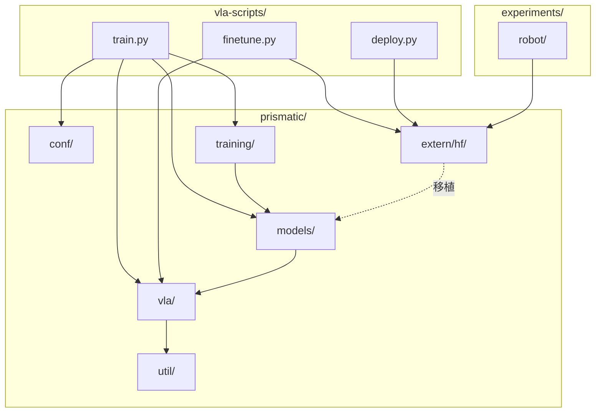
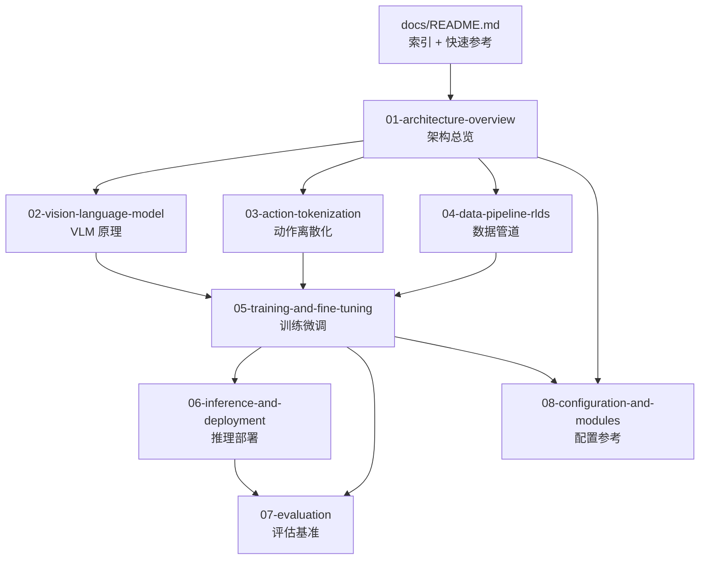

# 08 — 配置与模块参考

## 1. 仓库目录结构

```
openvla/
├── prismatic/                          # 核心 Python 包
│   ├── __init__.py
│   ├── conf/                           # 配置 dataclass
│   │   ├── __init__.py                 # 导出 VLAConfig, ModelConfig 等
│   │   ├── vla.py                      # VLA 训练实验配置 (VLARegistry)
│   │   ├── models.py                   # VLM 模型配置 (ModelRegistry)
│   │   └── datasets.py                 # VLM 预训练数据集配置
│   ├── models/                         # 模型定义
│   │   ├── __init__.py
│   │   ├── load.py                     # load() / load_vla() 入口
│   │   ├── materialize.py              # 构建 backbone 工厂
│   │   ├── registry.py                 # 预训练模型注册表
│   │   ├── backbones/
│   │   │   ├── vision/                 # Vision Transformer backbones
│   │   │   │   ├── base_vision.py      # VisionBackbone 基类
│   │   │   │   ├── clip_vit.py         # CLIP ViT
│   │   │   │   ├── siglip_vit.py       # SigLIP ViT
│   │   │   │   ├── dinov2_vit.py       # DINOv2 ViT
│   │   │   │   ├── dinosiglip_vit.py   # DINO-SigLIP 融合 ★
│   │   │   │   ├── dinoclip_vit.py     # DINO-CLIP 融合
│   │   │   │   └── in1k_vit.py         # ImageNet ViT
│   │   │   └── llm/                    # LLM backbones
│   │   │       ├── base_llm.py         # LLMBackbone 基类
│   │   │       ├── llama2.py           # Llama-2 ★
│   │   │       ├── mistral.py          # Mistral
│   │   │       ├── phi.py              # Phi-2
│   │   │       └── prompting/          # Prompt 模板
│   │   │           ├── base_prompter.py
│   │   │           ├── llama2_chat_prompter.py  # ★ OpenVLA 使用
│   │   │           ├── vicuna_v15_prompter.py
│   │   │           ├── mistral_instruct_prompter.py
│   │   │           └── phi_prompter.py
│   │   ├── vlms/                       # VLM 模型
│   │   │   ├── base_vlm.py             # VLM 基类
│   │   │   └── prismatic.py            # PrismaticVLM ★
│   │   └── vlas/                       # VLA 模型
│   │       └── openvla.py              # OpenVLA ★
│   ├── vla/                            # VLA 专用模块
│   │   ├── action_tokenizer.py         # 动作离散化 ★
│   │   ├── materialize.py              # 数据集工厂
│   │   └── datasets/
│   │       ├── datasets.py             # RLDSDataset, RLDSBatchTransform ★
│   │       └── rlds/                   # RLDS 数据管道
│   │           ├── dataset.py          # make_dataset_from_rlds ★
│   │           ├── obs_transforms.py   # 观测变换
│   │           ├── traj_transforms.py  # 轨迹变换
│   │           ├── oxe/                # Open X-Embodiment
│   │           │   ├── configs.py      # 数据集配置 ★
│   │           │   ├── mixtures.py     # 混合配方 ★
│   │           │   ├── transforms.py   # 标准化函数 ★
│   │           │   └── materialize.py  # OXE kwargs 生成
│   │           └── utils/
│   │               ├── data_utils.py   # 归一化/统计 ★
│   │               ├── goal_relabeling.py
│   │               └── task_augmentation.py
│   ├── training/                       # 训练系统
│   │   ├── materialize.py              # get_train_strategy()
│   │   ├── metrics.py                  # VLAMetrics
│   │   └── strategies/
│   │       ├── base_strategy.py        # 训练循环 ★
│   │       ├── fsdp.py                 # FSDP 策略 ★
│   │       └── ddp.py                  # DDP 策略
│   ├── extern/hf/                      # HuggingFace 集成
│   │   ├── configuration_prismatic.py  # OpenVLAConfig ★
│   │   ├── modeling_prismatic.py       # HF 模型类 ★
│   │   └── processing_prismatic.py     # HF Processor ★
│   ├── util/                           # 工具函数
│   │   ├── nn_utils.py                 # Projector 定义 ★
│   │   ├── data_utils.py               # Collator
│   │   ├── batching_utils.py           # SplitModalitySampler
│   │   └── torch_utils.py
│   ├── preprocessing/                  # VLM 预训练数据 (遗留)
│   └── overwatch/                      # 日志系统
├── vla-scripts/                        # VLA 脚本 ★
│   ├── train.py                        # FSDP 训练入口
│   ├── finetune.py                     # LoRA 微调入口
│   ├── deploy.py                       # REST API 部署
│   └── extern/
│       ├── convert_openvla_weights_to_hf.py  # 权重转换
│       └── verify_openvla.py           # 验证脚本
├── experiments/robot/                  # 评估 ★
│   ├── openvla_utils.py                # 评估工具函数
│   ├── robot_utils.py                  # 通用机器人工具
│   ├── bridge/                         # BridgeData V2 评估
│   │   ├── run_bridgev2_eval.py
│   │   ├── bridgev2_utils.py
│   │   └── widowx_env.py
│   └── libero/                         # LIBERO 评估
│       ├── run_libero_eval.py
│       ├── libero_utils.py
│       └── regenerate_libero_dataset.py
├── scripts/                            # VLM 预训练脚本 (遗留)
├── docs/                               # 技术文档 (本系列)
├── pyproject.toml                      # 项目配置
├── requirements-min.txt                # 最小推理依赖
└── README.md
```

★ = OpenVLA 核心文件

---

## 2. 配置系统

### 2.1 draccus ChoiceRegistry

OpenVLA 使用 [draccus](https://pypi.org/project/draccus/) 管理配置，支持命令行选择实验：

```bash
# 选择 VLA 配置
python vla-scripts/train.py --vla.type "prism-dinosiglip-224px+mx-bridge"

# 覆盖单个参数
python vla-scripts/train.py --vla.type "..." --vla.learning_rate 1e-5
```

### 2.2 VLAConfig 字段

```python
@dataclass
class VLAConfig(ChoiceRegistry):
    vla_id: str                    # 实验 ID
    base_vlm: Union[str, Path]     # 基座 VLM ID 或路径
    freeze_vision_backbone: bool   # 冻结视觉编码器
    freeze_llm_backbone: bool      # 冻结 LLM
    unfreeze_last_llm_layer: bool  # 解冻 LLM 最后一层
    data_mix: str                  # 数据集混合名
    shuffle_buffer_size: int       # Shuffle buffer
    epochs: int                    # 训练 epoch 数
    max_steps: Optional[int]       # 最大步数 (override epochs)
    expected_world_size: int       # GPU 数量 (must match)
    global_batch_size: int         # 全局 batch size
    per_device_batch_size: int     # 每 GPU batch size
    learning_rate: float
    weight_decay: float
    max_grad_norm: float
    lr_scheduler_type: str         # "constant" | "linear-warmup+cosine-decay"
    warmup_ratio: float
    train_strategy: str            # "fsdp-full-shard"
    enable_gradient_checkpointing: bool = True
    enable_mixed_precision_training: bool = True
    reduce_in_full_precision: bool = True
```

### 2.3 预注册 VLA 实验

| vla_id | base_vlm | data_mix | GPUs | 用途 |
|--------|----------|----------|------|------|
| `siglip-224px+mx-bridge` | siglip-224px+7b | bridge | 8 | 快速调试 |
| `prism-dinosiglip-224px+mx-bridge` | prism-dinosiglip-224px+7b | bridge | 8 | DINO-SigLIP 调试 |
| `siglip-224px+mx-oxe-magic-soup` | siglip-224px+7b | oxe_magic_soup | 64 | v01 预训练 |
| `prism-dinosiglip-224px+mx-oxe-magic-soup-plus` | prism-dinosiglip-224px+7b | oxe_magic_soup_plus_minus | 64 | **openvla-7b 预训练** |

### 2.4 添加新 VLA 实验

```python
# prismatic/conf/vla.py

@dataclass
class Exp_MyCustom(VLAConfig):
    vla_id: str = "my-custom-vla"
    base_vlm: Union[str, Path] = "prism-dinosiglip-224px+7b"
    freeze_vision_backbone: bool = True
    freeze_llm_backbone: bool = False
    data_mix: str = "my_dataset"
    expected_world_size: int = 1
    global_batch_size: int = 4
    per_device_batch_size: int = 4
    learning_rate: float = 2e-5

# 注册到 VLARegistry
class VLARegistry(Enum):
    ...
    MY_CUSTOM = Exp_MyCustom
```

---

## 3. 模块边界与依赖关系



### 3.1 模块职责边界

| 模块 | 输入 | 输出 | 不应包含 |
|------|------|------|----------|
| `conf/` | CLI 参数 | dataclass 配置 | 训练逻辑 |
| `models/backbones/` | 图像/token | 特征/embeddings | 损失计算 |
| `models/vlms/` | 多模态输入 | logits/loss | 动作离散化 |
| `models/vlas/` | 图像+指令 | 连续动作 | 数据加载 |
| `vla/datasets/` | RLDS 文件 | PyTorch batch | 模型 forward |
| `vla/action_tokenizer.py` | 连续/离散动作 | 离散/token | 模型逻辑 |
| `training/strategies/` | batch | 参数更新 | 数据预处理 |
| `extern/hf/` | HF 格式 | HF 兼容模型 | FSDP 逻辑 |

---

## 4. 关键类继承关系

```
VLM (base_vlm.py)
 └── PrismaticVLM (prismatic.py)
      └── OpenVLA (openvla.py)

VisionBackbone (base_vision.py)
 ├── SigLIPViTBackbone
 ├── DinoV2ViTBackbone
 └── DinoSigLIPViTBackbone

LLMBackbone (base_llm.py)
 ├── LLaMa2LLMBackbone
 ├── MistralLLMBackbone
 └── PhiLLMBackbone

TrainingStrategy (base_strategy.py)
 ├── FSDPStrategy (fsdp.py)
 └── DDPStrategy (ddp.py)

PreTrainedModel (transformers)
 └── PrismaticPreTrainedModel
      └── PrismaticForConditionalGeneration
           └── OpenVLAForActionPrediction
```

---

## 5. 扩展指南

### 5.1 添加新 Vision Backbone

1. 在 `prismatic/models/backbones/vision/` 创建新文件
2. 继承 `VisionBackbone`，实现 `forward()`, `get_image_transform()`, `get_fsdp_wrapping_policy()`
3. 在 `materialize.py` 的 `get_vision_backbone_and_transform()` 中注册
4. 在 `models.py` 添加 `ModelConfig` 子类

### 5.2 添加新 LLM Backbone

1. 在 `prismatic/models/backbones/llm/` 创建新文件
2. 继承 `LLMBackbone`，实现 `forward()`, `embed_input_ids()`, `get_tokenizer()`
3. 创建对应 `PromptBuilder`
4. 在 `materialize.py` 注册

### 5.3 添加新 OXE 数据集

1. `configs.py`: 添加 `OXE_DATASET_CONFIGS["my_dataset"]`
2. `transforms.py`: 添加 `my_dataset_transform()` 并注册
3. `mixtures.py`: （可选）添加到混合
4. 数据转为 RLDS 格式并放入 `data_root_dir`

### 5.4 添加新评估环境

1. 在 `experiments/robot/` 创建新目录
2. 实现环境接口（obs dict + step function）
3. 复用 `openvla_utils.get_vla_action()` 获取动作
4. 创建 `run_*_eval.py` 入口脚本

---

## 6. 环境变量

| 变量 | 用途 | 示例 |
|------|------|------|
| `HF_HOME` | HuggingFace 缓存目录 | `/mnt/cache/huggingface` |
| `HF_TOKEN` | HuggingFace API token | `hf_...` |
| `TF_CPP_MIN_LOG_LEVEL` | 抑制 TF 日志 | `3` |
| `TOKENIZERS_PARALLELISM` | 禁用 tokenizer 并行 | `false` (代码内设置) |
| `CUDA_VISIBLE_DEVICES` | 指定 GPU | `0,1,2,3` |

---

## 7. 依赖版本锁定

OpenVLA 严格锁定以下版本（兼容性问题）：

```
torch==2.2.0
torchvision==0.17.0
transformers==4.40.1
tokenizers==0.19.1
timm==0.9.10
flash-attn==2.5.5
tensorflow==2.15.0
tensorflow_datasets==4.9.3
peft==0.11.1
draccus==0.8.0
```

**已知问题**：
- `tensorflow-datasets > 4.9.3`：RLDS 加载失败
- `transformers > 4.40.1`：推理回归
- `timm >= 1.0.0`：API breaking changes

---

## 8. Makefile 与代码质量

```bash
# Lint 检查
make lint

# 自动修复
make fix
```

工具：Black (formatter) + Ruff (linter)，配置见 `pyproject.toml`。

---

## 9. 文档章节关系图



---

## 10. 常见问题速查

| 问题 | 章节 | 关键点 |
|------|------|--------|
| 如何推理？ | 06 | HF AutoClasses + predict_action |
| 如何 LoRA 微调？ | 05 | finetune.py + RLDS 数据 |
| 如何添加数据集？ | 04, 08 | configs.py + transforms.py |
| 动作如何离散化？ | 03 | 256-bin + 词表末尾 token |
| 为什么需要 unnorm_key？ | 03 | 多数据集 q01/q99 统计 |
| 训练 OOM？ | 05 | 减小 batch / gradient checkpointing |
| 真机表现差？ | 05, 07 | Sanity check + 数据质量 |
| Prismatic → HF 转换？ | 05 | convert_openvla_weights_to_hf.py |
| center_crop 必须吗？ | 07 | 训练有 augment 时必须 |
| 支持 action chunking 吗？ | 03 | 不支持 (window_size=1) |

---

## 11. 外部项目链接

| 项目 | 链接 | 关系 |
|------|------|------|
| OpenVLA | https://github.com/openvla/openvla | 本仓库 |
| Prismatic VLMs | https://github.com/TRI-ML/prismatic-vlms | VLM 基座 |
| OpenVLA-OFT | https://openvla-oft.github.io/ | 推荐微调 recipe |
| FAST Tokenizer | https://www.physicalintelligence.company/research/fast | 高效动作 token |
| Octo | https://github.com/octo-models/octo | 对比基线 |
| LIBERO | https://github.com/Lifelong-Robot-Learning/LIBERO | 仿真评估 |
| Bridge Robot | https://github.com/rail-berkeley/bridge_data_robot | 真机评估 |
| RLDS Builder | https://github.com/kpertsch/rlds_dataset_builder | 数据集转换 |

---

*本文档系列覆盖 OpenVLA 项目全部核心技术点。如有遗漏或更新，请参考 [GitHub Issues](https://github.com/openvla/openvla/issues)。*
