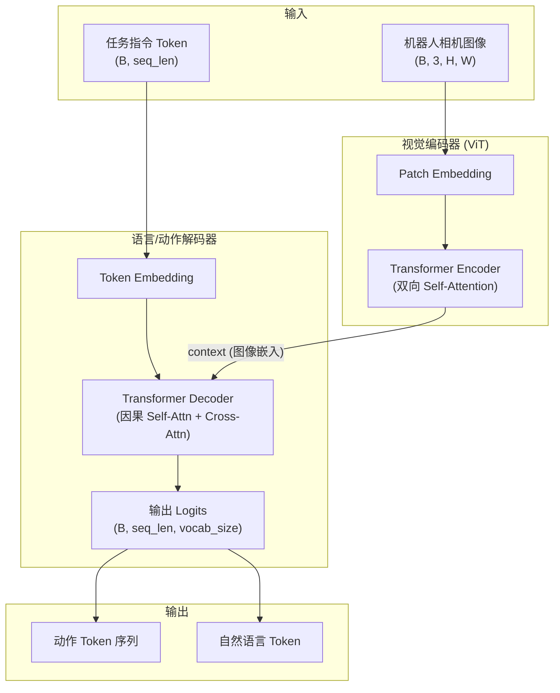
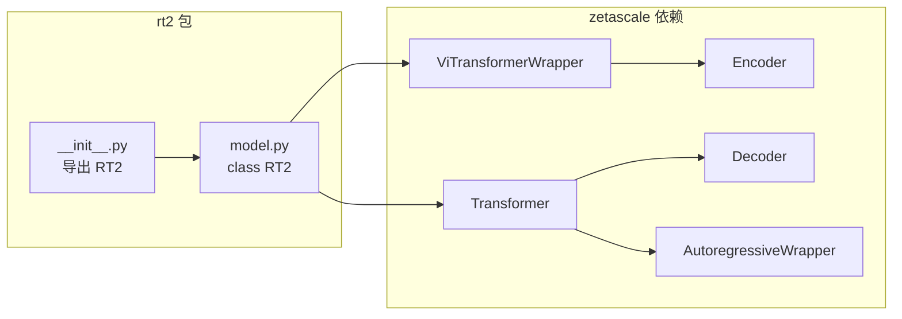

# 0. 总体架构与知识图谱

## 0.1 RT-2 是什么

**RT-2 (Robotic Transformer 2)** 是 Google DeepMind 提出的 **Vision-Language-Action (VLA)** 模型家族，核心思想是：

> 将预训练的 Vision-Language Model (VLM) 直接微调为机器人闭环控制策略，把**机器人动作表示为文本 Token**，与语言 Token 共享同一输出空间。

这使得模型能够：
1. 继承 Web 规模预训练中的**语义理解、视觉推理**能力
2. 在机器人演示数据上学习**低层控制动作**
3. 实现**零样本泛化**到新物体、新背景、新指令

---

## 0.2 整体架构图



---

## 0.3 本仓库代码架构



### 模块职责一览

| 模块 | 文件/类 | 职责 |
|------|---------|------|
| 包入口 | `rt2/__init__.py` | 导出 `RT2` 类，定义 `__all__` |
| 核心模型 | `rt2/model.py::RT2` | 组装视觉编码器 + 语言解码器，实现 `forward` |
| 视觉编码 | `ViTransformerWrapper` + `Encoder` | 图像 → Patch → ViT → 图像 Token 序列 |
| 语言解码 | `Transformer` + `Decoder` | 文本 Token + 图像 context → 下一个 Token 概率 |
| 自回归包装 | `AutoregressiveWrapper` | Teacher Forcing 训练、采样生成推理 |
| 示例 | `example.py` | 最小前向传播演示 |
| 测试 | `tests/test.py` | 形状、参数、异常测试 |

---

## 0.4 数据流（Forward Pass）

```
img (B, 3, 256, 256)
    │
    ▼
encoder = ViTransformerWrapper
    │  Patch: (B, 64, patch_dim)  →  Linear → (B, 64, 512)
    │  + 位置编码
    │  Encoder (6层双向 Attention)
    ▼
encoded (B, 64, 512)  ←── 作为 context 传入 decoder

text (B, 1024)  ←── Token ID 序列
    │
    ▼
decoder = AutoregressiveWrapper(Transformer)
    │  Token Embedding + (可选) 位置编码
    │  Decoder (6层: 因果 Self-Attn + Cross-Attn to encoded)
    │  Linear → logits
    ▼
output (B, 1024, 20000)  ←── 每个位置对 vocab 的 logits
```

**关键设计**：图像嵌入通过 **Cross-Attention** 注入解码器，使每个文本/动作 Token 的预测都能"看到"完整图像上下文。这与 PaLM-E 将图像 Token 与文本 Token **拼接** 的方式不同，本实现更接近 **Encoder-Decoder 跨模态注意力** 范式。

---

## 0.5 知识图谱

```
                    ┌─────────────────────────────────────┐
                    │         RT-2 知识体系               │
                    └─────────────────────────────────────┘
                                      │
          ┌───────────────────────────┼───────────────────────────┐
          ▼                           ▼                           ▼
   ┌──────────────┐           ┌──────────────┐           ┌──────────────┐
   │  理论基础     │           │  模型架构     │           │  工程实践     │
   └──────────────┘           └──────────────┘           └──────────────┘
          │                           │                           │
   ┌──────┴──────┐            ┌───────┴───────┐           ┌───────┴───────┐
   │ VLA 范式    │            │ ViT 视觉编码  │           │ 安装与依赖    │
   │ 动作 Token  │            │ Transformer   │           │ API 调用      │
   │ Co-Fine-Tune│            │ Cross-Attn    │           │ 单元测试      │
   │ 涌现能力    │            │ 自回归解码    │           │ 训练数据混合  │
   └─────────────┘            └───────────────┘           └───────────────┘
          │                           │                           │
   ┌──────┴──────┐            ┌───────┴───────┐           ┌───────┴───────┐
   │ RT-1 动作空间│            │ Flash Attn    │           │ 评估基准      │
   │ PaLI-X      │            │ QK-Norm       │           │ 泛化场景      │
   │ PaLM-E      │            │ GQA (KV heads)│           │ 消融实验      │
   └─────────────┘            └───────────────┘           └───────────────┘
```

---

## 0.6 各方案对比

### VLA vs 传统机器人学习

| 方案 | 预训练 | 动作输出 | 语义泛化 | 代表工作 |
|------|--------|----------|----------|----------|
| **端到端 IL** | 无 / 视觉表征 | 连续/离散动作 | 弱 | BC, RT-1 |
| **VLM + 高层规划** | VLM | 语言计划 → 低层控制器 | 中 | PaLM-E (planning) |
| **VLA (RT-2)** | VLM | 动作即 Token | **强** | RT-2 |
| **VLM + 结构化策略** | VLM | 语义图/像素标记 | 中 | MOO, CLIPort |

### 本仓库 vs 论文 RT-2

| 特性 | 论文 RT-2-PaLI-X-55B | 论文 RT-2-PaLM-E-12B | 本仓库 RT2 |
|------|----------------------|----------------------|------------|
| 视觉骨干 | ViT-22B | ViT-4B | ViT (512d, 6层) |
| 语言骨干 | UL2-32B (Enc-Dec) | PaLM-12B (Dec-Only) | Transformer Dec (512d, 6层) |
| 参数量 | ~55B | ~12B | ~50M (默认) |
| 多模态融合 | 投影 + Enc-Dec / 拼接 | 图像 Token 拼接 | Cross-Attention |
| 训练数据 | WebLI + Robot | Web + Robot | 需自行准备 |
| 推理频率 | 1-3 Hz (55B, TPU) | - | 本地 GPU 实时 |
| 适用场景 | 研究复现、SOTA 性能 | 推理/CoT 能力 | **原型验证、教学、架构实验** |

### 优缺点

**优点**
- 架构简洁：ViT Encoder + Cross-Attn Decoder，易于理解与修改
- 依赖 [zetascale](https://github.com/kyegomez/zeta) 模块化组件，可快速替换层数/维度
- 纯 PyTorch，无特殊硬件要求
- 完整单元测试覆盖形状与边界情况

**缺点**
- 非论文级规模，无法直接复现论文数值结果
- 未内置动作 Token 编解码、Co-Fine-Tuning 训练脚本
- 默认 `num_tokens=20000`，与 PaLI/PaLM 词表不一致
- README 称基于 PaLM-E，实现实为独立 Enc-Dec 结构

**适用场景**
- 理解 VLA 数据流与 Cross-Attention 多模态融合
- 在自定义机器人数据上实验动作-as-Token 范式
- 作为更大 VLA 项目的轻量 backbone 起点

---

## 0.7 章节阅读顺序

```
00-overview (本文)
    │
    ├── 01-vla-theory ────────── 理解"为什么"
    │
    ├── 02-implementation ────── 理解"代码怎么组织"
    │       │
    │       ├── 03-vision-encoder
    │       └── 04-decoder-autoregression
    │
    ├── 05-action-tokenization ─ 理解"动作如何变成 Token"
    │
    ├── 06-training-datasets ── 理解"如何训练"
    │
    ├── 07-evaluation ─────────── 理解"如何评估"
    │
    └── 08-usage-api ──────────── 动手运行
```

---

## 0.8 相关开源项目

| 项目 | 说明 | 链接 |
|------|------|------|
| Open X-Embodiment | 大规模机器人数据集 | https://robotics-transformer-x.github.io |
| Octo | 开源通用机器人策略 | https://github.com/octo-models/octo |
| OpenVLA | 开源 VLA 实现 | https://github.com/openvla/openvla |
| LeRobot | Hugging Face 机器人库 | https://github.com/huggingface/lerobot |
| Zeta | 本仓库依赖的模型组件库 | https://github.com/kyegomez/zeta |
