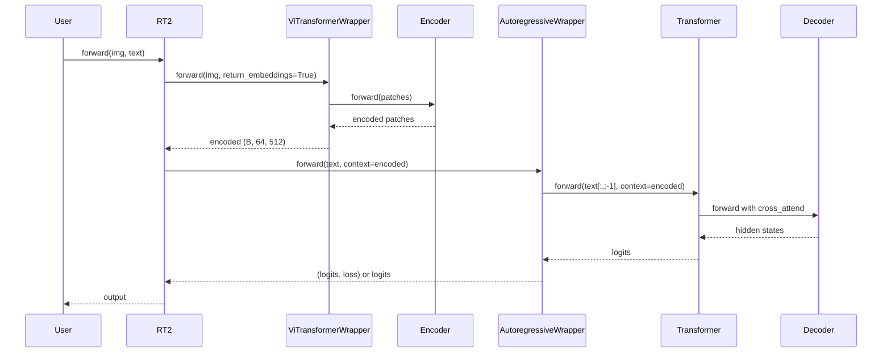

# 2. 代码实现详解

本章完整解读本仓库全部源代码：文件结构、类/函数 API、调用关系与数据流。

---

## 2.1 仓库文件清单

| 路径 | 类型 | 说明 |
|------|------|------|
| `rt2/__init__.py` | 包入口 | 导出 `RT2` |
| `rt2/model.py` | 核心 | `RT2` 类：`__init__`, `forward` |
| `example.py` | 示例 | 最小前向传播 |
| `tests/test.py` | 测试 | 14 个 pytest 用例 |
| `requirements.txt` | 依赖 | pip 依赖列表 |
| `pyproject.toml` | 打包 | Poetry 配置 |

**边界说明**：本仓库**不包含**训练脚本、数据加载器、动作编解码器、部署服务；这些属于论文完整管线的扩展部分。

---

## 2.2 包入口：`rt2/__init__.py`

### 完整源码

```python
from rt2.model import RT2

__all__ = ["RT2"]
```

### 解读

| 元素 | 说明 |
|------|------|
| `from rt2.model import RT2` | 从 model 模块导入唯一公开类 |
| `__all__ = ["RT2"]` | 定义 `from rt2 import *` 时导出的符号 |

**设计意图**：最小化公开 API，用户只需 `from rt2 import RT2` 或 `from rt2.model import RT2`。

---

## 2.3 核心类：`RT2`

**文件**：`rt2/model.py`

### 2.3.1 类签名与文档

```12:37:rt2/model.py
class RT2(nn.Module):
    """
    RT2 model implementation.
    ...
    Attributes:
        encoder (ViTransformerWrapper): Encoder module.
        decoder (AutoregressiveWrapper): Decoder module.
    """
```

### 2.3.2 构造函数 `__init__`

#### 完整参数表

| 参数 | 默认值 | 含义 | 影响 |
|------|--------|------|------|
| `image_size` | 256 | 输入图像边长 (像素) | ViT patch 数量 = $(256/32)^2 = 64$ |
| `patch_size` | 32 | Patch 边长 | 每个 patch 维度 = $3 \times 32^2 = 3072$ |
| `encoder_dim` | 512 | ViT 隐藏维度 | 图像 Token 向量长度 |
| `encoder_depth` | 6 | ViT Encoder 层数 | 视觉特征抽象深度 |
| `encoder_heads` | 8 | ViT 注意力头数 | 每头维度 = $512/8 = 64$ |
| `num_tokens` | 20000 | 词表大小 | 输出 logits 最后一维 |
| `max_seq_len` | 1024 | 最大序列长度 | 位置编码范围、截断上限 |
| `decoder_dim` | 512 | Decoder 隐藏维度 | 需与 cross-attn 兼容 |
| `decoder_depth` | 6 | Decoder 层数 | 语言/动作建模深度 |
| `decoder_heads` | 8 | Decoder 注意力头数 | - |
| `attn_kv_heads` | 2 | GQA 的 KV 头数 | 减少 KV 投影参数量 |
| `use_abs_pos_emb` | False | 绝对位置编码 | False 时依赖 ALiBi 等 |
| `cross_attend` | True | 启用 Cross-Attention | **必须为 True** 才能融合图像 |
| `attn_flash` | True | Flash Attention | 加速、省显存 |
| `qk_norm` | True | Q/K L2 归一化 | 训练稳定性 |

#### 构建逻辑（逐步）

**Step 1：创建视觉编码器**

```59:65:rt2/model.py
        self.encoder = ViTransformerWrapper(
            image_size=image_size,
            patch_size=patch_size,
            attn_layers=Encoder(
                dim=encoder_dim, depth=encoder_depth, heads=encoder_heads
            ),
        )
```

**Step 2：创建 Transformer 解码器**

```67:80:rt2/model.py
        self.decoder = Transformer(
            num_tokens=num_tokens,
            max_seq_len=max_seq_len,
            use_abs_pos_emb=use_abs_pos_emb,
            attn_layers=Decoder(
                dim=decoder_dim,
                depth=decoder_depth,
                heads=decoder_heads,
                cross_attend=cross_attend,
                attn_kv_heads=attn_kv_heads,
                attn_flash=attn_flash,
                qk_norm=qk_norm,
            ),
        )
```

**Step 3：包装为自回归模型**

```82:82:rt2/model.py
        self.decoder = AutoregressiveWrapper(self.decoder)
```

#### 模块树

```
RT2
├── encoder: ViTransformerWrapper
│   ├── patch_to_embedding: Sequential(LayerNorm, Linear, LayerNorm)
│   ├── pos_embedding: Parameter (1, num_patches, dim)
│   └── attn_layers: Encoder (AttentionLayers, causal=False)
└── decoder: AutoregressiveWrapper
    └── net: Transformer
        ├── token_emb: TokenEmbedding
        ├── pos_emb: AbsolutePositionalEmbedding (或 0)
        ├── attn_layers: Decoder (AttentionLayers, causal=True, cross_attend=True)
        └── to_logits: Linear(dim, num_tokens)
```

---

### 2.3.3 前向传播 `forward`

#### 完整源码

```84:104:rt2/model.py
    def forward(self, img: torch.Tensor, text: torch.Tensor) -> torch.Tensor:
        ...
        try:
            encoded = self.encoder(img, return_embeddings=True)
            return self.decoder(text, context=encoded)
        except Exception as error:
            print(f"Failed in forward method: {error}")
            raise
```

#### 输入/输出规格

| 参数 | 形状 | dtype | 说明 |
|------|------|-------|------|
| `img` | `(B, 3, H, W)` | float | 默认 `H=W=256` |
| `text` | `(B, seq_len)` | long | Token ID，默认 `seq_len=1024` |
| **返回** | 见下文 | float | logits 或 (logits, loss) |

#### 执行步骤

```
1. encoded = encoder(img, return_embeddings=True)
   - img (B,3,256,256) → patches (B,64,3072) → embed (B,64,512)
   - 6层双向 Transformer → encoded (B,64,512)

2. output = decoder(text, context=encoded)
   - AutoregressiveWrapper 内部 Teacher Forcing：
     inp = text[:, :-1], target = text[:, 1:]
   - Transformer(inp, context=encoded) → logits
```

#### 返回值说明

`AutoregressiveWrapper.forward` 默认 `return_loss=True`，返回 `(logits, loss)` 元组：

- `logits` 形状：`(B, seq_len - 1, num_tokens)`
- `loss`：交叉熵标量

**推理建议**：显式传入 `return_loss=False` 仅获取 logits：

```python
logits = model.decoder(text, context=encoded, return_loss=False)
# 或通过 RT2 封装时扩展 forward 接口
```

#### 异常处理

- `forward` 使用 `try/except` 捕获异常并打印 `"Failed in forward method: {error}"` 后重新抛出
- 缺少 `text` 参数会触发 `TypeError`（见 `test_forward_exception`）
- `encoder.return_embeddings=False` 时返回分类 logits 而非序列嵌入，导致 cross-attn 维度不匹配

---

## 2.4 示例脚本：`example.py`

### 完整源码与解读

```python
import torch
from rt2.model import RT2

# img: (batch_size, 3, 256, 256)
# caption: (batch_size, 1024)
img = torch.randn(1, 3, 256, 256)
caption = torch.randint(0, 20000, (1, 1024))

model = RT2()
output = model(img, caption)
print(output)
```

| 行 | 作用 |
|----|------|
| `torch.randn` | 随机图像，模拟相机输入 |
| `torch.randint(0, 20000, ...)` | 随机 Token ID，模拟已分词指令 |
| `RT2()` | 默认超参实例化 |
| `model(img, caption)` | 前向传播 |

---

## 2.5 测试套件：`tests/test.py`

### Fixture 函数

| Fixture | 返回值 | 用途 |
|---------|--------|------|
| `rt2()` | `RT2()` 实例 | 共享模型 |
| `img()` | `(1, 3, 256, 256)` float | 标准图像 |
| `text()` | `(1, 1024)` long | 标准文本 Token |

### 测试用例完整列表

| 测试函数 | 验证内容 |
|----------|----------|
| `test_init` | `isinstance(rt2, RT2)` |
| `test_forward` | 默认输入输出形状 `(1, 1024, 20000)` |
| `test_forward_different_img_shape` | batch=2 时输出 `(2, 1024, 20000)` |
| `test_forward_different_text_length` | seq_len=512 → `(1, 512, 20000)` |
| `test_forward_different_num_tokens` | 修改 `decoder.num_tokens=10000` |
| `test_forward_different_max_seq_len` | 修改 `decoder.max_seq_len=512` |
| `test_forward_exception` | 缺少 `text` 抛出异常 |
| `test_forward_no_return_embeddings` | `return_embeddings=False` 抛异常 |
| `test_forward_different_encoder_dim` | 运行时改 `encoder.dim=256` |
| `test_forward_different_encoder_depth` | 运行时改 `encoder.depth=3` |
| `test_forward_different_encoder_heads` | 运行时改 `encoder.heads=4` |
| `test_forward_different_decoder_dim` | 运行时改 `decoder.dim=256` |
| `test_forward_different_decoder_depth` | 运行时改 `decoder.depth=3` |
| `test_forward_different_decoder_heads` | 运行时改 `decoder.heads=4` |
| `test_forward_different_alibi_num_heads` | 运行时改 `decoder.alibi_num_heads=2` |

运行测试：

```bash
pip install torch einops beartype zetascale pytest
pytest tests/test.py -v
```

---

## 2.6 依赖关系

### requirements.txt

```
torch
einops
beartype
pali-torch
deepspeed
palme
transformers
palm-rlhf-pytorch
tokenizers
wandb
classifier-free-guidance-pytorch
zetascale
```

### 运行时硬依赖（RT2 前向必需）

| 包 | 用途 |
|----|------|
| `torch` | 张量与 nn.Module |
| `einops` | 张量 rearrange（zetascale 内部） |
| `zetascale` | ViTransformerWrapper, Transformer, Encoder, Decoder, AutoregressiveWrapper |

### 声明但未在 model.py 使用的依赖

| 包 | 论文关联 |
|----|----------|
| `palme` | PaLM-E 完整实现 |
| `pali-torch` | PaLI-X 实现 |
| `transformers` | HuggingFace 模型 |
| `deepspeed` | 大规模分布式训练 |
| `wandb` | 实验跟踪 |

---

## 2.7 调用关系图



---

## 2.8 与论文 RT-2 的代码映射

| 论文组件 | 本仓库实现 | 差距 |
|----------|------------|------|
| ViT-22B / ViT-4B | `ViTransformerWrapper(512d, 6层)` | 规模小 |
| PaLI-X UL2 / PaLM-E | `Transformer Decoder` | 非预训练权重 |
| 动作 Token 256 bins | `num_tokens=20000` 通用词表 | 需自行映射 256 动作 Token |
| Co-Fine-Tuning | 无训练代码 | 需自行实现 |
| 输出约束采样 | `AutoregressiveWrapper.generate()` | 需约束 vocab 子集 |
| TPU 云端推理 | 本地 PyTorch | 部署方式不同 |

---

## 2.9 扩展开发指南

### 添加动作 Token 编解码

见 [05-action-tokenization.md](./05-action-tokenization.md) 中的 `ActionTokenizer` 示例。

### 自定义 forward 接口

```python
class RT2Inference(RT2):
    def predict_logits(self, img, text):
        encoded = self.encoder(img, return_embeddings=True)
        return self.decoder(text, context=encoded, return_loss=False)

    @torch.no_grad()
    def generate_action_tokens(self, img, prompt_ids, max_len=8):
        encoded = self.encoder(img, return_embeddings=True)
        return self.decoder.generate(
            prompt_ids, seq_len=max_len, context=encoded
        )
```

### 对接 HuggingFace Tokenizer

```python
from transformers import AutoTokenizer

tokenizer = AutoTokenizer.from_pretrained("google/paligemma-3b-pt-224")
text_ids = tokenizer("pick up the apple", return_tensors="pt")["input_ids"]
```

---

## 2.10 相关章节

- 视觉编码器细节 → [03-vision-encoder.md](./03-vision-encoder.md)
- 解码器与自回归 → [04-decoder-autoregression.md](./04-decoder-autoregression.md)
- 使用指南 → [08-usage-api.md](./08-usage-api.md)
