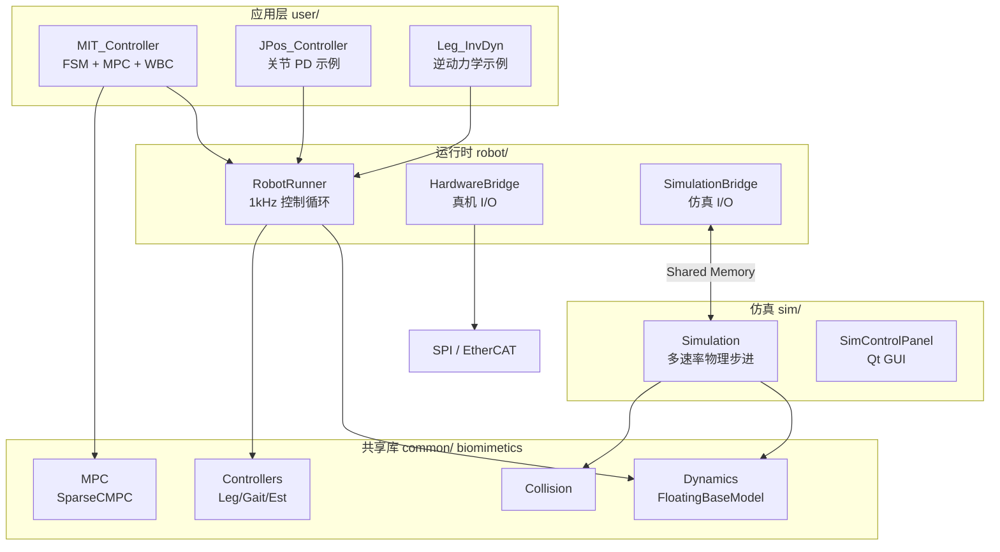

# 00 — 总体架构与技术总览

## 1. 项目定位

Cheetah-Software 是 MIT Biomimetics Lab 为 **Mini Cheetah** 与 **Cheetah 3** 四足机器人开发的完整软件栈，包含：

- **动力学与仿真**：基于 Featherstone 空间向量算法的刚体模型、接触仿真
- **状态估计**：IMU + 腿编码器的卡尔曼滤波融合
- **运动控制**：Convex MPC、Vision MPC、Sparse CMPC、WBC、Balance QP
- **行为调度**：有限状态机（FSM）管理站立、行走、视觉地形、后空翻等模式
- **硬件抽象**：SPI（Mini Cheetah）、EtherCAT（Cheetah 3）、共享内存（仿真）

---

## 2. 分层架构



### 2.1 各层职责

| 层级 | 目录 | 职责 | 典型频率 |
|------|------|------|----------|
| 应用层 | `user/` | 用户算法：FSM、MPC 参数、行为逻辑 | `controller_dt`（默认 1 ms） |
| 运行时 | `robot/` | 周期任务、硬件/仿真桥接、LCM 发布 | 1 kHz 控制 + 500 Hz SPI |
| 共享库 | `common/` | 可复用动力学、估计、步态、碰撞 | 被上层调用 |
| 仿真 | `sim/` | 物理积分、低层 PD、GUI、地形 | `dynamics_dt` / `low_level_dt` / `high_level_dt` |
| 通信 | LCM + SharedMemory | 调试/调参 vs 硬实时数据 | — |

### 2.2 模块间数据流（Locomotion 典型路径）

```
Gamepad/RC → DesiredStateCommand → 12-D 期望状态轨迹
                                        ↓
GaitScheduler → 接触相位 schedule ──→ ConvexMPCLocomotion
                                        ↓ GRF 力
StateEstimator → 位姿/速度 ──────────→ WBC (LocomotionCtrl)
                                        ↓ 关节力矩/阻抗
LegController → SPI/TI Board ────────→ 电机 PD (40 kHz  onboard)
```

---

## 3. 控制算法体系对比

### 3.1 质心层控制器

| 方法 | 模块 | 状态维 | 控制量 | 优点 | 缺点 | 适用场景 |
|------|------|--------|--------|------|------|----------|
| **Convex MPC** | `convexMPC/` | 13（质心+角动量） | 12（4×3 足端力） | 实时、约束内最优、成熟 | 单刚体质心近似、足端位置外环 | Trot/Bound 等周期步态 |
| **Vision MPC** | `VisionMPC/` | 同 Convex MPC | 同 | + 高度图/可通行性 | 依赖感知 LCM、计算更重 |  uneven terrain |
| **Sparse CMPC** | `SparseCMPC/` | 12 | 稀疏足端力序列 | 可变接触、稀疏 QP | 未接入主 FSM 热路径 | 研究/足步规划 |
| **Balance QP** | `BalanceController/` | — | 12（GRF） | 简单站立、WBC 前级 | 无预测 horizon | BalanceStand 状态 |

### 3.2 全身层控制器

| 方法 | 模块 | 求解内容 | 优点 | 缺点 |
|------|------|----------|------|------|
| **KinWBC + WBIC** | `WBC/WBIC/` | 满足接触约束下的任务空间加速度 + GRF | 精确动力学、任务优先级 | 需完整 H(q)、C、G |
| **Leg PD 叠加** | `LegController` | 关节/笛卡尔 PD + 前馈 | 简单、硬件友好 | 无全局约束 |

### 3.3 步态生成

| 方法 | 模块 | 机制 |
|------|------|------|
| **OffsetDurationGait** | `convexMPC/Gait` | 固定 offset + duration 的 MPC 接触表 |
| **GaitScheduler** | `common/Controllers` | 15 种命名步态、相位变量、切换逻辑 |
| **FootstepPlanner** | `FootstepPlanner/` | 图搜索（`planFixedEvenGait` 为 stub） |

---

## 4. 机器人模型对比

| | Mini Cheetah (`m`) | Cheetah 3 (`3`) |
|---|-------------------|-----------------|
| 腿数 | 4 | 4 |
| 低层接口 | SPI → SpineBoard | EtherCAT → TI Board |
| 笛卡尔阻抗 | 仅关节 PD | TI Board 支持 Cartesian PD |
| 质量/力限 | ~12 kg，GRF clamp 350 N | 更重，GRF clamp 1800 N |
| 构建函数 | `buildMiniCheetah()` | `buildCheetah3()` |
| 关节数 | 12（每腿 3 DOF） | 12 |
| 广义坐标 | 19（6 浮基 + 12 关节 + 1？） | 同结构 |

**腿序约定（俯视图）：**

```
FRONT
1(FR)  0(FL)   ← 右侧为 x 正，左侧为 y 正
3(RR)  2(RL)
BACK
```

---

## 5. 通信架构

### 5.1 共享内存（仿真 ↔ 控制器）

- **为什么**：LCM 有延迟与抖动，不适合硬实时闭环
- **机制**：`SimulatorSyncronizedMessage` 双信号量交替访问 `SimulatorToRobotMessage` / `RobotToSimulatorMessage`
- **内容**：Gamepad、IMU、SPI/TI 反馈 → 控制器；Leg 命令、可视化 → 仿真

### 5.2 LCM（调试与调参）

| 通道 | 用途 |
|------|------|
| `leg_control_command` / `leg_control_data` | 腿命令与反馈日志 |
| `state_estimator` | 估计状态 |
| `simulator_state` | 仿真快照 |
| `interface` / `interface_request` | 游戏手柄、参数读写 |
| `main_cheetah_visualization` | 远程可视化位姿 |

---

## 6. 构建与部署模式

```bash
# 标准开发机构建
mkdir build && cd build && cmake .. && ../scripts/make_types.sh && make -j4

# 交叉编译 Mini Cheetah  onboard
cmake -DMINI_CHEETAH_BUILD=TRUE ..

# 运行仿真 + MIT 控制器
./sim/sim                                    # 终端 1
./user/MIT_Controller/mit_ctrl m s           # 终端 2
```

| 参数 | 含义 |
|------|------|
| `m` / `3` | Mini Cheetah / Cheetah 3 |
| `s` / `r` | 仿真 / 真机 |

---

## 7. 第三方依赖与选型

| 库 | 用途 | 位置 |
|----|------|------|
| **Eigen** | 线性代数 | 全局 |
| **qpOASES** | Convex MPC QP（默认） | `third-party/qpOASES` |
| **JCQP** | MPC / SparseCMPC 备选求解器 | `third-party/JCQP` |
| **OSQP** | SparseCMPC | `third-party/osqp` |
| **LCM** | 消息传递 | 系统安装 |
| **Qt5** | 仿真 GUI | 仅 `sim/` |
| **SOEM** | EtherCAT（Cheetah 3） | `third-party/SOEM` |
| **ParamHandler** | YAML 参数 | `third-party/ParamHandler` |

**MPC 求解器切换**：`MIT_UserParameters.use_jcqp` 可在 qpOASES 与 JCQP 间切换。

---

## 8. 知识图谱（章节依赖）

```
00 总览
 ├── 01 动力学 ──────────────┐
 ├── 02 腿控/步态 ───────────┤
 ├── 03 状态估计 ────────────┼──→ 08 FSM/MIT_Controller
 ├── 04 Convex MPC ──────────┤
 ├── 05 Vision/Sparse MPC ───┤
 ├── 06 WBC ─────────────────┤
 ├── 07 Balance ─────────────┤
 ├── 09 特技 ────────────────┘
 ├── 10 运行时
 ├── 11 数学/碰撞
 └── 12 参数/示例控制器
```

---

## 9. 设计权衡总结

1. **质心 MPC + WBC 分层**：MPC 处理慢动力学与接触力，WBC 处理全身体动力学与摆动腿跟踪——兼顾实时性与精度。
2. **LegController 命令叠加**：`tauFeedForward + forceFeedForward + joint PD + cartesian PD` 可同时生效，便于组合前馈与阻抗。
3. **FSM 显式行为切换**：每种行为独立实现 `run/checkTransition`，安全检查和 RC 覆盖集中在一处。
4. **Cheater 模式**：仿真中可注入真值位姿，用于隔离估计误差与控制算法调试。

下一章：[01-dynamics-and-kinematics.md](./01-dynamics-and-kinematics.md)
