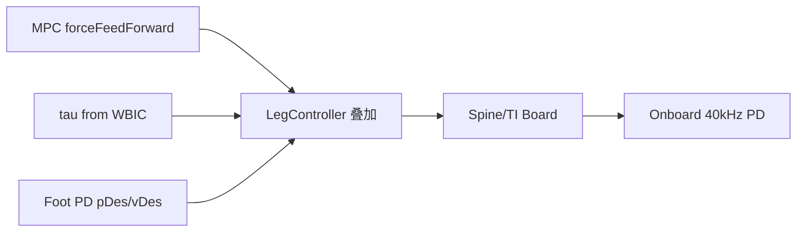

# 02 — 腿级控制与步态调度

## 1. 模块边界

| 文件 | 类/结构 |
|------|---------|
| `LegController.h/.cpp` | 腿命令/反馈、SPI/TI 接口 |
| `GaitScheduler.h/.cpp` | 15 种步态、相位调度 |
| `FootSwingTrajectory.h/.cpp` | 摆动腿 Bézier 轨迹 |
| `DesiredStateCommand.h/.cpp` | 手柄 → 期望状态 |

**调用链**：`MIT_Controller::runController` → `GaitScheduler::step` → `DesiredStateCommand::convertToStateCommands` → FSM 内 MPC/WBC → `LegController::updateCommand`

---

## 2. LegController

### 2.1 为什么需要

统一四腿命令/反馈的数据结构，并负责与 **SpineBoard（Mini）** 或 **TI Board（Cheetah 3）** 的数据格式转换。多种控制量（力矩、力、关节/笛卡尔 PD）**线性叠加**后下发。

### 2.2 LegControllerCommand — 每条腿的命令

| 成员 | 含义 | 单位/坐标系 |
|------|------|-------------|
| `tauFeedForward` | 关节力矩前馈 | Nm，(abd, hip, knee) |
| `forceFeedForward` | 足端力前馈 | N，hip 系 |
| `qDes`, `qdDes` | 关节 PD 期望 | rad, rad/s |
| `pDes`, `vDes` | 笛卡尔 PD 期望 | m, m/s，hip 系 |
| `kpCartesian`, `kdCartesian` | 笛卡尔增益 | 3×3（常用对角） |
| `kpJoint`, `kdJoint` | 关节增益 | 3×3 |

**方法** `zero()`：清零全部命令字段。

### 2.3 LegControllerData — 每条腿的反馈

| 成员 | 含义 |
|------|------|
| `q`, `qd` | 关节角/速 |
| `p`, `v` | 足端 hip 系位置/速度 |
| `J` | 3×3 足端 Jacobian |
| `tauEstimate` | 估计关节力矩 |
| `setQuadruped(quad)` / `zero()` | 初始化 |

### 2.4 LegController 类方法

| 方法 | 说明 |
|------|------|
| `LegController(quad)` | 绑定四足模型 |
| `zeroCommand()` | 清零四腿命令 |
| `edampCommand(robot, gain)` | 紧急阻尼：高 kd、零期望 |
| `updateData(spiData)` | 读 Mini Cheetah SPI 反馈 |
| `updateData(tiBoardData)` | 读 Cheetah 3 TI 反馈 |
| `updateCommand(spiCommand)` | 写 SPI 命令 |
| `updateCommand(tiBoardCommand)` | 写 TI 命令 |
| `setEnabled(enabled)` | 使能/禁用腿 |
| `setLcm(data, command)` | LCM 发布 |
| `setMaxTorqueCheetah3(tau)` | C3 力矩上限 |

### 2.5 自由函数

```cpp
void computeLegJacobianAndPosition(
    Quadruped<T>& quad, Vec3<T> q, Mat3<T>* J, Vec3<T>* p, int leg);
```

解析计算单腿 Jacobian 与足端位置（用于 WBC、安全检测）。设 $c_{23}=\cos(q_{hip}+q_{knee})$，$s_{23}=\sin(q_{hip}+q_{knee})$，$s=\pm 1$ 为左右腿符号：

**足端位置**（hip 系）：

$$
\begin{aligned}
p_x &= l_3 s_{23} + l_2 s_2 \\
p_y &= (l_1+l_4)s\cos q_{abd} + l_3 s_1 c_{23} + l_2 c_2 s_1 \\
p_z &= (l_1+l_4)s\sin q_{abd} - l_3 c_1 c_{23} - l_2 c_1 c_2
\end{aligned}
$$

**命令叠加**（`updateCommand`）：

$$
\boldsymbol{\tau} = \boldsymbol{\tau}_{ff} + \mathbf{J}^T\!\left(\mathbf{f}_{ff} + \mathbf{K}_p(\mathbf{p}_{des}-\mathbf{p}) + \mathbf{K}_d(\mathbf{v}_{des}-\mathbf{v})\right) + \mathbf{K}_q(\mathbf{q}_{des}-\mathbf{q}) + \mathbf{K}_{\dot{q}}(\dot{\mathbf{q}}_{des}-\dot{\mathbf{q}})
$$

详见 [13-algorithms-and-formulas.md §3](./13-algorithms-and-formulas.md#3-单腿运动学)。

### 2.6 低层执行

Mini Cheetah  onboard 关节 PD 约 **40 kHz**；`LegController` 层默认 ~1 kHz 更新期望。

---

## 3. GaitScheduler

### 3.1 是什么

将 **命名步态**（Trot、Bound 等）映射为每条腿的 **接触相位 schedule**，供 MPC 与摆动轨迹使用。

### 3.2 GaitType 枚举（完整）

`STAND`, `STAND_CYCLE`, `STATIC_WALK`, `AMBLE`, `TROT_WALK`, `TROT`, `TROT_RUN`, `PACE`, `BOUND`, `ROTARY_GALLOP`, `TRAVERSE_GALLOP`, `PRONK`, `THREE_FOOT`, `CUSTOM`, `TRANSITION_TO_STAND`

### 3.3 GaitData 字段

| 字段 | 含义 |
|------|------|
| `_currentGait`, `_nextGait`, `gaitName` | 当前/下一步态 |
| `periodTimeNominal`, `initialPhase`, `switchingPhaseNominal` | 周期与切换相位 |
| `gaitEnabled[4]` | 单腿是否参与 |
| `periodTime`, `timeStance`, `timeSwing`, `*Remaining` | 时间域量 |
| `switchingPhase`, `phaseVariable`, `phaseOffset`, `phaseScale` | 相位域 |
| `phaseStance`, `phaseSwing` | 支撑/摆动相位区间 |
| `contactStateScheduled`, `contactStatePrev` | 计划/历史接触 |
| `touchdownScheduled`, `liftoffScheduled` | 触地/离地事件 |

**方法** `zero()`：重置全部。

### 3.4 GaitScheduler 方法

| 方法 | 说明 |
|------|------|
| `GaitScheduler(userParameters, dt)` | 依赖 `MIT_UserParameters` |
| `initialize()` | 初始化默认步态 |
| `step()` | 每控制周期推进相位 |
| `modifyGait()` | 从步态库修改参数 |
| `createGait()` | 创建自定义步态 |
| `calcAuxiliaryGaitData()` | 派生 timeStance/Swing 等 |
| `printGaitInfo()` | 调试输出 |

### 3.5 与 Convex MPC Gait 的关系

- **GaitScheduler**：高层行为、手柄切换、相位变量
- **OffsetDurationGait**（MPC 内）：生成 `mpcTable` 供 QP 约束

两者通过 `MIT_UserParameters` 中的步态选择与 `ConvexMPCLocomotion` 内部 gait 实例协同。

---

## 4. FootSwingTrajectory

### 4.1 解决什么问题

支撑相由 MPC/WBC 管力，**摆动相**需平滑足端轨迹避免触地冲击与关节抖动。

### 4.2 算法

使用 **三次 Bézier** 插值（`Interpolate::cubicBezier`），水平与垂直分量可独立：

- 水平：`p_xy = lerp(p0_xy, pf_xy, bezier(phase))`
- 垂直：抬脚高度 `height`，中间过 peak

**Bézier 基函数**（`Interpolation.h`）：

$$
B(x) = x^3 + 3x^2(1-x), \quad B'(x) = 6x(1-x), \quad B''(x) = 6 - 12x
$$

### 4.3 方法

| 方法 | 说明 |
|------|------|
| `setInitialPosition(p0)` | 摆动起点 |
| `setFinalPosition(pf)` | 落点 |
| `setHeight(h)` | 峰值高度 |
| `computeSwingTrajectoryBezier(phase, swingTime)` | 计算 p,v,a |
| `getPosition()` / `getVelocity()` / `getAcceleration()` | 当前输出 |

---

## 5. DesiredStateCommand

### 5.1 是什么

将 **Gamepad / RC** 输入转换为 **12 维质心期望状态**及 **MPC 参考轨迹**。

### 5.2 12-D 状态向量（典型顺序）

体姿态 RPY、体位置、角速度、线速度（具体排列与 MPC 权重对齐）。

### 5.3 DesiredStateData

| 成员 | 说明 |
|------|------|
| `stateDes` | 当前 12-D 期望 |
| `pre_stateDes` | 上一周期 |
| `stateTrajDes` | 12×10 MPC  horizon 参考 |
| `zero()` | 重置 |

### 5.4 方法

| 方法 | 说明 |
|------|------|
| `DesiredStateCommand(gamepad, rc, parameters, sEstimate, dt)` | 构造 |
| `convertToStateCommands()` | 每周期：读输入 → 限幅 → 填 stateDes |
| `setCommandLimits(...)` | 速度/转向限幅 |
| `desiredStateTrajectory(N, dtVec)` | 构造未来轨迹 |
| `deadband(command, minVal, maxVal)` | 摇杆死区 |
| `printRawInfo()` / `printStateCommandInfo()` | 调试 |

**公开限幅成员**：`maxRoll/minRoll`, `maxPitch/minPitch`, `maxVelX/minVelX`, `maxVelY/minVelY`, `maxTurnRate/minTurnRate`

---

## 6. 典型用法（Locomotion）

```cpp
// MIT_Controller::runController 每 tick
_gaitScheduler->step();
_desiredStateCommand->convertToStateCommands();
_controlFSM->runFSM();  // 内部 FSM_State_Locomotion

// FSM_State_Locomotion::run 内（简化）
convexMPC.run(data);           // 足端力 + 接触
locomotionCtrl.run(...);       // WBC → LegController
legController->updateCommand(); // 下发
```

---

## 7. 命令叠加示意



---

## 8. 示例：JPos_Controller

最小关节 PD（`user/JPos_Controller`）：

```cpp
void JPos_Controller::runController() {
  for (int leg = 0; leg < 4; leg++) {
    for (int j = 0; j < 3; j++) {
      _legController->commands[leg].qDes[j] = sin(_iterations * 0.001);
      _legController->commands[leg].kpJoint(j,j) = userParams.kp;
      _legController->commands[leg].kdJoint(j,j) = userParams.kd;
    }
  }
}
```

运行：`./user/JPos_Controller/jpos_ctrl m s`

---

上一章：[01-dynamics-and-kinematics.md](./01-dynamics-and-kinematics.md)  
下一章：[03-state-estimation.md](./03-state-estimation.md)
