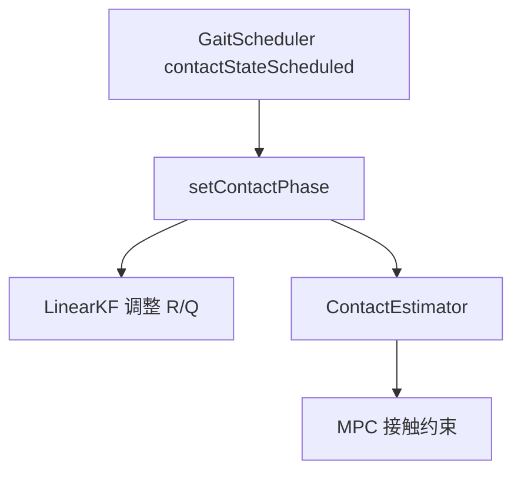

# 03 — 状态估计

## 1. 模块边界

| 文件 | 内容 |
|------|------|
| `StateEstimatorContainer.h` | 估计器容器、StateEstimate |
| `OrientationEstimator.h` | 姿态（Cheater / VectorNav） |
| `PositionVelocityEstimator.h` | 位置速度 KF / Cheater |
| `ContactEstimator.h` | 接触相位复制 |

**调用**：`RobotRunner::run` → `_stateEstimator->run()` → 各 `GenericEstimator::run()`

---

## 2. 为什么需要状态估计

控制器与 MPC 需要 **世界系位姿、速度、角速度**。真机仅有 IMU 与关节编码器，无全局 GPS。必须在 **接触约束** 下融合 IMU 与足端运动学，并处理支撑/摆动相切换。

---

## 3. StateEstimate — 输出结构

| 字段 | 含义 |
|------|------|
| `contactEstimate[4]` | 估计接触（0/1） |
| `position`, `vWorld` | 世界系位置/速度 |
| `orientation`, `rBody` | 四元数 / 旋转矩阵 body→world |
| `rpy` |  roll-pitch-yaw |
| `omegaBody`, `omegaWorld` | 角速度 |
| `vBody`, `aBody`, `aWorld` | 体坐标加速度等 |
| `setLcm(lcm_data)` | 导出 LCM |

---

## 4. StateEstimatorContainer

### 4.1 StateEstimatorData（共享输入）

指针指向：`result`, IMU(`vectorNav`), `cheaterState`, `legData`, `contactPhase`, `parameters`

### 4.2 GenericEstimator 接口

| 方法 | 说明 |
|------|------|
| `run()` | 纯虚：执行估计 |
| `setup()` | 纯虚：初始化 |
| `setData(data)` | 注入共享数据 |

### 4.3 Container 方法

| 方法 | 说明 |
|------|------|
| `StateEstimatorContainer(cheaterState, vectorNavData, legControllerData, stateEstimate, parameters)` | 构造；内部 `_phase` 置零并绑定 `contactPhase` 指针 |
| `run(visualization)` | 顺序执行所有 `GenericEstimator::run()`；若传入 `CheetahVisualization*` 则更新 `quat`/`p` |
| `getResult()` | 返回 `StateEstimate` 常量引用 |
| `getResultHandle()` | 返回可写 `StateEstimate*` |
| `setContactPhase(phase)` | 写入 Gait 计划接触相位，供 KF 调整 trust |
| `addEstimator<EstimatorToAdd>()` | 模板：new → setData → setup → push_back |
| `removeEstimator<EstimatorToRemove>()` | 模板：dynamic_cast 匹配则 delete |
| `removeAllEstimators()` | 清空并 delete 全部 |
| `~StateEstimatorContainer()` | 析构时 delete 所有 estimator |

### 4.4 StateEstimate 方法

| 方法/字段 | 说明 |
|-----------|------|
| `setLcm(lcm_data)` | 导出 position, vWorld, vBody, rpy, omega, quat 到 LCM |
| 其余字段 | 见 §3 表 |

### 4.5 GenericEstimator 接口

| 方法 | 说明 |
|------|------|
| `run()` | **纯虚**：执行单步估计 |
| `setup()` | **纯虚**：分配矩阵/初值 |
| `setData(data)` | 注入 `StateEstimatorData` |
| `~GenericEstimator()` | 虚析构 |
| `_stateEstimatorData` | protected 共享输入 |

### 4.6 RobotRunner 默认配置

**正常模式**：
1. `VectorNavOrientationEstimator`（或 Microstrain）
2. `LinearKFPositionVelocityEstimator`
3. `ContactEstimator`

**Cheater 模式**（`cheater_mode=true`）：
1. `CheaterOrientationEstimator`
2. `CheaterPositionVelocityEstimator`

Cheater 从仿真直接读取真值，用于隔离控制算法与估计误差。

---

## 5. 姿态估计

### 5.1 VectorNavOrientationEstimator

| 方法 | 说明 |
|------|------|
| `setup()` | 空实现 |
| `run()` | 读 IMU 四元数 → `orientation`, `rBody`, `rpy`, `omegaBody`, `omegaWorld` |

**首次访问**：记录 `_ori_ini_inv` 作为初始 yaw 对齐（`_b_first_visit`）。

**输入**：`VectorNavData`（accelerometer, gyro, quat）

### 5.2 CheaterOrientationEstimator

| 方法 | 说明 |
|------|------|
| `setup()` | 空 |
| `run()` | 复制 `CheaterState::orientation` 及派生量 |

---

## 6. LinearKFPositionVelocityEstimator

### 6.1 LinearKFPositionVelocityEstimator — 完整 API

| 方法 | 说明 |
|------|------|
| `LinearKFPositionVelocityEstimator()` | 构造 |
| `setup()` | 构建 `_A`, `_B`, `_C`, `_Q0`, `_R0`, `_P` 初值 |
| `run()` | Predict + Update，写 `StateEstimate` |

**私有状态**（理解调参）：`_xhat`(18), `_ps`/`_vs`(12), `_A`(18×18), `_P`, `_Q0`, `_R0`, `_B`(18×3), `_C`(28×18)

### 6.2 状态向量（18 维）

$$
\mathbf{x} = [\mathbf{p}_b^T,\ \mathbf{v}_b^T,\ \mathbf{p}_{f0}^T,\ \mathbf{p}_{f1}^T,\ \mathbf{p}_{f2}^T,\ \mathbf{p}_{f3}^T]^T
$$

- $\mathbf{p}_b$：body 世界位置  
- $\mathbf{v}_b$：body 世界速度  
- $\mathbf{p}_{fi}$：第 i 足端世界位置（随 body 运动缓慢更新）

### 6.2 测量向量（28 维）

- 四足相对 body 的位置/速度（各 3D，共 24）
- 四足高度约束 $z_{foot}$（各 1D，共 4）

### 6.3 离散模型

**状态转移** $\mathbf{x}_{k+1} = \mathbf{A}\mathbf{x}_k + \mathbf{B}\mathbf{a}_k + \mathbf{w}_k$，其中 $\mathbf{a}_k = \mathbf{a}_{world} + \mathbf{g}$：

$$
\mathbf{A} = \begin{bmatrix}
\mathbf{I}_3 & \Delta t \cdot \mathbf{I}_3 & \mathbf{0} \\
\mathbf{0} & \mathbf{I}_3 & \mathbf{0} \\
\mathbf{0} & \mathbf{0} & \mathbf{I}_{12}
\end{bmatrix}, \quad
\mathbf{B} = \begin{bmatrix} \mathbf{0} \\ \Delta t \cdot \mathbf{I}_3 \\ \mathbf{0} \end{bmatrix}
$$

**观测模型** $\mathbf{y} = \mathbf{C}\mathbf{x} + \mathbf{v}$（28 维）。对第 $i$ 足，设 $R_b$ 为 body→world 旋转，$\mathbf{p}_{rel,i}$ 为 hip 系足端位置：

$$
\begin{aligned}
\mathbf{y}_{p,i} &= \mathbf{p}_b - \mathbf{p}_{fi} \approx -R_b^T(\mathbf{p}_{hip,i}+\mathbf{p}_{rel,i}) \\
\mathbf{y}_{v,i} &= \mathbf{v}_b - \dot{\mathbf{p}}_{fi} \approx -R_b^T(\boldsymbol{\omega}\times\mathbf{p}_{rel,i}+\dot{\mathbf{p}}_{rel,i}) \\
z_{foot,i} &= p_{b,z} + (R_b^T\mathbf{p}_{rel,i})_z \approx 0
\end{aligned}
$$

**卡尔曼递推**：

$$
\begin{aligned}
\hat{\mathbf{x}}_{k|k-1} &= \mathbf{A}\hat{\mathbf{x}}_{k-1} + \mathbf{B}\mathbf{a}_k \\
\mathbf{P}_m &= \mathbf{A}\mathbf{P}_{k-1}\mathbf{A}^T + \mathbf{Q} \\
\mathbf{K} &= \mathbf{P}_m\mathbf{C}^T(\mathbf{C}\mathbf{P}_m\mathbf{C}^T + \mathbf{R})^{-1} \\
\hat{\mathbf{x}}_{k} &= \hat{\mathbf{x}}_{k|k-1} + \mathbf{K}(\mathbf{y}_k - \mathbf{C}\hat{\mathbf{x}}_{k|k-1})
\end{aligned}
$$

**接触信任度**（摆动相降低约束，$w=0.2$，$M=100$）：

$$
\text{trust}_i = \begin{cases}
\phi_i/w & \phi_i < w \\
1 & w \le \phi_i \le 1-w \\
(1-\phi_i)/w & \phi_i > 1-w
\end{cases}, \quad
\mathbf{R}_i \leftarrow (1 + (1-\text{trust}_i)M)\mathbf{R}_i
$$

完整推导见 [13-algorithms-and-formulas.md §4](./13-algorithms-and-formulas.md#4-状态估计--线性卡尔曼滤波)。

### 6.4 噪声参数（RobotControlParameters）

| 参数 | 含义 |
|------|------|
| `imu_process_noise_position` | 位置过程噪声缩放 |
| `imu_process_noise_velocity` | 速度过程噪声 |
| `foot_process_noise_position` | 足端位置过程噪声 |
| `foot_sensor_noise_position` | 足端相对位置测量噪声 |
| `foot_sensor_noise_velocity` | 足端相对速度测量噪声 |
| `foot_height_sensor_noise` | 足高测量噪声 |

### 6.5 run() 流程

1. 用 IMU 加速度（旋转到世界系）作输入
2. 从 `LegController` 读足端 kinematics
3. 按 `contactPhase` 调整足端 trust（摆动相降低约束）
4. Predict + Update
5. 写回 `StateEstimate::position`, `vWorld`, `vBody`

### 6.6 CheaterPositionVelocityEstimator

| 方法 | 说明 |
|------|------|
| `setup()` | 空 |
| `run()` | 复制 `CheaterState` 的 position, velocity 等到 `StateEstimate` |

---

## 7. ContactEstimator — 完整 API

| 方法 | 说明 |
|------|------|
| `setup()` | 空 |
| `run()` | `contactEstimate = *contactPhase`（复制 Gait 计划，非力传感） |

**说明**：非力传感检测，而是 **开环 schedule 复制**。可替换为基于力/触地检测的估计器。

---

## 8. 接触相位的作用



摆动腿时降低足端位置约束权重，避免 KF 被错误 foot position 拉偏。

---

## 9. 调试建议

| 现象 | 检查 |
|------|------|
| 估计漂移 | `foot_sensor_noise_*`, 接触 schedule 是否正确 |
| 仿真红灰双机偏差大 | 关闭 cheater，对比 `state_estimator` LCM |
| 快速运动发散 | 增大 `imu_process_noise_velocity` 或检查 IMU 噪声仿真 |

**LCM 通道**：`state_estimator` — 可用 `scripts/launch_lcm_spy.sh` 绘图。

---

## 10. 可运行验证

```bash
cd build
./common/test-common --gtest_filter=*Imu*   # IMU 仿真测试
./sim/sim   # 开启 cheater_mode 对比双机器人重合度
```

---

上一章：[02-leg-control-and-gait.md](./02-leg-control-and-gait.md)  
下一章：[04-convex-mpc.md](./04-convex-mpc.md)
