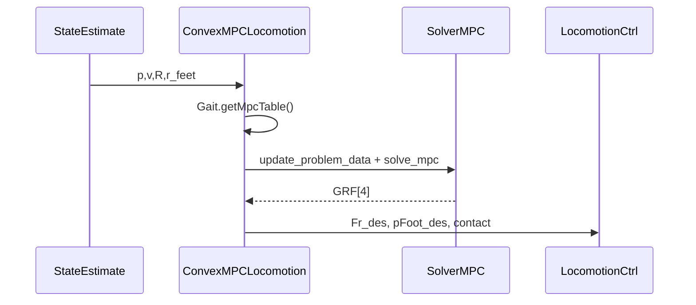

# 04 — Convex MPC 运动控制

## 1. 模块边界

```
user/MIT_Controller/Controllers/convexMPC/
├── ConvexMPCLocomotion.h/.cpp   # 高层 locomotion 逻辑
├── convexMPC_interface.h/.cpp   # C API 封装
├── SolverMPC.h/.cpp             # QP 构建与求解
├── Gait.h/.cpp                  # 接触时间表
├── RobotState.h/.cpp            # 质心状态封装
├── convexMPC_util.h             # 类型别名
└── common_types.h               # fpt, 矩阵 typedef
```

**依赖**：qpOASES（默认）或 JCQP；`Quadruped` 惯性；`StateEstimate`；`GaitScheduler` 步态选择。

---

## 2. 算法概述

### 2.1 是什么

**Convex Model-Predictive Control** 在 **单刚体质心模型** 上预测未来若干步，优化 **地面反力 GRF**，满足摩擦锥与力上限，跟踪期望质心轨迹。

### 2.2 为什么用质心模型

- 全阶 18+ DOF MPC 维度过高，难实时
- 四足 locomotion 主要动力学由 **总 GRF** 与 **足端相对质心位置** 决定
- 线性化 + 小角度假设 → **凸 QP**，保证全局最优

### 2.3 适用与不适用

| 适用 | 不适用 |
|------|--------|
| Trot, Bound, Pronk 等周期步态 | 精细全身体操纵 |
| 平地/缓坡高速跑 | 大变形软地形 |
| 与 WBC 分层 | 无 WBC 时的 sole 控制器（精度有限） |

---

## 3. 状态与控制

### 3.1 13 维状态 \(\mathbf{x}\)

| 索引 | 分量 |
|------|------|
| 0-2 | roll, pitch, yaw |
| 3-5 | 位置 \(p_x, p_y, p_z\) |
| 6-8 | 角速度 \(\omega_x, \omega_y, \omega_z\) |
| 9-11 | 线速度 \(v_x, v_y, v_z\) |
| 12 | 重力常数项（固定 -9.81 技巧） |

### 3.2 12 维控制 \(\mathbf{u}\)

4 足 × 3D 力 \([f_{FR}, f_{FL}, f_{RR}, f_{RL}]\)，每足 \(f \in \mathbb{R}^3\)

### 3.3 连续时间线性化 `ct_ss_mats`

```cpp
void ct_ss_mats(Matrix<fpt,3,3> I_world, fpt m, Matrix<fpt,3,4> r_feet,
                Matrix<fpt,3,3> R_yaw, Matrix<fpt,13,13>& A, Matrix<fpt,13,12>& B);
```

- \(I_world\)：世界系惯性张量  
- \(r_feet\)：足端相对质心位置（3×4）  
- \(R_yaw\)：仅 yaw 旋转（解耦水平动力学）  
- 输出 \( \dot{x} = A x + B u \)

**物理含义**：\(\dot{v} = \sum f_i / m + g\)，\(\dot{\omega} = I^{-1} \sum r_i \times f_i\)

---

## 4. 离散化 `c2qp`

使用矩阵指数（零阶保持）：

\[
\exp\left(\begin{bmatrix} A_c & B_c \\ 0 & 0 \end{bmatrix} \Delta t\right) \rightarrow A_d, B_d
\]

堆叠 horizon \(N\) 步：

\[
X = A_{qp} x_0 + B_{qp} U
\]

`c2qp(Ac, Bc, dt, horizon)` 填充 `A_qp`, `B_qp`（最大 horizon 19）。

---

## 5. QP 问题

### 5.1 代价

\[
\min_U \ (X - X_d)^T Q (X - X_d) + \alpha \|U\|^2
\]

- \(X_d\)：来自 `DesiredStateCommand::stateTrajDes`  
- \(Q\)：12/13 维权重（`MIT_UserParameters`）  
- \(\alpha\)：控制正则 `cmpc_alpha`

### 5.2 约束

| 约束 | 说明 |
|------|------|
| 摩擦锥 | \(\|f_{xy}\| \le \mu f_z\)，\(f_z \ge 0\) |
| 力上限 | \(\|f\| \le f_{max}\) |
| 接触 | 摆动相对应力为 0（via `gait` table） |
| 初始状态 | \(x_0\) 固定为当前估计 |

### 5.3 求解器

- **qpOASES**：热启动 active-set，默认路径  
- **JCQP**：`update_solver_settings(..., use_jcqp=1)`

` solve_mpc(update_data_t*, problem_setup*)` 为入口。

---

## 6. Gait 类体系

### 6.1 Gait 抽象基类

| 方法 | 说明 |
|------|------|
| `getContactState()` | 4 腿接触比例 [0,1] |
| `getSwingState()` | 4 腿摆动比例 |
| `getMpcTable()` | horizon 内 0/1 接触表 |
| `setIterations(iterBetweenMPC, currentIter)` | 同步 MPC 更新节拍 |
| `getCurrentStanceTime/SwingTime(dtMPC, leg)` | 当前相时长 |
| `getCurrentGaitPhase()` | 整数相位 |
| `debugPrint()` | 调试 |

### 6.2 OffsetDurationGait

```cpp
OffsetDurationGait(int nSegment, Vec4<int> offset, Vec4<int> durations, string name);
```

- `nSegment`：一个周期内 MPC 离散步数  
- `offset[leg]`：该腿相对周期起点的相位偏移  
- `durations[leg]`：支撑持续步数  

**例：Trot** — 对角腿同相，offset 相差半周期。

### 6.3 MixedFrequncyGait

各腿 **period** 可不同 + 统一 `duty_cycle`，用于 asymmetric gait。

### 6.4 ConvexMPCLocomotion 内预置 Gait

`trotting`, `bounding`, `pronking`, `jumping`, `galloping`, `standing`, `trotRunning`, `walking`, `walking2`, `pacing`, `random`, `random2`

---

## 7. ConvexMPCLocomotion

### 7.1 方法

| 方法 | 说明 |
|------|------|
| `ConvexMPCLocomotion(dt, iterations_between_mpc, parameters)` | 构造 |
| `initialize()` | 初始化 gait、`setup_problem` |
| `run(ControlFSMData& data)` | 主循环（模板） |

### 7.2 输出（public）

| 成员 | 说明 |
|------|------|
| `pBody_des`, `vBody_des`, `aBody_des` | 质心期望 |
| `pBody_RPY_des`, `vBody_Ori_des` | 姿态期望 |
| `pFoot_des[4]`, `vFoot_des[4]`, `aFoot_des[4]` | 足端期望 |
| `Fr_des[4]` | MPC 最优 GRF |
| `contact_state` | 当前接触 |

### 7.3 run() 逻辑概要

1. 读 `StateEstimate`、足端位置、yaw  
2. 选 gait → 更新 `RobotState`  
3. 每 `iterations_between_mpc` 调用 `update_problem_data` + `solve_mpc`  
4. 插值 GRF → `Fr_des`  
5. 摆动腿：FootSwingTrajectory 生成 `pFoot_des`  
6. 输出给 `LocomotionCtrl`

### 7.4 CMPC_Jump

| 方法 | 说明 |
|------|------|
| `trigger_pressed(seg, trigger)` | 跳跃触发 |
| `should_jump(seg)` | 是否进入 jump gait |
| `debug(seg)` | 调试 |

---

## 8. RobotState

| 方法 | 说明 |
|------|------|
| `set(p, v, q, w, r, yaw)` | 填充状态 |
| `print()` | 调试 |

| 成员 | 说明 |
|------|------|
| `p`, `v`, `w` | 位置、速度、角速度 |
| `r_feet` | 3×4 足端相对质心 |
| `R`, `R_yaw` | 完整旋转 / 仅 yaw |
| `I_body`, `m`, `q`, `yaw` | 惯性、质量、四元数 |

---

## 9. convexMPC_interface C API

| 函数 | 说明 |
|------|------|
| `setup_problem(dt, horizon, mu, f_max)` | 初始化 QP 尺寸与摩擦/力上限 |
| `update_problem_data(...)` | double 精度：状态、权重、轨迹、gait 表 |
| `update_problem_data_floats(...)` | float 精度同上 |
| `get_solution(index)` | 读第 index 维力解（leg*3+axis） |
| `update_solver_settings(max_iter, rho, sigma, alpha, terminate, use_jcqp)` | JCQP/qpOASES 切换与参数 |
| `update_x_drag(x_drag)` | 水平阻尼系数 |

**结构体**：
- `problem_setup`：`dt`, `mu`, `f_max`, `horizon`
- `update_data_t`：13-D 状态、12×N 参考、权重、gait 表、求解器 flags
- `K_MAX_GAIT_SEGMENTS = 36`

---

## 10. SolverMPC 工具函数

| 函数 | 说明 |
|------|------|
| `solve_mpc(update, setup)` | QP 构建 + qpOASES/JCQP 求解入口 |
| `ct_ss_mats(I_world, m, r_feet, R_yaw, A, B)` | 连续时间 13×13 A、13×12 B |
| `c2qp(Ac, Bc, dt, horizon)` | 矩阵指数离散化并堆叠 A_qp, B_qp |
| `resize_qp_mats(horizon)` | 按 horizon 分配 dense 矩阵 |
| `get_q_soln()` | 返回力解数组指针 |
| `quat_to_rpy(q, rpy)` | 四元数→RPY |
| `print_array` / `print_named_array` | 调试打印矩阵 |
| `pnv(name, v)` | 打印标量 |
| `t_min(a,b)` / `sq(a)` | 模板：min / 平方 |

---

## 11. 稀疏路径 solveSparseMPC

当 `MIT_UserParameters.cmpc_use_sparse > 0.9` 时，`ConvexMPCLocomotion` 调用 `SparseCMPC`（见第 05 章）而非 `solve_mpc`。输出仍写入 `Fr_des[4]`。

---

## 12. CMPC_Result / CMPC_Jump

**`CMPC_Result<T>`**：`commands[4]`, `contactPhase` — 内部 gait 命令缓存。

**`CMPC_Jump`**（跳跃 gait 辅助）：

| 成员/方法 | 说明 |
|-----------|------|
| `START_SEG=6`, `END_SEG=0`, `END_COUNT=2` | 相位常量 |
| `trigger_pressed(seg, trigger)` | 手柄触发 |
| `should_jump(seg)` | 是否进入 jump |
| `debug(seg)` | 调试打印 |
| `jump_pending`, `jump_in_progress` 等 | 状态标志 |

---

## 13. 与 WBC 接口

`LocomotionCtrlData` 接收 MPC 输出 → `BodyPosTask`, `BodyOriTask`, `LinkPosTask`, `SingleContact::setRFDesired(Fr_des)`

---

## 14. 参数调优（MIT_UserParameters 节选）

| 参数 | 作用 |
|------|------|
| `cmpc_gait` | 步态选择 |
| `cmpc_horizon_length` | 预测步数 |
| `cmpc_alpha` | 力正则 |
| `cmpc_use_sparse` | 稀疏求解开关 |
| `use_jcqp` | JCQP vs qpOASES |
| `Swing_*` | 摆动高度、增益 |

---

## 15. 示意图



---

## 16. 验证

```bash
cd build
./user/MIT_Controller/mit_ctrl m s
# 仿真中 control mode → 4 (LOCOMOTION)
# LCM spy: 观察 leg_control forceFeedForward
```

单元测试：`common/test/test_osqp.cpp`（OSQP 路径，与 SparseCMPC 相关）

---

上一章：[03-state-estimation.md](./03-state-estimation.md)  
下一章：[05-vision-mpc-and-sparse-cmpc.md](./05-vision-mpc-and-sparse-cmpc.md)
