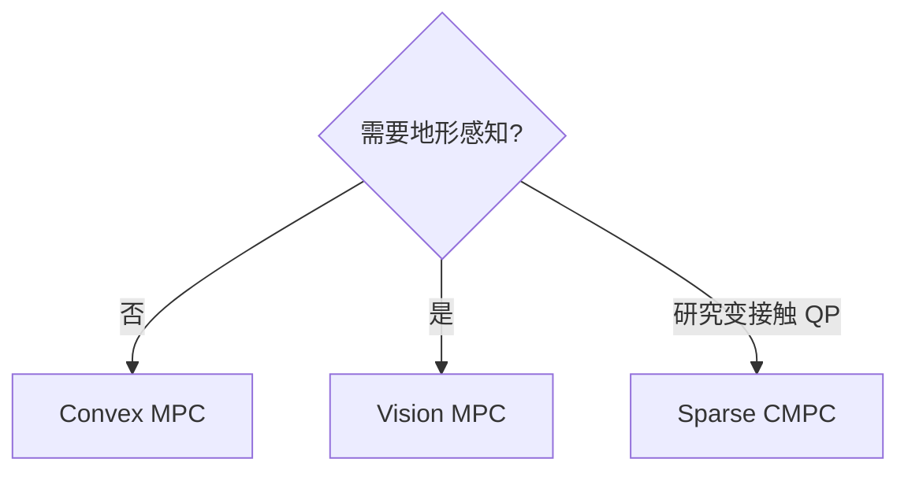

# 05 — Vision MPC 与 Sparse CMPC

## 1. 模块边界

| 路径 | 用途 |
|------|------|
| `user/MIT_Controller/Controllers/VisionMPC/` | 地形感知 Convex MPC 变体 |
| `common/include/SparseCMPC/` | 稀疏结构 centroidal MPC |
| `common/FootstepPlanner/` | 足步图搜索（部分 stub） |

---

## 2. Vision MPC

### 2.1 与 Convex MPC 的差异

| 方面 | Convex MPC | Vision MPC |
|------|------------|------------|
| 足端落点 | 启发式 / 速度积分 | **高度图 + 可通行性图** |
| 状态机 | `FSM_State_Locomotion` | `FSM_State_Vision` |
| LCM 输入 | 无 | `heightmap_t`, `traversability_map_t`, `localization_lcmt` |
| 求解器 API | `solve_mpc` | `vision_solve_mpc` |

核心 QP 结构 **相同**（13 状态、12 控制、摩擦约束），差异在 **参考轨迹与落足规划**。

### 2.2 VisionGait

| 方法 | 说明 |
|------|------|
| `VisionGait(nMPC_segments, offsets, durations, name)` | 构造 |
| `getContactState()` / `getSwingState()` | 相位 |
| `mpc_gait()` | MPC 表 |
| `setIterations(iterPerMPC, currentIteration)` | 节拍 |

Public: `_stance`, `_swing`

### 2.3 VisionMPCLocomotion

| 方法 | 说明 |
|------|------|
| `VisionMPCLocomotion(dt, iter_between_mpc, parameters)` | 构造 |
| `initialize()` | 初始化 |
| `run(data, vel_cmd, height_map, idx_map)` | 带地图运行 |

**输出成员**与 `ConvexMPCLocomotion` 相同。

**run 额外逻辑**：
1. 订阅 LCM 高度图/可通行性  
2. 根据 `vel_cmd` 与地图选 **安全落足点**  
3. 调整 `pFoot_des` 与 body 高度参考  
4. 调用 `vision_update_problem_data` + `vision_solve_mpc`

### 2.4 VisionSolverMPC API

| 函数 | 说明 |
|------|------|
| `vision_setup_problem(dt, horizon, mu, f_max)` | 初始化 |
| `vision_update_problem_data(...)` | 更新（double） |
| `vision_update_problem_data_floats(...)` | 更新（float） |
| `vision_get_solution(index)` | 读解 |
| `vision_ct_ss_mats(...)` | 连续系统矩阵 |
| `vision_c2qp(...)` | 离散化 |
| `vision_resize_qp_mats(horizon)` | 分配 |
| `vision_get_q_soln()` | 解指针 |

### 2.5 VisionRobotState

与 `RobotState` 相同 API：`set(p,v,q,w,r,yaw)`, `print()`，成员 `p,v,w,r_feet,R,R_yaw,I_body,m,q,yaw`

### 2.6 FSM_State_Vision 集成

- LCM：`local_heightmap`, `traversability`, `velocity_cmd`  
- 可选 WBC：`LocomotionCtrl` 跟踪 MPC 输出  
- RC 模式 `RC_mode::VISION` 强制进入

---

## 3. Sparse CMPC

### 3.1 是什么

在 `common/SparseCMPC` 中实现的 **稀疏 QP** 质心 MPC，支持 **变 timestep** 与 **变接触序列**，用 JCQP 或 OSQP 求解。

### 3.2 为什么需要

Convex MPC 使用固定 horizon 与 dense QP。Footstep 规划或 **非均匀时间网格** 时，稀疏结构更高效且便于与 `ContactState` 序列耦合。

### 3.3 状态（12 维）

```
0-2: roll, pitch, yaw
3-5: x, y, z position
6-8: roll_rate, pitch_rate, yaw_rate
9-11: x, y, z velocity
```

（无 Convex MPC 的第 13 维重力 trick）

### 3.4 公共 API

| 方法 | 说明 |
|------|------|
| `SparseCMPC()` | 构造 |
| `run()` | 构建并求解 QP |
| `setRobotParameters(inertia, mass, maxForce)` | 机器人参数 |
| `setFriction(mu)` | 摩擦系数 |
| `setWeights(weights, alpha)` | 12-D 状态权重 + 控制正则 |
| `setX0(p, v, q, w)` | 初始位姿与 twist |
| `setContactTrajectory(contacts, length)` | 每步接触模式 |
| `setStateTrajectory(traj)` | 参考状态 |
| `setDtTrajectory(traj)` | 每步 dt |
| `setFeet(feet)` | 足端位置 12-D |
| `getResult()` | 最优 12-D 结果 |

### 3.5 run() 内部步骤

```
buildX0() → buildCT() → buildDT()
addX0Constraint()
addDynamicsConstraints()    # ẋ = Ax + Σ B_i f_i
addForceConstraints()       # 力幅值
addFrictionConstraints()    # 摩擦锥
addQuadraticStateCost()
addLinearStateCost()
addQuadraticControlCost()
runSolverOSQP()  // 或 runSolver()
```

### 4.4 动力学 buildCT

对每个 timestep 构建 12×12 的 $\mathbf{A}_c$，对每个 **接触足** 构建 12×3 的 $\mathbf{B}_i$ block（稀疏存储为 triples）。

**连续时间 $\mathbf{A}_c$**（RPY, pos, ω, vel 各 3 维）：

$$
\mathbf{A}_c = \begin{bmatrix}
\mathbf{0} & \mathbf{0} & R_{yaw} & \mathbf{0} \\
\mathbf{0} & \mathbf{0} & \mathbf{0} & \mathbf{I}_3 \\
\mathbf{0} & \mathbf{0} & \mathbf{0} & \mathbf{0}
\end{bmatrix}
$$

**每足 $\mathbf{B}_i$**（$\mathbf{r}_i$ 为相对质心位置）：

$$
\mathbf{B}_i = \begin{bmatrix} \mathbf{0} \\ \mathbf{0} \\ \mathbf{I}_w^{-1}[\mathbf{r}_i]_\times \\ \frac{1}{m}\mathbf{I}_3 \end{bmatrix}
$$

**动力学等式**（每步 $k$）：

$$
\mathbf{x}_k = \mathbf{A}_d^{(k)}\mathbf{x}_{k-1} + \sum_{i\in\text{contact}(k)} \mathbf{B}_{d,i}^{(k)}\mathbf{f}_{k,i} + \mathbf{g}\Delta t_k
$$

离散化 `c2d` per interval `dt[i]`（矩阵指数 ZOH）。详见 [13-algorithms-and-formulas.md §6](./13-algorithms-and-formulas.md#6-sparse-cmpc)。

### 3.7 与 Convex MPC 对比

| | Convex MPC | Sparse CMPC |
|---|------------|-------------|
| 集成 | FSM Locomotion 热路径 | 库级，需自行调用 |
| Horizon | 固定 N | 可变长度 trajectory |
| 求解器 | qpOASES 为主 | OSQP/JCQP |
| 落足 | Gait 表 | `ContactTrajectory` 显式 |

---

## 4. FootstepPlanner

### 4.1 数据结构

| 类型 | 说明 |
|------|------|
| `ContactState` | `contact[4]` 布尔 |
| `DefaultGaits` | `trotting`, `standing` 序列 |
| `InputTrajectoryState` | `p, v (Vec2), theta` |
| `FootplanFootState` | 单足 `p, contact, stateTime` |
| `FootplanState` | `t, pBase, feet[4]` |
| `FootplanStats` | 搜索统计 |
| `FootplanGoal` | `goalPos` |

### 4.2 FootstepPlanner 类

| 方法 | 说明 |
|------|------|
| `FootstepPlanner(verbose)` | 构造 |
| `reset()` | 清空 |
| `buildInputTrajectory(duration, dt, x0, omega)` | 常速+常角速度积分 |
| `planFixedEvenGait(gait, gait_period)` | **Stub（空实现）** |
| `getInitialTrajectory()` | 参考输入轨迹 |
| `addCost(stateCost)` / `addCost(transitionCost)` | 注册代价 |
| `getGoal()` | 目标 |

### 4.3 FootplanCosts

`distanceToGoal(state, goal)` — $\|p_{base} - p_{goal}\|_2$

### 4.4 与 SparseCMPC 关系

设计上：`FootstepPlanner` 产出 contact/foot 序列 → `SparseCMPC::setContactTrajectory`。当前主 FSM **未完整接线** `planFixedEvenGait`。

---

## 5. 选型建议



---

## 6. Vision 模式运行提示

1. 启动带 vision 模块的感知节点（项目外或 sim 发布 heightmap）  
2. `mit_ctrl m s`，RC → VISION 或 control_mode = 8  
3. LCM spy 确认 `local_heightmap` 有数据

---

上一章：[04-convex-mpc.md](./04-convex-mpc.md)  
下一章：[06-whole-body-control.md](./06-whole-body-control.md)
