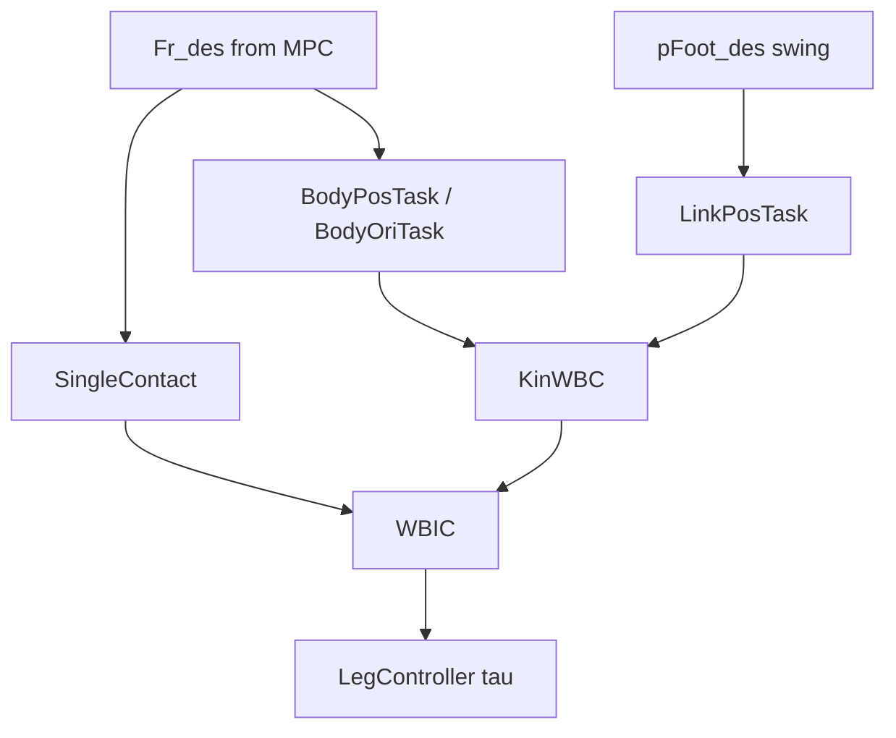

# 06 — 全身控制 (WBC / WBIC)

## 1. 模块边界

```
user/MIT_Controller/Controllers/WBC/
├── WBC.hpp              # 抽象基类
├── Task.hpp             # 任务抽象
├── ContactSpec.hpp      # 接触抽象
└── WBIC/
    ├── KinWBC.hpp/.cpp  # 运动学 WBC
    └── WBIC.hpp/.cpp    # 动力学 WBIC + QP

user/MIT_Controller/Controllers/WBC_Ctrl/
├── WBC_Ctrl.hpp/.cpp    # 运行时管线
├── LocomotionCtrl/      # Locomotion 专用配置
├── TaskSet/             # 具体 Task 实现
└── ContactSet/          # 具体 Contact 实现
```

**用途**：`FSM_State_BalanceStand`, `FSM_State_Locomotion`, `FSM_State_Vision` 中跟踪 MPC 质心/足端指令，输出 **关节力矩**。

---

## 2. 控制问题表述

### 2.1 浮动基动力学

$$
H(q)\ddot{q} + C(q,\dot{q})\dot{q} + G(q) = J_c^T F_r + S^T \tau
$$

- $q \in \mathbb{R}^{18}$：6 浮基 + 12 关节  
- $F_r$：接触力（GRF）  
- $\tau$：关节力矩  

### 2.2 任务

每个 Task 定义期望加速度 $\ddot{x}_{des}$ 与 Jacobian $J_t$：

$$
\ddot{x}_{des} = K_p (x_{des} - x) + K_d (\dot{x}_{des} - \dot{x}) + \ddot{x}_{ff}
$$

### 2.3 接触

stance 足：$J_c \ddot{q} + \dot{J}_c \dot{q} = 0$（加速度级非滑移）+ 摩擦不等式约束 GRF。

---

## 3. WBC 基类

| 方法 | 说明 |
|------|------|
| `WBC(num_qdot)` | 构造 |
| `UpdateSetting(A, Ainv, cori, grav, extra)` | 注入 $H, H^{-1}, C\dot{q}, G$ |
| `MakeTorque(cmd, extra)` | 纯虚：计算 $\tau$ |

---

## 4. Task 基类

| 方法 | 说明 |
|------|------|
| `getCommand(op_cmd)` | 期望 $\ddot{x}$ |
| `getTaskJacobian(Jt)` | $J_t$ |
| `getTaskJacobianDotQdot(JtDotQdot)` | $\dot{J}_t \dot{q}$ |
| `UpdateTask(pos_des, vel_des, acc_des)` | 设置目标 |
| `IsTaskSet()` / `UnsetTask()` | 状态 |
| `getDim()` | 任务维数 |
| `getPosError()` / `getDesVel()` / `getDesAcc()` | 误差与期望 |

---

## 5. ContactSpec 基类

| 方法 | 说明 |
|------|------|
| `getContactJacobian(Jc)` | 接触 Jacobian |
| `getJcDotQdot(JcDotQdot)` | 漂移项 |
| `getRFConstraintMtx(Uf)` / `getRFConstraintVec(ieq_vec)` | 摩擦不等式 $U_f F \le \mathbf{ieq}$ |
| `getRFDesired()` / `setRFDesired(Fr_des)` | MPC 力参考 |
| `UpdateContactSpec()` | 更新接触几何 |
| `getDim()` / `getDimRFConstraint()` / `getFzIndex()` | 维数信息 |
| `UnsetContact()` | 清除 |

---

## 6. KinWBC — 运动学层级

### 6.1 算法（null-space 投影）

对任务列表按优先级：

$$
N_{i+1} = N_i (I - J_{t,i\#}^+ J_{t,i\#}), \quad J_{t,i\#} = J_{t,i} N_i
$$

$$
\ddot{q}_{pre} \mathrel{+}= J_{t,i\#}^+ (\ddot{x}_{des,i} - \dot{J}_{t,i}\dot{q} - J_{t,i}\ddot{q}_{pre})
$$

### 6.2 方法

| 方法 | 说明 |
|------|------|
| `KinWBC(num_qdot)` | 构造 |
| `FindConfiguration(curr_config, task_list, contact_list, jpos_cmd, jvel_cmd)` | 输出关节位姿/速度命令 |
| `Ainv_` | 加权逆惯性（public） |

**用途**：生成 **kinematic 参考** 供 WBIC 等式约束。

---

## 7. WBIC — 动力学 + QP

### 7.1 两阶段

1. **接触约束投影**（若有接触）  
   - 构建 $J_c$，加权伪逆 $J_c^\#$  
   - $\ddot{q}_{pre} = J_c^\# (-\dot{J}_c \dot{q})$  
   - $N_{pre} = I - J_c^\# J_c$

2. **任务 null-space 叠加**（同 KinWBC，在 $N_{pre}$ 上）

3. **QP 求 $\delta\ddot{q}_{float}$ 与 $\delta F_r$**  
   - 代价：$\|\delta\ddot{q}_{float}\|_{W_{float}}^2 + \|\delta F_r\|_{W_{rf}}^2$  
   - 等式：$\mathbf{A}_{float}\ddot{q} - \mathbf{S}_v^T\mathbf{J}_c^T F_r = -\mathbf{S}_v^T(\mathbf{H}\ddot{q}_{pre}+\mathbf{C}\dot{q}+\mathbf{G}-\mathbf{J}_c^T F_{des})$  
   - 不等式：$U_f F_r \le u_{ieq}$，$F_r = F_{des} + \delta F_r$

4. **力矩**：$\tau = S(\mathbf{H}\ddot{q} + \mathbf{C}\dot{q} + \mathbf{G} - \mathbf{J}_c^T F_r)$

完整 WBIC 公式见 [13-algorithms-and-formulas.md §8](./13-algorithms-and-formulas.md#8-全身控制-wbic)。

### 7.2 WBIC 方法

| 方法 | 说明 |
|------|------|
| `WBIC(num_qdot, contact_list, task_list)` | 构造 |
| `UpdateSetting(A, Ainv, cori, grav, extra)` | 动力学矩阵 |
| `MakeTorque(cmd, extra)` | 主入口 |

### 7.3 WBIC_ExtraData

| 字段 | 说明 |
|------|------|
| `_opt_result` | QP 结果码 |
| `_qddot` | 广义加速度 |
| `_Fr` | 接触力 |
| `_W_floating`, `_W_rf` | 权重 |

---

## 8. WBC_Ctrl 管线

| 方法 | 说明 |
|------|------|
| `WBC_Ctrl(FloatingBaseModel model)` | 持有 model 副本 |
| `run(input, data)` | 主循环 |
| `setFloatingBaseWeight(weight)` | 浮基任务权重 |

**run 流程**（`WBC_Ctrl.cpp`）：
```
_UpdateModel(stateEstimate, legData)   // FK, massMatrix, coriolis, gravity
_ContactTaskUpdate(input, data)        // 虚函数：LocomotionCtrl 配置 Task/Contact
_ComputeWBC()                          // KinWBC::FindConfiguration + WBIC::MakeTorque
_UpdateLegCMD(data)                    // tauFeedForward, qDes, qdDes, kp/kdJoint
```

**Protected 方法**（子类可依赖）：

| 方法 | 说明 |
|------|------|
| `_UpdateModel(seResult, legData)` | 组装 `_full_config`，更新 `_A,_Ainv,_coriolis,_grav` |
| `_ContactTaskUpdate(input, data)` | **虚函数**，LocomotionCtrl 实现 |
| `_ComputeWBC()` | KinWBC + WBIC |
| `_UpdateLegCMD(data)` | 写入 LegController |

默认关节 PD：Kp=5, Kd=1.5；WBIC 权重 `_W_floating=0.1`, `_W_rf=1.0`。

---

## 9. LocomotionCtrl

| 方法 | 说明 |
|------|------|
| `LocomotionCtrl(model)` | 构造 |
| `run(input, data)` | 继承 `WBC_Ctrl::run` |

### LocomotionCtrlData 输入

`pBody_des`, `vBody_des`, `aBody_des`, `pBody_RPY_des`, `vBody_Ori_des`,  
`pFoot_des[4]`, `vFoot_des[4]`, `aFoot_des[4]`, `Fr_des[4]`, `contact_state`

### 运行时 Task/Contact 配置

| 条件 | 使用 |
|------|------|
| 始终 | `BodyOriTask`, `BodyPosTask` |
| stance 腿 | `SingleContact` + `setRFDesired(Fr_des)` |
| swing 腿 | `LinkPosTask`（跟踪 pFoot_des） |

---

## 10. TaskSet 完整列表

| 类 | 维数 | 控制量 | 增益成员 |
|----|------|--------|----------|
| `BodyPosTask` | 3 | 质心位置 | `_Kp_kin, _Kp, _Kd` |
| `BodyOriTask` | 3 | 质心姿态 | 同上 |
| `BodyPostureTask` | 6 | 位姿组合 | `_Kp, _Kd` |
| `BodyRyRzTask` | 2 | pitch/yaw | `_Kp_kin, _Kp, _Kd` |
| `JPosTask` | 12 | 关节角 | `_Kp, _Kd` |
| `LinkPosTask` | 3 | 连杆点位置 | `_Kp, _Kd, _Kp_kin` |
| `LocalPosTask` | 3 | 局部系点 | `_Kp_kin, _Kp, _Kd` |
| `LocalHeadPosTask` | 3 | 头部位 | 同上 |
| `LocalTailPosTask` | 3 | 尾部位 | 同上 |
| `LocalRollTask` | 1 | roll | `_Kp_kin, _Kp, _Kd` |

每个 Task：**构造函数** `(FloatingBaseModel*)`，继承全部 `Task` 虚方法。

---

## 11. ContactSet

| 类 | 说明 |
|----|------|
| `SingleContact` | 单点接触，`SingleContact(model, contact_pt)`, `setMaxFz(max_fz)` |
| `FixedBodyContact` | 固定体接触（特殊场景） |

---

## 12. 与 BalanceController 对比

| | BalanceController | WBIC |
|---|-------------------|------|
| 动力学 | 质心简化 | 全阶 H(q) |
| 输出 | 仅 GRF | GRF + τ |
| 计算量 | 低 | 高 |
| FSM | BalanceStand（可单独） | BalanceStand + Locomotion |

---

## 13. 示意图



---

上一章：[05-vision-mpc-and-sparse-cmpc.md](./05-vision-mpc-and-sparse-cmpc.md)  
下一章：[07-balance-controller.md](./07-balance-controller.md)
