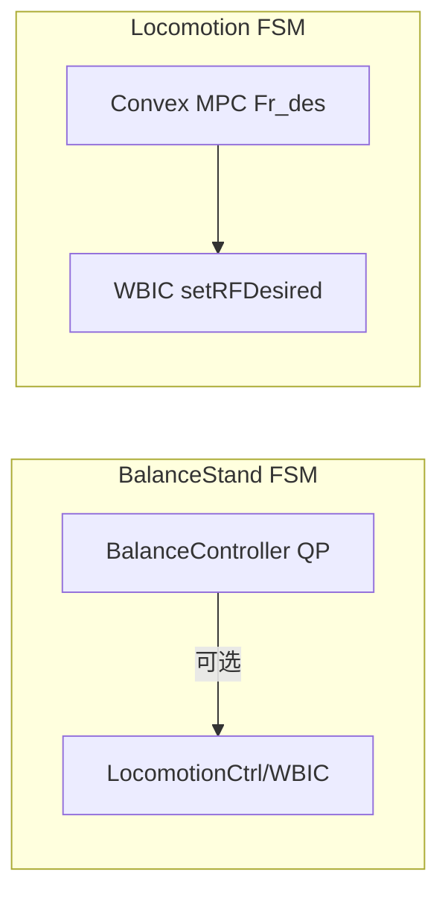

# 07 — 平衡控制器 (BalanceController)

## 1. 模块边界

```
user/MIT_Controller/Controllers/BalanceController/
├── BalanceController.hpp/.cpp       # 主 QP 平衡
├── BalanceControllerVBL.hpp/.cpp    # LQR 权重变体
├── BalanceControllerWrapper.h/.cpp  # C API（MATLAB/legacy）
├── ReferenceGRF.hpp/.cpp            # 参考 GRF 分配
└── ReferenceGRF.hpp
```

**用途**：`FSM_State_BalanceStand` 站立平衡；历史上亦为 WBC 提供 GRF 参考。

---

## 2. 问题 formulation

### 2.1 是什么

在 **固定接触** 下求四足 GRF，使质心 **位置/姿态 PD 误差** 产生的期望 wrench 被满足，同时满足 **摩擦锥** 与 **力界**。

### 2.2 变量

\(\mathbf{x}_{opt} \in \mathbb{R}^{12}\)：4 足 × 3D 力

### 2.3 约束（每足 5 个，共 20）

- 摩擦金字塔：\(f_x \le \mu f_z\), \(-f_x \le \mu f_z\), 同理 \(f_y\)  
- 法向：\(f_z \ge f_{min}\)（接触时）或 \(f=0\)（摆动）  
- 上界：\(\|f\| \le f_{max}\)

---

## 3. BalanceController

### 3.1 方法完整列表

| 方法 | 说明 |
|------|------|
| `BalanceController()` / `~BalanceController()` | 构造/析构 |
| `testFunction()` | 内部测试 |
| `updateProblemData(xfb, p_feet, p_des, p_act, v_des, v_act, O_err, yaw_act)` | 填充当前状态与误差 |
| `SetContactData(contact_state, min_forces, max_forces)` | 接触与力界 |
| `solveQP(xOpt)` | 线程安全 QP |
| `solveQP_nonThreaded(xOpt)` | 非线程 QP |
| `set_desiredTrajectoryData(rpy_des, p_des, omegab_des, v_des)` | 期望轨迹 |
| `set_PDgains(Kp_COM, Kd_COM, Kp_Base, Kd_Base)` | COM/Base PD |
| `set_QP_options(use_hard_constraint_pitch_in)` | pitch 硬约束选项 |
| `set_RobotLimits()` | 默认机器人限制 |
| `set_worldData()` | 世界系数据 |
| `set_PDgains()` | 默认 PD |
| `set_wrench_weights(COM_weights, Base_weights)` | wrench 权重 |
| `set_QPWeights()` | 组装 QP 权重 |
| `set_friction(mu)` | 摩擦 μ |
| `set_alpha_control(alpha)` | 控制正则 |
| `set_mass(mass)` | 质量 |
| `set_desired_swing_pos(pFeet_des)` | 摆动足期望位置 |
| `set_actual_swing_pos(pFeet_act)` | 摆动足实际位置 |
| `print_QPData()` | 调试 |
| `verifyModel(vbd_command)` | 模型验证 |
| `set_base_support_flag(sflag)` | 支撑标志 |
| `publish_data_lcm()` | LCM 发布 |

### 3.2 updateProblemData 含义

- `xfb`：浮基状态向量（位置、姿态、速度等 packed）  
- `p_feet`：四足位置  
- `O_err`：姿态误差  
- 内部计算 **期望 wrench** \(\mathbf{w}_{des} = [F_{com}; \tau_{base}]\) via PD

### 3.3 QP 目标（Focchi 质心 wrench 跟踪）

**PD 阶段**（yaw 系）：由位置/姿态误差得期望线加速度 \(\ddot{x}_{des}\) 与角加速度 \(\dot{\omega}_{des}\)。

**Wrench 平衡等式**：\(A f = b\)，其中 \(b = [m(\ddot{x}_{des}+g);\ I\dot{\omega}_{des}]\)，\(A\) 堆叠四足力与力臂。

**QP**：
\[
\min_f \ (Af-b)^T S (Af-b) + \alpha \|f - f_{prev}\|^2
\]
约束同 MPC 摩擦金字塔（12 变量，20 不等式）。求解器：`qpOASES QProblem(12,20)`，`nWSR=100`。

---

## 4. BalanceControllerVBL

**VBL**：变体含 **LQR 风格状态权重** 与 **参考 GRF** 跟踪。

### 4.1 额外/差异 API

| 方法 | 说明 |
|------|------|
| `updateProblemData(xfb, p_feet, p_feet_desired, rpy_des, rpy_act)` | 简化输入 |
| `SetContactData(..., threshold, stance_legs)` | 含 stance 腿数 |
| `set_reference_GRF(f_ref)` | MPC/WBC 力参考 |
| `set_LQR_weights(x, xdot, R, omega, alpha, beta)` | LQR 权重 |
| `set_inertia(Ixx, Iyy, Izz)` | 对角惯性 |

Public: `xOpt_combined`

---

## 5. ReferenceGRF

专门 QP：**仅分配参考 GRF**，满足接触与摩擦，跟踪期望 COM 位置相关的力分布。

| 方法 | 说明 |
|------|------|
| `ReferenceGRF()` / `~ReferenceGRF()` | 构造 |
| `updateProblemData(p_feet_desired, p_des)` | 更新 |
| `SetContactData(...)` | 接触 |
| `solveQP_nonThreaded(xOpt)` | 求解 |
| `set_RobotLimits()` / `set_worldData()` / `set_QPWeights()` | 配置 |
| `set_mass(mass)` / `set_alpha_control(alpha)` | 参数 |

---

## 6. BalanceControllerWrapper C API

供外部/MATLAB 调用：

| 函数 | 说明 |
|------|------|
| `balanceControl_init()` | 初始化 |
| `balanceControl_set_desiredTrajectoryData(...)` | 期望 |
| `balanceControl_set_desired_swing_pos(...)` | 摆动足 des |
| `balanceControl_set_actual_swing_pos(...)` | 摆动足 act |
| `balanceControl_set_PDgains(...)` | PD |
| `balanceControl_set_wrench_weights(...)` | 权重 |
| `balanceControl_set_QP_options(...)` | 选项 |
| `balanceControl_updateProblemData(xfb, pFeet, yaw)` | 更新 |
| `balanceControl_SetContactData(...)` | 接触 |
| `balanceControl_solveQP_nonThreaded()` | 求解 |
| `balanceControl_set_friction(mu)` | μ |
| `balanceControl_set_alpha_control(alpha)` | α |
| `balanceControl_set_mass(mass)` | 质量 |
| `balanceControl_publish_data_lcm()` | LCM |
| `balanceControl_get_fOpt_matlab(index)` | 读力 |
| `bcPrint()` | 打印 |

---

## 7. 与 WBC 分工



Locomotion 路径 **MPC 直接给 Fr_des**，BalanceController 主要用于 **静态站立** 或不使用 MPC 的场景。

---

## 8. 参数（RobotControlParameters）

- `kpCOM`, `kdCOM`, `kpBase`, `kdBase`  
- `stand_kp_cartesian`, `stand_kd_cartesian`

---

上一章：[06-whole-body-control.md](./06-whole-body-control.md)  
下一章：[08-fsm-and-mit-controller.md](./08-fsm-and-mit-controller.md)
