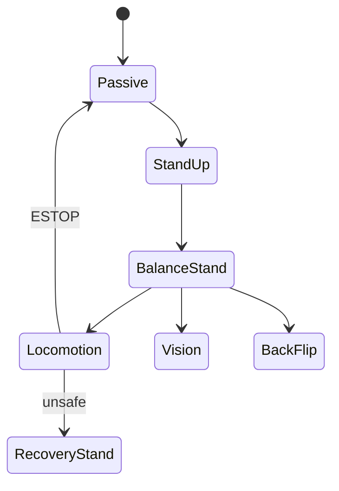

# 08 — FSM 与 MIT_Controller

## 1. 模块边界

```
user/MIT_Controller/
├── MIT_Controller.hpp/.cpp    # 主控制器入口
├── MIT_UserParameters.h       # 用户可调参数
├── main.cpp                   # main_helper 入口
└── FSM_States/
    ├── ControlFSM.h/.cpp      # 状态机引擎
    ├── ControlFSMData.h       # 共享数据
    ├── FSM_State.h/.cpp       # 状态基类
    ├── SafetyChecker.h/.cpp   # 安全检查
    ├── TransitionData.h       # 过渡数据
    └── FSM_State_*.h/.cpp     # 11 个具体状态
```

---

## 2. MIT_Controller 主流程

### 2.1 类 API

| 方法 | 说明 |
|------|------|
| `MIT_Controller()` / `~MIT_Controller()` | 构造/析构 |
| `initializeController()` | 创建 GaitScheduler + ControlFSM |
| `runController()` | 每 tick：gait → desired state → FSM |
| `updateVisualization()` | 可视化 |
| `getUserControlParameters()` | 返回 `MIT_UserParameters*` |
| `Estop()` | 调用 `_controlFSM->initialize()` → PASSIVE |

### 2.2 initializeController

```cpp
_gaitScheduler = new GaitScheduler<float>(userParameters, controller_dt);
_controlFSM = new ControlFSM<float>(quadruped, stateEstimator, legController,
    gaitScheduler, desiredStateCommand, controlParameters, visualizationData, userParameters);
// 初始状态 PASSIVE
```

### 2.3 runController

```cpp
_gaitScheduler->step();
_desiredStateCommand->convertToStateCommands();
_controlFSM->runFSM();
```

---

## 3. ControlFSM

### 3.1 操作模式 FSM_OperatingMode

| 模式 | 含义 |
|------|------|
| `NORMAL` | 当前状态 `run()` |
| `TRANSITIONING` | 执行 `transition()` |
| `ESTOP` | 强制 PASSIVE |
| `EDAMP` | 紧急阻尼（预留） |

### 3.2 方法

| 方法 | 说明 |
|------|------|
| `ControlFSM(...)` | 构造所有状态实例 |
| `initialize()` | 进入 PASSIVE |
| `runFSM()` | 主循环 |
| `safetyPreCheck()` | 姿态检查 → ESTOP |
| `safetyPostCheck()` | 足端/力 clamp |
| `getNextState(FSM_StateName)` | 状态查找 |
| `printInfo(opt)` | 调试 |

Public: `data`, `statesList`, `currentState`, `nextState`, `nextStateName`, `safetyChecker`, `transitionData`

### 3.3 runFSM 逻辑

```
if use_rc: map RC_mode → control_mode
safetyPreCheck → ESTOP?
switch operatingMode:
  NORMAL: checkTransition → TRANSITIONING or run()
  TRANSITIONING: transition() → done → onExit/onEnter
  ESTOP: force PASSIVE
safetyPostCheck()
```

---

## 4. FSM_StateName 与控制模式 ID

| 状态 | 枚举 | control_mode ID |
|------|------|-----------------|
| PASSIVE | `PASSIVE` | 0 |
| STAND_UP | `STAND_UP` | 1 |
| BALANCE_STAND | `BALANCE_STAND` | 3 |
| LOCOMOTION | `LOCOMOTION` | 4 |
| LOCOMOTION_TEST | — | 5 |
| RECOVERY_STAND | `RECOVERY_STAND` | 6 |
| VISION | `VISION` | 8 |
| BACKFLIP | `BACKFLIP` | 9 |
| FRONTJUMP | `FRONTJUMP` | 11 |
| JOINT_PD | `JOINT_PD` | 51 |
| IMPEDANCE_CONTROL | `IMPEDANCE_CONTROL` | 52 |

---

## 5. FSM_State 基类

### 5.1 生命周期（纯虚）

| 方法 | 说明 |
|------|------|
| `onEnter()` | 进入状态 |
| `run()` | 每周期控制 |
| `checkTransition()` | 检查是否切换 |
| `transition()` | 混合/插值过渡 |
| `onExit()` | 离开状态 |

### 5.2 辅助控制

| 方法 | 说明 |
|------|------|
| `jointPDControl(leg, qDes, qdDes)` | 单腿关节 PD |
| `cartesianImpedanceControl(leg, pDes, vDes, kp, kd)` | 笛卡尔阻抗 |
| `footstepHeuristicPlacement(leg)` | 启发式落足 |
| `runControls()` | 通用控制入口 |
| `runBalanceController()` | 调 Balance QP |
| `turnOnAllSafetyChecks()` / `turnOffAllSafetyChecks()` | 安全标志 |

### 5.3 未实现声明

`runWholeBodyController()`, `runConvexModelPredictiveController()`, `runRegularizedPredictiveController()` — **无 .cpp 实现**；各状态直接实例化控制器。

### 5.4 安全标志

`checkSafeOrientation`, `checkPDesFoot`, `checkForceFeedForward`, `checkLegSingularity`（后者无 checker 实现）

---

## 6. 各状态详细说明

每个具体状态 public API：`Constructor`, `onEnter`, `run`, `checkTransition`, `transition`, `onExit`；部分含 `testTransition()`。

### 6.1 FSM_State_Passive

| 方法 | 行为 |
|------|------|
| `onEnter()` | 清零 leg 命令 |
| `run()` | 零力矩或低增益；腿 disabled |
| `checkTransition()` | control_mode → JointPD / StandUp / Recovery |
| `testTransition()` | 调试转移 |

### 6.2 FSM_State_JointPD

| 方法 | 行为 |
|------|------|
| `run()` | `jointPDControl` 到固定 `stand_jpos` |
| `transitionDuration` | 1.0 s 插值 |

### 6.3 FSM_State_ImpedanceControl

| 方法 | 行为 |
|------|------|
| `run()` | `cartesianImpedanceControl` 跟踪足端位置 |

### 6.4 FSM_State_StandUp

| 方法 | 行为 |
|------|------|
| `run()` | 多阶段关节角插值：趴下 → 蹲姿 → 站立准备 |
| `checkTransition()` | 完成后可转 BALANCE / LOCOMOTION / VISION |

### 6.5 FSM_State_BalanceStand

| 方法 | 行为 |
|------|------|
| `run()` | `LocomotionCtrl` + 零速度期望；或 `BalanceController`（legacy 路径） |
| `checkTransition()` | → LOCOMOTION, VISION, BACKFLIP, RECOVERY, PASSIVE |

### 6.6 FSM_State_Locomotion

| 成员/方法 | 说明 |
|-----------|------|
| `cMPCOld` | `ConvexMPCLocomotion*` |
| `_wbc_ctrl` | `LocomotionCtrl*` |
| `_wbc_data` | `LocomotionCtrlData*` |
| `LocomotionControlStep()` | MPC → 可选 WBC → LegController |
| `locomotionSafe()` | roll/pitch < 40°、足端 z<0、|y|<0.18m、|v|<9 m/s |
| `StanceLegImpedanceControl(leg)` | 声明的 stance 阻抗（当前 run 路径未调用） |

**LocomotionControlStep 流程**：

```
cMPCOld->run(data)                    // GRF + 足端/体参考
if use_wbc > 0.9:
  填充 LocomotionCtrlData ← MPC 输出
  _wbc_ctrl->run(_wbc_data, data)     // KinWBC + WBIC
恢复部分 vDes/kdCartesian 备份
```

MPC 更新频率：Mini `27/(1000*dt)` iter；C3 `33/(1000*dt)` iter。

### 6.7 FSM_State_Vision

| 方法 | 行为 |
|------|------|
| `run()` | `VisionMPCLocomotion` + LCM 高度图/可通行性 + WBC |
| LCM | `local_heightmap`, `traversability`, `velocity_cmd` |

### 6.8 FSM_State_RecoveryStand

| 方法 | 行为 |
|------|------|
| `run()` | 分阶段恢复序列（翻身、收腿、站起） |
| `testTransition()` | 调试 |

### 6.9 FSM_State_BackFlip / FrontJump

| 方法 | 行为 |
|------|------|
| `_Initialization()` | 6 tick 稳定 |
| `ComputeCommand()` | DataReadCtrl 状态机 |
| `run()` | BackFlipCtrl / FrontJumpCtrl → LegController |
| `checkTransition()` | 完成 → BALANCE / LOCOMOTION / RECOVERY |

**注意**：构造函数中 `stateName` 误传 `STAND_UP`（源码已知问题），以 `control_mode=9/11` 为准。

---

## 7. 转移矩阵（摘要）

| From | 常见目标 |
|------|----------|
| PASSIVE | JOINT_PD, STAND_UP, RECOVERY |
| STAND_UP | BALANCE, LOCOMOTION, VISION, PASSIVE |
| BALANCE | LOCOMOTION, VISION, RECOVERY, BACKFLIP, PASSIVE |
| LOCOMOTION | *需 locomotionSafe()* → BALANCE/RECOVERY/VISION/PASSIVE；unsafe → 强制 RECOVERY |
| RECOVERY | 多数状态 |
| BACKFLIP/FRONTJUMP | BALANCE, LOCOMOTION, RECOVERY, PASSIVE |

**RC 覆盖**（`use_rc`）：
- `RECOVERY_STAND` → mode 6  
- `LOCOMOTION` → mode 4  
- `QP_STAND` → mode 3  
- `VISION` → mode 8  
- `BACKFLIP` / `BACKFLIP_PRE` → mode 9  

---

## 8. TransitionData

| 方法/字段 | 说明 |
|-----------|------|
| `zero()` | 清零 |
| `done` | 过渡完成 |
| `t0`, `tCurrent`, `tDuration` | 时间 |
| `comState0`, `qJoints0`, `pFoot0` | 起始 |
| `comState`, `qJoints`, `pFoot` | 当前插值 |

---

## 9. SafetyChecker

| 方法 | 条件 |
|------|------|
| `checkSafeOrientation()` | \(\|roll\|, \|pitch\| < 0.5\) rad |
| `checkPDesFoot()` | clamp `pDes` 到 kinematic 可达范围 |
| `checkForceFeedForward()` | GRF clamp：Mini 350N，C3 1800N |

**Pre-check**：姿态（Recovery 状态跳过）  
**Post-check**：足端与力（按状态 flags）

---

## 10. ControlFSMData

聚合指针：`quadruped`, `_legController`, `_stateEstimator`, `_gaitScheduler`, `_desiredStateCommand`, `controlParameters`, `userParameters`, `_visualizationData`, `command`, `_rci` 等 — 供所有 FSM 状态只读/读写。

---

## 11. 典型仿真操作序列

```bash
./sim/sim                    # Mini Cheetah + Simulator → Start
./user/MIT_Controller/mit_ctrl m s
# GUI control mode: 10 → 1 → 4
# 10: 准备, 1: STAND_UP, 4: LOCOMOTION
```

---

## 12. 状态-算法关系图



---

上一章：[07-balance-controller.md](./07-balance-controller.md)  
下一章：[09-acrobatics-backflip.md](./09-acrobatics-backflip.md)
