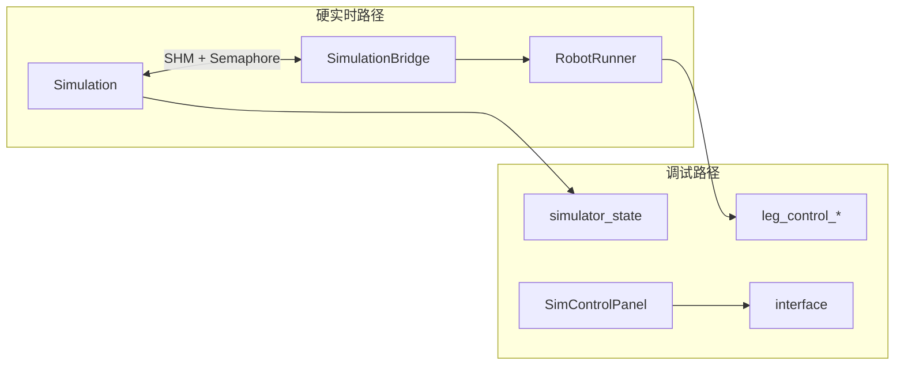

# 10 — 运行时、仿真与通信

## 1. 模块边界

| 目录 | 内容 |
|------|------|
| `robot/` | RobotRunner, HardwareBridge, SimulationBridge, RT |
| `sim/` | Simulation, SimControlPanel, Graphics3D |
| `lcm-types/` | LCM 消息定义 |
| `config/` | YAML 默认参数 |

---

## 2. RobotController 抽象

用户控制器基类（`robot/include/RobotController.h`）：

| 方法 | 说明 |
|------|------|
| `initializeController()` | 纯虚：初始化 |
| `runController()` | 纯虚：每 tick 控制 |
| `updateVisualization()` | 纯虚：调试几何 |
| `getUserControlParameters()` | 纯虚：用户参数或 nullptr |
| `Estop()` | 可选急停 |

**Protected 资源**（由 RobotRunner 注入）：

| 成员 | 说明 |
|------|------|
| `_quadruped` | 机器人常数 |
| `_model` | FloatingBaseModel |
| `_legController` | 腿接口 |
| `_stateEstimator` | 估计容器 |
| `_stateEstimate` | 估计结果引用 |
| `_driverCommand` | Gamepad |
| `_controlParameters` | 机器人参数 |
| `_visualizationData` | 可视化 |
| `_robotType` | MINI_CHEETAH / CHEETAH_3 |

---

## 3. RobotRunner

### 3.1 方法

| 方法 | 说明 |
|------|------|
| `init()` | 建模型、LegController、Estimator、DesiredStateCommand |
| `run()` | **主控制循环** |
| `setupStep()` | 读传感器、RC |
| `finalizeStep()` | 写命令、LCM |
| `initializeStateEstimator()` | 配置估计器链 |

### 3.2 run() 顺序

```
1. _stateEstimator->run()
2. setupStep()
3. [startup] leg disable windows
4. if ESTOP: edamp; else JPosInitializer or user runController()
5. updateVisualization()
6. finalizeStep()
```

### 3.3 硬件数据路径

| 平台 | setupStep 读 | finalizeStep 写 |
|------|--------------|-----------------|
| Mini Cheetah | `SpiData` | `SpiCommand` |
| Cheetah 3 | `TiBoardData[4]` | `TiBoardCommand[4]` |

---

## 4. HardwareBridge（真机 Linux）

### 4.1 类层次

- `HardwareBridge` — 公共 LCM、参数、RC  
- `MiniCheetahHardwareBridge` — SPI + Microstrain  
- `Cheetah3HardwareBridge` — EtherCAT + VectorNav  

### 4.2 实时设置

```cpp
prefaultStack();                    // 触摸栈页
mlockall(MCL_CURRENT | MCL_FUTURE); // 锁内存
setupScheduler();                   // SCHED_FIFO priority 49
```

### 4.3 Mini Cheetah 周期任务

| 任务 | 周期 | 函数 |
|------|------|------|
| SPI | 2 ms | `runSpi()` |
| Control | controller_dt | `RobotRunner::run()` |
| Viz LCM | ~16.7 ms | `publishVisualizationLCM()` |
| SBUS RC | 5 ms | `run_sbus()` |
| Microstrain | 1 ms | `logMicrostrain()` |

### 4.4 Cheetah 3

- EtherCAT 1 ms `runEcat()`  
- Control @ `controller_dt`  
- SBUS 当前代码中禁用  

### 4.5 RT 接口

| 模块 | API |
|------|-----|
| `rt_spi` | `init_spi()`, `spi_driver_run()` |
| `rt_ethercat` | `rt_ethercat_init/run()`, `get_data/set_command` |
| `rt_rc_interface` | `get_rc_control_settings()`, `RC_mode::*` |
| `rt_sbus` | `init_sbus()`, `receive_sbus()` |
| `rt_vectornav` | `init_vectornav()` |

---

## 5. SimulationBridge

| 方法 | 说明 |
|------|------|
| `run()` | 主循环 |
| `runRobotControl()` | 单次控制 |
| `handleControlParameters()` | 参数同步 |

**共享内存名**：`DEVELOPMENT_SIMULATOR_SHARED_MEMORY_NAME`

**模式** `SimulatorMode`：
- `RUN_CONTROLLER` — 正常闭环  
- `RUN_CONTROL_PARAMETERS` — 仅调参  
- `DO_NOTHING` — 空转  
- `EXIT` — 退出  

**握手**：`waitForSimulator()` → 控制 → `robotIsDone()`

---

## 6. Simulation（sim/）

### 6.1 多速率时钟

| 参数 | 典型用途 |
|------|----------|
| `dynamics_dt` | ABA + 接触积分 |
| `low_level_dt` | Spine/TI 板 PD |
| `high_level_dt` | 用户控制器 |

### 6.2 关键方法

| 方法 | 说明 |
|------|------|
| `step()` | 单步仿真 |
| `lowLevelControl()` | 电机 PD + 力矩 |
| `highLevelControl()` | 共享内存 ↔ 控制器 |
| `firstRun()` | 等待控制器连接 |
| `runAtSpeed()` | 实时/加速仿真主循环 |
| `sendControlParameter()` | 推送 YAML 参数 |

### 6.3 可视化

- **绿色**：仿真真值  
- **灰色/红色**：控制器估计（`mainCheetahVisualization`）  
- 快捷键：`t` 全速，`space` 自由相机  

### 6.4 SimControlPanel 三栏

| 栏 | YAML | 内容 |
|----|------|------|
| 左 | simulator-defaults | 仿真速度、弹簧阻尼等 |
| 中 | mini-cheetah-defaults | cheater_mode, controller_dt |
| 右 | user params | MIT_UserParameters 等 |

---

## 7. 入口 main_helper

```bash
./user/MIT_Controller/mit_ctrl [3|m] [s|r] [f]
# f: 从文件加载 robot 参数（真机）
```

---

## 8. LCM 类型（active）

| 类型 | 通道 | 方向 |
|------|------|------|
| `leg_control_command_lcmt` | leg_control_command | Robot→Log |
| `leg_control_data_lcmt` | leg_control_data | Robot→Log |
| `state_estimator_lcmt` | state_estimator | Robot→Log |
| `simulator_lcmt` | simulator_state | Sim→Log |
| `gamepad_lcmt` | interface | Sim→Robot |
| `control_parameter_request/response` | interface_request/response | 双向 |
| `cheetah_visualization_lcmt` | main_cheetah_visualization | Robot→Sim |
| `spi_*` / `ecat_*` | 硬件 debug | HW→Log |
| Vision | local_heightmap, traversability | Perception→Controller |

生成：`scripts/make_types.sh`

---

## 9. 共享内存 vs LCM



---

## 13. 低层板卡仿真（SimUtilities）

### 13.1 SpineBoard（Mini Cheetah）

**路径**：`common/include/SimUtilities/SpineBoard.h`

| 结构/类 | 方法/字段 |
|---------|-----------|
| `SpiCommand` | q/qd/kp/kd/tau 分 abad/hip/knee ×4，`flags[4]` |
| `SpiData` | 关节反馈 q/qd，`spi_driver_status` |
| `SpineBoard::init(side_sign, board)` | 初始化板号与左右符号 |
| `SpineBoard::run()` | 执行 onboard 关节 PD + 力矩限幅 + soft stop |
| `SpineBoard::resetData()` / `resetCommand()` | 复位 |
| `torque_out[3]` | 当前输出力矩 |

限幅：`max_torque` {17,17,26} Nm；关节限位 `q_limit_p/n`。

### 13.2 TI_BoardControl（Cheetah 3）

**路径**：`common/include/SimUtilities/ti_boardcontrol.h`

| 结构/类 | 方法/字段 |
|---------|-----------|
| `TiBoardCommand` | 笛卡尔 + 关节双路：position/velocity/kp/kd/force_ff/tau_ff |
| `TiBoardData` | position, velocity, force, q, dq, tau |
| `TI_BoardControl::init(side_sign)` | 初始化 |
| `TI_BoardControl::run_ti_board_iteration()` | 笛卡尔阻抗 + 运动学 |
| `set_link_lengths(l1,l2,l3)` | 连杆长度 |
| `reset_ti_board_data/command()` | 复位 |

**为什么两套接口**：Mini 仅关节 PD；C3 TI 板支持 **笛卡尔阻抗**，与 `LegController` 的 `pDes/kpCartesian` 对应。

### 13.3 VisualizationData

`RobotRunner` 注入 `visualizationData`；`StateEstimatorContainer::run(viz)` 更新估计机位姿供 Sim 灰色机器人显示。

---

## 14. JPosInitializer

机器人启动时 **B-spline 插值** 将腿移到安全初始 pose，避免猛冲；完成后才调用用户 `runController()`。

---

## 15. 编写自定义控制器清单

1. 在 `user/YourCtrl/` 创建类继承 `RobotController`  
2. 添加到 `user/CMakeLists.txt`  
3. 实现 `initializeController`, `runController`, `updateVisualization`, `getUserControlParameters`  
4. `main.cpp` 调用 `main_helper(argc, argv, new YourCtrl())`  
5. 仿真验证：`./your_ctrl m s`  

---

## 16. 真机部署（Mini Cheetah 摘要）

```bash
mkdir mc-build && cd mc-build
cmake -DMINI_CHEETAH_BUILD=TRUE .. && make -j
../scripts/send_to_mini_cheetah.sh
ssh user@10.0.0.34
cd robot-software-* && ./run_mc.sh
```

详见 `documentation/running_mini_cheetah.md`。

---

上一章：[09-acrobatics-backflip.md](./09-acrobatics-backflip.md)  
下一章：[11-math-collision-utilities.md](./11-math-collision-utilities.md)
