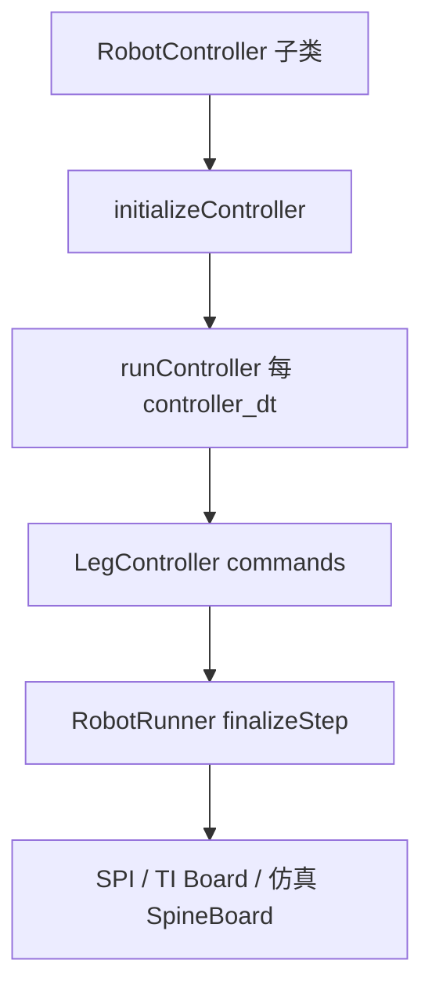

# 12 — 用户参数与示例控制器

## 1. 模块边界

| 路径 | 内容 |
|------|------|
| `user/MIT_Controller/MIT_UserParameters.h` | MIT 控制器全部可调参数 |
| `config/c3-jpos-user-parameters.yaml` 等 | 参数默认值 YAML |
| `user/JPos_Controller/` | 最小关节 PD 示例 |
| `user/Example_Leg_InvDyn/` | 逆动力学前馈示例 |
| `user/MiniCheetahSpi_Controller/` | SPI 直连测试 |

**与主文档关系**：第 04–08 章算法的行为由本章参数驱动；第 10 章说明如何在仿真 GUI 或 YAML 中修改它们。

---

## 2. MIT_UserParameters — 完整参数表

`MIT_UserParameters` 继承 `ControlParameters`，注册名 `"user-parameters"`。所有字段可通过 SimControlPanel 右栏或 `config/*-user-parameters.yaml` 读写。

### 2.1 Convex MPC

| 参数 | 类型 | 作用 |
|------|------|------|
| `cmpc_gait` | double | 步态索引（对应 ConvexMPCLocomotion 内预置 gait） |
| `cmpc_x_drag` | double | 水平速度阻尼项，高速跑稳定 |
| `cmpc_use_sparse` | double | >0.9 时走 SparseCMPC 而非 dense qpOASES |
| `cmpc_bonus_swing` | double | 摆动相额外代价/奖励系数 |

### 2.2 WBC 增益

| 参数 | 类型 | 作用 |
|------|------|------|
| `use_wbc` | double | >0.9 时 Locomotion 启用 LocomotionCtrl/WBIC |
| `Kp_body`, `Kd_body` | Vec3 | BodyPosTask 增益 |
| `Kp_ori`, `Kd_ori` | Vec3 | BodyOriTask 增益 |
| `Kp_foot`, `Kd_foot` | Vec3 | LinkPosTask（摆动腿）增益 |
| `Kp_joint`, `Kd_joint` | Vec3 | JPosTask 关节跟踪增益 |

### 2.3 MPC 状态/控制权重

| 参数 | 类型 | 映射 |
|------|------|------|
| `Q_pos` | Vec3 | 位置跟踪权重 |
| `Q_vel` | Vec3 | 速度跟踪权重 |
| `Q_ori` | Vec3 | 姿态 RPY 权重 |
| `Q_ang` | Vec3 | 角速度权重 |
| `R_control` | double | 控制 effort 正则 |
| `R_prev` | double | 力变化率正则（平滑 GRF） |

### 2.4 求解器

| 参数 | 类型 | 作用 |
|------|------|------|
| `use_jcqp` | double | 1=JCQP，0=qpOASES（dense MPC） |
| `jcqp_max_iter` | double | JCQP 最大迭代 |
| `jcqp_rho`, `jcqp_sigma`, `jcqp_alpha` | double | ADMM/内点参数 |
| `jcqp_terminate` | double | 终止阈值 |

### 2.5 摆动腿

| 参数 | 类型 | 作用 |
|------|------|------|
| `Swing_Kp_cartesian`, `Swing_Kd_cartesian` | Vec3 | 摆动相笛卡尔 PD（MPC 内 FootSwing 后处理） |
| `Swing_Kp_joint`, `Swing_Kd_joint` | Vec3 | 摆动相关节 PD |
| `Swing_step_offset` | Vec3 | 落足点相对 body 偏移 |
| `Swing_traj_height` | double | Bézier 峰值高度 |
| `Swing_use_tau_ff` | double | 是否使用摆腿力矩前馈 |

### 2.6 GaitScheduler

| 参数 | 类型 | 作用 |
|------|------|------|
| `gait_type` | double | GaitType 枚举值 |
| `gait_period_time` | double | 步态周期 (s) |
| `gait_switching_phase` | double | 切换相位 [0,1] |
| `gait_override` | double | 强制覆盖步态库 |
| `gait_max_leg_angle` | double | 最大摆腿角 |
| `gait_max_stance_time` / `gait_min_stance_time` | double | 支撑时间界 |

### 2.7 RPC（Regularized Predictive Controller，预留）

`RPC_*`、`des_*`、`two_leg_orient`、`stance_legs` 等参数在 `FSM_State` 基类中声明了 `runRegularizedPredictiveController()`，**当前无 .cpp 实现**；保留供研究/扩展。

---

## 3. RobotControlParameters 摘要

定义于 `common/include/ControlParameters/RobotParameters.h`，SimControlPanel **中栏**编辑。

| 参数 | 典型值 | 作用 |
|------|--------|------|
| `controller_dt` | 0.001 | 控制周期 (s) |
| `cheater_mode` | 0/1 | 仿真注入真值位姿 |
| `control_mode` | 0–11 | FSM 目标状态 ID |
| `use_rc` | 0/1 | 手柄覆盖 control_mode |
| `imu_process_noise_*` | — | KF 过程噪声 |
| `foot_sensor_noise_*` | — | KF 测量噪声 |
| `stand_kp_cartesian`, `stand_kd_cartesian` | — | 站立阻抗 |
| `kpCOM`, `kdCOM`, `kpBase`, `kdBase` | — | BalanceController PD |

---

## 4. JPos_Controller — 最小可运行示例

### 4.1 目的

演示如何继承 `RobotController`，仅通过关节 PD 驱动四腿，**不依赖 FSM/MPC**。

### 4.2 核心代码

```cpp
void JPos_Controller::runController() {
  for (int leg = 0; leg < 4; leg++) {
    for (int j = 0; j < 3; j++) {
      _legController->commands[leg].qDes[j] =
          0.3f * sinf(_iterations * 0.001f + leg * 0.5f);
      _legController->commands[leg].kpJoint(j, j) = userParams.kp;
      _legController->commands[leg].kdJoint(j, j) = userParams.kd;
    }
  }
  _iterations++;
}
```

### 4.3 运行

```bash
cd build
./user/JPos_Controller/jpos_ctrl m s   # Mini Cheetah 仿真
./user/JPos_Controller/jpos_ctrl 3 s   # Cheetah 3 仿真
```

### 4.4 类 API

| 方法 | 说明 |
|------|------|
| `JPos_Controller()` | 构造 |
| `initializeController()` | 读 user params |
| `runController()` | 正弦关节轨迹 |
| `updateVisualization()` | 空 |
| `getUserControlParameters()` | 返回 `JPosUserParameters*` |

---

## 5. Example_Leg_InvDyn — 逆动力学前馈

### 5.1 目的

用 `FloatingBaseModel::inverseDynamics()` 计算满足期望关节轨迹的力矩，经 `tauFeedForward` 下发，验证动力学链路与 LegController 叠加语义。

### 5.2 算法步骤

1. 从 `StateEstimate` 组装 `FBModelState`（浮基 + 12 关节）
2. 设定期望 `q`, `qd`, `qdd`（如正弦解析导数）
3. `tau = model->inverseDynamics(dState)`
4. 分配到 `_legController->commands[leg].tauFeedForward`

### 5.3 运行

```bash
cd build
./user/Example_Leg_InvDyn/leg_invdyn_ctrl m s
```

---

## 6. 编写自定义控制器检查清单

1. 创建 `user/YourCtrl/`，类继承 `RobotController`
2. 实现四个纯虚函数 + 可选 `Estop()`
3. `main.cpp`：`main_helper(argc, argv, new YourCtrl())`
4. 在 `user/CMakeLists.txt` 添加 target
5. 仿真：`./user/YourCtrl/your_ctrl m s`
6. 需要 FSM 时参考 `MIT_Controller`，仅需周期控制则参考 `JPos_Controller`



---

## 7. 参数调试工作流

1. `./sim/sim` → Start → 连接 `./user/MIT_Controller/mit_ctrl m s`
2. SimControlPanel 右栏修改 `use_wbc`、`cmpc_gait` 等 → Save to file
3. LCM `interface_request/response` 可远程改参（真机）
4. 改 `controller_dt` 或 LCM 类型后需 `cmake .. && make`

---

上一章：[11-math-collision-utilities.md](./11-math-collision-utilities.md)  
下一章：[13-algorithms-and-formulas.md](./13-algorithms-and-formulas.md)  
返回索引：[README.md](./README.md)
