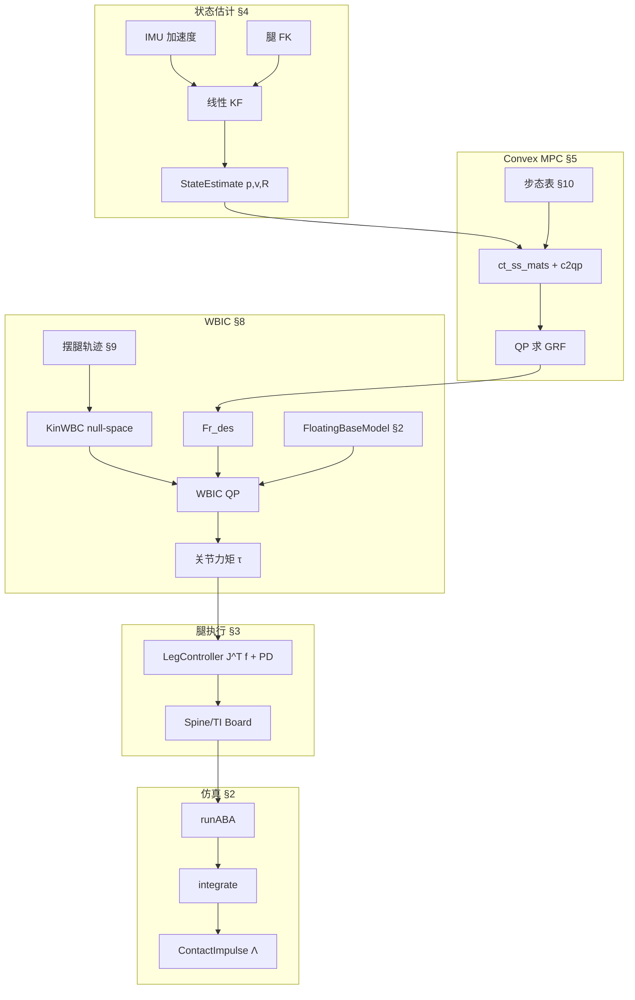

# 13 — 核心算法与数学公式（详解版）

本章对 Cheetah-Software 中每个核心算法给出三层说明：

1. **通俗理解** — 用日常语言说明「在算什么、为什么需要」  
2. **算法原理** — 核心思路与计算流程  
3. **公式推导** — 从物理/数学出发推到源码中的形式  

各节末尾标注 **源码对应**。符号约定见 §1。

---

## 1. 符号约定

| 符号 | 含义 |
|------|------|
| $\mathbf{q} \in \mathbb{R}^{18}$ | 广义坐标：6 浮基 + 12 关节 |
| $\mathbf{f}_i \in \mathbb{R}^3$ | 第 $i$ 足地面反力（世界系） |
| $\mathbf{r}_i$ | 足端相对质心位置（世界系） |
| $m$ | 机器人总质量 |
| $\mathbf{I}_w$ | 世界系惯性张量 |
| $R_{yaw}$ | 仅绕 $z$ 轴的 yaw 旋转矩阵 |
| $\mu$ | 地面摩擦系数 |
| $[\mathbf{v}]_\times$ | 向量 $\mathbf{v}$ 的反对称矩阵，满足 $[\mathbf{v}]_\times \mathbf{u} = \mathbf{v}\times\mathbf{u}$ |

---

## 2. 浮基动力学

**源码**：`FloatingBaseModel.h/.cpp`，`DynamicsSimulator.h`

---

### 2.1 运动方程（共性基础）

#### 通俗理解

把 Cheetah 看成 **18 个自由度** 的机械系统：机身可以在空中自由飘移/旋转（6 DOF），四条腿各 3 个关节（12 DOF）。动力学回答的问题是：**给定各关节力矩和足端接触力，机身和关节会以多快的加速度运动？** 反过来也可以问：**要达到某种加速度，需要多大扭矩？**

#### 算法原理

经典拉格朗日/牛顿形式的多体方程：

$$
\mathbf{H}(\mathbf{q})\ddot{\mathbf{q}} + \mathbf{C}(\mathbf{q}, \dot{\mathbf{q}})\dot{\mathbf{q}} + \mathbf{G}(\mathbf{q}) = \mathbf{J}_c^T \mathbf{F}_r + \mathbf{S}^T \boldsymbol{\tau}
$$

- $\mathbf{H}$：广义质量矩阵（含耦合）  
- $\mathbf{C}\dot{\mathbf{q}}$：科氏/离心力  
- $\mathbf{G}$：重力  
- $\mathbf{J}_c^T \mathbf{F}_r$：接触力映射到广义力  
- $\mathbf{S}^T \boldsymbol{\tau}$：关节力矩（$\mathbf{S}$ 只选 12 个关节自由度）

**朴素做法**是每步组装 $\mathbf{H}$ 再求逆，复杂度 $O(n^3)$。Featherstone 用 **空间向量** 把树形结构上的递推做到 **$O(n)$**，于是有了下面三个经典算法。

| 算法 | 函数 | 问的问题 |
|------|------|----------|
| CRBA | `massMatrix()` | 只要 $\mathbf{H}(\mathbf{q})$ |
| RNEA | `inverseDynamics()` | 已知 $\ddot{\mathbf{q}}$ → 求 $\boldsymbol{\tau}$ |
| ABA | `runABA()` | 已知 $\boldsymbol{\tau}$ → 求 $\ddot{\mathbf{q}}$ |

仿真 `DynamicsSimulator::step()` 每步调用 **ABA**；WBC 逆动力学路径调用 **RNEA**。

#### 公式推导（从牛顿第二定律到广义形式）

对第 $i$ 个连杆，牛顿-欧拉方程（世界系）：

$$
m_i \ddot{\mathbf{c}}_i = \mathbf{f}_i + \sum \text{子连杆力}, \quad
\mathbf{I}_i \dot{\boldsymbol{\omega}}_i + \boldsymbol{\omega}_i \times (\mathbf{I}_i \boldsymbol{\omega}_i) = \boldsymbol{\tau}_i + \cdots
$$

把所有连杆方程通过 **运动学约束**（关节只允许特定方向转动）组装，消去内部约束力，得到关于 $\mathbf{q}$ 的 **18 维** 方程，即上式。$\mathbf{H}$ 的对称正定来自系统动能 $T = \frac{1}{2}\dot{\mathbf{q}}^T \mathbf{H} \dot{\mathbf{q}}$。

---

### 2.2 ABA — 铰接体算法（Articulated Body Algorithm）

#### 通俗理解

**输入**：12 个关节力矩 + 重力 + 足端外力。  
**输出**：机身线/角加速度 + 12 个关节角加速度。

可以把它想象成 **从脚尖往身体「汇总有效质量/惯量」**，再从身体往脚尖 **分配加速度**。之所以快，是因为不需要把 $18\times 18$ 的 $\mathbf{H}$ 整个求逆。

#### 算法原理

ABA 分 **两趟扫描**（见 `FloatingBaseModel::runABA`）：

**第一趟（叶 → 根）**：`updateArticulatedBodies()`  
对每个关节，把子树合并成 **铰接体惯性** $\mathbf{IA}_i$——含义是：「如果在这个关节处剪断，下方整棵子树对外表现的等效 6×6 惯性」。

**第二趟（根 → 叶）**：  
1. 从浮基开始求 $\mathbf{a}_{base}$（含重力 $\mathbf{g}$）  
2. 对每个关节 $i$：已知父连杆加速度 $\mathbf{a}_{parent}$，用 $\tau_i$ 和铰接体参数解出 $\ddot{q}_i$，再向下传递 $\mathbf{a}_i$

中间变量（源码命名）：$\mathbf{IA}$（铰接体惯性）、$\mathbf{U},\ d$（力传播系数）、$\mathbf{pA}$（偏置力）、$\mathbf{u}$（等效关节力）。

#### 公式推导（单自由度关节简化版）

设关节 $i$ 的等效标量惯量 $d_i = \mathbf{S}_i^T \mathbf{IA}_i \mathbf{S}_i$，偏置力项 $p_i$，关节力矩 $\tau_i$，则关节加速度：

$$
\ddot{q}_i = \frac{\tau_i - \mathbf{S}_i^T p_i - \mathbf{U}_i^T \mathbf{a}_{parent}}{d_i}
$$

父连杆感受到的反作用力向上合并到 $\mathbf{pA}_{parent}$。浮基（6 DOF）最终解：

$$
\mathbf{a}_{base} = \mathbf{IA}_5^{-1}\left(\mathbf{u}_{base} - \cdots\right)
$$

源码中 `_invIA5.solve(...)` 即此步。完整 6×6 空间向量形式见 Featherstone, *Rigid Body Dynamics Algorithms*, Algorithm 7.1。

**与 RNEA 的对偶**：RNEA 自叶向根累加 **力**，ABA 自叶向根累加 **惯性**、自根向叶分配 **加速度**；二者共享同一套 $\mathbf{X}_{up}$（空间变换）和 $\mathbf{S}$（运动子空间）。

---

### 2.3 空间惯性矩阵

#### 通俗理解

普通 3×3 惯性张量只描述 **绕质心旋转**。空间 6×6 惯性 **把平移和旋转绑在一起**，这样在连杆坐标系之间变换时，只需一个 6×6 矩阵乘法，不必分开处理质心偏移。

#### 公式推导

设连杆坐标系原点处测得的 6×6 空间惯性为 $\mathcal{I}$，质心偏移 $\mathbf{c}$，质心惯性 $\mathbf{I}_c$，质量 $m$：

$$
\mathcal{I} = \begin{bmatrix}
\mathbf{I}_c + m[\mathbf{c}]_\times[\mathbf{c}]_\times^T & m[\mathbf{c}]_\times \\
m[\mathbf{c}]_\times^T & m\mathbf{I}_3
\end{bmatrix}
$$

其中 $[\mathbf{c}]_\times$ 满足 $[\mathbf{c}]_\times \mathbf{v} = \mathbf{c}\times\mathbf{v}$。  
**源码对应**：`SpatialInertia.h` 构造函数。

---

### 2.4 接触逆惯性（Sequential Impulse）

#### 通俗理解

仿真里足端戳进地面时，不能穿模。需要在 **速度层面** 施加冲量，把法向速度「弹回去」。问题是：推足端 1N，整机加速度多大？取决于 **整机有多「愿意」在这个方向动**——这就是 **逆接触惯性** $\Lambda^{-1}$。

#### 算法原理

接触约束：足端法向速度 $v_n \to 0$（或带恢复系数）。设接触 Jacobian 为 $\mathbf{J}_c$（1×18 或 3×18），单位测试力 $\mathbf{f}$ 产生的广义加速度 $\ddot{\mathbf{q}} = \mathbf{H}^{-1}\mathbf{J}_c^T \mathbf{f}$，则足端沿 $\mathbf{f}$ 方向的 **逆惯性**：

$$
\Lambda^{-1} = \mathbf{J}_c \mathbf{H}^{-1} \mathbf{J}_c^T
$$

冲量更新：$\Delta v = -\Lambda (v_{rel})$。多接触时用 **Projected Gauss-Seidel** 迭代（`ContactImpulse`）。

#### 公式推导

约束 $ \phi = h(\mathbf{q}) \ge 0 $，速度级 $\mathbf{J}_c \dot{\mathbf{q}} \ge 0$。冲量 $\boldsymbol{\lambda}$ 使 $\dot{\mathbf{q}}^+ = \dot{\mathbf{q}}^- + \mathbf{H}^{-1}\mathbf{J}_c^T \boldsymbol{\lambda}$。  
代入约束 $\mathbf{J}_c \dot{\mathbf{q}}^+ = \mathbf{0}$ 得：

$$
\mathbf{J}_c \mathbf{H}^{-1} \mathbf{J}_c^T \boldsymbol{\lambda} = -\mathbf{J}_c \dot{\mathbf{q}}^- \quad \Rightarrow \quad \boldsymbol{\Lambda} = \left(\mathbf{J}_c \mathbf{H}^{-1} \mathbf{J}_c^T\right)^{-1}
$$

**源码对应**：`applyTestForce()` 用 ABA 结构 **$O(n)$** 算 $\Lambda^{-1}$，不显式求 $\mathbf{H}^{-1}$（见 `FloatingBaseModel.cpp` L40–84）。

---

### 2.5 执行器模型

#### 通俗理解

真实电机不是「想要多少扭矩就给多少」：电压有限、反电势随转速升高、减速器摩擦。仿真若不建模，会出现 ** unrealistic 的跳跃/超速**。

#### 算法原理

等效 DC 电机电路：$V = iR + V_{bemf}$，扭矩 $\tau_m = K_T i$。关节侧扭矩经减速比 $N$ 放大，并 clamp 到电池电压与最大扭矩。

#### 公式

$$
\begin{aligned}
V_{bemf} &= \dot{q}_j \cdot N \cdot K_T \cdot 2 \\
i &= \tau_m / (K_T \cdot 1.5) \\
V &= \mathrm{clamp}(i R + V_{bemf}, \pm V_{bat}) \\
\tau_j &= N \cdot \mathrm{clamp}\!\left(\frac{K_T \cdot 1.5 (V - V_{bemf})}{R}, \pm \tau_{max}\right) - d \dot{q}_j - f_c \,\mathrm{sgn}(\dot{q}_j)
\end{aligned}
$$

**源码对应**：`ActuatorModel.h`

---

## 3. 单腿运动学

**源码**：`LegController.cpp` → `computeLegJacobianAndPosition`

---

### 3.1 通俗理解

每条腿 3 个关节（外展 abd、髋 hip、膝 knee），像 **肩-肘-腕** 链。控制器/WBC 需要知道：**关节角 → 足端在哪、关节角速度 → 足端多快**，以及反向 **足端力 → 关节力矩**（$\boldsymbol{\tau} = \mathbf{J}^T \mathbf{f}$）。

### 3.2 算法原理

在 **hip 坐标系**（原点在髋 pivot，轴向与机身对齐）下，用 Denavit-Hartenberg 风格的连杆变换连乘，得到足端位置 $\mathbf{p}(\mathbf{q})$，再对 $\mathbf{q}$ 求偏导得 Jacobian $\mathbf{J}$。

参数：$l_1$ 外展偏置、$l_2$ 大腿、$l_3$ 小腿、$l_4$ 膝 y 向偏置、$s=\pm 1$ 左右腿镜像。

### 3.3 公式推导

记 $c_i=\cos q_i$，$s_i=\sin q_i$，$c_{23}=\cos(q_{hip}+q_{knee})$，$s_{23}=\sin(q_{hip}+q_{knee})$。

**Step 1 — 在 sagittal 平面（暂设 abd=0）**，足端相对髋：

$$
p_x^{2D} = l_2 s_2 + l_3 s_{23}, \quad p_z^{2D} = -(l_2 c_2 + l_3 c_{23})
$$

**Step 2 — 外展旋转** 绕 $x$ 轴（abd），并加 $y$ 向髋宽 $(l_1+l_4)s$：

$$
\begin{aligned}
p_x &= l_3 s_{23} + l_2 s_2 \\
p_y &= (l_1 + l_4)\, s \cos q_{abd} + l_3 s_1 c_{23} + l_2 c_2 s_1 \\
p_z &= (l_1 + l_4)\, s \sin q_{abd} - l_3 c_1 c_{23} - l_2 c_1 c_2
\end{aligned}
$$

**Step 3 — Jacobian**：$\mathbf{J}_{ij} = \partial p_i / \partial q_j$，对上面三式直接求导即得源码中的 3×3 矩阵（见 `LegController.cpp` L284–294）。

**Step 4 — 力矩映射**（虚功原理）：

$$
\delta W = \mathbf{f}^T \delta \mathbf{p} = \mathbf{f}^T \mathbf{J} \delta \mathbf{q} = \boldsymbol{\tau}^T \delta \mathbf{q} \quad \Rightarrow \quad \boldsymbol{\tau} = \mathbf{J}^T \mathbf{f}
$$

**LegController 总命令**：

$$
\boldsymbol{\tau} = \boldsymbol{\tau}_{ff} + \mathbf{J}^T \left(\mathbf{f}_{ff} + \mathbf{K}_p(\mathbf{p}_{des}-\mathbf{p}) + \mathbf{K}_d(\mathbf{v}_{des}-\mathbf{v})\right) + \mathbf{K}_q(\mathbf{q}_{des}-\mathbf{q}) + \mathbf{K}_{\dot{q}}(\dot{\mathbf{q}}_{des}-\dot{\mathbf{q}})
$$

---

## 4. 状态估计 — 线性卡尔曼滤波

**源码**：`PositionVelocityEstimator.cpp`

---

### 4.1 通俗理解

真机 **没有 GPS**。IMU 能测加速度和角速度，但加速度二次积分会 **疯狂漂移**。腿在地上撑住时，足端相对世界 **几乎不动**——这是天然的「零速修正」来源。卡尔曼滤波把 IMU 预测和足端运动学测量 **按可信度加权融合**。

### 4.2 算法原理

维护 18 维状态：机身位置/速度 + 4 个足端世界坐标。  
- **预测**：用 IMU 加速度积分（类似 $p \leftarrow p + v\Delta t$，$v \leftarrow v + a\Delta t$）  
- **更新**：用编码器 FK 算出的「足相对 body 位置/速度」和「足高≈0」修正状态  
- **摆动腿**：足端在动，测量不可信 → 增大噪声（降低 trust）

### 4.3 公式推导

#### 4.3.1 状态与运动模型

连续时间：

$$
\dot{\mathbf{p}}_b = \mathbf{v}_b, \quad \dot{\mathbf{v}}_b = \mathbf{a}_{imu} + \mathbf{g} + \mathbf{w}_v, \quad \dot{\mathbf{p}}_{fi} = \mathbf{w}_{f,i}
$$

足端位置建模为 **随机游走**（实际变化慢，主要靠观测校正）。欧拉离散（步长 $\Delta t$）：

$$
\mathbf{x}_{k+1} = \mathbf{A}\mathbf{x}_k + \mathbf{B}\mathbf{a}_k + \mathbf{w}_k
$$

$$
\mathbf{A} = \begin{bmatrix}
\mathbf{I} & \Delta t \mathbf{I} & \mathbf{0} \\
\mathbf{0} & \mathbf{I} & \mathbf{0} \\
\mathbf{0} & \mathbf{0} & \mathbf{I}_{12}
\end{bmatrix}, \quad
\mathbf{B} = \begin{bmatrix} \mathbf{0} \\ \Delta t \mathbf{I} \\ \mathbf{0} \end{bmatrix}
$$

其中 $\mathbf{a}_k = \mathbf{a}_{world} + \mathbf{g}$（源码 L96：`aWorld + g`）。

#### 4.3.2 观测模型

理想情况下，若 $\mathbf{p}_{fi}$ 为足 $i$ 的世界坐标，$\mathbf{p}_b$ 为 body 世界坐标，则 body 系下足位置：

$$
\mathbf{p}_{rel,i}^{world} = \mathbf{p}_{fi} - \mathbf{p}_b
$$

FK 给出 $\hat{\mathbf{p}}_{rel,i} = R_b^T(\mathbf{p}_{hip,i}+\mathbf{p}_{leg,i})$。定义观测：

$$
\mathbf{y}_{p,i} = \mathbf{p}_b - \mathbf{p}_{fi} \approx -\hat{\mathbf{p}}_{rel,i}^{body}
$$

即 $\mathbf{y}_{p,i} = \mathbf{C}_{p,i}\mathbf{x}$，$\mathbf{C}_{p,i}$ 在 $\mathbf{p}_b$ 块为 $\mathbf{I}$，在 $\mathbf{p}_{fi}$ 块为 $-\mathbf{I}$（源码 `_C.block(0,6,12,12) = -I`）。

同理速度观测（含 $\boldsymbol{\omega}\times\mathbf{r}$ 项）：

$$
\mathbf{y}_{v,i} = \mathbf{v}_b - \dot{\mathbf{p}}_{fi} \approx -R_b^T(\boldsymbol{\omega}_{body}\times\mathbf{p}_{rel,i}+\dot{\mathbf{p}}_{rel,i})
$$

足高观测（触地时 world 系 $z$ 分量之和≈0）：

$$
z_{foot,i} = p_{b,z} + (R_b^T \mathbf{p}_{rel,i})_z \approx 0
$$

对应 `_C(24+i, 8+3i) = 1` 等稀疏结构。

#### 4.3.3 卡尔曼递推

**预测**：

$$
\hat{\mathbf{x}}_{k|k-1} = \mathbf{A}\hat{\mathbf{x}}_{k-1} + \mathbf{B}\mathbf{a}_k, \quad
\mathbf{P}_{m} = \mathbf{A}\mathbf{P}_{k-1}\mathbf{A}^T + \mathbf{Q}
$$

**更新**（标准 KF）：

$$
\mathbf{S} = \mathbf{C}\mathbf{P}_{m}\mathbf{C}^T + \mathbf{R}, \quad
\mathbf{K} = \mathbf{P}_{m}\mathbf{C}^T\mathbf{S}^{-1}
$$

$$
\hat{\mathbf{x}}_{k} = \hat{\mathbf{x}}_{k|k-1} + \mathbf{K}(\mathbf{y}_k - \mathbf{C}\hat{\mathbf{x}}_{k|k-1}), \quad
\mathbf{P}_{k} = (\mathbf{I} - \mathbf{K}\mathbf{C})\mathbf{P}_{m}
$$

**Trust 调制**（摆动相）：$\text{trust}_i \in [0,1]$ 由 Gait 相位在触地/离地窗口线性 ramp；trust 低时 $R_i, Q_{p_{fi}}$ 放大 $(1+(1-\text{trust})M)$ 倍（$M=100$），滤波器 **几乎忽略** 该足测量。

---

## 5. Convex MPC — 质心模型预测控制

**源码**：`SolverMPC.cpp`，`ConvexMPCLocomotion.cpp`

---

### 5.1 通俗理解

四足跑步时，**决定机身运动的是四条腿推地的合力**，不必每步解 18 关节全部细节。MPC 的做法是：

> 在未来 $N$ 个时间步里，假设机器人是 **一个刚体盒子**，优化四条腿的 **地面反力** $\mathbf{f}_i$，让盒子跟踪期望速度/姿态，同时力不能太大、不能违反摩擦锥、摆动腿不能推地。

算出的力交给 WBC 执行。

### 5.2 算法原理

1. 用当前估计填充 13 维质心状态 $\mathbf{x}_0$  
2. `ct_ss_mats` 构建线性化 $\dot{\mathbf{x}}=\mathbf{A}_c\mathbf{x}+\mathbf{B}_c\mathbf{u}$  
3. `c2qp` 矩阵指数离散化，堆叠成 $\mathbf{X}=\mathbf{A}_{qp}\mathbf{x}_0+\mathbf{B}_{qp}\mathbf{U}$  
4. 组装 QP：跟踪 $\mathbf{X}_d$ + 力正则 + 摩擦/接触约束  
5. qpOASES / JCQP 求解，取第一步力作为输出

### 5.3 公式推导

#### 5.3.1 从牛顿-欧拉到质心方程

**平动**（世界系）：

$$
m \dot{\mathbf{v}} = \sum_{i=1}^{4} \mathbf{f}_i + m\mathbf{g}
$$

**转动**（世界系，$\mathbf{r}_i$ 为足端相对质心）：

$$
\mathbf{I}_w \dot{\boldsymbol{\omega}} = \sum_{i=1}^{4} \mathbf{r}_i \times \mathbf{f}_i
$$

（源码忽略 $\boldsymbol{\omega}\times\mathbf{I}\boldsymbol{\omega}$ 或隐含在小角度假设中；高阶项由 WBC 层补偿。）

#### 5.3.2 状态变量与重力 trick

取状态：

$$
\mathbf{x} = [\phi,\ \theta,\ \psi,\ p_x,p_y,p_z,\ \omega_x,\omega_y,\omega_z,\ v_x,v_y,v_z,\ g]^T
$$

其中 $g$ **恒为** $-9.81$。则：

$$
\dot{v}_z = g + \frac{1}{m}\sum f_{i,z}
$$

把常数重力放进 **状态第 13 维**，使 $\dot{\mathbf{x}}=\mathbf{A}_c\mathbf{x}+\mathbf{B}_c\mathbf{u}$ 中 $\mathbf{A}_c$ **不含** $\mathbf{g}$ 列，控制矩阵更规整。$\dot{g}=0$ 隐含在 $\mathbf{A}_c$ 中（无显式行——$g$ 不随时间变，只在初始化写入 $x_0(12)=-9.81$）。

#### 5.3.3 小角度 + yaw 解耦

RPY 变化率与 body 角速度关系（小角度）：

$$
\begin{bmatrix}\dot{\phi}\\\dot{\theta}\\\dot{\psi}\end{bmatrix} \approx R_{yaw}^T \boldsymbol{\omega}
$$

对应 $\mathbf{A}_c(0:2, 6:8) = R_{yaw}^T$。

位置：$\dot{\mathbf{p}}=\mathbf{v}$ → $\mathbf{A}_c(3:5, 9:11)=\mathbf{I}$。

#### 5.3.4 控制矩阵

每足 $\mathbf{f}_i$ 占 $\mathbf{u}$ 的 3 维块：

$$
\mathbf{B}_c(6:8,\ 3i:3i+2) = \mathbf{I}_w^{-1}[\mathbf{r}_i]_\times, \quad
\mathbf{B}_c(9:11,\ 3i:3i+2) = \frac{1}{m}\mathbf{I}_3
$$

因为 $[\mathbf{r}_i]_\times \mathbf{f}_i = \mathbf{r}_i \times \mathbf{f}_i$。

#### 5.3.5 离散化

零阶保持（ZOH）精确解：

$$
\begin{bmatrix}\mathbf{x}_{k+1}\\\mathbf{u}_k\end{bmatrix} = \exp\!\left(\begin{bmatrix}\mathbf{A}_c & \mathbf{B}_c \\ \mathbf{0} & \mathbf{0}\end{bmatrix}\Delta t\right) \begin{bmatrix}\mathbf{x}_k\\\mathbf{u}_k\end{bmatrix}
$$

提取 $\mathbf{A}_d, \mathbf{B}_d$，再堆叠 horizon（`c2qp` L88–121）。

#### 5.3.6 QP 化为标准形式

代价：

$$
J = (\mathbf{X}-\mathbf{X}_d)^T\mathbf{S}(\mathbf{X}-\mathbf{X}_d) + \alpha\|\mathbf{U}\|^2
$$

代入 $\mathbf{X}=\mathbf{A}_{qp}\mathbf{x}_0+\mathbf{B}_{qp}\mathbf{U}$，令 $\mathbf{e}=\mathbf{A}_{qp}\mathbf{x}_0-\mathbf{X}_d$：

$$
J = \mathbf{U}^T(\mathbf{B}_{qp}^T\mathbf{S}\mathbf{B}_{qp}+\alpha\mathbf{I})\mathbf{U} + 2\mathbf{e}^T\mathbf{S}\mathbf{B}_{qp}\mathbf{U} + \text{const}
$$

qpOASES 标准形式 $\min \frac{1}{2}\mathbf{U}^T\mathbf{H}\mathbf{U}+\mathbf{g}^T\mathbf{U}$，故：

$$
\mathbf{H} = 2(\mathbf{B}_{qp}^T\mathbf{S}\mathbf{B}_{qp}+\alpha\mathbf{I}), \quad
\mathbf{g} = 2\mathbf{B}_{qp}^T\mathbf{S}(\mathbf{A}_{qp}\mathbf{x}_0-\mathbf{X}_d)
$$

#### 5.3.7 摩擦金字塔

摩擦锥 $\sqrt{f_x^2+f_y^2}\le \mu f_z$ 非凸。用 **4 个半平面 + 法向** 线性近似（square pyramid）：

$$
\begin{bmatrix}
\mu & 0 & 1 \\
-\mu & 0 & 1 \\
0 & \mu & 1 \\
0 & -\mu & 1 \\
0 & 0 & 1
\end{bmatrix}
\begin{bmatrix}f_x\\f_y\\f_z\end{bmatrix} \ge \mathbf{0}
$$

即 $|f_x|\le \mu f_z$，$|f_y|\le \mu f_z$，$f_z\ge 0$。再加 $f_z \le f_{max}\cdot\text{gait}$；摆动腿 gait=0 → $f_z\le 0$ 结合 $f_z\ge 0$ 得 $\mathbf{f}=\mathbf{0}$。

---

## 6. Sparse CMPC

**源码**：`SparseCMPC.cpp`

---

### 6.1 通俗理解

与 Convex MPC **同一物理模型**，但：

- 状态 12 维（无 $g$ trick）  
- 每步 **接触足集合可变** → $\mathbf{B}$ 矩阵 **稀疏**  
- 每步 $\Delta t$ 可不同  

适合研究 **变步长、变接触序列** 的足步规划，主 FSM 热路径仍用 dense Convex MPC。

### 6.2 算法原理

对每个时间步 $k$ 单独 `buildCT()` → `c2d()`，把动力学等式作为 **稀疏线性约束** 写入 QP，用 OSQP/JCQP 求解。

### 6.3 公式推导

连续动力学（每接触足一块 $\mathbf{B}_i$）：

$$
\dot{\mathbf{x}} = \mathbf{A}_c \mathbf{x} + \sum_{i \in \text{contact}(k)} \mathbf{B}_i \mathbf{f}_{k,i}, \quad
\mathbf{A}_c = \begin{bmatrix} \mathbf{0} & \mathbf{0} & R_{yaw} & \mathbf{0} \\ \mathbf{0} & \mathbf{0} & \mathbf{0} & \mathbf{I} \\ \mathbf{0} & \mathbf{0} & \mathbf{0} & \mathbf{0} \end{bmatrix}
$$

$$
\mathbf{B}_i = \begin{bmatrix} \mathbf{0} \\ \mathbf{0} \\ \mathbf{I}_w^{-1}[\mathbf{r}_i]_\times \\ \frac{1}{m}\mathbf{I}_3 \end{bmatrix}
$$

离散化（与 Convex MPC 相同 ZOH，但 $\mathbf{B}$ 块按足稀疏存储）：

$$
\mathbf{x}_k = \mathbf{A}_d^{(k)} \mathbf{x}_{k-1} + \sum_{i \in \text{contact}(k)} \mathbf{B}_{d,i}^{(k)} \mathbf{f}_{k,i} + \mathbf{g}\Delta t_k
$$

`addDynamicsConstraints()` 把上式写成 $\mathbf{C}_{eq}\mathbf{z}=\mathbf{d}_{eq}$，$\mathbf{z}$ 堆叠所有 $\mathbf{x}_k$ 与 $\mathbf{f}_{k,i}$。

---

## 7. 平衡控制器 QP

**源码**：`BalanceController.cpp`（Focchi et al., Autonomous Robots 2016）

---

### 7.1 通俗理解

站立时，四条腿推地产生 **合力/合力矩**，把机身 **托住** 并纠正倾斜。BalanceController **不算关节角**，只算 **四足各推多大力**（12 维 GRF），类似 MPC 的「单步、无预测」版本。

### 7.2 算法原理

1. PD 把位置/姿态误差 → 期望线加速度 $\ddot{\mathbf{x}}_{des}$ 和角加速度 $\dot{\boldsymbol{\omega}}_{des}$  
2. 组装 6D wrench 目标 $\mathbf{b}=[m(\ddot{\mathbf{x}}+\mathbf{g});\ \mathbf{I}\dot{\boldsymbol{\omega}}]$  
3. 建立 $\mathbf{A}_{ctrl}\mathbf{f}=\mathbf{b}$  
4. QP：最小化 $\|\mathbf{A}\mathbf{f}-\mathbf{b}\|^2$ + 力平滑 + 摩擦约束

### 7.3 公式推导

#### 7.3.1 期望 wrench

yaw 对齐误差（便于水平面解耦）：

$$
\ddot{\mathbf{x}}_{des} \mathrel{+}= \mathbf{K}_{p,com}(\mathbf{x}_{des}-\mathbf{x}) + \mathbf{K}_{d,com}(\dot{\mathbf{x}}_{des}-\dot{\mathbf{x}})
$$

姿态误差（矩阵对数，小角度 $\approx$ 轴角）：

$$
\boldsymbol{\theta}_{err} = \log\!\left(R_{yaw}^T R_{des} R^T R_{yaw}\right)
$$

$$
\dot{\boldsymbol{\omega}}_{des} = \mathbf{K}_{p,base}\boldsymbol{\theta}_{err} + \mathbf{K}_{d,base}(\boldsymbol{\omega}_{des}-\boldsymbol{\omega})
$$

目标 wrench：

$$
\mathbf{b} = \begin{bmatrix} m(\ddot{\mathbf{x}}_{des}+\mathbf{g}) \\ \mathbf{I}_{yaw}\dot{\boldsymbol{\omega}}_{des} \end{bmatrix}
$$

#### 7.3.2 力到 wrench

第 $i$ 足力 $\mathbf{f}_i$ 对质心的贡献：力 $\mathbf{f}_i$，力矩 $\mathbf{r}_i\times\mathbf{f}_i$。变换到 yaw 系：

$$
\begin{bmatrix} \mathbf{F}_{com} \\ \boldsymbol{\tau}_{base} \end{bmatrix} = \sum_i \begin{bmatrix} R_{yaw}^T \mathbf{f}_i \\ R_{yaw}^T (\mathbf{r}_i \times \mathbf{f}_i) \end{bmatrix} = \mathbf{A}_{ctrl}\mathbf{f}
$$

其中 $\mathbf{A}_{ctrl}(0:2, 3i:3i+2)=R_{yaw}^T$，$\mathbf{A}_{ctrl}(3:5, 3i:3i+2)=R_{yaw}^T[\mathbf{r}_i]_\times$。

#### 7.3.3 QP

$$
\min_{\mathbf{f}} (\mathbf{A}_{ctrl}\mathbf{f}-\mathbf{b})^T\mathbf{S}_{ctrl}(\mathbf{A}_{ctrl}\mathbf{f}-\mathbf{b}) + \alpha\|\mathbf{f}-\mathbf{f}_{prev}\|^2
$$

展开：

$$
J = \mathbf{f}^T\mathbf{A}^T\mathbf{S}\mathbf{A}\mathbf{f} - 2\mathbf{b}^T\mathbf{S}\mathbf{A}\mathbf{f} + \alpha\mathbf{f}^T\mathbf{f} - 2\alpha\mathbf{f}_{prev}^T\mathbf{f} + \text{const}
$$

故：

$$
\mathbf{H} = 2(\mathbf{A}^T\mathbf{S}\mathbf{A} + (\alpha+10^{-3})\mathbf{W}), \quad
\mathbf{g} = -2\mathbf{A}^T\mathbf{S}\mathbf{b} - 2\alpha\mathbf{f}_{prev}
$$

摩擦约束与 MPC 相同金字塔（§5.3.7）。

---

## 8. 全身控制 WBIC

**源码**：`WBIC.cpp`，`KinWBC.cpp`，`WBC_Ctrl.cpp`

---

### 8.1 通俗理解

MPC 只给 **质心该咋动 + 每条腿推多大力**。真正电机要转多少度、出多大扭矩，需要 **18 自由度全模型**：

- **KinWBC**：在关节空间里凑一组 $\mathbf{q}_{des}, \dot{\mathbf{q}}_{des}$，尽量满足质心/足端任务，且不破坏「脚不能滑」  
- **WBIC**：在此基础上解 **接触力修正 + 浮基加速度**，满足完整动力学，输出 $\boldsymbol{\tau}$

### 8.2 算法原理

**阶段 1 — 接触投影**（KinWBC / WBIC 共用）：  
支撑足 $\mathbf{J}_c\ddot{\mathbf{q}}=-\dot{\mathbf{J}}_c\dot{\mathbf{q}}$，先求满足接触的最小范数 $\ddot{\mathbf{q}}_{pre}$。

**阶段 2 — 任务 null-space 叠加**：按优先级（质心姿态 > 质心位置 > 摆动足位置）在 null-space 里叠加任务加速度。

**阶段 3 — WBIC QP**：在 $\ddot{\mathbf{q}}_{pre}$ 附近，微调浮基加速度 $\delta\ddot{\mathbf{q}}_{float}$ 和接触力偏差 $\delta\mathbf{F}_r$，满足 **浮基动力学等式** + **摩擦锥**，并尽量贴近 MPC 给的 $\mathbf{F}_{des}$。

**阶段 4 — 力矩**：RNEA 形式 $\boldsymbol{\tau} = \mathbf{S}(\mathbf{H}\ddot{\mathbf{q}}+\mathbf{C}\dot{\mathbf{q}}+\mathbf{G}-\mathbf{J}_c^T\mathbf{F}_r)$。

### 8.3 公式推导

#### 8.3.1 任务空间 PD

$$
\ddot{\mathbf{x}}_{des} = \mathbf{K}_p(\mathbf{x}_{des}-\mathbf{x}) + \mathbf{K}_d(\dot{\mathbf{x}}_{des}-\dot{\mathbf{x}}) + \ddot{\mathbf{x}}_{ff}
$$

任务 Jacobian $\mathbf{J}_t$ 满足 $\dot{\mathbf{x}}=\mathbf{J}_t\dot{\mathbf{q}}$，微分：

$$
\ddot{\mathbf{x}} = \mathbf{J}_t\ddot{\mathbf{q}} + \dot{\mathbf{J}}_t\dot{\mathbf{q}} \quad \Rightarrow \quad \mathbf{J}_t\ddot{\mathbf{q}} = \ddot{\mathbf{x}}_{des} - \dot{\mathbf{J}}_t\dot{\mathbf{q}}
$$

#### 8.3.2 Null-space 投影

设当前 null-space 投影矩阵 $\mathbf{N}$（初始 $\mathbf{I}$ 或接触投影后的 $\mathbf{N}_{pre}$）。任务在 null-space 中的 Jacobian：

$$
\mathbf{J}_{t\#} = \mathbf{J}_t \mathbf{N}
$$

**动力学一致伪逆**（加权 $\mathbf{H}^{-1}$，源码 `WBC::_WeightedInverse`）：

$$
\mathbf{J}_{t\#}^+ = \mathbf{H}^{-1}\mathbf{J}_{t\#}^T(\mathbf{J}_{t\#}\mathbf{H}^{-1}\mathbf{J}_{t\#}^T)^{-1}
$$

叠加：

$$
\ddot{\mathbf{q}}_{pre} \mathrel{+}= \mathbf{J}_{t\#}^+(\ddot{\mathbf{x}}_{des} - \dot{\mathbf{J}}_t\dot{\mathbf{q}} - \mathbf{J}_t\ddot{\mathbf{q}}_{pre}), \quad
\mathbf{N} \leftarrow \mathbf{N}(\mathbf{I}-\mathbf{J}_{t\#}^+\mathbf{J}_{t\#})
$$

#### 8.3.3 WBIC QP

优化变量 $\mathbf{z}=[\delta\ddot{\mathbf{q}}_{float}^T,\ \delta\mathbf{F}_r^T]^T$。

**代价**（尽量不改预解）：

$$
\min \ \|\delta\ddot{\mathbf{q}}_{float}\|_{\mathbf{W}_{float}}^2 + \|\delta\mathbf{F}_r\|_{\mathbf{W}_{rf}}^2
$$

**动力学等式**（只约束浮基 6 方程，$\mathbf{S}_v$ 选取浮基行）：

$$
\mathbf{H}\ddot{\mathbf{q}} + \mathbf{C}\dot{\mathbf{q}} + \mathbf{G} = \mathbf{J}_c^T\mathbf{F}_r
$$

令 $\ddot{\mathbf{q}}=\ddot{\mathbf{q}}_{pre}+\delta\ddot{\mathbf{q}}$，$\mathbf{F}_r=\mathbf{F}_{des}+\delta\mathbf{F}_r$，浮基块：

$$
\mathbf{H}_{float}\delta\ddot{\mathbf{q}}_{float} - \mathbf{J}_{c,float}^T\delta\mathbf{F}_r = -\mathbf{r}_{float}
$$

其中残差 $\mathbf{r}_{float} = \mathbf{H}_{float}\ddot{\mathbf{q}}_{pre}+\mathbf{C}_{float}\dot{\mathbf{q}}+\mathbf{G}_{float}-\mathbf{J}_{c,float}^T\mathbf{F}_{des}$（对应 `_SetEqualityConstraint`）。

**摩擦不等式**：$\mathbf{U}_f\mathbf{F}_r\le\mathbf{u}_{ieq}$，线性化在 $\mathbf{F}_{des}$ 附近。

**力矩**：

$$
\boldsymbol{\tau} = \mathbf{S}\left(\mathbf{H}\ddot{\mathbf{q}}+\mathbf{C}\dot{\mathbf{q}}+\mathbf{G}-\mathbf{J}_c^T\mathbf{F}_r\right)
$$

$\mathbf{S}$ 选取 12 个关节行。

---

## 9. 摆动腿轨迹（Bézier）

**源码**：`FootSwingTrajectory.cpp`，`Interpolation.h`

---

### 9.1 通俗理解

摆动腿 **不推地**，但要 **抬脚、向前伸、轻轻落下**，避免绊倒或砸地。用平滑曲线插值起点/终点，中间加抬脚高度。

### 9.2 算法原理

归一化相位 $\phi\in[0,1]$。水平用 Bézier 插值；竖直加 $\sin(\pi\phi)$ 鼓包抬脚。

### 9.3 公式推导

三次 Bézier（端点一阶导为 0 → 起止速度为零）：

$$
B(\phi) = \phi^3 + 3\phi^2(1-\phi) = 3\phi^2 - 2\phi^3
$$

验证：$B(0)=0$，$B(1)=1$，$B'(0)=B'(1)=0$。

$$
B'(\phi) = 6\phi(1-\phi), \quad B''(\phi) = 6-12\phi
$$

轨迹：

$$
\mathbf{p}_{xy}(\phi) = \mathbf{p}_{0,xy} + B(\phi)(\mathbf{p}_{f,xy}-\mathbf{p}_{0,xy})
$$

$$
p_z(\phi) = (1-B(\phi))p_{0,z} + B(\phi)p_{f,z} + h\sin(\pi\phi)
$$

速度/加速度对 $\phi$ 链式法则乘以 $\dot{\phi}=1/T_{swing}$。

---

## 10. 步态相位

**源码**：`Gait.cpp`，`GaitScheduler.cpp`

---

### 10.1 通俗理解

Trot 是对角腿一起落地；Bound 是前后腿对。步态调度器告诉 MPC/WBC：**哪条腿现在该撑地、哪条该抬起**。

### 10.2 算法原理

`OffsetDurationGait` 把周期切成 $N_{seg}$ 个 MPC 离散步。每腿有 **相位偏移** `offset` 和 **支撑持续步数** `duration`。

### 10.3 公式

离散相位 $t \in \{0,\ldots,N_{seg}-1\}$：

$$
\text{contact}_i(t) = \begin{cases}
1 & ((t + offset_i) \bmod N_{seg}) < duration_i \\
0 & \text{otherwise}
\end{cases}
$$

**Trot**：FR+RL 同相，FL+RR 同相，两相位差 $N_{seg}/2$，$duration_i \approx N_{seg}/2$。

`GaitScheduler` 在此基础上提供手柄切换、时间域 `phaseVariable`、触地/离地事件等高层逻辑。

---

## 11. 算法总览图

---

## 12. 公式—源码对照表

| 章节 | 算法 | 主要源文件 |
|------|------|-----------|
| §2.2 | ABA | `FloatingBaseModel.cpp` L880–951 |
| §2.4 | 接触 Λ | `FloatingBaseModel.cpp` L40–84, `ContactImpulse` |
| §3 | 腿 FK/Jacobian | `LegController.cpp` L264–301 |
| §4 | 线性 KF | `PositionVelocityEstimator.cpp` |
| §5 | Convex MPC QP | `SolverMPC.cpp` L236–387 |
| §6 | Sparse CMPC | `SparseCMPC.cpp`, `SparseCMPC_Math.cpp` |
| §7 | Balance QP | `BalanceController.cpp` L332–452 |
| §8 | WBIC | `WBIC.cpp`, `KinWBC.cpp` |
| §9 | Bézier 摆腿 | `FootSwingTrajectory.cpp` |
| §10 | 步态表 | `Gait.cpp` |

---

## 13. 推荐阅读顺序

1. 本章（算法原理 + 推导）  
2. [01 动力学](./01-dynamics-and-kinematics.md) — API  
3. [03 状态估计](./03-state-estimation.md) — KF 调参  
4. [04 Convex MPC](./04-convex-mpc.md) — 集成与参数  
5. [06 WBC](./06-whole-body-control.md) — 分层控制  

---

上一章：[12-user-parameters-and-example-controllers.md](./12-user-parameters-and-example-controllers.md)
