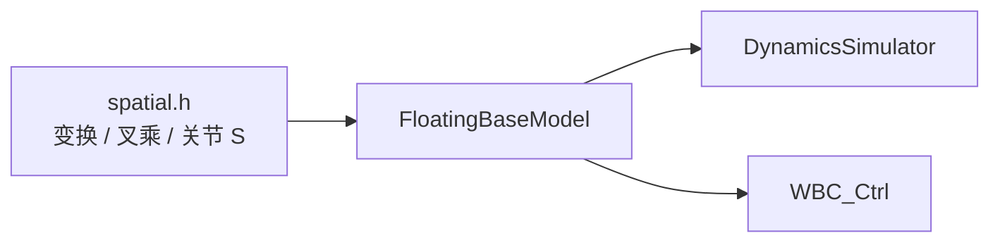
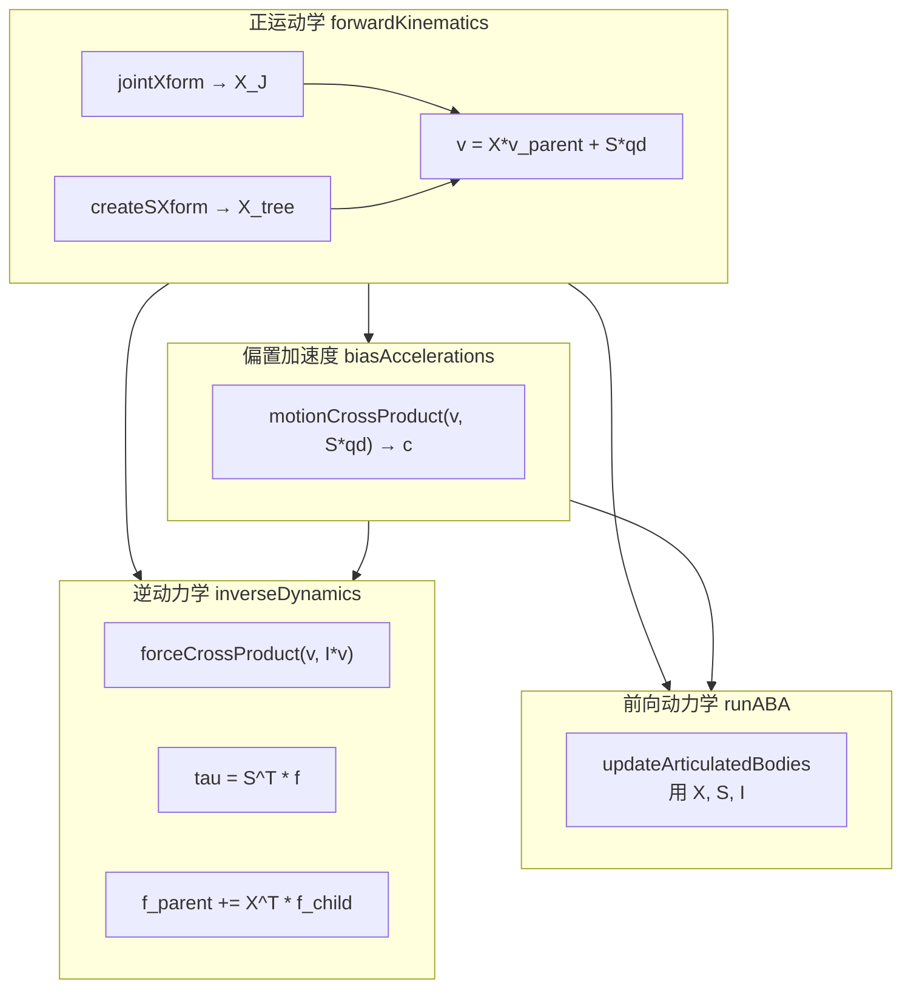

# 14 — 空间向量代数（`spatial.h`）

## 1. 文档定位

| 项目 | 说明 |
|------|------|
| **源文件** | `common/include/Dynamics/spatial.h` |
| **命名空间** | `spatial`（内部 `using namespace ori`） |
| **依赖** | `Math/orientation_tools.h` → `cppTypes.h` |
| **被谁使用** | `FloatingBaseModel`、`SpatialInertia`、`DynamicsSimulator`、WBC |

本文档将 `spatial.h` 中的约定、公式与 API **整理为可独立阅读的技术参考**。动力学引擎总览见 [01-dynamics-and-kinematics.md](./01-dynamics-and-kinematics.md)；算法推导见 [13-algorithms-and-formulas.md §2](./13-algorithms-and-formulas.md#2-浮基动力学)。

---

## 2. 为什么需要空间向量

传统做法对每条连杆分别写牛顿-欧拉方程，再组装成 $n \times n$ 广义质量矩阵 $\mathbf{H}$ 并求逆，复杂度 $O(n^3)$。

Featherstone **空间向量**把 6D 速度/力统一表示，在 **树形运动链** 上递推，使 RNEA / CRBA / ABA 达到 $O(n)$ 或 $O(n^2)$。Cheetah 的 `FloatingBaseModel` 全部建立在本文件提供的原语之上。



---

## 3. 符号与约定

### 3.1 向量类型（`cppTypes.h`）

| 类型 | 维度 | 含义 |
|------|------|------|
| `SVec<T>` | 6×1 | 空间运动向量或空间力向量 |
| `SXform<T>` | 6×6 | 空间坐标变换 |
| `Mat6<T>` | 6×6 | 空间惯性、叉乘矩阵等 |

### 3.2 运动向量与力向量

遵循 Roy Featherstone《Rigid Body Dynamics Algorithms》：

**运动向量**（速度、加速度）：

$$
\hat{v} = \begin{bmatrix} \boldsymbol{\omega} \\ \mathbf{v} \end{bmatrix} \in \mathbb{R}^6
\quad\text{（上 3 维角速度，下 3 维线速度）}
$$

**力向量**（wrench：力矩 + 力）：

$$
\hat{f} = \begin{bmatrix} \boldsymbol{\tau} \\ \mathbf{f} \end{bmatrix} \in \mathbb{R}^6
\quad\text{（上 3 维力矩，下 3 维力）}
$$

### 3.3 空间变换

坐标系 A → B 的 6×6 变换 $\mathbf{X}$：

$$
\hat{v}_B = \mathbf{X}\,\hat{v}_A
\qquad
\hat{f}_A = \mathbf{X}^T\,\hat{f}_B
\quad\text{（力用转置，与速度方向相反）}
$$

含旋转 $\mathbf{R}$ 与平移 $\mathbf{r}$（**B 原点在 A 中的位置**）的一般形式：

$$
\mathbf{X} =
\begin{bmatrix}
\mathbf{R} & \mathbf{0} \\
-\mathbf{R}[\mathbf{r}]_\times & \mathbf{R}
\end{bmatrix}
$$

其中 $[\mathbf{r}]_\times$ 为反对称矩阵（`ori::vectorToSkewMat`），满足 $[\mathbf{r}]_\times \mathbf{u} = \mathbf{r} \times \mathbf{u}$。

**纯旋转**（无平移，$\mathbf{r}=\mathbf{0}$）：

$$
\mathbf{X} =
\begin{bmatrix}
\mathbf{R} & \mathbf{0} \\
\mathbf{0} & \mathbf{R}
\end{bmatrix}
$$

物理含义：角速度与线速度分量均用同一 $\mathbf{R}$ 旋转。

---

## 4. API 总览

### 4.1 按功能分类

| 分类 | 函数 | 一句话 |
|------|------|--------|
| **空间变换** | `spatialRotation`, `createSXform`, `invertSXform` | 构造 / 求逆 6×6 变换 |
| | `rotationFromSXform`, `translationFromSXform` | 从 X 提取 R、r |
| | `sxformToHomogeneous`, `homogeneousToSXform` | 与 4×4 齐次矩阵互转 |
| **空间叉乘** | `motionCrossMatrix`, `motionCrossProduct` | 运动向量叉乘 $a \times^* b$ |
| | `forceCrossMatrix`, `forceCrossProduct` | 力向量对偶叉乘 |
| **关节** | `jointMotionSubspace`, `jointXform` | 子空间 $\mathbf{S}$、关节变换 $\mathbf{X}_J(q)$ |
| **惯性建模** | `rotInertiaOfBox` | 均匀长方体 $3\times3$ 惯量 |
| **速度/加速度** | `spatialToLinearVelocity`, `spatialToAngularVelocity` | 空间量 → 经典 3D 量 |
| | `spatialToLinearAcceleration` | 含 transport 项 $\boldsymbol{\omega}\times\mathbf{v}$ |
| **几何/力** | `sXFormPoint`, `forceToSpatialForce` | 点变换、点力 → wrench |

### 4.2 关节类型

```cpp
enum class JointType { Prismatic, Revolute, FloatingBase, Nothing };
```

| 类型 | 含义 | `jointMotionSubspace` |
|------|------|------------------------|
| `Revolute` | 转动关节 | $\mathbf{S} = [\text{axis};\ \mathbf{0}]$ |
| `Prismatic` | 移动关节 | $\mathbf{S} = [\mathbf{0};\ \text{axis}]$ |
| `FloatingBase` | 浮基 6 DOF | 在 `FloatingBaseModel` 中单独处理 |
| `Nothing` | 固定 | 无自由度 |

---

## 5. 空间坐标变换（详解）

### 5.1 `spatialRotation(axis, theta)`

**作用**：构造纯旋转空间变换。

**公式**：

$$
\mathbf{X} = \begin{bmatrix} \mathbf{R}(\theta) & \mathbf{0} \\ \mathbf{0} & \mathbf{R}(\theta) \end{bmatrix}
$$

**源码逻辑**：

```cpp
RotMat<T> R = coordinateRotation(axis, theta);
X.topLeftCorner<3,3>()     = R;  // omega_B = R * omega_A
X.bottomRightCorner<3,3>() = R;  // v_B     = R * v_A
```

**典型用途**：转动关节 `jointXform(Revolute, axis, q)`。

---

### 5.2 `createSXform(R, r)`

**作用**：含旋转与平移的完整空间变换；`FloatingBaseModel` 正运动学核心（`_Xup`、`_Xa`）。

**公式**：

$$
\mathbf{X} = \begin{bmatrix} \mathbf{R} & \mathbf{0} \\ -\mathbf{R}[\mathbf{r}]_\times & \mathbf{R} \end{bmatrix}
$$

**线速度耦合**：下左块将角速度映射到偏移点的线速度：

$$
\mathbf{v}_B = \mathbf{R}\mathbf{v}_A - \mathbf{R}[\mathbf{r}]_\times \boldsymbol{\omega}_A
\quad\equiv\quad \mathbf{v} + \boldsymbol{\omega} \times \mathbf{r}
$$

---

### 5.3 `invertSXform(X)`

**作用**：解析求逆，$O(1)$，无需通用 6×6 矩阵求逆。

若 $\mathbf{X}$ 将 A → B，则：

$$
\mathbf{X}^{-1} = \texttt{createSXform}(\mathbf{R}^T,\ -\mathbf{R}\mathbf{r})
$$

Featherstone 结构：

$$
\mathbf{X}^{-1} = \begin{bmatrix} \mathbf{R}^T & [\mathbf{R}\mathbf{r}]_\times \mathbf{R}^T \\ \mathbf{0} & \mathbf{R}^T \end{bmatrix}
$$

**典型用途**：`FloatingBaseModel` 中 `invertSXform(_Xa[i])` 从绝对系变回连杆系。

---

### 5.4 与齐次变换互转

| 函数 | 方向 | 公式 |
|------|------|------|
| `sxformToHomogeneous(X)` | 6×6 → 4×4 | $\mathbf{H} = \begin{bmatrix}\mathbf{R}&\mathbf{t}\\\mathbf{0}&1\end{bmatrix}$，$\mathbf{t}$ 由 `-R[r]×` 反推 |
| `homogeneousToSXform(H)` | 4×4 → 6×6 | 左下块 $[\mathbf{t}]_\times \mathbf{R}$ |

---

### 5.5 提取 R / r

| 函数 | 提取 |
|------|------|
| `rotationFromSXform(X)` | 左上角 3×3 → $\mathbf{R}$ |
| `translationFromSXform(X)` | 由 `bottomLeft = -R[r]×` 得 $\mathbf{r} = -\text{skewVec}(\mathbf{R}^T \cdot \text{bottomLeft})$ |

---

## 6. 空间叉乘（详解）

### 6.1 运动叉乘 $a \times^* b$

**函数**：`motionCrossProduct(a, b)` 或 `motionCrossMatrix(v) * b`

**结果结构**（6×1）：

| 分量 | 公式 |
|------|------|
| 上 3 维 | $\boldsymbol{\omega}_a \times \boldsymbol{\omega}_b$ |
| 下 3 维 | $\boldsymbol{\omega}_a \times \mathbf{v}_b + \mathbf{v}_a \times \boldsymbol{\omega}_b$ |

**在动力学中的角色**：加速度运动学偏置项（科氏项）

$$
\mathbf{a} = \mathbf{X}\mathbf{a}_{parent} + \mathbf{S}\ddot{q} + \mathbf{c}, \quad
\mathbf{c} = \text{motionCrossProduct}(\mathbf{v},\ \mathbf{S}\dot{q})
$$

**性能**：单向量乘法优先 `motionCrossProduct`，避免 6×6 矩阵分配。

---

### 6.2 力叉乘 $a \times^* b$（对偶）

**函数**：`forceCrossProduct(a, b)` 或 `forceCrossMatrix(v) * b`

**在 RNEA 中**：

$$
\hat{f} = \mathcal{I}\hat{a} + \text{forceCrossProduct}(\hat{v},\ \mathcal{I}\hat{v})
$$

第二项为陀螺力项（$\boldsymbol{\omega} \times (\mathbf{I}\boldsymbol{\omega})$ 的空间形式）。

---

## 7. 关节子空间与关节变换

### 7.1 `jointMotionSubspace(joint, axis)`

返回 6×1 向量 $\mathbf{S}$：关节允许的 **单位自由运动** 方向。

| 关节 | $\mathbf{S}$ | 广义速度贡献 |
|------|--------------|--------------|
| Revolute | $[\text{axis};\ \mathbf{0}]$ | 纯旋转 |
| Prismatic | $[\mathbf{0};\ \text{axis}]$ | 纯平移 |

**两处核心用法**：

$$
\hat{v}_{child} = \mathbf{X}_J \hat{v}_{parent} + \mathbf{S}\dot{q}
\qquad\text{（正运动学）}
$$

$$
\tau = \mathbf{S}^T \hat{f}
\qquad\text{（RNEA 力矩投影）}
$$

---

### 7.2 `jointXform(joint, axis, q)`

| 关节 | 变换 |
|------|------|
| Revolute | $\mathbf{X}_J = \texttt{spatialRotation}(\text{axis},\ q)$ |
| Prismatic | $\mathbf{X}_J = \texttt{createSXform}(\mathbf{I},\ q\cdot\text{axis})$ |

**正运动学递推**（`FloatingBaseModel::forwardKinematics`）：

$$
\hat{v}_{child} = \mathbf{X}_J \hat{v}_{parent} + \mathbf{S}\dot{q}
$$

---

## 8. 速度 / 加速度与经典 3D 量

### 8.1 点处线速度

**`spatialToLinearVelocity(v, x)`**：

$$
\mathbf{v}_{linear}(\mathbf{x}) = \mathbf{v}_{spatial} + \boldsymbol{\omega} \times \mathbf{x}
$$

- `v`：原点处空间速度 $[\boldsymbol{\omega};\ \mathbf{v}_{origin}]$
- `x`：点相对原点的偏移 [m]

---

### 8.2 经典线加速度

空间加速度与「经典」线加速度差 **transport 项** $\boldsymbol{\omega}\times\mathbf{v}$：

$$
\mathbf{a}_{classical} = \mathbf{a}_{spatial,linear} + \boldsymbol{\omega} \times \mathbf{v}_{spatial,linear}
$$

| 重载 | 作用 |
|------|------|
| `(a, v)` | 原点处经典线加速度 |
| `(a, v, x)` | 先映射到点 $\mathbf{x}$，再加该点 transport 项 |

**用途**：接触约束、足端线加速度输出（`getLinearAcceleration`）。

---

## 9. 点变换与力转换

### 9.1 `sXFormPoint(X, p)`

3D 点从 A 系变到 B 系：

$$
\mathbf{p}_B = \mathbf{R}(\mathbf{p}_A - \mathbf{r})
$$

等价于用 `rotationFromSXform` + `translationFromSXform` 提取 $\mathbf{R},\mathbf{r}$ 后计算。

---

### 9.2 `forceToSpatialForce(f, p)`

作用在点 $\mathbf{p}$ 的力 $\mathbf{f}$（同坐标系）转为空间 wrench：

$$
\hat{f}_{spatial} = \begin{bmatrix} \mathbf{p} \times \mathbf{f} \\ \mathbf{f} \end{bmatrix}
$$

对原点的力矩 = 力臂叉乘力。**用途**：`FloatingBaseModel` 施加外接触力、测试力。

---

## 10. 惯性辅助

### 10.1 `rotInertiaOfBox(mass, dims)`

均匀密度长方体（边长 `dims = [lx, ly, lz]`）绕 **质心** 的 3×3 转动惯量：

$$
I_{ii} = \frac{m}{12}\bigl(l_j^2 + l_k^2\bigr), \quad \{i,j,k\} \text{ 为 } x,y,z \text{ 的排列}
$$

与 `SpatialInertia` 配合，构建连杆惯性参数（见 [01 §3](./01-dynamics-and-kinematics.md#3-spatialinertia)）。

---

## 11. 在 FloatingBaseModel 中的调用关系



| spatial.h 函数 | FloatingBaseModel 中的用途 |
|----------------|---------------------------|
| `createSXform` | 连杆树固定变换 `_Xtree`、绝对位姿 `_Xa` |
| `jointXform` | 关节角 → `_Xup` |
| `invertSXform` | 绝对系 ↔ 连杆系 |
| `jointMotionSubspace` | 初始化 `_S` |
| `motionCrossProduct` | 偏置加速度 `_c` |
| `forceCrossProduct` | RNEA 陀螺力项 |
| `forceToSpatialForce` | 接触/外力施加 |
| `spatialToLinearVelocity` | 足端线速度 |
| `spatialToLinearAcceleration` | 足端线加速度 |

---

## 12. 与 CRBA / RNEA / ABA 的关系

| 算法 | 是否直接调用 spatial.h | 依赖的空间原语 |
|------|------------------------|----------------|
| **RNEA** | 是 | $\mathbf{X}$, $\mathbf{X}^T$, $\mathbf{S}$, motion/force cross |
| **CRBA** | 是 | $\mathbf{X}^T$ 力传递、复合惯性 |
| **ABA** | 是 | $\mathbf{X}$, $\mathbf{S}$, 铰接体递推 |
| **接触逆惯性** | 间接 | `applyTestForce` 复用 ABA 结构 |

**关键结论**：`spatial.h` 不包含 CRBA/RNEA/ABA 本身，但提供了这三种 $O(n)$ 算法所需的 **全部几何与代数原语**。

---

## 13. 完整函数速查表

| 函数 | 输入 | 输出 | 复杂度 |
|------|------|------|--------|
| `spatialRotation` | axis, θ | 6×6 X | O(1) |
| `createSXform` | R, r | 6×6 X | O(1) |
| `invertSXform` | X | 6×6 X⁻¹ | O(1) |
| `rotationFromSXform` | X | 3×3 R | O(1) |
| `translationFromSXform` | X | 3×1 r | O(1) |
| `sxformToHomogeneous` | X | 4×4 H | O(1) |
| `homogeneousToSXform` | H | 6×6 X | O(1) |
| `motionCrossMatrix` | 6×1 v | 6×6 | O(1) |
| `motionCrossProduct` | a, b | 6×1 | O(1) |
| `forceCrossMatrix` | 6×1 v | 6×6 | O(1) |
| `forceCrossProduct` | a, b | 6×1 | O(1) |
| `jointMotionSubspace` | type, axis | 6×1 S | O(1) |
| `jointXform` | type, axis, q | 6×6 X_J | O(1) |
| `rotInertiaOfBox` | m, dims | 3×3 I | O(1) |
| `spatialToLinearVelocity` | v, x | 3×1 | O(1) |
| `spatialToAngularVelocity` | v | 3×1 ω | O(1) |
| `spatialToLinearAcceleration` | a, v [, x] | 3×1 | O(1) |
| `sXFormPoint` | X, p | 3×1 | O(1) |
| `forceToSpatialForce` | f, p | 6×1 | O(1) |

---

## 14. 数值与实现注意事项

1. **`.template` 语法**：Eigen 模板矩阵访问块时需 `X.template topLeftCorner<3,3>()`，否则 `<` 被解析为小于号。
2. **力与速度变换方向相反**：速度用 $\mathbf{X}$，力用 $\mathbf{X}^T$；混用会导致能量/虚功不一致。
3. **r 的含义**：始终是 **子系原点在父系中的坐标**，与 `createSXform(R, r)` 一致。
4. **叉乘优先用 Product 版**：`motionCrossProduct` / `forceCrossProduct` 比矩阵版更快。
5. **单元测试**：`common/test/test_spatial.cpp` 覆盖变换互逆、齐次互转、叉乘等价性。

---

## 15. 推荐阅读顺序

1. 本文（spatial.h 公式与 API）
2. [01-dynamics-and-kinematics.md §2–4](./01-dynamics-and-kinematics.md) — FloatingBaseModel API
3. [13-algorithms-and-formulas.md §2](./13-algorithms-and-formulas.md#2-浮基动力学) — ABA/RNEA 推导
4. 源码：`FloatingBaseModel.cpp` 中 `forwardKinematics`、`inverseDynamics`、`runABA`

---

上一章：[13-algorithms-and-formulas.md](./13-algorithms-and-formulas.md)  
相关：[01-dynamics-and-kinematics.md](./01-dynamics-and-kinematics.md)
