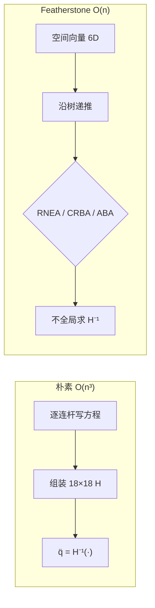

# 朴素做法 vs Featherstone 空间向量递推

文档里这句话说的是：**多体动力学有两种算力方式**——一种每步把大矩阵拼出来再求逆（慢），一种利用机器人「树形结构」做递推（快）。Cheetah 的 `FloatingBaseModel` 用的是后者。

---

## 1. 问题是什么？

Cheetah 有 **18 个自由度**（浮基 6 + 关节 12），动力学方程是：

$$
\mathbf{H}(\mathbf{q})\ddot{\mathbf{q}} + \mathbf{C}(\mathbf{q}, \dot{\mathbf{q}})\dot{\mathbf{q}} + \mathbf{G}(\mathbf{q}) = \mathbf{J}_c^T \mathbf{F}_r + \mathbf{S}^T \boldsymbol{\tau}
$$

仿真和控制里常要解两类问题：

| 问题 | 已知 | 求 |
|------|------|-----|
| **前向动力学** | 力矩 $\boldsymbol{\tau}$、接触力 | 加速度 $\ddot{\mathbf{q}}$ |
| **逆动力学** | 加速度 $\ddot{\mathbf{q}}$ | 所需力矩 $\boldsymbol{\tau}$ |
| **质量矩阵** | 构型 $\mathbf{q}$ | $\mathbf{H}(\mathbf{q})$ |

WBC 还要用 $\mathbf{H}$、$\mathbf{C}$、$\mathbf{G}$；仿真每步要算 $\ddot{\mathbf{q}}$；接触求解还要 $\mathbf{H}^{-1}$ 的作用。

---

## 2. 朴素做法：每步组装再求逆

### 2.1 怎么做？

典型流程：

```
1. 对每个连杆写牛顿-欧拉方程（力、力矩平衡）
2. 用关节约束消去内部力，组装成 18×18 的 H(q)、C(q,q̇)、G(q)
3. 前向动力学：q̈ = H⁻¹ (τ - C q̇ - G + Jcᵀ Fr)
4. 接触：Λ = (Jc H⁻¹ Jcᵀ)⁻¹
```

### 2.2 复杂度

| 操作 | 复杂度 |
|------|--------|
| 组装 $\mathbf{H}$（暴力） | $O(n^2)$ ~ $O(n^3)$ |
| 求 $\mathbf{H}^{-1}$ | **$O(n^3)$** |
| 对 Cheetah，$n=18$ | $18^3 \approx 5800$ 次量级运算 |

18 维还能接受，但：
- **人形 30+ DOF** 时 $O(n^3)$ 很快成为瓶颈
- 仿真 **1 kHz** 每步都算，浪费明显
- 树形结构里的 **大量零块、重复计算** 被完全忽略

### 2.3 为什么慢？——没利用「树」

四足腿是 **开链树**：

```
        浮基 (body)
       /    |    \    \
     髋FL  髋FR  髋RL  髋RR
      |     |     |     |
     大腿  大腿  大腿  大腿
      |     |     |     |
     小腿  小腿  小腿  小腿
```

**物理直觉**：髋部力矩主要影响整条腿，**不会直接**耦合到另一条腿——耦合是 **沿树路径间接传递** 的。朴素做法把 18×18 矩阵当 **满矩阵** 处理，既多算零，又重复传播同一物理量。

---

## 3. Featherstone 的核心思想

Roy Featherstone（1980s–2000s）做了两件事：

### 3.1 空间向量（6D 合一）

把 **角速度 + 线速度** 合成一个 6 维 **空间运动向量**：

$$
\hat{v} = \begin{bmatrix} \boldsymbol{\omega} \\ \mathbf{v} \end{bmatrix} \in \mathbb{R}^6
$$

**空间力向量**（力矩 + 力）：

$$
\hat{f} = \begin{bmatrix} \boldsymbol{\tau} \\ \mathbf{f} \end{bmatrix} \in \mathbb{R}^6
$$

**好处**：
- 连杆间变换只需一个 **6×6 空间变换** $\mathbf{X}$，不必分开处理「质心偏移导致的力矩传递」
- 惯性用一个 **6×6 空间惯性** $\mathcal{I}$ 表示（`SpatialInertia.h`）

```
85:90:docs-cheetah/01-dynamics-and-kinematics.md
```
$$
\mathcal{I} = \begin{bmatrix}
\mathbf{I}_c + m[\mathbf{c}]_\times[\mathbf{c}]_\times^T & m[\mathbf{c}]_\times \\
m[\mathbf{c}]_\times^T & m\mathbf{I}
\end{bmatrix}
$$


### 3.2 沿树递推，不做全局求逆

只在 **父→子、子→父** 链上传递，每条边 $O(1)$，整棵树 **$O(n)$**。

Cheetah 源码对应：`spatial.h`（变换/叉乘）、`FloatingBaseModel`（CRBA/RNEA/ABA）。

---

## 4. 三个 $O(n)$ 经典算法

| 算法 | 函数 | 方向 | 算什么 |
|------|------|------|--------|
| **RNEA** | `inverseDynamics()` | 叶 → 根 | 已知 $\ddot{\mathbf{q}}$ → $\boldsymbol{\tau}$ |
| **CRBA** | `massMatrix()` | 叶 → 根 | $\mathbf{H}(\mathbf{q})$ |
| **ABA** | `runABA()` | 叶→根 + 根→叶 | 已知 $\boldsymbol{\tau}$ → $\ddot{\mathbf{q}}$ |

---

### 4.1 RNEA（递归牛顿-欧拉）— 逆动力学

**问题**：给定期望加速度，需要多大关节力矩？

**思路**：想象从 **脚尖往身体推**。

```
第 1 趟（根→叶）：算每个连杆的空间速度 v、偏置加速度 c
第 2 趟（叶→根）：由 a = X·a_parent + S·q̈ + c 算加速度
                  由 f = I·a + v×*(I·v) 算空间力
                  在关节处投影：τ_i = S_iᵀ f_i
                  把剩余力 Xᵀ f 传给父连杆
```

源码片段（`inverseDynamics` 第二趟，自叶向根）：

```867:869:common/src/Dynamics/FloatingBaseModel.cpp
  for (size_t i = _nDof - 1; i > 5; i--) {
    // Pull off compoents of force along the joint
    genForce[i] = _S[i].dot(_f[i]) + _Srot[i].dot(_frot[i]);
```

**复杂度**：每个关节常数时间 → **$O(n)$**，**不需要** $\mathbf{H}^{-1}$。

---

### 4.2 CRBA（复合刚体算法）— 质量矩阵

**问题**：WBC 需要显式 $\mathbf{H}(\mathbf{q})$。

**思路**：$\mathbf{H}_{ij}$ = 「只让关节 $j$ 动单位加速度时，关节 $i$ 需要多大力」。沿树 **向下传空间力、向上累加复合惯性**。

源码 `massMatrix()` 核心：

```785:808:common/src/Dynamics/FloatingBaseModel.cpp
  for (size_t j = 6; j < _nDof; j++) {
    // f = spatial force required for a unit qdd_j
    SVec<T> f = _IC[j].getMatrix() * _S[j];
    ...
    _H(j, j) = _S[j].dot(f) + _Srot[j].dot(frot);
    // Propagate down the tree
    f = _Xup[j].transpose() * f + ...
    while (i > 5) {
      _H(i, j) = _S[i].dot(f);
      ...
    }
  }
```

**复杂度**：**$O(n^2)$**（要填整个 $\mathbf{H}$），但仍 **不需要求逆**。对 $n=18$ 比 $O(n^3)$ 求逆快很多。

---

### 4.3 ABA（铰接体算法）— 前向动力学 ⭐

**问题**：仿真每步已知 $\boldsymbol{\tau}$，求 $\ddot{\mathbf{q}}$。这是 **最省** 的路径——**连 $\mathbf{H}$ 都不用显式组装**。

**核心直觉**：把每条子树等效成 **铰接体惯性** $\mathbf{IA}_i$——「在这个关节剪断，下方整棵子树对外表现的 6×6 有效惯性」。

#### 第一趟：叶 → 根（`updateArticulatedBodies`）

合并子树惯性到父节点：

```159:171:common/src/Dynamics/FloatingBaseModel.cpp
  for (size_t i = _nDof - 1; i >= 6; i--) {
    _U[i] = _IA[i] * _S[i];
    ...
    _d[i] = _S[i].transpose() * _U[i] + ...;   // 关节等效标量惯量
    // articulated inertia recursion
    Mat6<T> Ia = _Xup[i].transpose() * _IA[i] * _Xup[i] + ... 
                 - _Utot[i] * _Utot[i].transpose() / _d[i];
    _IA[_parents[i]] += Ia;
  }
  _invIA5.compute(_IA[5]);   // 只对浮基 6×6 求逆！
```

单关节简化公式：

$$
d_i = \mathbf{S}_i^T \mathbf{IA}_i \mathbf{S}_i, \qquad
\ddot{q}_i = \frac{\tau_i - \mathbf{S}_i^T \mathbf{p}_i - \cdots}{d_i}
$$

#### 第二趟：根 → 叶

从浮基解 $\mathbf{a}_{base}$（仅 **6×6** 求逆），再向下分配各关节 $\ddot{q}_i$。

**复杂度**：
- 关节递推：$O(n)$
- 浮基求逆：$O(6^3) = O(1)$
- **总计 $O(n)$**，不是 $O(n^3)$

`DynamicsSimulator::step()` 每步调用 `runABA(tau)` 就是这个。

---

## 5. 对比一张图



| | 朴素 | Featherstone |
|---|------|--------------|
| 数据结构 | 18×18 满矩阵 | 树 + 6D 空间量 |
| 前向动力学 | $H^{-1}$，$O(n^3)$ | ABA，$O(n)$ |
| 逆动力学 | 先算 $H$ 再乘 | RNEA，$O(n)$ |
| 要 $H$ 时 | 组装 + 可能求逆 | CRBA，$O(n^2)$ |
| 接触 $\Lambda$ | $J H^{-1} J^T$ | `applyTestForce`，利用 ABA 结构 $O(n)$ |

---

## 6. 空间向量解决了什么「烦」？

### 6.1 不用空间向量时

连杆 $i$ 在质心处写方程，换到父坐标系要：
- 平移力 → 对原点产生额外力矩 $\mathbf{r} \times \mathbf{f}$
- 旋转惯性张量 → 换系
- 每个关节单独处理，公式冗长易错

### 6.2 用空间向量后

- **一个** $\hat{v}$、**一个** $\hat{f}$、**一个** $\mathcal{I}$
- 父→子：$\hat{v}_{child} = \mathbf{X} \hat{v}_{parent} + \mathbf{S}\dot{q}$
- 子→父：$\hat{f}_{parent} += \mathbf{X}^T \hat{f}_{child}$
- 空间变换求逆比 6×6 矩阵逆快得多（`invertSXform`）

这就是文档说的：**「把 6D 速度/力统一表示，使递归动力学为 $O(n)$」**。

---

## 7. 在 Cheetah 里谁用谁？

| 场景 | 算法 | 原因 |
|------|------|------|
| `DynamicsSimulator::step()` | **ABA** | 仿真每 ms 要 $\ddot{\mathbf{q}}$，最快 |
| `Example_Leg_InvDyn` | **RNEA** | 轨迹跟踪，已知 $\ddot{q}$ 求 $\tau$ |
| `WBC_Ctrl` | **CRBA** + RNEA 项 | QP 需要 $\mathbf{H}, \mathbf{C}, \mathbf{G}$ |
| `ContactImpulse` | **ABA 结构** | 算 $\Lambda^{-1}$ 不显式 $H^{-1}$ |

---

## 8. 一句话总结

> **朴素做法**：把 18 个关节当成一个「大弹簧质量块系统」，每步拼 18×18 矩阵再求逆 → $O(n^3)$。  
> **Featherstone**：认出机器人是 **树**，用 **6D 空间向量** 在父子之间递推力或惯性 → **$O(n)$**（ABA/RNEA）或 $O(n^2)$（CRBA），且仿真前向动力学 **根本不必求 $\mathbf{H}^{-1}$**。

对 Cheetah（$n=18$）两者都能跑，但 Featherstone 是 **可扩展、可实时** 的标准做法；代码里 `FloatingBaseModel` 的三函数 `massMatrix` / `inverseDynamics` / `runABA` 就是这三套算法的直接实现。

若要继续深入，可以单独展开 **ABA 两趟扫描的变量**（$\mathbf{IA}, \mathbf{U}, d, \mathbf{pA}$）或 **`applyTestForce` 如何用 ABA 算接触逆惯性**。