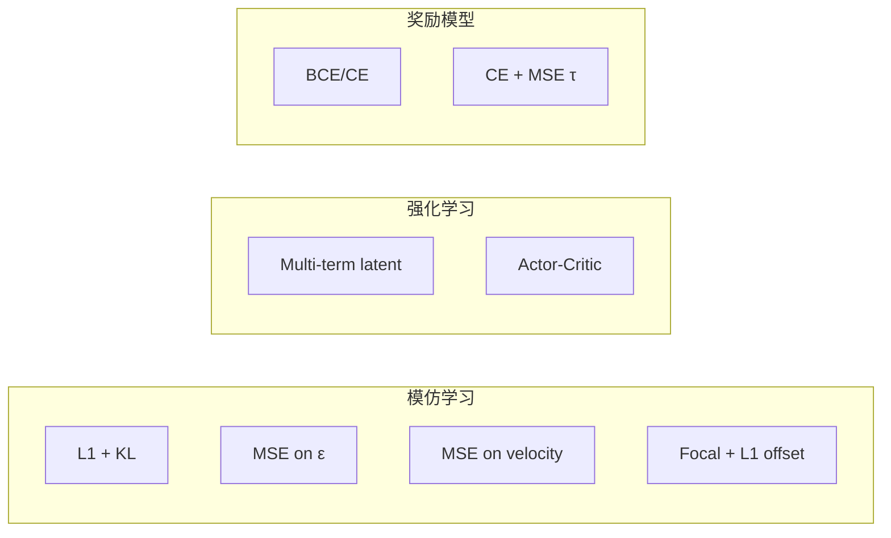

# 13 — 算法原理、数学公式与参考文献

> 本章对 LeRobot 中 **16 种策略** 与 **4 种奖励模型** 给出：算法思想、损失函数、关键推导、实现要点、论文与开源链接。  
> 公式与 `src/lerobot/policies/*/modeling_*.py` 及 `rewards/*/modeling_*.py` 实现对齐。

---

## 目录

1. [模仿学习：回归与序列建模](#1-模仿学习回归与序列建模)
2. [扩散与 Flow Matching](#2-扩散与-flow-matching)
3. [强化学习与 MPC](#3-强化学习与-mpc)
4. [离散动作与 VQ](#4-离散动作与-vq)
5. [VLA 与多模态](#5-vla-与多模态)
6. [奖励模型与 RA-BC](#6-奖励模型与-ra-bc)
7. [RTC 推理算法](#7-rtc-推理算法)
8. [损失族 taxonomy](#8-损失族-taxonomy)
9. [开源项目对照表](#9-开源项目对照表)

---

## 1. 模仿学习：回归与序列建模

### 1.1 ACT（Action Chunking Transformer）

**是什么**：用 Transformer **一次预测未来 H 步动作 chunk**，执行时可 queue 多步或 temporal ensembling，缓解单步回归的复合误差。

**为什么**：长 horizon 操作需要动作序列一致性；chunk 降低逐步 drift。

#### 架构

```
Images ──► ResNet ──► spatial features ──► Transformer Encoder
                                                      │
State ────────────────────────────────────────────────┤
Optional VAE latent z ────────────────────────────────┤
                                                      ▼
                              Learnable action queries ──► Decoder ──► â_{1:H}
```

可选 VAE 编码器输入 `[CLS, state, a_{1:H}]`，输出 `(μ, log σ²)` 采样 `z` 条件化解码。

#### 损失函数

**重建项（L1）**：

$$
\mathcal{L}_{\text{recon}} = \frac{1}{|\mathcal{M}|} \sum_{(t,d) \in \mathcal{M}} \left| \hat{a}_{t,d} - a_{t,d} \right|
$$

$\mathcal{M}$ 为非 padding 时空位置集合。

**VAE KL 项**（`use_vae=True`）：

设 $q(z|s,a) = \mathcal{N}(\mu, \sigma^2 I)$，先验 $p(z)=\mathcal{N}(0,I)$。

$$
\mathcal{L}_{\text{KL}} = -\frac{1}{2} \sum_{j=1}^{d_z} \left( 1 + \log\sigma_j^2 - \mu_j^2 - \sigma_j^2 \right)
$$

**总损失**：

$$
\mathcal{L} = \mathcal{L}_{\text{recon}} + \lambda_{\text{KL}} \mathcal{L}_{\text{KL}}, \quad \lambda_{\text{KL}} = \texttt{kl\_weight}\ (\默认\ 10)
$$

#### 推理

- **Action queue**：每次预测 H 步，逐步 pop；队列空时再 forward。
- **Temporal ensembling**（可选）：对重叠预测加权平均  
  $\hat{a}_t = \sum_i w_i \hat{a}_t^{(i)} / \sum_i w_i$

#### 参考文献与链接

| 类型         | 链接                                                                                                                        |
| ---------- | ------------------------------------------------------------------------------------------------------------------------- |
| 论文         | [Learning Fine-Grained Bimanual Manipulation with Low-Cost Hardware (arXiv:2304.13705)](https://arxiv.org/abs/2304.13705) |
| 项目页        | https://tonyzhaozh.github.io/aloha                                                                                        |
| LeRobot 文档 | [policy_act_README.md](../source/policy_act_README.md)                                                                    |
| 代码         | `policies/act/modeling_act.py`                                                                                            |

#### 默认超参（`ACTConfig`）

`chunk_size=100`, `dim_model=512`, `n_heads=8`, `use_vae=True`, `latent_dim=32`, `vision_backbone=resnet18`

---

## 2. 扩散与 Flow Matching

### 2.1 Diffusion Policy

**是什么**：将 **动作轨迹** $\mathbf{a}_{1:T}$ 视为高维向量，用 DDPM/DDIM 学习去噪网络 $\epsilon_\theta(x_t, t, \text{obs})$。

**为什么**：动作分布多峰；扩散能建模复杂条件分布。

#### 前向扩散（DDPM）

$$
q(x_t \mid x_0) = \mathcal{N}\big(\sqrt{\bar{\alpha}_t}\, x_0,\ (1-\bar{\alpha}_t) I\big)
$$

等价采样：$x_t = \sqrt{\bar{\alpha}_t}\, a + \sqrt{1-\bar{\alpha}_t}\,\epsilon$，$\epsilon \sim \mathcal{N}(0,I)$。

#### 训练目标（ε-预测，`prediction_type="epsilon"`）

$$
\mathcal{L} = \mathbb{E}_{t, \epsilon, a, \text{obs}} \left[ \left\| \epsilon - \epsilon_\theta(x_t, t, c(\text{obs})) \right\|^2 \right]
$$

$c(\text{obs})$ 为 ResNet+SpatialSoftmax 编码的多帧观测全局条件。

#### 推理

从 $x_T \sim \mathcal{N}(0,I)$ 迭代 denoise 得 $x_0$ 作为动作轨迹；取前 `n_action_steps` 执行。

#### 参考文献

| 类型 | 链接 |
|------|------|
| 论文 | [Diffusion Policy (arXiv:2303.04137)](https://arxiv.org/abs/2303.04137) |
| 官方 | https://diffusion-policy.cs.columbia.edu/ |
| 代码 | `policies/diffusion/modeling_diffusion.py` |

#### 关键超参

`horizon=64`, `n_obs_steps=2`, `n_action_steps=32`, `num_train_timesteps=100`, `down_dims=(512,1024,2048)`

---

### 2.2 Flow Matching（π₀ / SmolVLA / EO-1 等）

**是什么**：学习向量场 $v_\theta(x_t, t)$，使 ODE 从噪声流向数据；比扩散更简的连续归一化流训练。

#### π₀ 插值路径（OpenPI 约定）

采样 $t \sim \text{Beta}(\alpha, \beta)$ 缩放到 $[0,1)$，$\epsilon \sim \mathcal{N}(0,I)$：

$$
x_t = t \,\epsilon + (1-t)\, a
$$

**目标速度**（直线流）：

$$
u_t = \epsilon - a
$$

**损失**：

$$
\mathcal{L} = \mathbb{E}\left[ \left\| v_\theta(x_t, t, \text{prefix}) - u_t \right\|^2 \right]
$$

**推导直觉**：若 $x_t = t\epsilon + (1-t)a$，则 $\frac{dx_t}{dt} = \epsilon - a = u_t$；回归该常速度场即 flow matching 特例（Conditional Flow Matching）。

#### 推理

Euler 积分（`num_inference_steps=K`）：

$$
x_{t_{k+1}} = x_{t_k} + \Delta t_k \cdot v_\theta(x_{t_k}, t_k)
$$

从 $t \approx 1$（噪声）积到 $t \approx 0$ 得动作 $a$。Prefix（图像+语言）经 PaliGemma 编码，KV cache 加速 denoise 步。

#### 参考文献

| 类型 | 链接 |
|------|------|
| π₀ 论文 | [π₀: A Vision-Language-Action Flow Model (arXiv:2410.24164)](https://arxiv.org/abs/2410.24164) |
| OpenPI | https://github.com/Physical-Intelligence/openpi |
| Flow Matching 综述 | [Flow Matching for Generative Modeling (Lipman et al., 2023)](https://arxiv.org/abs/2210.02747) |
| SmolVLA | [arXiv:2506.01844](https://arxiv.org/abs/2506.01844) |
| 代码 | `policies/pi0/modeling_pi0.py`, `policies/smolvla/` |

---

### 2.3 GR00T Flow Matching（插值方向相反）

GR00T 实现（`FlowmatchingActionHead`）使用：

$$
x_t = (1-t)\,\epsilon + t\, a, \quad v^* = a - \epsilon
$$

$$
\mathcal{L} = \frac{\sum (v_\theta - v^*)^2 \cdot m_{\text{action}}}{\sum m_{\text{action}}}
$$

**注意**：加载/对比不同 repo 时必须核对 **$t$ 的方向与 $v^*$ 定义**，不可与 π₀ 公式混用。

#### 参考文献

| 类型 | 链接 |
|------|------|
| 论文 | [GR00T N1.5 (arXiv:2503.14734)](https://arxiv.org/abs/2503.14734) |
| NVIDIA | https://research.nvidia.com/labs/gear/gr00t-n1_5/ |
| Isaac-GR00T | https://github.com/NVIDIA/Isaac-GR00T |
| 代码 | `policies/groot/` |

---

### 2.4 Multi-Task DiT

支持两种 `objective_type`：

**Diffusion 模式**：同 Diffusion Policy，DiT 替代 1D U-Net。

**Flow matching 模式**：

$$
x_t = t \cdot a + \big(1 - (1-\sigma_{\min}) t\big)\,\epsilon, \quad
v^* = a - (1-\sigma_{\min})\,\epsilon
$$

#### 参考文献

- [Multi-Task Diffusion Transformer (arXiv:2507.05331)](https://arxiv.org/abs/2507.05331)
- 代码：`policies/multi_task_dit/`

---

## 3. 强化学习与 MPC

### 3.1 TD-MPC / FOWM

**是什么**：学习 latent dynamics $z_{t+1}=f(z_t,a_t)$、reward $\hat{r}$、Q/V/π，在 latent 空间做 **MPC（MPPI/CEM）** 或直接用 π。

#### 一致性损失

$$
\mathcal{L}_{\text{cons}} = \sum_t w_t \left\| \hat{z}_{t+1} - \text{sg}(\text{Enc}(o_{t+1})) \right\|^2
$$

#### 奖励损失

$$
\mathcal{L}_r = \sum_t w_t \left( \hat{r}_t - r_t \right)^2
$$

#### Q 学习（ensemble）

$$
\mathcal{L}_Q = \sum_t w_t \sum_{i=1}^{N} \left( Q_i(z_t, a_t) - \big(r_t + \gamma V(\text{Enc}(o_{t+1}))\big) \right)^2
$$

#### V 的 expectile 回归（FOWM）

$$
\mathcal{L}_V = \sum_t w_t \cdot \rho_\tau\big(V(z_t) - \min_j Q_j^{\text{target}}(z_t, a_t)\big)
$$

$\rho_\tau(u) = |\tau - \mathbb{1}_{u<0}| \cdot u^2$（非对称 L2）。

#### 策略改进（advantage weighted regression）

$$
A_t = \min_j Q_j^{\text{target}}(z_t, a_t) - V(z_t)
$$
$$
\mathcal{L}_\pi = \sum_t w_t \cdot \exp(\text{clip}(\beta A_t)) \cdot \| \pi(z_t) - a_t \|^2
$$

#### 总损失

$$
\mathcal{L} = c_{\text{cons}}\mathcal{L}_{\text{cons}} + c_r\mathcal{L}_r + c_v(\mathcal{L}_Q+\mathcal{L}_V) + c_\pi \mathcal{L}_\pi
$$

#### MPC 推理（简述）

在 $z_t$ 上采样 $N$ 条动作序列，rollout $f$ 得回报，CEM 迭代更新分布均值。

#### 参考文献

| 论文 | 链接 |
|------|------|
| TD-MPC | [arXiv:2203.04955](https://arxiv.org/abs/2203.04955) |
| FOWM | [arXiv:2310.16029](https://arxiv.org/abs/2310.16029) |
| 代码 | `policies/tdmpc/modeling_tdmpc.py` |

---

### 3.2 Gaussian Actor（SAC）

**是什么**：在线 RL **随机策略** $\pi(a|s)$，`forward()` 输出 `log_prob`，损失在 `rl/learner.py` 中与 Critic 联合优化，**非 BC**。

策略：对角高斯 + tanh squashing：

$$
a = \tanh(\mu_\theta(s) + \sigma_\theta(s) \odot \xi), \quad \xi \sim \mathcal{N}(0,I)
$$

SAC 目标（概念）：

$$
\mathcal{L}_Q = \mathbb{E}\left[ (Q(s,a) - (r + \gamma (Q_{\text{target}}(s',a') - \alpha \log\pi(a'|s'))))^2 \right]
$$
$$
\mathcal{L}_\pi = \mathbb{E}\left[ \alpha \log\pi(a|s) - Q(s,a) \right]
$$

#### 参考文献

- [Soft Actor-Critic (Haarnoja et al., 2018)](https://arxiv.org/abs/1801.01290)
- HIL-SERL：[arXiv:2403.04790](https://arxiv.org/abs/2403.04790)
- 代码：`policies/gaussian_actor/`, `rl/`

---

## 4. 离散动作与 VQ

### 4.1 VQ-BeT

**阶段 1 — Residual VQ-VAE**：

$$
\mathcal{L}_{\text{RVQ}} = \|a - \text{Dec}(\text{Quant}(\text{Enc}(a)))\|_1 + \beta \cdot \mathcal{L}_{\text{commit}}
$$

**阶段 2 — Behavior Transformer**：

用 GPT 预测 RVQ **code indices**（Focal Loss）+ **offset**（L1）：

$$
\mathcal{L} = \mathcal{L}_{\text{focal}}(\text{codes}) + \lambda_{\text{off}} \| a - (\text{RVQ\_decode}(\hat{c}) + \delta) \|_1
$$

$\lambda_{\text{off}} = \texttt{offset\_loss\_weight}$（默认 10000）。

#### 参考文献

| 论文 | 链接 |
|------|------|
| VQ-BeT | [arXiv:2403.03181](https://arxiv.org/abs/2403.03181) |
| BeT | [arXiv:2206.11251](https://arxiv.org/abs/2206.11251) |
| 代码 | `policies/vqbet/` |

---

### 4.2 π₀-FAST

**是什么**：动作用 **FAST tokenizer** 离散化为 token 序列，PaliGemma **自回归 CE** 预测。

$$
\mathcal{L} = \text{CE}(\text{logits}_{1:L}, \text{token}_{1:L})
$$

#### 链接

- OpenPI FAST：https://github.com/Physical-Intelligence/openpi
- 代码：`policies/pi0_fast/`

---

## 5. VLA 与多模态

### 5.1 策略对照（Flow / CE / 混合）

| Policy | 骨干 | 动作头 | 主损失 |
|--------|------|--------|--------|
| **pi0 / pi05** | PaliGemma + Gemma expert | Flow matching | $\|v-u\|^2$ |
| **smolvla** | SmolVLM2 + expert | Flow matching | 同上 |
| **groot** | Eagle 2.5-VL | CrossAttentionDiT | GR00T flow |
| **xvla** | Florence-2 | SoftTransformer | MSE/BCE 按 action_mode |
| **wall_x** | Qwen2.5-VL MoE | Flow + 语言 CE | $\mathcal{L}_{\text{CE}} + \lambda \mathcal{L}_{\text{flow}}$ |
| **eo1** | Qwen2.5-VL | MLP + flow | π₀ 式 flow |
| **molmoact2** | MolmoAct2 | Expert + discrete | $\mathcal{L}_{\text{CE}} + \mathcal{L}_{\text{flow}}$ |
| **vla_jepa** | Qwen3-VL | DiT + V-JEPA WM | $\mathcal{L}_{\text{action}} + \lambda \mathcal{L}_{\text{wm}}$ |

### 5.2 XVLA 动作空间损失（`action_hub`）

**末端 6D（ee6d）**：

$$
\mathcal{L} = 500 \cdot \text{MSE}(pos) + 10 \cdot \text{MSE}(rot6d) + \text{BCE}(gripper)
$$

**关节空间**：$\mathcal{L} = \text{MSE}(q) + \text{BCE}(gripper)$

### 5.3 VLA-JEPA 世界模型项

$$
\mathcal{L}_{\text{wm}} = \| \hat{s}_{t+1:t+k} - s_{t+1:t+k} \|_1
$$
$$
\mathcal{L} = \mathcal{L}_{\text{action}} + \lambda_{\text{wm}} \mathcal{L}_{\text{wm}}
$$

基于 [V-JEPA 2](https://ai.meta.com/v-jepa/) 思想，联合预测未来表征。

#### 参考文献汇总

| 模型 | 论文/链接 |
|------|-----------|
| XVLA | [2toINF/XVLA](https://github.com/2toINF/Infinity) 生态 |
| Wall-X | https://github.com/x2-robot/wall-x |
| EO-1 | [EO-1 技术报告](https://huggingface.co/papers) |
| MolmoAct2 | https://allenai.org/blog/molmoact2 |
| VLA-JEPA | starVLA / Qwen3-VL + JEPA |
| Florence-2 | [Microsoft Florence-2](https://arxiv.org/abs/2311.06242) |

---

## 6. 奖励模型与 RA-BC

### 6.1 Reward Classifier

**是什么**：图像（+可选状态）二分类/多分类 **成功/阶段**。

$$
\mathcal{L} = \text{BCEWithLogits}(\text{logits}, y) \quad \text{或} \quad \text{CE}(\text{logits}, y)
$$

**用途**：HIL-SERL 稀疏奖励、episode 筛选。

**代码**：`rewards/classifier/modeling_classifier.py`

---

### 6.2 SARM（Stage-Aware Reward Model）

**是什么**：预测 **阶段 index** + **段内进度 τ∈[0,1)**，目标编码为 `stage.tau` 浮点数。

$$
\mathcal{L}_{\text{stage}} = \text{CE}(\hat{s}, s), \quad
\mathcal{L}_{\tau} = \text{MSE}(\hat{\tau}, \tau)
$$
$$
\mathcal{L} = \mathcal{L}_{\text{stage}} + \mathcal{L}_{\tau}
$$

训练时 75% GT stage / 25% 预测 stage 条件化（curriculum）。

**RA-BC 权重**：`compute_rabc_weights.py` 将进度转为样本权重 $w_i$。

$$
\mathcal{L}_{\text{BC}} = \frac{1}{N}\sum_i w_i \cdot \ell_i
$$

#### 参考文献

- [SARM 文档](../source/sarm.mdx)
- 代码：`rewards/sarm/`

---

### 6.3 Robometer / TOPReward

- **Robometer**：细粒度操作质量评分，transformers 骨干 + 回归/排序头
- **TOPReward**：轨迹 preference / ranking reward

均提供 `compute_rabc_weights` 供 RA-BC 训练。

---

## 7. RTC 推理算法

**问题**：VLA 预测 **action chunk** $\hat{a}_{1:H}$ 需时间 $T_{\text{infer}}$，而控制周期 $T_c$ 内须输出动作；且 chunk 边界不连续。

**Real-Time Chunking (RTC)**：

1. 后台线程持续以最新 obs 预测 chunk，写入 `ActionQueue`
2. 主线程每 $T_c$ pop $a_t$ 送机器人
3. **Prefix re-anchor**：新 chunk 前 $k$ 步与队列中未执行前缀对齐，减少跳变  
   $$
   \hat{a}'_{1:k} = \text{Blend}(\hat{a}_{1:k}^{\text{new}}, a_{1:k}^{\text{queue}})
   $$
4. **Relative action**：postprocessor 需当前 state 反解绝对关节角

**代码**：`policies/rtc/`, `rollout/inference/rtc.py`

**相关**：Action chunking 与 async inference 见 [09-rollout-inference.md](./09-rollout-inference.md)

---

## 8. 损失族 Taxonomy



| 家族 | Policies | 核心式 |
|------|----------|--------|
| 回归 | act, tdmpc 分量 | L1 / MSE |
| 扩散 | diffusion, multi_task_dit | $\|\epsilon_\theta - \epsilon\|^2$ |
| Flow | pi0, smolvla, groot, eo1, … | $\|v_\theta - u\|^2$ |
| 离散 | vqbet, pi0_fast, molmoact2 | Focal / CE |
| RL | gaussian_actor | SAC losses（外部） |

---

## 9. 开源项目对照表

| LeRobot policy | 上游/参考实现 |
|----------------|---------------|
| act | [ALOHA / act repo](https://github.com/tonyzhaozh/act) |
| diffusion | [Columbia Diffusion Policy](https://github.com/real-stanford/diffusion_policy) |
| tdmpc | [tdmpc2](https://github.com/nicklashansen/tdmpc2) 系 |
| pi0/pi05/pi0_fast | [OpenPI](https://github.com/Physical-Intelligence/openpi) |
| groot | [Isaac-GR00T](https://github.com/NVIDIA/Isaac-GR00T) |
| smolvla | HF LeRobot 原生 + SmolVLM2 |
| xvla | Florence-2 + 2toINF |
| wall_x | [wall-x](https://github.com/x2-robot/wall-x) |
| vla_jepa | starVLA port |
| libero eval | [LIBERO](https://github.com/Lifelong-Robot-Learning/LIBERO) |
| lerobot 本体 | https://github.com/huggingface/lerobot |

---

## 10. 可运行示例：对比策略 loss 形状

```python
"""在同一 fake batch 上检查各 policy forward 输出（需安装对应 extra）。"""
import torch

def fake_batch(action_dim=6, img=(3, 96, 96)):
    return {
        "observation.state": torch.randn(2, action_dim),
        "observation.images.top": torch.randn(2, *img),
        "action": torch.randn(2, action_dim),
    }

from lerobot.policies.factory import make_policy_config, get_policy_class

for name in ["act", "diffusion"]:  # 按需扩展
    cfg = make_policy_config(
        name,
        input_features={
            "observation.state": {"type": "STATE", "shape": (6,)},
            "observation.images.top": {"type": "VISUAL", "shape": (3, 96, 96)},
        },
        output_features={"action": {"type": "ACTION", "shape": (6,)}},
    )
    policy = get_policy_class(name)(cfg)
    loss, logs = policy.forward(fake_batch())
    print(name, "loss shape:", loss.shape, "loss:", loss.item())
```

---

## 返回索引

[← 策略概览](./05-policies.md) · [完整 API](./12-core-api-reference.md) · [README](./README.md)
