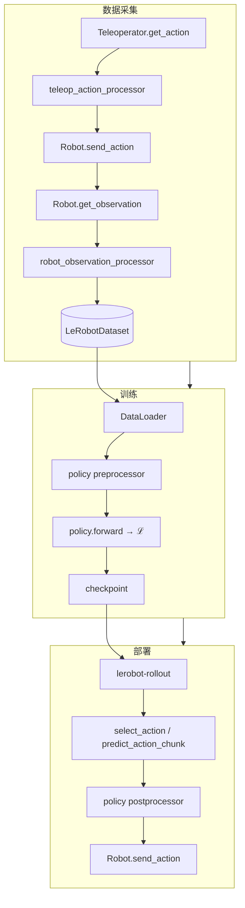

# LeRobot 技术文档索引

> 版本：基于 LeRobot **0.5.2**（`src/lerobot/`）  
> 面向开发者与研究者：架构、**完整 API**、**算法原理与公式**、论文与开源链接。  
> 用户安装教程：[Hugging Face 文档](https://huggingface.co/docs/lerobot/index)

---

## 文档地图

| 章节 | 文件 | 主题 |
|------|------|------|
| **总览** | [01-architecture-overview.md](./01-architecture-overview.md) | 整体架构、数据流、模块关系、设计权衡 |
| **核心抽象** | [02-core-types-and-config.md](./02-core-types-and-config.md) | `EnvTransition`、ChoiceRegistry、全部注册表 |
| **数据集** | [03-dataset-system.md](./03-dataset-system.md) | LeRobotDataset v3、读写 API、视频编解码 |
| **处理器** | [04-processor-pipeline.md](./04-processor-pipeline.md) | 30 种 ProcessorStep、管道序列化 |
| **策略模型** | [05-policies.md](./05-policies.md) | 16 种策略架构、训练/推理 API、选型 |
| **训练与评估** | [06-training-evaluation.md](./06-training-evaluation.md) | train/eval 流程、优化器、Accelerate |
| **硬件层** | [07-hardware-layer.md](./07-hardware-layer.md) | Robot / Teleoperator / Camera / Motors |
| **仿真环境** | [08-environments.md](./08-environments.md) | 12 种 EnvConfig、HIL-SERL |
| **部署推理** | [09-rollout-inference.md](./09-rollout-inference.md) | Rollout、Sync/RTC、gRPC |
| **CLI 参考** | [10-cli-reference.md](./10-cli-reference.md) | 18 个命令行入口 |
| **扩展模块** | [11-advanced-modules.md](./11-advanced-modules.md) | 奖励模型、RL、标注、utils |
| **完整 API** | [12-core-api-reference.md](./12-core-api-reference.md) | **基类全部 public 方法**（无遗漏） |
| **算法与数学** | [13-algorithms-and-mathematics.md](./13-algorithms-and-mathematics.md) | **损失函数、公式推导、论文/项目链接** |

---

## 阅读路径

| 目标 | 推荐顺序 |
|------|----------|
| 快速理解项目 | 01 → 02 → README 数据流图 |
| 实现自定义 Robot | 07 → **12** → 02 §插件 |
| 训练/微调策略 | **13** → 05 → 06 → 04 |
| 真机部署 VLA | **13** §Flow/RTC → 09 → 04 |
| API 速查 | **12** |
| 算法/论文调研 | **13** |

---

## 知识覆盖说明

本文档集按以下原则组织，避免「只列名词、漏函数」：

1. **API 层**：[12-core-api-reference.md](./12-core-api-reference.md) 对 9 个核心基类列出 **每一个 public 方法/属性** 及用途。
2. **算法层**：[13-algorithms-and-mathematics.md](./13-algorithms-and-mathematics.md) 对 16 种策略 + 4 种奖励模型给出 **损失公式、推导要点、论文与开源链接**。
3. **系统层**：01–11 章描述模块边界、调用链、示例命令与代码。

---

## 端到端数据流



---

## 源码目录

```
src/lerobot/
├── configs/ policies/ datasets/ processor/
├── robots/ teleoperators/ cameras/ motors/
├── envs/ rollout/ async_inference/
├── rewards/ rl/ scripts/ optim/ utils/
└── types.py
```

---

## 外部资源

| 资源 | 链接 |
|------|------|
| 官方文档 | https://huggingface.co/docs/lerobot/index |
| GitHub | https://github.com/huggingface/lerobot |
| Hub 数据集 | https://huggingface.co/lerobot |
| Discord | https://discord.gg/q8Dzzpym3f |
| SO-101 中文教程 | https://zihao-ai.feishu.cn/wiki/space/7589642043471924447 |

---

## 与 `docs/source/` 的关系

| 路径 | 定位 |
|------|------|
| `docs/source/*.mdx` | 安装、硬件图文、单策略 README（面向终端用户） |
| `docs/technical/` | **本系列**——架构、API、算法（面向开发者/研究者） |

建议：**13（算法）+ 12（API）** 作进阶速查；**01–06** 作系统导读。
