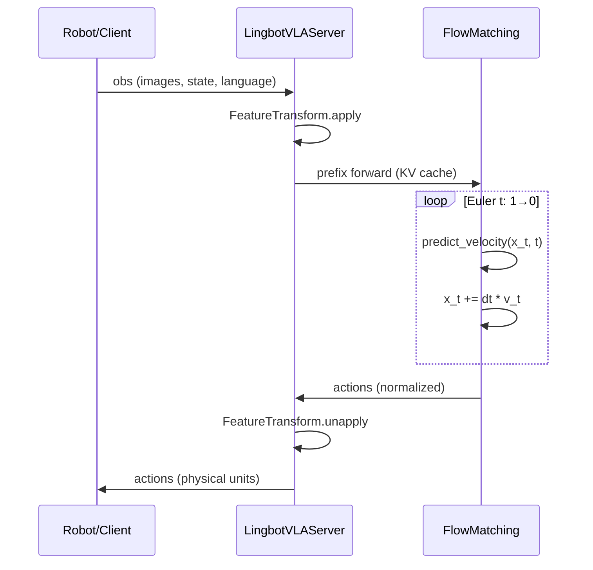

# 1. 架构总览

## 1.1 代码库目录结构

```
lingbot-vla/
├── lingbotvla/                 # 核心 Python 包
│   ├── models/                 # 模型定义与权重 IO
│   │   ├── vla/pi0/            # LingBot-VLA / PI0 策略实现
│   │   └── vla/vision_models/  # 深度对齐头、MoGe 工具
│   ├── data/                   # 通用 + VLA 数据管道
│   ├── distributed/            # FSDP、序列并行、DeviceMesh
│   ├── ops/                    # Attention、MoE、group_gemm
│   ├── optim/                  # AdamW、LR Scheduler
│   ├── checkpoint/             # DCP / bytecheckpoint
│   ├── schedulers/             # FlowMatchScheduler（通用，PI0 未直接使用）
│   └── utils/                  # 参数解析、归一化、日志
├── tasks/vla/
│   └── train_lingbotvla.py     # VLA 训练主入口
├── deploy/                     # WebSocket 推理服务
├── configs/
│   ├── vla/                    # 训练 YAML
│   └── robot_configs/          # 机器人特征映射
├── scripts/                    # 归一化、评估、下载、DCP 转换
└── experiment/                 # Libero、RoboTwin 评测脚本
```

### 模块边界说明

| 边界 | 内侧职责 | 外侧职责 |
|------|----------|----------|
| `data/` ↔ `models/` | Dataset 输出统一 tensor 字典 | Model 不关心 LeRobot 原始 key |
| `models/` ↔ `distributed/` | 定义 `nn.Module` 结构 | FSDP 按层 wrap，不改 forward 语义 |
| `models/` ↔ `deploy/` | `sample_actions()` API | 观测预处理、WebSocket 协议 |
| `configs/` ↔ 运行时 | 声明超参与特征名 | `parse_args()` 合并 CLI 覆盖 |

---

## 1.2 端到端数据流

### 训练路径

```mermaid
sequenceDiagram
    participant LR as LeRobotDataset
    participant FT as FeatureTransform
    participant DL as DataLoader
    participant M as FlowMatching
    participant L as Loss

    LR->>FT: raw frame (state, action, images, task)
    FT->>FT: convert_features + normalize + pad
    FT->>DL: sample dict
    DL->>M: batch (images, state, actions, lang_tokens, ...)
    M->>M: sample t, noise; x_t = t*noise + (1-t)*actions
    M->>M: QwenvlWithExpert → v_t
    M->>L: MSE(v_t, noise-actions) [+ depth loss]
```

### 推理路径



---

## 1.3 模型注册与构建

### `registry.py` — 自动发现

- 扫描 `lingbotvla.models.vla` 包
- 读取各模块的 `ModelClass` 属性（如 `LingbotVlaPolicy`）
- `get_registry().get_model_cls(name)` 按类名获取

### `auto.py` — `build_foundation_model()`

将训练 CLI/YAML 中的 VLA 超参注入 `PI0Config` / 自定义 config：

| 注入参数 | 含义 |
|----------|------|
| `n_action_steps` | 来自 `chunk_size`，动作预测步长 |
| `max_action_dim`, `max_state_dim` | padding 维度 |
| `attention_implementation` | `flex` / `eager` |
| `align_params` | 深度对齐配置 dict |
| `loss_type` | `fm` (MSE) / `L1_fm` |
| `freeze_vision_encoder`, `train_expert_only` | 冻结策略 |

### `module_utils.py` — 权重加载

| 函数 | 作用 |
|------|------|
| `load_model_weights()` | 支持 post_training 严格加载、VLM-only 部分加载 |
| `save_model_weights()` | 分片 safetensors 保存（默认 5GB/片） |
| `get_model_prefix()` | 识别 `qwenvl_with_expert` 前缀 |

---

## 1.4 核心类关系

```
PreTrainedPolicy (LeRobot)
    └── LingbotVlaPolicy
            └── model: FlowMatching
                    ├── qwenvl_with_expert: QwenvlWithExpertModel
                    │       ├── qwenvl: Qwen2_5_VLForConditionalGeneration
                    │       └── qwen_expert: Qwen2ForCausalLM (无 embed_tokens)
                    ├── state_proj, action_in_proj, action_out_proj
                    ├── action_time_mlp_* 或 separate time_mlp
                    └── depth_align_head (optional)
```

**PI0 变体**（`modeling_pi0.py`）结构类似，骨干换为 `PaliGemmaWithExpertModel`。

---

## 1.5 Token 序列布局

### Prefix（VLM 流，hidden=2048）

```
[img_cam0_tokens | img_cam1_tokens | img_cam2_tokens | (depth_query_tokens×3)? | lang_tokens]
```

- 图像 token 数 ≈ `(H/patch) × (W/patch) / merge_size²` 每相机
- Depth query 模式：每相机后插 `num_task_tokens` 个可学习 query
- `att_masks=0` → prefix 内双向注意力（非 causal）

### Suffix（Expert 流，hidden=768）

```
[state_token | action_token_1 | ... | action_token_chunk_size]
```

- `att_masks[:, :2] = True`：state 与第一个 action 块边界；action 块内双向
- Prefix **不能** attend 到 suffix；suffix **可以** attend 到 prefix（通过拼接后的 2D mask）

---

## 1.6 训练入口 `train_lingbotvla.py` 流程

1. `parse_args(Arguments)` — 合并 YAML + CLI
2. `init_parallel_state()` — DeviceMesh (FSDP/DP/SP/TP/EP)
3. `build_foundation_model()` — 加载预训练权重
4. （可选）`build_depth_model()` — MoGe + MoRGBD 冻结教师
5. `VLADataset` + `build_dataloader(VLADataCollatorWithPacking)`
6. `build_parallelize_model()` — FSDP2 wrap
7. `build_optimizer()` / `build_lr_scheduler()`
8. 训练循环：micro-batch 梯度累积 → forward → backward → clip → step
9. `Checkpointer.save()` + 可选导出 `hf_ckpt/`

---

## 1.7 与外部生态集成

| 组件 | 版本/来源 | 用途 |
|------|-----------|------|
| LeRobot | v3.0 | 数据集格式、`PreTrainedPolicy` 基类 |
| Qwen2.5-VL-3B | HuggingFace | VLM 预训练权重 |
| MoGe-2-vitb-normal | Ruicheng/moge-2-vitb-normal | 单目深度估计 |
| LingBot-Depth (MoRGBD) | robbyant/lingbot-depth-pretrain-vitl-14 | 深度特征教师 |
| PyTorch | 2.8.0 | Flex Attention、FSDP2 composable API |
| draccus | — | YAML dataclass 解析 |

---

## 1.8 性能与扩展点

**吞吐优化来源：**

- 按 decoder/vision block 粒度 FSDP2 分片
- Action Expert 使用 `torch.compile` 的 Flex Attention
- Qwen-VL backbone 使用 Flash Attention 2
- 可选 activation offloading（`distributed/offloading.py`）

**常见扩展：**

| 需求 | 修改位置 |
|------|----------|
| 新机器人 | `configs/robot_configs/<name>.yaml` + norm stats |
| 新损失 | `FlowMatching.forward()` |
| 新相机数 | `data.cameras` + model config |
| 更快推理 | 减少 `num_denoising_step`，`--use_compile` |
| 冻结 VLM | `train_expert_only: true` |
