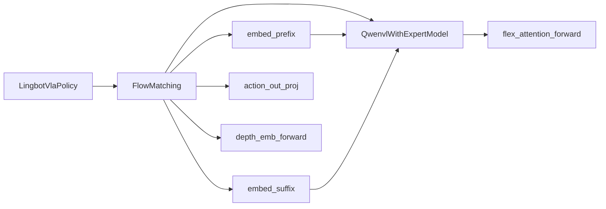

# 3. 核心模型模块详解

本章按类/函数逐项解读 `lingbotvla/models/vla/pi0/` 及相关基础设施，确保无遗漏。

**主文件：** `modeling_lingbot_vla.py`（约 1900 行）

---

## 3.1 `LingbotVlaPolicy`

**位置：** `modeling_lingbot_vla.py` L1372–1442  
**注册：** `ModelClass = LingbotVlaPolicy`

LeRobot `PreTrainedPolicy` 子类，对外暴露标准 policy API。

| 方法 | 说明 |
|------|------|
| `__init__(config)` | 创建 `FlowMatching(config, eval=False)` |
| `forward(...)` | 委托 `self.model(...)`，返回 loss |
| `select_action(...)` | 推理时调用 `sample_actions`（deploy 层封装） |

---

## 3.2 `FlowMatching`

**位置：** L1444–1901  
**职责：** 动作 Flow Matching 全流程 + 可选深度对齐

### 3.2.1 `__init__(config, eval)`

| 子模块 | 配置来源 | 说明 |
|--------|----------|------|
| `QwenvlWithExpertModel` | `QwenvlWithExpertConfig` | VLM+Expert 融合骨干 |
| `state_proj` | `Linear(max_state_dim → proj_width)` | 本体状态投影 |
| `action_in_proj` | `Linear(max_action_dim → proj_width)` | 噪声/动作投影 |
| `action_out_proj` | `Linear(proj_width → max_action_dim)` | 速度场输出 |
| `action_time_mlp_in/out` | 默认 | concat(action, time) 融合 |
| `time_mlp_in/out` | `separate_time_proj=True` | 时间独立 MLP |
| `depth_align_head` | `align_params != {}` | 深度对齐 |

**`set_requires_grad()`：** 仅 `state_proj` 受 `train_state_proj` 控制（必须为 True）。

### 3.2.2 `init_depth_heads(config)`

| `align_type` | 组件 | 输出 |
|--------------|------|------|
| `"direct"` | `nn.Sequential(Linear→GELU→Linear)` | 直接从 image hidden 预测 depth embedding |
| `"query"` | `depth_align_embs` (Parameter) + `TaskTokenDepthHead` | 可学习 query + Perceiver 交叉注意力 |

### 3.2.3 `_init_weights(module)`

Linear/Conv3d/Embedding 权重 $\mathcal{N}(0, \text{initializer\_range})$。

### 3.2.4 `sample_time(bsize, device)`

Beta(1.5,1.0) → $[0.001, 0.999]$。见 [02-flow-matching-algorithms.md](./02-flow-matching-algorithms.md)。

### 3.2.5 `embed_prefix(images, img_masks, lang_tokens, lang_masks, vlm_causal, label=None)`

**步骤：**

1. `embed_image(images)` → `(B, N_cam * num_patch, 2048)`
2. （query 模式）插入 `3 × num_task_tokens` 个 align embedding
3. `embed_language_tokens(lang_tokens)` → `(B, L_lang, 2048)`
4. `torch.cat` 得 prefix embeddings 与 pad_masks
5. 设置 `att_masks`：非 causal 全 0；causal 全 1

**返回：** `(embs, pad_masks, att_masks)`

### 3.2.6 `embed_suffix(state, noisy_actions, timestep)`

**步骤：**

1. `state_proj(state)` → `(B, 768)` → unsqueeze → `(B, 1, 768)`
2. `create_sinusoidal_pos_embedding(timestep)` → time emb
3. `action_in_proj(noisy_actions)` → `(B, chunk_size, 768)`
4. MLP 融合 time + action
5. cat `[state_emb, action_time_emb]`；设置 suffix att_masks（`:2 = True`）

**返回：** `(time_emb_ori, embs, pad_masks, att_masks)`

### 3.2.7 `forward(...)`

**训练主路径：**

```
noise ~ N(0,I), time ~ sample_time()
x_t = t*noise + (1-t)*actions
u_t = noise - actions
prefix, suffix → QwenvlWithExpert → suffix_out[:, -n_action_steps:]
v_t = action_out_proj(suffix_out)
loss = MSE/L1(u_t, v_t)
+ depth_loss (optional)
```

**参数：**

| 参数 | 形状 | 说明 |
|------|------|------|
| `images` | `(B, N, C, H, W)` | 多相机 |
| `state` | `(B, max_state_dim)` | 归一化状态 |
| `actions` | `(B, chunk_size, max_action_dim)` | GT 动作 |
| `depth_targets` | 可选 | MoRGBD 教师特征 |

### 3.2.8 `sample_actions(...)`

推理入口；prefix KV cache + Euler 循环。见算法章。

### 3.2.9 `predict_velocity(state, prefix_pad_masks, past_key_values, x_t, timestep)`

单步去噪：仅 forward suffix，`inputs_embeds=[None, suffix_embs]`，拼接 prefix pad 到 attention mask。

### 3.2.10 `make_att_2d_masks_with_query(att_2d_masks, prefix_len, img_masks)`

Depth query 模式的精细 mask 规则（每相机 query 只看对应 image patch）。

### 3.2.11 `depth_emb_forward(hidden_states, depth_targets, img_masks)`

- **direct：** 取前 `3*chunk_size` image tokens → `depth_align_head`
- **query：** image + align query tokens → `TaskTokenDepthHead`

### 3.2.12 `_emb_loss(emb_preds, emb_targets)`

| 模式 | 损失 |
|------|------|
| direct | L1 + cosine similarity matrix L1（对比结构） |
| query | Smooth L1 |

---

## 3.3 `QwenvlWithExpertModel`

**位置：** L1088–1366  
**配置：** `QwenvlWithExpertConfig` (L907–1041)

### 3.3.1 默认维度

| 组件 | hidden_size | layers | heads |
|------|-------------|--------|-------|
| Qwen2.5-VL (VLM) | 2048 | 36 | 16 |
| Qwen2 Expert | 768 | 36 | 16 |
| head_dim | 128 | — | — |

### 3.3.2 `__init__(config, eval)`

- 加载 `Qwen2_5_VLForConditionalGeneration`（FA2）
- 加载 `Qwen2ForCausalLM` expert，**删除** `embed_tokens`
- 可选 `replace_lnorm_with_adanorm` 于 expert
- `get_attention_interface()` → flex/eager

### 3.3.3 `set_requires_grad()` / `train(mode)`

- `freeze_vision_encoder` → visual 全部 `requires_grad=False`，eval 模式
- `train_expert_only` → 整个 qwenvl 冻结

### 3.3.4 `get_image_features(pixel_values, image_grid_thw)`

调用 Qwen ViT，`spatial_merge_size=2`，输出 per-image token 序列。

### 3.3.5 `embed_image(image, patch_size=14, temporal_patch_size=2)`

从 flatten patch 推断 `grid_thw`，调用 `get_image_features`。

### 3.3.6 `embed_language_tokens(tokens)`

`self.qwenvl.model.embed_tokens(tokens)`

### 3.3.7 `handle_kv_cache(key_states, value_states, layer_idx, past_key_values, use_cache, fill_kv_cache)`

- `fill_kv_cache=True`：存储当前层 K/V
- 否则：与 cache concat 沿 seq 维

### 3.3.8 `forward(...)`

核心 36 层共享注意力循环（见架构章）。  
**返回：** `(outputs_embeds: [prefix_out, suffix_out], past_key_values)`

### 3.3.9 `get_attention_interface()`

| 值 | 实现 |
|----|------|
| `flex` | `flex_attention_forward` |
| `eager` | `our_eager_attention_forward` |
| `fa2` | NotImplemented |
| `xformer` | NotImplemented |

---

## 3.4 Qwen2 Expert 子模块

### 3.4.1 `Qwen2DecoderLayer` (L265–343)

**双模式 forward：**

| 模式 | 参数 | 返回 |
|------|------|------|
| `compute_kqv=True` | hidden_states, ada_cond?, norm_qkv? | Q, K, V, gate |
| `output_atten=True` | hidden_states, att_output, start, end | MLP 后 hidden |

### 3.4.2 `Qwen2Model` (L494–633)

36 层 decoder stack，无 embedding（由外部注入 `inputs_embeds`）。

### 3.4.3 `Qwen2ForCausalLM` (L789–905)

包装 `Qwen2Model`；VLA 中不使用 lm_head 生成 token。

### 3.4.4 `AdaRMSNorm` (L1043–1076)

$\gamma(c), \beta(c)$ 来自 time cond；用于 expert layer norm。

### 3.4.5 辅助函数

| 函数 | 作用 |
|------|------|
| `rotate_half(x)` | RoPE 旋转半维 |
| `apply_rotary_pos_emb(q,k,cos,sin)` | HF 标准 RoPE |
| `repeat_kv(hidden_states, n_rep)` | GQA KV 扩展 |
| `eager_attention_forward(...)` | HF 风格 eager attn（decoder 内部） |

---

## 3.5 `qwenvl_in_vla.py` — Qwen2.5-VL 定制

VLA 专用 vendored 实现，支持 `compute_kqv` / `output_atten` 分离。

### 主要类

| 类 | 行号区间 | 职责 |
|----|----------|------|
| `Qwen2_5_VisionPatchEmbed` | ~58 | Conv3d patch embedding |
| `Qwen2_5_VisionTransformerPretrainedModel` | ~325 | 32-block ViT，window + full attn |
| `Qwen2_5_VLDecoderLayer` | ~816 | 双模式 decoder layer |
| `Qwen2_5_VLModel` | ~908 | 36-layer LLM + M-RoPE |
| `Qwen2_5_VLForConditionalGeneration` | ~1318 | visual + model + lm_head |

**Vision 输出：** `(total_tokens, out_hidden_size=2048)`

**M-RoPE：** 多模态 3D position ids (t, h, w)，见 `get_rope_index()`。

---

## 3.6 `flex_attention.py`

### `flex_attention_forward(query_states, key_states, value_states, attention_mask)`

- 输入 layout: `(B, L, H, D)`
- Pad L 至 128 倍数
- `create_block_mask` + `flex_attention` compiled
- 输出: `(B, L, H*D)`

---

## 3.7 `modeling_pi0.py` — PaliGemma 变体

| 类 | 对应 LingBot 类 |
|----|-----------------|
| `PaliGemmaWithExpertModel` | `QwenvlWithExpertModel` |
| `PI0FlowMatching` | `FlowMatching`（无 depth/ada） |
| `PI0Policy` | `LingbotVlaPolicy` |

Expert hidden=1024；image embed 乘 $\sqrt{d}$。

---

## 3.8 基础设施模块

### `registry.py`

```python
class _ModelRegistry:
    def _scan_models(self):
        # walk lingbotvla.models.vla, find ModelClass
def get_registry() -> _ModelRegistry  # lru_cache singleton
```

### `auto.py` 关键函数

| 函数 | 说明 |
|------|------|
| `build_tokenizer(path)` | AutoTokenizer, padding_side=right |
| `build_processor(path)` | AutoProcessor（Qwen VL） |
| `build_foundation_model(...)` | 完整模型构建 + 权重加载 |

**assert `train_state_proj is True`**

### `modeling_layers.py`

`GradientCheckpointingLayer` — 包装 forward 支持 gradient checkpointing（要求 positional args）。

### `module_utils.py`

| 函数 | 说明 |
|------|------|
| `init_empty_weights()` | meta device 上下文 |
| `StateDictIterator` | 遍历 safetensors 分片 |
| `_load_state_dict()` | 解析 HF 权重路径 |
| `load_model_weights()` | 加载并 remap expert_visual 前缀 |
| `save_model_weights()` | 分片保存 bf16 |

---

## 3.9 配置类 `QwenvlWithExpertConfig`

| 字段 | 默认值 | 说明 |
|------|--------|------|
| `attention_implementation` | flex | 共享注意力后端 |
| `freeze_vision_encoder` | False | 冻结 ViT |
| `train_expert_only` | False | 冻结 VLM |
| `adanorm_time` | False | Expert AdaRMSNorm |
| `separate_time_proj` | False | 时间 MLP 分离 |
| `norm_qkv` | False | Q/K LayerNorm |
| `use_lm_head` | False | 保留 VLM lm_head |
| `use_cache` | True | KV cache |

---

## 3.10 调用关系图



---

## 3.11 典型 config 字段（PI0Config 扩展）

训练 YAML / `lingbotvla_cli.yaml` 中常见：

```yaml
chunk_size: 50              # → n_action_steps
max_action_dim: 75
max_state_dim: 75
num_steps: 10               # 推理 Euler 步数
attention_implementation: flex
loss_type: L1_fm
freeze_vision_encoder: false
align_params: {}            # 非空则启用 depth
```

> **迁移提示：** 2026/05/01 前 checkpoint 的部分字段已从 `config.json` 移至 `lingbotvla_cli.yaml` 的 `train` 段，见 README。
