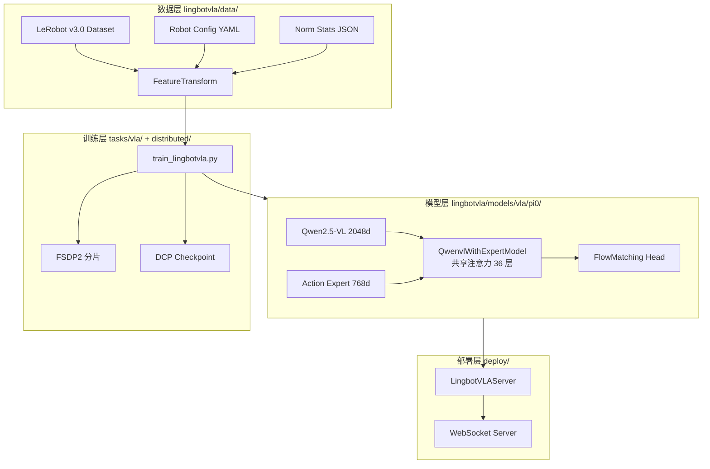

# LingBot-VLA 技术文档

> 本文档基于 LingBot-VLA 代码库（`lingbotvla/`、`tasks/`、`deploy/`、`configs/`）编写，面向需要理解实现细节、二次开发或部署的工程师与研究者。

## 文档索引

| 章节 | 文件 | 内容概要 |
|------|------|----------|
| **0. 总览** | [README.md](./README.md)（本页） | 项目定位、整体架构、模块关系、适用场景对比 |
| **1. 架构总览** | [01-architecture-overview.md](./01-architecture-overview.md) | 目录结构、数据流、训练/推理链路、设计取舍 |
| **2. 流匹配与算法原理** | [02-flow-matching-algorithms.md](./02-flow-matching-algorithms.md) | Flow Matching 数学推导、PI0 风格实现、注意力掩码、RoPE |
| **3. 核心模型模块** | [03-core-model-modules.md](./03-core-model-modules.md) | `LingbotVlaPolicy`、`QwenvlWithExpertModel`、各函数/类完整解读 |
| **4. 视觉与深度对齐** | [04-vision-and-depth.md](./04-vision-and-depth.md) | Qwen2.5-VL 视觉塔、Depth Head、Resampler、MoGe/MoRGBD |
| **5. 数据流水线** | [05-data-pipeline.md](./05-data-pipeline.md) | LeRobot v3.0、`FeatureTransform`、归一化、Collator |
| **6. 训练与分布式** | [06-training-system.md](./06-training-system.md) | FSDP2、Checkpoint、优化器、训练循环 |
| **7. 部署与评估** | [07-deployment-evaluation.md](./07-deployment-evaluation.md) | WebSocket 服务、开环评估、推理优化 |
| **8. 配置参考** | [08-configuration-reference.md](./08-configuration-reference.md) | YAML 参数、Robot Config、训练场景对比 |

**相关已有文档：**

- [Training Configuration Guide](../config/config.md) / [configs/vla/Training_Config.md](../../configs/vla/Training_Config.md)
- [Custom Data Guide](../../lingbotvla/data/vla_data/README.md)
- [RoboTwin 实验说明](../../experiment/robotwin/README.md)
- [技术报告 PDF](../../assets/LingBot-VLA.pdf) / [ArXiv:2601.18692](https://arxiv.org/abs/2601.18692)

---

## 1. 项目定位

**LingBot-VLA** 是一个面向真实机器人场景的 **Vision-Language-Action (VLA) 基础模型** 及其高效训练/部署代码库。核心特点：

| 维度 | 说明 |
|------|------|
| **模型范式** | PI0 风格：预训练 VLM（Qwen2.5-VL-3B）+ 小型 Action Expert（768 维 Qwen2）+ **共享跨流注意力** |
| **动作生成** | **Conditional Flow Matching**：训练预测速度场 $v_t$，推理 Euler 积分去噪 |
| **数据规模** | 预训练约 20,000 小时真实双臂数据（9 种机器人配置） |
| **深度增强** | 可选 Depth 蒸馏分支：MoGe-2 + MoRGBD 教师，Query/Direct 两种对齐模式 |
| **训练效率** | 相对现有 VLA 代码库约 **1.5–2.8×** 吞吐提升（FSDP2 + Flex Attention + 工程优化） |

---

## 2. 整体架构

### 2.1 系统分层



### 2.2 训练时张量流（单样本）

```
观测: images (N_cam, C, H, W), state (max_state_dim), task text
  ↓ FeatureTransform
lang_tokens, actions (chunk_size, max_action_dim)
  ↓ embed_prefix: 图像 token + 语言 token → prefix (B, L_prefix, 2048)
  ↓ embed_suffix: state + noisy_actions(x_t) + time → suffix (B, L_suffix, 768)
  ↓ QwenvlWithExpertModel: 36 层共享 Q/K/V 注意力
  ↓ action_out_proj → v_t
  ↓ Loss: MSE/L1(v_t, u_t), u_t = noise - actions
```

### 2.3 推理时张量流

```
1. embed_prefix + forward(fill_kv_cache=True) → 缓存 prefix KV
2. x_t ← N(0, I), t ← 1.0
3. loop: v_t = predict_velocity(x_t, t); x_t += dt * v_t; t += dt
4. FeatureTransform.unapply → 反归一化 + 关节映射
```

---

## 3. 模块关系与职责

| 模块路径 | 主题 | 与其他模块关系 |
|----------|------|----------------|
| `lingbotvla/models/vla/pi0/modeling_lingbot_vla.py` | **主策略模型** | 依赖 `qwenvl_in_vla.py`、`utils.py`、`flex_attention.py`、vision align heads |
| `lingbotvla/models/vla/pi0/qwenvl_in_vla.py` | Qwen2.5-VL 视觉+语言 | 被 `QwenvlWithExpertModel` 作为 VLM 流 |
| `lingbotvla/models/auto.py` | 模型工厂 | 读取 config，注入 VLA 超参，调用 `registry` |
| `lingbotvla/data/vla_data/` | VLA 数据集 | 输出 batch 供 `train_lingbotvla.py` |
| `lingbotvla/distributed/torch_parallelize.py` | FSDP 封装 | 包裹 `LingbotVlaPolicy` |
| `lingbotvla/schedulers/flow_match.py` | 通用 FlowMatch 调度器 | **当前 PI0 路径未使用**，内联实现更简单线性路径 |
| `deploy/lingbot_vla_policy.py` | 推理服务 | 加载 HF checkpoint，WebSocket 对外 |

---

## 4. 设计取舍与适用场景

### 4.1 LingBot-VLA vs PI0 (PaliGemma) 变体

代码库同时提供两套实现：

| 对比项 | LingBot-VLA (`modeling_lingbot_vla.py`) | PI0 Baseline (`modeling_pi0.py`) |
|--------|----------------------------------------|----------------------------------|
| VLM 骨干 | Qwen2.5-VL-3B (2048d) | PaliGemma-3B (2048d) |
| Action Expert | Qwen2 768d | Gemma 1024d |
| 时间条件 | AdaRMSNorm / separate_time_proj 可选 | 简单 MLP 融合 |
| 深度对齐 | ✅ direct / query 模式 | ❌ |
| 注意力 | flex / eager | 同类接口 |
| **适用** | 生产主路径、中文/多模态、Depth 版 | 对照实验、PaliGemma 生态 |

### 4.2 有/无 Depth 版本

| | w/o Depth | w/ Depth |
|--|-----------|----------|
| 输入 | RGB 三相机 | RGB + 深度教师蒸馏 |
| 额外损失 | 无 | L1/Smooth L1 + 可选对比损失 |
| 适用 | 仿真 RoboTwin、算力受限 | 真实机器人、遮挡/精度敏感任务 |
| 配置 | `robotwin_load20000h.yaml` | `robotwin_load20000h_depth.yaml` |

### 4.3 训练并行策略

| 策略 | 默认 VLA | MoE 大模型 |
|------|----------|------------|
| FSDP2 | ✅ 默认 | ✅ |
| Ulysses SP | 关闭 (`ulysses_parallel_size: 1`) | 长序列可用 |
| group_gemm / fused_moe | 未用于 VLA | MoE+EP 场景 |

### 4.4 优缺点摘要

**优点：**

- 共享注意力使 VLM 语义与动作 Expert 每层对齐，利于细粒度操控
- Flow Matching 推理步数可调（5–10 步），比扩散采样更快
- FSDP2 + torch.compile 工程化成熟，支持大规模 post-training
- LeRobot v3.0 + Robot Config 解耦，适配新机器人成本低

**局限：**

- 固定 `chunk_size` 动作块，需 action chunking 执行策略
- Qwen2.5-VL 要求 `rmpad: false`，无法使用文本侧动态 packing
- 深度分支依赖 MoGe/MoRGBD 额外权重与算力
- 单卡部署，无分布式推理

---

## 5. 快速代码导航

```python
# 构建模型（训练）
from lingbotvla.models import build_foundation_model
model = build_foundation_model(config_path=..., weights_path=...)

# 训练入口
# bash train.sh tasks/vla/train_lingbotvla.py configs/vla/robotwin_load20000h.yaml ...

# 推理
from deploy.lingbot_vla_policy import LingbotVLAServer
server = LingbotVLAServer(path_to_pi_model="output/checkpoints/.../hf_ckpt")
```

---

## 6. 关键论文与开源参考

| 主题 | 引用 |
|------|------|
| LingBot-VLA | [A Pragmatic VLA Foundation Model (arXiv:2601.18692)](https://arxiv.org/abs/2601.18692) |
| PI0 / VLA Flow | [π₀: A Vision-Language-Action Flow Model (arXiv:2410.24164)](https://arxiv.org/abs/2410.24164) |
| Flow Matching | [Lipman et al., ICLR 2023 (arXiv:2210.02747)](https://arxiv.org/abs/2210.02747) |
| Qwen2.5-VL | [Qwen2.5-VL Technical Report](https://github.com/QwenLM/Qwen2.5-VL) |
| LeRobot | [huggingface/lerobot](https://github.com/huggingface/lerobot) |
| VeOmni 训练框架 | [VeOmni (arXiv:2508.02317)](https://arxiv.org/abs/2508.02317) |
| OpenPI 参考实现 | [Physical-Intelligence/openpi](https://github.com/Physical-Intelligence/openpi) |
| Perceiver Resampler | [Flamingo (Alayrac et al.)](https://github.com/mlfoundations/open_flamingo) |

---

## 7. 阅读建议

1. **入门**：本页 → [01-architecture-overview.md](./01-architecture-overview.md) → [08-configuration-reference.md](./08-configuration-reference.md)
2. **算法深入**：[02-flow-matching-algorithms.md](./02-flow-matching-algorithms.md) → [03-core-model-modules.md](./03-core-model-modules.md)
3. **数据定制**：[05-data-pipeline.md](./05-data-pipeline.md) + [Custom Data Guide](../../lingbotvla/data/vla_data/README.md)
4. **上线部署**：[07-deployment-evaluation.md](./07-deployment-evaluation.md)
