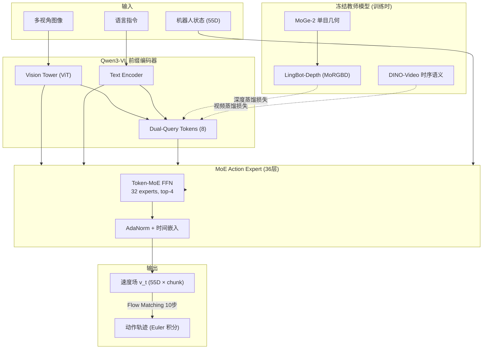
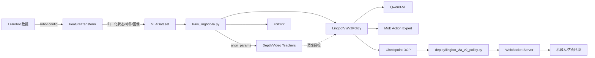

# 0. 总体架构与知识结构

## 0.1 项目定位

**LingBot-VLA 2.0** 是一个 **Vision-Language-Action (VLA)** 基础模型：给定多视角图像观测、机器人本体状态与自然语言指令，预测未来一段动作轨迹（action chunk），驱动机器人完成任务。

与通用 VLM（只做视觉-语言理解）不同，VLA 在 VLM 之上增加了 **动作生成头（Action Expert）**，并通过大规模机器人轨迹数据预训练，获得跨任务、跨本体（embodiment）的泛化能力。

### 核心能力（相对 v1.0 的提升）

| 维度 | v1.0 | v2.0 |
|------|------|------|
| 预训练数据 | 较小规模 | ~60,000 小时（50k 机器人 + 10k 第一人称视频） |
| 动作空间 | 双臂为主 | 55 维统一空间（臂、EEF、夹爪、手、腰、头、底盘） |
| 动力学建模 | 无 | Dual-Query 蒸馏（深度几何 + 视频时序） |
| Action Expert | 稠密 Transformer | 36 层稀疏 MoE（32 experts, top-4） |
| 骨干 VLM | Qwen2.5-VL | Qwen3-VL-4B-Instruct |

---

## 0.2 系统架构总览



### 数据流（训练一步）

```
LeRobot 样本
  → FeatureTransform（robot config 映射 + 归一化）
  → VLADataCollator（批处理）
  → LingbotVlaV2Policy.forward()
      ├── 前缀：图像 + 语言 + query tokens → Qwen3-VL KV Cache
      ├── 后缀：状态 + 噪声动作 x_t + 时间 t → Action Expert
      ├── 损失：Flow Matching + 深度对齐 + 视频对齐 + MoE 辅助
      └── 反向传播 → FSDP2 分片更新
```

### 数据流（推理）

```
观测 (images, state, instruction)
  → FeatureTransform.apply()
  → sample_actions()
      ├── 前缀编码一次，缓存 KV
      └── 10 步 Euler 去噪 → 动作 chunk
  → FeatureTransform.unapply()（反归一化）
  → 机器人执行
```

---

## 0.3 模块划分与职责

| 模块 | 目录 | 职责 |
|------|------|------|
| **VLA 模型** | `lingbotvla/models/vla/lingbot_vla/` | Qwen3-VL + MoE Action Expert + Flow Matching |
| **视觉教师** | `lingbotvla/models/vla/vision_models/` | MoGe、LingBot-Depth、DINO-Video、对齐头 |
| **数据层** | `lingbotvla/data/vla_data/` | LeRobot 加载、特征映射、归一化、增强 |
| **分布式** | `lingbotvla/distributed/` | FSDP1/2、MoE EP、Ulysses 序列并行 |
| **算子** | `lingbotvla/ops/` | Fused MoE、Group GEMM、Triton 损失 |
| **训练** | `tasks/vla/train_lingbotvla.py` | 主训练循环、教师目标计算、日志 |
| **部署** | `deploy/` | 策略封装、WebSocket 服务 |
| **配置** | `configs/` | 训练 YAML、robot config、norm stats |

---

## 0.4 模块间关联



**关键依赖链：**

1. **Robot Config** 决定原始 LeRobot 字段如何映射到 55 维统一空间；必须与 `data.joints` / `data.cameras` 一致。
2. **Norm Stats** 由 `scripts/compute_norm_stats.py` 离线计算，训练与推理共用同一 JSON。
3. **Qwen3-VL 权重** 通过 `tokenizer_path` / `QWEN3VL_PATH` 加载，VLA checkpoint 仅含增量部分（Action Expert + 对齐头）。
4. **教师模型** 仅在训练时加载，推理阶段不需要 MoGe / DINO-Video。

---

## 0.5 技术选型对比

### VLA vs 传统模仿学习

| 方法 | 表征 | 泛化 | 语言条件 |
|------|------|------|----------|
| BC（行为克隆） | 小 MLP/CNN | 任务内 | 弱 |
| ACT / Diffusion Policy | Transformer + Diffusion | 单任务/单本体 | 可选 |
| **VLA（本仓库）** | 大 VLM + Flow Matching | 跨任务/跨本体 | 原生支持 |

### Flow Matching vs Diffusion（DDPM）

| 维度 | Diffusion (DDPM) | Flow Matching（本仓库） |
|------|------------------|-------------------------|
| 训练目标 | 预测噪声 ε | 预测速度场 v = ε − x |
| 插值路径 | 随机扩散 | 线性：x_t = t·ε + (1−t)·x |
| 推理 | 多步去噪（通常 50–1000） | Euler 积分（默认 10 步） |
| 采样效率 | 较低 | 较高（~130ms @ RTX 4090D） |
| 实现复杂度 | 需噪声调度器 | 直接 ODE 积分 |

详见 [02-flow-matching.md](./02-flow-matching.md)。

### MoE vs 稠密 Action Expert

| 维度 | 稠密 FFN | Token-MoE（v2.0） |
|------|----------|-------------------|
| 参数量 | 固定 | 32 experts，激活 top-4 |
| 跨本体泛化 | 共享全部容量 | 专家分工（通用 + 专用） |
| 计算量 | 全量 FFN | 稀疏激活，相近 FLOPs |
| 负载均衡 | N/A | Loss-free bias + 可选 z-loss |

### 真机 vs 仿真（RoboTwin）配置差异

| 配置项 | 真机 | RoboTwin 仿真 |
|--------|------|-----------------|
| `norm_type` | `meanstd` | `bounds_99_woclip` |
| `loss_type` | `fm`（MSE） | `L1_fm`（L1） |
| `subtract_state`（臂关节） | 推荐 `True`（相对动作） | `False`（绝对动作） |

---

## 0.6 适用场景

| 场景 | 是否适合 | 说明 |
|------|----------|------|
| 双臂操作（RoboTwin） | ✅ 开箱即用 | 提供 50 任务配置与评估脚本 |
| 真机双臂（AgileX 等） | ✅ | `real_robot.yaml` + robot config 模板 |
| 移动操作（长时域） | ✅ | 55 维含 base/head/waist |
| 灵巧手高 DoF | ✅ | `hand.position` 12 维 |
| 无语言指令的纯视觉策略 | ⚠️ | 需构造空/固定 prompt |
| 极低延迟（<50ms） | ⚠️ | 可减少 `num_steps` 或 `use_compile` |
| 无 GPU 边缘部署 | ❌ | 需 6B 级模型 + CUDA |

---

## 0.7 仓库目录结构

```
lingbot-vla-v2/
├── lingbotvla/              # 核心 Python 包
│   ├── models/vla/          # VLA 模型（lingbot_vla, pi0, vision_models）
│   ├── data/vla_data/       # VLA 数据集
│   ├── distributed/         # 分布式训练
│   ├── ops/                 # MoE / GEMM 算子
│   ├── optim/               # AdamW / Muon
│   ├── checkpoint/          # DCP 检查点
│   └── utils/               # 参数解析、日志
├── tasks/vla/               # 训练脚本
├── deploy/                  # 推理部署
├── configs/                 # YAML 配置
│   ├── vla/                 # 训练配置
│   └── robot_configs/       # 机器人特征映射
├── assets/                  # norm stats、训练数据列表
├── scripts/                 # 工具脚本
├── experiment/robotwin/     # RoboTwin 评估
└── docs/                    # 本文档体系
```

---

## 0.8 推荐阅读顺序

1. **入门**：本文 → [01-model-architecture.md](./01-model-architecture.md) → [04-data-pipeline.md](./04-data-pipeline.md)
2. **算法深入**：[02-flow-matching.md](./02-flow-matching.md) → [03-dual-query-distillation.md](./03-dual-query-distillation.md)
3. **实操**：[05-training-system.md](./05-training-system.md) → [07-configuration.md](./07-configuration.md) → [06-inference-deployment.md](./06-inference-deployment.md)
4. **扩展阅读**：[08-references.md](./08-references.md)
