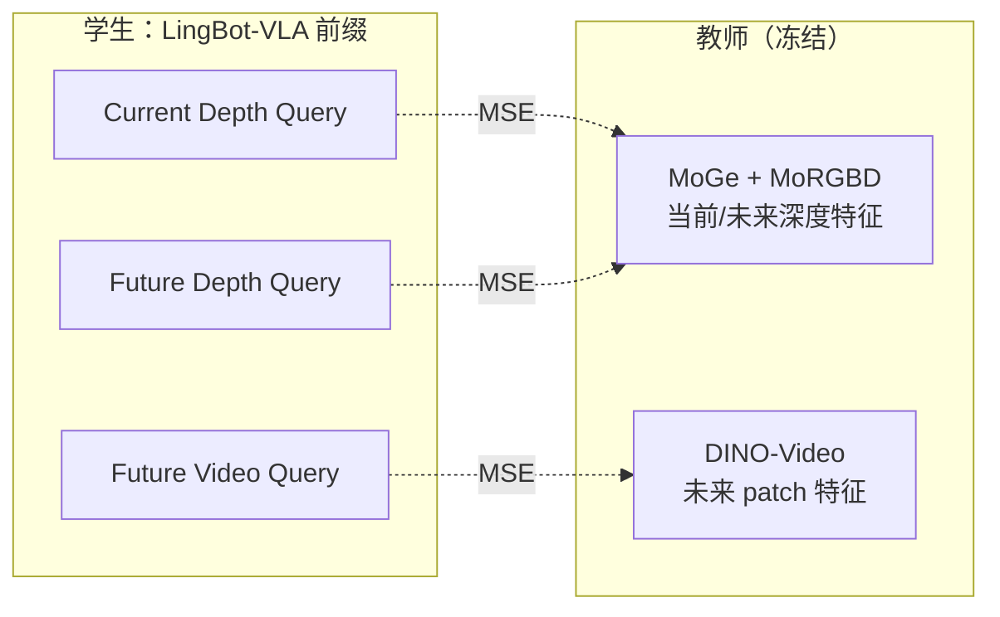

# 3. Dual-Query 蒸馏（深度与视频先验）

本章详解 LingBot-VLA 2.0 的 **Predictive Dynamics Modeling**：通过 Dual-Query Distillation，将几何深度先验（LingBot-Depth）与时序语义先验（DINO-Video）注入 VLA 前缀表征。

---

## 3.1 动机：为什么需要蒸馏

纯行为克隆（仅 Flow Matching 动作损失）的局限：

1. **缺乏 3D 几何理解**：2D 图像难以显式编码深度、遮挡、空间关系
2. **缺乏时序预测**：当前帧不足以推断「动作后果」，长时域任务易失败
3. **数据效率**：大 VLM 视觉特征偏向语义，未必对齐机器人操作所需的几何-动力学结构

**解决思路**：将预训练的 **深度模型** 与 **视频表征模型** 作为冻结教师，通过可学习 Query Token 的中间表征对齐，迫使 VLA 在因果推理时内化几何与时序知识。



---

## 3.2 Dual-Query Token 设计

### 3.2.1 结构

在 Qwen3-VL 前缀末尾追加 **`num_task_tokens=8`** 个可学习 embedding，经 Transformer 层后与教师特征对齐。

配置入口：`train.align_params`（见 `configs/vla/Training_Config.md`）

| Query 类型 | 监督信号 | 损失权重（默认） |
|------------|----------|------------------|
| Current depth | 当前帧 MoRGBD 深度 token | `depth_loss_weight=0.004` |
| Future depth | 未来帧 MoRGBD 深度 token | `future_depth_loss_weight=0.004` |
| Future video | 未来帧 DINO patch | `future_video_loss_weight=0.004` |
| Current video patch（可选） | 当前帧 DINO patch | 同上 video 权重 |

### 3.2.2 Resampler 对齐头

学生 query 维度（LLM hidden，如 2560）与教师特征维度（如 1024）不同，通过 **Resampler** 或 **Depth Head** 投影：

```python
# align_heads/resampler.py 概念
# 可学习 query tokens attend 到 backbone tokens，输出固定维度特征
class Resampler(nn.Module):
    def forward(self, student_queries, teacher_tokens):
        # Cross-attention: queries → teacher space
        return aligned_features  # [B, num_queries, dim_out]
```

配置示例：

```yaml
align_params:
  mode: 'query'
  num_task_tokens: 8
  depth:
    head_type: resampler  # 或 mlp
    dim_out: 1024
    num_backbone_tokens: 256
  video:
    head_type: resampler
    dim_out: 1024
    use_patch_loss: true
    use_current_patch_loss: true
```

### 3.2.3 共享 Query 投影

为减少参数、促进多任务协同：

- `share_future_depth_query: true`：future depth 与 future video 共享部分 query 初始化
- `use_shared_future_task_proj: true`：共享未来任务投影头
- `use_current_shared_task_proj: true`：当前深度与当前 DINO 共享投影

---

## 3.3 LingBot-Depth 教师（MoRGBD）

### 3.3.1 两阶段架构

| 阶段 | 模型 | 作用 |
|------|------|------|
| 单目几何先验 | **MoGe-2** (`moge-2-vitb-normal`) | 从 RGB 估计度量深度/法线/点云 |
| RGB-D 融合 | **MoRGBD** (LingBot-Depth) | DINOv2 骨干 + 深度解码，输出稠密深度特征 |

```python
# module_utils.py - build_depth_model
moge_model = v2.from_pretrained(config['depth']['moge_path'])      # 冻结
morgbd_model = v2_morgbd.from_pretrained(config['depth']['morgbd_path'])  # 冻结
```

### 3.3.2 训练时目标生成

```python
# get_depth_target 流程（概念）
# 1. 当前/未来 RGB 图像 → MoGe 单目深度
# 2. MoGe 输出 + RGB → MoRGBD 提取 depth tokens
# 3. 返回对齐目标 tensor，供 depth_emb_forward 计算 MSE
```

**未来帧来源**：`data.use_future_image=true` 时，数据加载器读取 \(t + \Delta t\) 时刻图像（由 `effective_fps` 控制间隔）。

### 3.3.3 梯度阻断

```yaml
depth:
  block_future_depth_to_action: true
  detach_future_image_feats: true
```

- `detach_future_image_feats`：future 图像特征不进动作分支梯度
- `block_future_depth_to_action`：注意力掩码阻止 action token attend future depth query

目的：动作预测不能「作弊」直接读取未来几何 query，须通过当前上下文推理。

---

## 3.4 DINO-Video 教师

### 3.4.1 是什么

**DINO-Video**（本仓库 `lumos_dinov3` 实现）是基于 DINOv3 的 **视频 ViT**，在机器人操作视频上预训练，提取 **时序一致的 patch 级语义特征**。

与图像 DINO 的区别：

- 支持多帧输入（`[warmup, current, future]` 三元组）
- `flex_block_causal` 注意力：块内因果，块间可看未来（训练教师时）

### 3.4.2 输入构造

```yaml
video:
  use_warmup_frame: true      # 输入 [t-Δ, t, t+Δ]
  num_future_frames: 1
  effective_fps: 1.0
  input_size: 256
```

教师前向时 `current_index=1` 表示以当前帧为主对齐目标。

### 3.4.3 损失类型

| 类型 | 配置 | 公式 |
|------|------|------|
| Patch MSE | `use_patch_loss: true` | \(\| \hat{P} - P_{\text{DINO}} \|_2^2\) |
| Current patch | `use_current_patch_loss: true` | 当前帧 patch 对齐 |
| CLS MSE | `use_cls_loss: true` | 全局 token 对齐 |
| Cosine | `use_cosine_loss: true` | \(1 - \cos(\hat{f}, f)\) |

默认以 **MSE patch loss** 为主（`use_mse_loss: true`）。

### 3.4.4 注意力阻断

```yaml
video:
  block_suffix_to_future_video: true
```

与深度分支类似，防止动作 token 直接 attend future video query。

---

## 3.5 损失汇总

训练总损失（概念）：

\[
\mathcal{L} = \mathcal{L}_{\text{FM}} + \lambda_d \mathcal{L}_{\text{depth}} + \lambda_{fd} \mathcal{L}_{\text{fut-depth}} + \lambda_v \mathcal{L}_{\text{video}} + \mathcal{L}_{\text{MoE-aux}}
\]

| 项 | 典型系数 |
|----|----------|
| \(\mathcal{L}_{\text{FM}}\) | 1.0 |
| \(\mathcal{L}_{\text{depth}}\) | 0.004 |
| \(\mathcal{L}_{\text{fut-depth}}\) | 0.004 |
| \(\mathcal{L}_{\text{video}}\) | 0.004 |
| MoE z-loss | 1e-4 |
| Sequence-wise balance | 1e-3 |

蒸馏损失相对较小，起 **正则化/表征塑形** 作用，避免压倒主任务。

---

## 3.6 训练循环中的调用

```python
# train_lingbotvla.py 概念流程
depth_model, morgbd_model = build_depth_model(align_params)
video_model = build_video_model(align_params['video'])

for batch in dataloader:
    if align_params:
        depth_targets = get_depth_target(batch, depth_model, morgbd_model)
        video_targets = get_video_target(batch, video_model)
    
    losses, loss_depth, loss_future_depth, loss_future_video, ... = model(
        ...,
        depth_targets=depth_targets,
        future_depth_targets=...,
        future_video_targets=...,
    )
    total_loss = fm_loss + loss_depth + loss_future_depth + loss_future_video + moe_aux
```

**推理阶段**：教师模型 **不加载**，query token 已内化几何/时序信息。

---

## 3.7 可视化与监控

- `align_params.visual_steps: 5000`：每 N 步记录深度/视频预测 vs GT 图像到 WandB/TensorBoard
- `log_max_samples: 32`：最多记录样本数
- 深度彩色图使用 MoGe 的 `colorize_depth` 工具

---

## 3.8 所需权重文件

| 模型 | 路径配置 | 来源 |
|------|----------|------|
| MoGe-2 | `align_params.depth.moge_path` | [HuggingFace Ruicheng/moge-2-vitb-normal](https://huggingface.co/Ruicheng/moge-2-vitb-normal) |
| MoRGBD | `align_params.depth.morgbd_path` | [lingbot-vla-v2-6b/depth](https://huggingface.co/robbyant/lingbot-vla-v2-6b/tree/main/depth) |
| DINO-Video | `align_params.video.ckpt_path` + `config_path` | [lingbot-vla-v2-6b/dino_video](https://huggingface.co/robbyant/lingbot-vla-v2-6b/tree/main/dino_video) |

安装深度依赖：

```bash
pip install -r requirements-depth.txt
# tools/create_train_env.sh 会以 editable 方式安装 lingbot-depth 与 MoGe
```

---

## 3.9 与 v1.0 / 无蒸馏模式对比

| 模式 | `align_params` | 适用 |
|------|----------------|------|
| 完整原生深度 | 非空，含 depth+video | LingBot-VLA 2.0 默认 post-training |
| 仅动作 FM | `{}` 或注释 align 块 | 消融实验、资源受限 |
| v1.0 | 部分 depth 支持 | `LingbotVLAConfig` + Qwen2.5-VL |

---

## 3.10 相关论文与项目

| 名称 | 链接 |
|------|------|
| MoGe (Monocular Geometry) | [arXiv:2410.19115](https://arxiv.org/abs/2410.19115), [GitHub](https://github.com/microsoft/MoGe) |
| DINOv2 / DINOv3 | [Meta DINO](https://github.com/facebookresearch/dinov2) |
| LingBot-VLA 2.0 | [arXiv:2607.06403](https://arxiv.org/pdf/2607.06403) |
| 知识蒸馏综述 | [Distilling the Knowledge in a Neural Network](https://arxiv.org/abs/1503.02531) |

---

## 3.11 章节关系

| 内容 | 章节 |
|------|------|
| Query token 在模型中的位置 | [01-model-architecture.md#dual-query-tokens](./01-model-architecture.md) |
| 未来帧数据如何加载 | [04-data-pipeline.md](./04-data-pipeline.md) |
| align_params YAML 详解 | [07-configuration.md](./07-configuration.md) |
