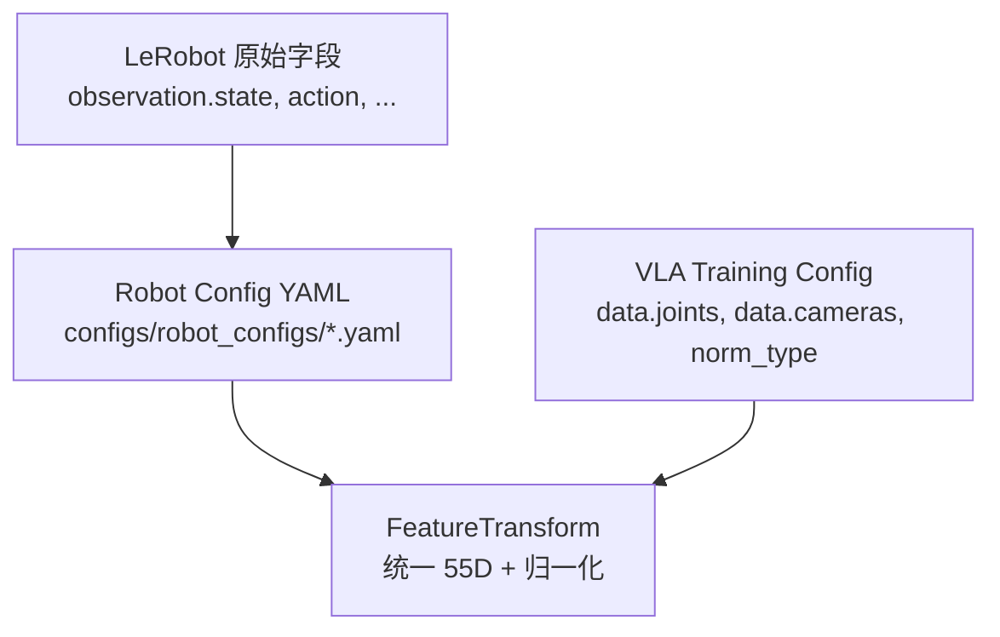

# 4. 数据流水线

本章详解从原始机器人数据到模型输入的完整链路：LeRobot 格式、Robot Config 特征映射、归一化、多数据集拼接与 DataLoader。

---

## 4.1 数据格式：LeRobot

### 4.1.1 是什么

[LeRobot](https://github.com/huggingface/lerobot) 是 HuggingFace 推出的机器人学习数据集标准，本仓库通过 `LeRobotDataset` 直接加载。

支持版本：

- **LeRobot v2.1**
- **LeRobot v3.0**

无需预先合并或格式转换。

### 4.1.2 目录结构（概念）

```
lerobot_dataset/
├── meta/
│   ├── info.json          # 特征定义、fps、机器人类型
│   ├── episodes.jsonl     # episode 索引
│   └── tasks.jsonl        # 任务/语言标注
├── data/
│   └── chunk-*/           # Parquet 文件（状态、动作、时间戳）
└── videos/
    └── observation.images.*/  # MP4 视频（每相机一个目录）
```

### 4.1.3 关键字段

| 字段类型 | 示例 | 说明 |
|----------|------|------|
| 状态 | `observation.state` | 低维本体状态向量 |
| 动作 | `action` | 控制指令 |
| 图像 | `observation.images.cam_high` | 视频帧，按 fps 索引 |
| 语言 | `task` / `subtask` | 全局或子任务描述 |

---

## 4.2 三层配置体系



### 4.2.1 Robot Config

**作用**：将各数据集异构字段映射到 **统一命名空间**。

示例 `configs/robot_configs/robotwin.yaml`：

```yaml
states:
  - observation.state.arm.position:
      origin_keys:
        - observation.state: {start: 0, end: 6}    # 左臂
        - observation.state: {start: 7, end: 13}   # 右臂
  - observation.state.effector.position:
      origin_keys:
        - observation.state: {start: 6, end: 7}
        - observation.state: {start: 13, end: 14}

actions:
  - action.arm.position:
      origin_keys:
        - action: {start: 0, end: 6}
        - action: {start: 7, end: 13}
      subtract_state: False   # 绝对动作；真机臂关节推荐 True

images:
  - observation.images.camera_top:
      origin_keys: observation.images.cam_high
  - observation.images.camera_wrist_left:
      origin_keys: observation.images.cam_left_wrist

norm_stats: assets/norm_stats/robotwin.json
```

**`subtract_state`**：

- `True`：动作变为 \(a' = a - s\)（相对增量），适合真机臂关节控制
- `False`：学习绝对动作，RoboTwin 仿真默认

### 4.2.2 VLA Training Config

声明模型使用的关节类型与相机列表（必须与 robot config 一致）：

```yaml
data:
  datasets_type: vla
  data_name: robotwin          # 单数据集；多数据集用 multi
  train_path: /path/to/lerobot
  robot_config_root: ./configs/robot_configs
  joints:
    - arm.position: 14
    - end.position: 14
    - effector.position: 2
  cameras:
    - camera_top
    - camera_wrist_left
    - camera_wrist_right
  norm_type:
    - arm.position: bounds_99_woclip
    - effector.position: bounds_99_woclip
  prompt_type: global
  use_future_image: true       # 蒸馏需要未来帧
```

### 4.2.3 一致性规则

| 规则 | 违反后果 |
|------|----------|
| robot config 中的 joint/camera 必须在 `data.joints`/`data.cameras` 中声明 | `ValueError` |
| `data.joints` 维度 ≥ 实际拼接维度 | 自动 padding |
| `norm_stats` 与 `norm_type` 匹配 | 归一化错误 |

---

## 4.3 FeatureTransform

实现：`lingbotvla/data/vla_data/utils.py`

### 4.3.1 处理流程

```
原始样本 dict
  → 按 robot config 切片拼接 states/actions/images
  → 可选 subtract_state
  → Normalizer 归一化
  → 图像 resize + 可选增强
  → Tokenizer 编码语言
  → 输出 model batch dict
```

### 4.3.2 输出字段（训练 batch）

| 字段 | Shape（概念） | 说明 |
|------|---------------|------|
| `images` | [B, N_cam, C, H, W] | 多相机图像 |
| `img_masks` | [B, N_cam] | 有效相机 mask |
| `state` | [B, 55] | 归一化状态 |
| `actions` | [B, chunk, 55] | 归一化动作 chunk |
| `lang_tokens` | [B, L] | 指令 token ids |
| `lang_masks` | [B, L] | 有效 token mask |
| `joint_mask` | [B, 55] | 有效关节维度 |
| `image_grid_thw` | [B, N, 3] | Qwen3-VL 网格（v2 必需） |

---

## 4.4 归一化（Normalization）

### 4.4.1 支持的 norm_type

| 类型 | 公式 | 适用场景 |
|------|------|----------|
| `meanstd` | \((x - \mu) / \sigma\) | 真机，近似高斯 |
| `bounds_99` | 线性缩放到 \([-1,1]\)（1%/99% 分位） | 仿真 |
| `bounds_99_woclip` | 同 bounds_99，不裁剪越界值 | RoboTwin 默认 |
| `bounds_98` | 2%/98% 分位 | 更保守 |
| `minmax` | 按 min/max 缩放 | 有界动作 |
| `sincos` | 角度 → \((\cos\theta, \sin\theta)\) | 旋转关节（`state_norm_type`） |
| `identity` | 不变换 | 已预处理数据 |

### 4.4.2 计算 Norm Stats

```bash
CUDA_VISIBLE_DEVICES=0 bash train.sh scripts/compute_norm_stats.py \
  ./configs/vla/robotwin/robotwin.yaml \
  --data.data_name robotwin \
  --data.train_path /path/to/lerobot_dataset \
  --data.robot_config_root ./configs/robot_configs \
  --data.norm_path assets/norm_stats/robotwin.json \
  --data.data_ratio_for_norm_compute 1
```

输出 JSON 结构（每关节每统计量）：

```json
{
  "action.arm.position": {
    "mean": [...],
    "std": [...],
    "min": [...],
    "max": [...],
    "q01": [...],
    "q99": [...]
  }
}
```

**注意**：若 `chunk_size` 小于统计时的 horizon，需重新计算 norm stats。

### 4.4.3 真机 vs 仿真

| | 真机 | RoboTwin |
|---|------|----------|
| `norm_type` | `meanstd` | `bounds_99_woclip` |
| 臂动作 | `subtract_state: True` | `subtract_state: False` |

---

## 4.5 多数据集模式

### 4.5.1 数据集列表文件

`assets/training_data/robotwin.txt`：

```text
robotwin /path/to/task_a_dataset
robotwin /path/to/task_b_dataset
robotwin /path/to/task_c_dataset
```

格式：`<robot_config_name> <lerobot_path>`，每行一个数据集。

### 4.5.2 MultiVLADataset

```python
# multi_vla_dataset.py
class MultiVLADataset:
    # 为每行实例化一个 VLADataset，torch.utils.data.ConcatDataset 拼接
```

配置：

```yaml
data:
  data_name: multi
  train_path: assets/training_data/robotwin.txt
```

---

## 4.6 VLADataset 采样逻辑

实现：`lingbotvla/data/vla_data/base_dataset.py`

### 4.6.1 `__getitem__` 步骤

1. 随机选择 episode 与时间索引 \(t\)
2. 读取 \(t\) 时刻各相机帧 → 当前图像
3. 若 `use_future_image`：读取 \(t + \Delta\) 未来帧
4. 读取 `state[t]`
5. 读取 `action[t : t+chunk_size]`，不足则 padding + `action_is_pad`
6. 读取 `task` 或 `subtask` 作为语言（由 `prompt_type` 控制）

### 4.6.2 Prompt 类型

| `prompt_type` | 行为 |
|---------------|------|
| `global` | 仅全局任务描述 |
| `subtask` | 仅子任务描述 |
| `both` | 数据集加倍，两种 prompt 各一份 |

### 4.6.3 图像增强

`data.image_augment: true` 时，对颜色抖动等增强 **所有相机共用同一组随机参数**，保持多视角一致性。

---

## 4.7 DataLoader 与 Collator

```python
# data_loader.py + multimodal/data_collator.py
VLADataCollatorWithPacking  # 批处理、padding、stack
```

| 参数 | 默认 | 说明 |
|------|------|------|
| `num_workers` | 8–20 | 并行加载 |
| `prefetch_factor` | 4 | 预取批次数 |
| `pin_memory` | true | 加速 GPU 传输 |

VLA post-training 通常 `rmpad: false`（固定长度 padding，非去 padding 训练）。

---

## 4.8 数据准备 Checklist

- [ ] LeRobot v2.1/v3.0 数据集就绪
- [ ] `configs/robot_configs/<name>.yaml` 字段映射正确
- [ ] `assets/norm_stats/<name>.json` 已计算
- [ ] `data.joints` / `data.cameras` 与 robot config 一致
- [ ] 蒸馏训练时 `use_future_image: true`
- [ ] 多数据集时 `data_name: multi` + 列表文件

---

## 4.9 可运行示例：探查数据集

```python
"""探查 LeRobot 数据集单条样本（需安装 lerobot）"""
from lerobot.common.datasets.lerobot_dataset import LeRobotDataset

ds = LeRobotDataset("/path/to/lerobot_dataset")
sample = ds[0]
print("Keys:", sample.keys())
print("State shape:", sample["observation.state"].shape)
print("Action shape:", sample["action"].shape)
print("Task:", sample.get("task", "N/A"))
# 图像键示例: observation.images.cam_high
```

---

## 4.10 相关资源

| 资源 | 链接 |
|------|------|
| LeRobot 官方 | [GitHub](https://github.com/huggingface/lerobot) |
| 本仓库自定义数据指南 | [lingbotvla/data/vla_data/README.md](../lingbotvla/data/vla_data/README.md) |
| RoboTwin 数据准备 | [experiment/robotwin/README.md](../experiment/robotwin/README.md) |
| 真机 robot config 示例 | [configs/robot_configs/agilex_cobot_magic.yaml](../configs/robot_configs/agilex_cobot_magic.yaml) |

---

## 4.11 章节关系

| 内容 | 章节 |
|------|------|
| 55 维空间定义 | [01-model-architecture.md](./01-model-architecture.md) |
| 未来帧用于蒸馏 | [03-dual-query-distillation.md](./03-dual-query-distillation.md) |
| 训练启动命令 | [05-training-system.md](./05-training-system.md) |
