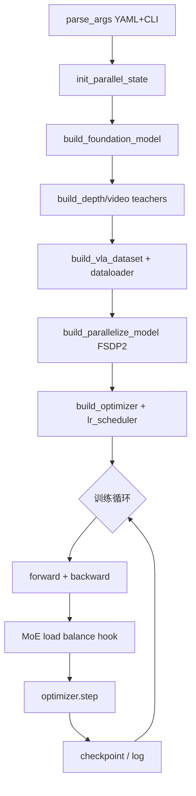

# 5. 训练系统

本章详解 LingBot-VLA 2.0 的 post-training 基础设施：训练入口、分布式并行、优化器、检查点与监控。

---

## 5.1 训练入口与启动

### 5.1.1 命令

```bash
# 标准启动（torchrun 多卡）
bash train.sh tasks/vla/train_lingbotvla.py ./configs/vla/robotwin/robotwin.yaml \
  --data.train_path assets/training_data/robotwin.txt \
  --data.data_name multi \
  --train.output_dir output/
```

`train.sh` 内部调用 `torchrun`，自动检测 GPU 数量。

### 5.1.2 主脚本流程

`tasks/vla/train_lingbotvla.py`：



### 5.1.3 环境准备

```bash
bash tools/create_train_env.sh
# Python 3.12, PyTorch 2.8.0, flash-attn 2.8.3
# 自动 editable 安装 lingbot-depth, MoGe
```

---

## 5.2 模型构建

### 5.2.1 Config Registry

```python
# lingbotvla/models/config_registry.py
# 自动发现 lingbotvla.models.vla 下的 Config 类
config_key: LingbotVLAV2Config  # v2.0 必须
```

### 5.2.2 权重加载

| 参数 | 说明 |
|------|------|
| `model.model_path` | LingBot-VLA 2.0 预训练 checkpoint |
| `model.tokenizer_path` | Qwen3-VL-4B-Instruct 路径 |
| `model.post_training: true` | 启用微调模式 |
| `train.allow_partial_checkpoint` | 结构不完全匹配时跳过缺失键 |

```bash
python scripts/download_hf_model.py \
  --repo_id robbyant/lingbot-vla-v2-6b \
  --local_dir lingbot-vla
```

---

## 5.3 分布式训练

基于 [VeOmni](https://arxiv.org/abs/2508.02317) 风格基础设施。

### 5.3.1 并行模式

| 模式 | 配置 | 说明 |
|------|------|------|
| DDP | `data_parallel_mode: ddp` | 数据并行，每卡完整模型 |
| FSDP1 | `fsdp1` | PyTorch FSDP v1 |
| **FSDP2** | `fsdp2` | **默认**，模块级分片 |
| FSDP2-VeScale | `fsdp2-vescale` | VeScale 后端 |

推荐配置：

```yaml
train:
  data_parallel_mode: fsdp2
  module_fsdp_enable: true
  vlm_fsdp: true           # VLM 也分片
  enable_full_shard: false
```

### 5.3.2 其他并行维度

| 参数 | 默认 | 用途 |
|------|------|------|
| `tensor_parallel_size` | 1 | 张量并行 |
| `expert_parallel_size` | 1 | MoE 专家并行 |
| `ulysses_parallel_size` | 1 | Ulysses 序列并行（长上下文） |
| `pipeline_parallel_size` | 1 | 流水线并行 |

实现目录：`lingbotvla/distributed/`

### 5.3.3 显存优化

| 技术 | 配置 | 效果 |
|------|------|------|
| Gradient Checkpointing | `enable_gradient_checkpointing: true` | 减显存，增计算 |
| Activation Offload | `enable_activation_offload: true` | 激活卸载到 CPU |
| FP32 Action Expert | `enable_fp32: true` | 动作分支高精度 |
| Mixed Precision | `enable_mixed_precision: true` | BF16 训练 |

---

## 5.4 优化器

### 5.4.1 可选优化器

| 优化器 | 配置 | 特点 |
|--------|------|------|
| AdamW | `optimizer: adamw` | 默认，稳定 |
| AnyPrecision AdamW | `anyprecision_adamw` | 低精度优化器状态 |
| **Muon** | `optimizer: muon` | 收敛更好，训练更慢 |

### 5.4.2 参数组

```python
# ViT 单独学习率
get_param_groups(model, default_lr=5e-5, vit_lr=1e-6)

# MoE 专家缩放学习率
# scale = sqrt(num_experts / top_k) = sqrt(32/4) = 2.828
use_moe_expert_lr: true
```

### 5.4.3 学习率调度

```yaml
lr: 5.0e-5
lr_decay_style: constant    # 或 cosine 等
lr_warmup_ratio: 0
max_steps: 30000
```

### 5.4.4 梯度裁剪

```yaml
max_grad_norm: 1.0
decayed_max_grad_norm: 1.0
stable_train_steps: 100000   # 之后使用 decayed norm
```

---

## 5.5 批大小与训练步数

### 5.5.1 全局批大小

\[
B_{\text{global}} = B_{\text{micro}} \times N_{\text{GPU}} \times G_{\text{accum}}
\]

```yaml
micro_batch_size: 1
global_batch_size: 3        # 3 卡时 accum=1；4 卡需调整
gradient_accumulation_steps: 1
```

若显式设置 `global_batch_size`，必须与计算值一致，否则报错。

### 5.5.2 训练终止条件

`num_train_epochs` 与 `max_steps` **至少指定一个**；同时指定时 **先达到者** 停止。

```yaml
num_train_epochs: 29000
max_steps: 30000
# 实际在 30000 step 停止并保存 checkpoint
```

---

## 5.6 MoE 训练辅助

### 5.6.1 Loss-free Load Balancing

```python
# moe_load_balance.py - 每步后更新 router bias
bias_update_speed: 0.00025
```

根据各专家 token 计数调整 `e_score_correction_bias`，无需 balance loss 即可均衡负载。

### 5.6.2 可选辅助损失

```yaml
router_z_loss_coeff: 1e-4
sequence_wise_loss_coeff: 1e-3
sequence_wise_mode: per_sequence   # 或 global
```

### 5.6.3 监控指标

`moe_monitor_interval: 1000` 记录：

- `moe_maxvio/layerXX`：最大过载
- `moe_minload/layerXX`：最小负载比（0 = 死亡专家）
- `moe_entropy_rank0/layerXX`：路由熵

---

## 5.7 检查点

### 5.7.1 后端

| 管理器 | 配置 | 说明 |
|--------|------|------|
| DCP | `ckpt_manager: dcp` | PyTorch Distributed Checkpoint，**推荐** |
| ByteCheckpoint | `bytecheckpoint` | 备选 |

### 5.7.2 保存策略

```yaml
save_steps: 30000
save_epochs: 29000
enable_resume: true
```

达到 `max_steps` 时 **自动保存**。

### 5.7.3 HuggingFace 格式导出

`AsyncHFCheckpointSaver` 异步将 DCP 转为 HF 权重，供 `deploy/` 加载。

---

## 5.8 日志与可视化

| 后端 | 配置 |
|------|------|
| WandB | `use_wandb: true` + `wandb_project` |
| TensorBoard | 默认本地 `output_dir/runs` |

记录内容：

- `loss/fm`, `loss/depth`, `loss/video`
- MoE 直方图与负载
- 深度/视频对齐可视化（每 `visual_steps` 步）

---

## 5.9 编译加速

```yaml
use_compile: true   # torch.compile
precompute_grid_thw: true   # 缓存 Qwen3-VL grid 张量
```

部署同样支持 `use_compile`（见 [06-inference-deployment.md](./06-inference-deployment.md)）。

---

## 5.10 完整训练示例（4×A6000）

```bash
bash train.sh tasks/vla/train_lingbotvla.py ./configs/vla/real_robot/real_robot.yaml \
  --data.train_path /path/to/training_data.txt \
  --data.data_name multi \
  --data.norm_stats_file /path/to/norm_stats.json \
  --train.output_dir output/ \
  --train.micro_batch_size 1 \
  --train.global_batch_size 4 \
  --train.enable_gradient_checkpointing true
```

显存需求：约 **49GB/GPU**（因数据集与蒸馏选项而异）。

---

## 5.11 训练步内部代码路径

```python
# 单步训练（简化）
batch = next(dataloader)
depth_targets, video_targets = compute_teacher_targets(batch)  # 若 align_params

outputs = model(
    images=batch['images'],
    state=batch['state'],
    actions=batch['actions'],
    lang_tokens=batch['lang_tokens'],
    ...
    depth_targets=depth_targets,
)

loss = fm_loss + depth_loss + video_loss + moe_aux
loss.backward()
optimizer.step()
moe_load_balance_hook.update()  # loss-free balancing
```

---

## 5.12 常见问题

| 问题 | 排查 |
|------|------|
| `global_batch_size` 不匹配 | 检查 GPU 数 × micro_batch × accum |
| OOM | 开启 gradient checkpointing；减小 batch；关闭 compile |
| `image_grid_thw` 缺失 | 确认 Qwen3 processor 与 v2 模型 |
| MoE 死亡专家 | 增大 `bias_update_speed`；启用 z-loss |
| norm 维度不匹配 | 重新 `compute_norm_stats` |

---

## 5.13 章节关系

| 内容 | 章节 |
|------|------|
| 配置参数详解 | [07-configuration.md](./07-configuration.md) |
| 数据准备 | [04-data-pipeline.md](./04-data-pipeline.md) |
| 模型前向细节 | [01-model-architecture.md](./01-model-architecture.md) |
| 蒸馏损失 | [03-dual-query-distillation.md](./03-dual-query-distillation.md) |
