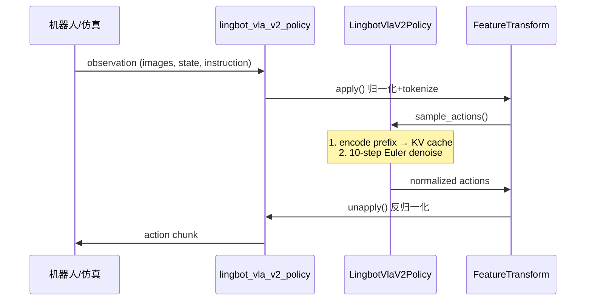

# 6. 推理与部署

本章详解 LingBot-VLA 2.0 的推理流程、真机部署、WebSocket 服务、开环评估与 RoboTwin 仿真评估。

---

## 6.1 推理概览



**延迟**：RTX 4090D 上约 **130ms**（10 去噪步，`use_compile`）。

---

## 6.2 策略类：PolicyServer

实现：`deploy/lingbot_vla_v2_policy.py`

### 6.2.1 环境变量

```bash
export QWEN3VL_PATH=/path/to/Qwen3-VL-4B-Instruct
```

### 6.2.2 启动命令

```bash
python -m deploy.lingbot_vla_v2_policy \
  --model_path /path/to/posttraining_ckpt \
  --robot_config configs/robot_configs/agilex_cobot_magic.yaml \
  --use_compile \
  --use_length 25 \
  --port 8000
```

| 参数 | 说明 |
|------|------|
| `model_path` | Post-training checkpoint（HF 格式目录） |
| `robot_config` | 特征映射与 norm stats |
| `use_compile` | `torch.compile` 加速 |
| `use_length` | 每次只执行 action chunk 前 N 步 |
| `port` | HTTP/WebSocket 端口 |

### 6.2.3 核心推理路径

```python
# PolicyPreprocessMixin.select_action
@torch.no_grad()
def select_action(self, observation, use_bf16=False):
    actions = self.model.sample_actions(
        observation['images'],
        observation['img_masks'],
        observation['lang_tokens'].unsqueeze(0),
        observation['lang_masks'].unsqueeze(0),
        observation['state'].unsqueeze(0),
        image_grid_thw=observation['image_grid_thw'],
    )
    observation['actions'] = actions.squeeze(0)
    return self.feature_transform.unapply(observation)
```

### 6.2.4 批量推理

`sample_actions_batch` 支持已批处理的观测（如向量化仿真环境），避免逐样本 `unsqueeze`。

---

## 6.3 WebSocket 服务

### 6.3.1 架构

```
deploy/websocket_policy_server.py   # 服务端
deploy/websocket_client_policy.py   # 客户端
deploy/msgpack_numpy.py             # numpy 序列化
```

### 6.3.2 协议

- 传输：WebSocket + **msgpack**（含 numpy 数组）
- 请求：观测 dict（images, state, instruction 等）
- 响应：反归一化后的 action dict

### 6.3.3 使用场景

- 推理进程与机器人控制进程 **解耦**（不同机器/容器）
- 仿真环境通过 client 调用远程 GPU 策略
- RoboTwin 评估脚本内置 WebSocket 通信

---

## 6.4 FeatureTransform 推理模式

与训练共用 `lingbotvla/data/vla_data/utils.py`：

```python
# 推理时
obs = feature_transform.apply(raw_obs)   # 图像resize、归一化、tokenize
actions = model.sample_actions(...)
raw_actions = feature_transform.unapply({**obs, 'actions': actions})
```

**关键**：`norm_stats` 与 `norm_type` 必须与训练一致。

---

## 6.5 开环评估（Open-Loop Eval）

不执行动作，仅对比 **预测轨迹 vs 数据集 GT**。

```bash
export QWEN3_PATH=Qwen/Qwen3-VL-4B-Instruct
python scripts/open_loop_eval.py \
  --model_path path/to/posttraining_ckpt \
  --robo_name robotwin \
  --data_path path/to/validation_data \
  --use_length 50
```

| 参数 | 说明 |
|------|------|
| `robo_name` | 加载 `configs/robot_configs/{robo_name}.yaml` |
| `use_length` | 评估的动作步数 |

输出：各关节维度的 MSE/MAE 曲线与可视化图。

---

## 6.6 RoboTwin 仿真评估

### 6.6.1 一键脚本

```bash
QWEN3VL_PATH=/path/to/Qwen3-VL-4B-Instruct/ \
EVAL_WORKDIR=/path/to/Robotwin_code/ \
bash experiment/robotwin/start_robotwin_infer_and_eval.sh \
  --model_path /path/to/post_training_checkpoint \
  --output_base /path/to/eval_output \
  --num_per_gpu 2
```

### 6.6.2 参数

| 参数 | 说明 |
|------|------|
| `num_per_gpu` | 每 GPU 并发评估任务数（受显存限制） |
| `EVAL_WORKDIR` | RoboTwin 2.0 代码目录 |

### 6.6.3 数据准备

见 [experiment/robotwin/README.md](../experiment/robotwin/README.md)：HDF5 → LeRobot 转换。

---

## 6.7 推理优化技巧

| 技巧 | 方法 | 权衡 |
|------|------|------|
| 减少去噪步 | `config.num_steps=5` | 可能降质量 |
| torch.compile | `--use_compile` | 首次编译慢 |
| BF16 | `use_bf16=True` | 略快，需验证精度 |
| 缩短 chunk | `--use_length 25` | 更频繁重规划 |
| KV Cache | 默认开启 | prefix 只算一次 |
| 批量推理 | `sample_actions_batch` | 提高仿真吞吐 |

---

## 6.8 推理时不需要的组件

| 组件 | 训练 | 推理 |
|------|------|------|
| MoGe / MoRGBD | ✅ | ❌ |
| DINO-Video | ✅ | ❌ |
| 未来帧图像 | ✅ | ❌（通常只需当前帧） |
| FSDP | ✅ | ❌（单卡加载） |
| 蒸馏对齐头 | 前向可选 | 不计算损失 |

Query token 已编码在 checkpoint 中，推理时随 prefix 一起前向。

---

## 6.9 Docker 部署

```dockerfile
# docker/Dockerfile
# 基于 CUDA + PyTorch 2.8 环境
# 构建后运行 deploy 模块
```

---

## 6.10 可运行示例：最小推理探查

```python
"""最小推理示例（需 GPU + 已下载权重）"""
import os
import torch
from deploy.lingbot_vla_v2_policy import LingbotVlaV2PolicyServer  # 类名以源码为准

os.environ['QWEN3VL_PATH'] = 'Qwen/Qwen3-VL-4B-Instruct'

# 实际类名请参照 lingbot_vla_v2_policy.py 底部 main
# policy = build_policy(model_path='...', robot_config='configs/robot_configs/robotwin.yaml')

# 构造假观测（仅测试数据流）
obs = {
    'images': torch.randn(3, 3, 256, 256),   # 3 cameras
    'state': torch.randn(55),
    'instruction': 'pick up the red block',
}
# actions = policy.select_action(obs)
```

> 完整可运行示例请参考 `scripts/open_loop_eval.py` 中的数据加载与 `select_action` 调用。

---

## 6.11 性能基准（论文）

### GM-100 双臂操作

| 平台 | LingBot-VLA 2.0 (进度/成功率) |
|------|-------------------------------|
| AgileX Cobot Magic | 66.2 / 34.4 |
| Galaxea R1Pro | 34.6 / 15.6 |

### 长时域移动操作

| 任务 | In-domain | Out-of-domain |
|------|-----------|---------------|
| 冰箱分拣 (Astribot S1) | 77.1 / 60.0 | 37.0 / 13.3 |
| 灶台清洁 (Cobot Magic) | 84.3 / 66.7 | 67.5 / 40.0 |

---

## 6.12 章节关系

| 内容 | 章节 |
|------|------|
| `sample_actions` 算法 | [02-flow-matching.md](./02-flow-matching.md) |
| Robot config / norm | [04-data-pipeline.md](./04-data-pipeline.md) |
| 真机训练配置 | [07-configuration.md](./07-configuration.md) |
