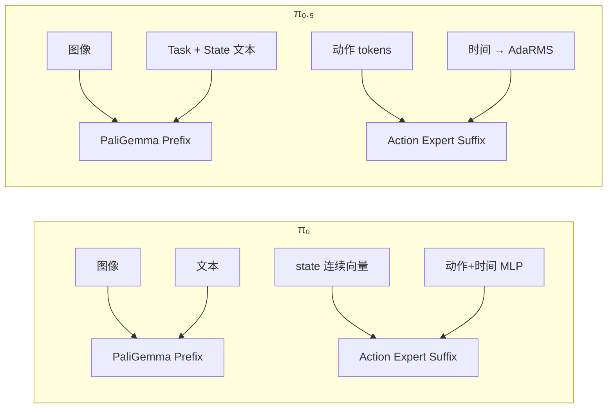

## π₀.₅ 是 π₀ 的升级

π₀ 和 π₀.₅ **共用同一套流匹配框架**（双 expert、联合 attention、Euler 去噪），差异主要在：**怎么把「状态」和「时间」喂给网络**，以及 **π₀.₅ 预训练时用的训练策略**。这两处改动，让 π₀.₅ 更贴近 PaliGemma 的 VLM 预训练格式，从而开放世界泛化更好。

---

## 1. 「更贴近 VLM 预训练格式」是什么意思

PaliGemma 预训练时学的是：**图像 + 文本 → 语言建模**，输入基本是「结构化文本 + 视觉 token」，例如：

```
[图像 patches] + "Task: pick up the cup, ..."
```

### π₀ 的输入格式（与预训练有偏移）

| 模态 | 进模型的方式 |
|------|-------------|
| 图像 | Prefix → SigLIP ✅ 与预训练一致 |
| 语言指令 | Prefix → `embed_tokens` ✅ |
| **机器人 state** | Suffix → `state_proj` 连续向量 ❌ **新分布** |
| 噪声动作 + 时间 | Suffix → Action Expert + MLP 融合 ❌ **新模态** |

π₀ 把 state 和 action 放在 **Action Expert 的 suffix**，走 `state_proj`、连续 embedding。这和 PaliGemma 预训练时「全是离散 language token」的格式不一样，VLM 主干看到的 prefix 只有图像+短文本，state 被挤到另一个 expert 里。

### π₀.₅ 的输入格式（刻意对齐 VLM）

π₀.₅ 把 state **离散化后写进 prompt**，和任务描述一起 tokenize：

```python
# tokenizer.py
full_prompt = f"Task: {cleaned_text}, State: {state_str};\nAction: "
tokens = self._tokenizer.encode(full_prompt, add_bos=True)
```

实际序列类似：

```
Task: pick up the red block, State: 42 128 67  ... ;
Action: 
```

| 模态 | 进模型的方式 |
|------|-------------|
| 图像 | Prefix → SigLIP ✅ |
| 语言 + **state** | Prefix → 同一套 `embed_tokens` ✅ |
| 动作 | Suffix → 只有 action tokens |
| 时间 | 不拼进 token，走 AdaRMS 条件注入 |

**核心思想**：任务、状态、动作提示都变成 **「Instruction → Response」** 式文本结构，和 VLM 微调/预训练时的 instruction following 格式一致。VLM 主干继续处理「看懂场景 + 读懂任务+状态」，而不是被迫适应全新的连续 state 通道。



---

## 2. 时间注入：为什么 AdaRMS 比 MLP concat 更合适

### π₀：时间拼进 action token

```
time_emb + action_emb → action_time_mlp → suffix tokens
```

时间信息 **混在 action 表示里**，Action Expert 每层看到的是已经融合过的 token。

### π₀.₅：时间通过 AdaRMS 调制整层

```
time_emb → time_mlp → adarms_cond
→ 每层 LayerNorm 的 scale / shift / gate
→ gated residual: x + gate × sublayer(x)
```

时间不是多几个 token，而是 **按 flow matching 的 t 动态调节每一层的归一化和残差强度**。这和扩散/流模型里「用 t 条件化整个网络」的常见做法一致，去噪不同阶段可以有不同的计算路径。

对 π₀.₅ 来说：
- **suffix 里只有「纯动作」token**，语义更干净
- **时间条件全局、连续**地作用在 Expert 上，适合 10 步 Euler 积分里 t 从 1→0 的变化

---

## 3. 「开放世界泛化更好」指什么

README 和 checkpoint 说明里提到 π₀.₅ 在 **LIBERO、DROID** 等基准上表现更好，尤其是 **语言跟随** 和 **未见过的任务/环境**。原因可以从架构和训练两方面理解：

### （1）更好地保留 VLM 预训练能力

π₀ 微调时，state 走 Action Expert，VLM 主干主要学「图像↔文本」，和 robot state 的耦合在 suffix，**语言-状态-视觉的联合推理主要在 attention 里间接发生**。

π₀.₅ 把 state 写进语言序列，相当于让 **预训练过的语言模型直接读 state**，格式接近：

> 「Given task + state, predict action」

对新指令、新物体、新场景，VLM 已有的语言理解和视觉 grounding 更容易迁移。

### （2）Knowledge Insulation（知识隔离）

README 写明 π₀.₅ 用 [knowledge insulation](https://www.physicalintelligence.company/research/knowledge_insulation) 训练：

- **目标**：微调机器人策略时，**少破坏** PaliGemma 里已有的视觉-语言知识
- **做法（概念上）**：把「VLM 知识」和「动作技能」在训练目标/梯度路径上部分隔离，让 Action Expert 学控制，VLM 尽量保持通用表示
- **结果**：语言跟随更好、开放世界指令理解更强，而不是只会 memorized 训练集里的固定 prompt

本仓库目前 **只实现 flow matching head**，但 π₀.₅ checkpoint（`pi05_base` 等）是在完整 PI 训练管线里用该策略训出来的。

### （3）结构化 prompt 的泛化优势

π₀ prompt 示例：
```
pick up the cup\n
```

π₀.₅ prompt 示例：
```
Task: pick up the cup, State: 42 128 67 ... ;
Action: 
```

后者是 **显式模板**：Task / State / Action 分段清晰。换任务、换 state 维度（离散化后）、换语言描述，模型更容易当作「填模板」而不是记死一种输入布局——这对 **训练集外的新指令** 更友好。

---

## 4. 代码层面的差异对照

| 维度 | π₀ | π₀.₅ |
|------|-----|------|
| `pi05` 开关 | `False` | `True` |
| state 输入 | `state_proj` → suffix 1 token | 离散化 → 拼进 `lang_tokens`（prefix） |
| `embed_suffix(state, ...)` | **使用** state | state **被忽略**（已在 prefix） |
| 时间注入 | `action_time_mlp` | `time_mlp` → `adarms_cond` |
| Expert LayerNorm | 普通 RMSNorm | AdaRMS（`use_adarms=[False, True]`） |
| `max_token_len` | 48 | 200（state 进语言流，序列更长） |
| 基座 checkpoint | `pi0_base` | `pi05_base`（不兼容） |

---

## 5. 直观类比

| | π₀ | π₀.₅ |
|---|-----|------|
| 类比 | 给 VLM 配了一个「专用机械臂控制头」，state/动作走侧门 | 让 VLM **按它熟悉的对话格式** 读任务+状态，再专门控制动作 |
| 风险 | VLM 与 robot state 分布偏移大 | 更复用预训练，微调更「绝缘」 |
| 收益 | 简单直接 | 语言理解、新任务泛化通常更好 |

---

## 一句话总结

**π₀.₅ 把机器人 state 从 Action Expert 的连续向量，改成 VLM 熟悉的离散语言 prompt；时间从 token 拼接改成 AdaRMS 全层条件；预训练还用 knowledge insulation 保护 VLM 知识。** 因此它更贴近 PaliGemma 预训练格式，在开放世界场景（新指令、新环境、语言跟随）上通常比 π₀ 泛化更好——本仓库里两者推理/训练接口相同，差在 config 的 `pi05=True` 和对应 checkpoint。