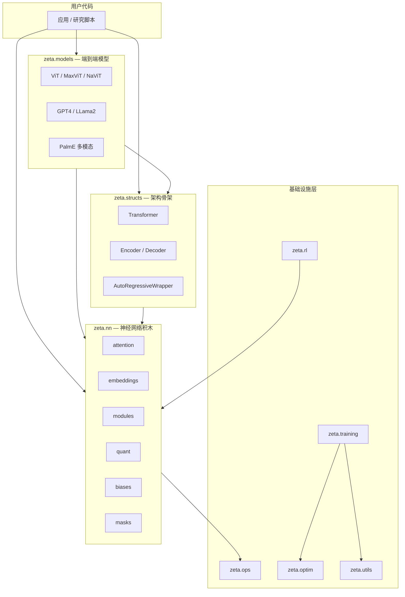
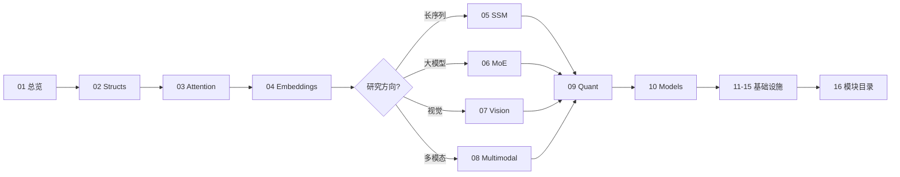

# 第 0 章：Zeta 框架总览

## 1. 设计哲学

Zeta 的定位是 **「AI 的 LEGO 积木」**：将现代深度学习中最常用的组件（注意力、MoE、SSM、量化、多模态融合等）拆成可独立导入、可组合的 `nn.Module`，让研究者与工程师能快速拼装 SOTA 架构，而不必从零实现每个算子。

核心设计原则：

1. **模块化（Modularity）**：每个文件通常只承载一个概念（如 `MultiQueryAttention`、`BitLinear`），可单独测试与替换。
2. **PyTorch 原生（Native PyTorch）**：不引入自定义计算图；与 `torch.nn`、`F.scaled_dot_product_attention`、FSDP 等生态兼容。
3. **性能导向（Performance）**：提供 Flash Attention、融合 GELU-Dense、Triton RMSNorm、BitLinear 等优化路径。
4. **广度优先（Breadth）**：覆盖 NLP、CV、视频、音频、RLHF 等多领域积木，而非单一模型全家桶。

---

## 2. 整体架构



### 2.1 各层职责

| 层级 | 包路径 | 职责 | 典型消费者 |
|------|--------|------|------------|
| **模型层** | `zeta.models` | 开箱即用的完整架构（ViT、GPT4、PalmE） | 快速实验、基线复现 |
| **骨架层** | `zeta.structs` | Transformer 堆叠、编解码器、自回归生成封装 | 自定义 LLM / VLM |
| **积木层** | `zeta.nn` | 注意力、归一化、MoE、SSM、卷积、损失等 | 所有上层 |
| **算子层** | `zeta.ops` | Softmax 变体、矩阵根、einops 封装、分布式 gather | `nn` 内部 & 高级用户 |
| **优化层** | `zeta.optim` | Lion、Sophia、Muon 等非标优化器 | 训练脚本 |
| **训练层** | `zeta.training` | Trainer、FSDP、DataLoader 构建 | 端到端训练 |
| **对齐层** | `zeta.rl` | DPO、PPO、奖励模型 | RLHF / 偏好学习 |
| **工具层** | `zeta.utils` | top-p 采样、内存 profiling、verbose 装饰器 | 调试 & 推理 |

### 2.2 模块间依赖关系

```
zeta/__init__.py
  ├── models  → structs, nn
  ├── structs → nn.attention, nn.embeddings, nn.modules
  ├── nn      → ops (部分模块), utils
  ├── ops     → (纯函数，无 zeta 依赖)
  ├── optim   → torch
  ├── rl      → nn (间接)
  ├── training→ optim, utils
  └── utils   → torch
```

**关键洞察**：`structs.transformer` 是多个子系统的汇聚点——它同时引用 `nn.attention.Attend`、`nn.embeddings`、`nn.biases`，并导出 `Attention`、`AttentionLayers` 供 `nn.attention` 再导出，形成「骨架 ↔ 积木」双向耦合。

---

## 3. 技术栈对比与选型

### 3.1 Zeta vs 其他框架

| 维度 | Zeta | HuggingFace Transformers | PyTorch 原生 | Mamba-SSM 官方 |
|------|------|--------------------------|--------------|----------------|
| **定位** | 模块化积木库 | 预训练模型 + Trainer | 底层张量/自动微分 | SSM 专用 |
| **模型数量** | 10+ 内置 + 无限组合 | 数千预训练 checkpoint | 无 | Mamba 系列 |
| **注意力变体** | 22+ 种可插拔 | 以标准 MHA 为主 | 需自写 | N/A |
| **MoE / 量化** | 内置多种 | 部分模型支持 | 需自写 | 无 |
| **学习曲线** | 中等（需了解模块关系） | 低（`from_pretrained`） | 高 | 低（单模型） |
| **定制自由度** | **最高** | 中等（改 config） | 最高但成本高 | 低 |

### 3.2 何时选用 Zeta

**适合：**

- 研究新架构（新注意力、新 MoE 路由、SSM+Transformer 混合）
- 需要快速 A/B 对比多种归一化、激活、位置编码
- 多模态原型（PalmE 式 Encoder-Decoder 拼装）
- RLHF 流水线（DPO + 奖励模型 + 语言奖励）

**不太适合：**

- 仅需加载现成 LLM 做推理（直接用 HF `transformers` 更省事）
- 生产环境要求单一官方维护模型（Zeta 偏研究与组合）
- 需要完整 tokenizer 流水线（`zeta/tokenizers` 包未实现，仅有 tests/examples）

### 3.3 子系统选型指南

| 需求 | 推荐组件 | 原因 |
|------|----------|------|
| 标准因果 LM | `structs.Transformer` + `Decoder` + `RotaryEmbedding` | 与 LLaMA 类架构对齐 |
| 省显存推理 | `MultiQueryAttention` / `MultiGroupedQueryAttn` | KV cache 共享 |
| 长上下文 | `LocalAttention` / `MambaBlock` / `LinearAttention` | 亚二次或线性复杂度 |
| 图像分类 | `models.ViT` 或 `structs.ViTransformerWrapper` | Patch embedding + Transformer |
| 分割 / 生成 | `nn.Unet` / `SpaceTimeUnet` | 经典 U-Net 与时空扩展 |
| 1-bit 推理 | `quant.BitLinear` | BitNet 风格量化线性层 |
| 偏好对齐 | `rl.DPO` | 无需显式奖励模型训练 |

---

## 4. 核心算法地图

Zeta 涉及的算法可按数学主题分类：

### 4.1 注意力家族

$$\text{Attention}(Q,K,V) = \text{softmax}\!\left(\frac{QK^\top}{\sqrt{d_k}} + B\right) V$$

变体包括：Multi-Query（共享 KV）、Linear（核技巧近似）、Sparse（Top-K）、Sigmoid（无 softmax 归一化）、Flash（IO 感知分块）。详见 [03-attention.md](./03-attention.md)。

### 4.2 状态空间模型（SSM）

连续系统离散化：

$$h_{t+1} = \bar{A}_t h_t + \bar{B}_t x_t, \quad y_t = C_t h_t + D x_t$$

Mamba 的关键创新是 **输入依赖** 的 $\Delta, B, C$（选择性扫描）。详见 [05-ssm-mamba.md](./05-ssm-mamba.md)。

### 4.3 混合专家（MoE）

$$y = \sum_{i=1}^{E} G(x)_i \cdot \text{Expert}_i(x)$$

其中 $G$ 为 Top-K 门控。详见 [06-moe.md](./06-moe.md)。

### 4.4 直接偏好优化（DPO）

$$\mathcal{L}_{\text{DPO}} = -\mathbb{E}\left[\log \sigma\left(\beta \left(\log\frac{\pi_\theta(y_w|x)}{\pi_{\text{ref}}(y_w|x)} - \log\frac{\pi_\theta(y_l|x)}{\pi_{\text{ref}}(y_l|x)}\right)\right)\right]$$

详见 [13-rl.md](./13-rl.md)。

### 4.5 量化

BitLinear 使用符号量化 + absmax 激活量化：

$$W_q = \text{sign}(W - \bar{W}) \cdot \beta, \quad \beta = \frac{\|W_q\|_1}{n}$$

详见 [09-quantization.md](./09-quantization.md)。

---

## 5. 安装与最小示例

```bash
pip install -U zetascale
```

```python
import torch
from zeta import MultiQueryAttention, FeedForward, MambaBlock

# 注意力 + FFN 拼装一个简单块
dim, heads, seq_len = 512, 8, 128
x = torch.randn(2, seq_len, dim)

attn = MultiQueryAttention(dim=dim, heads=heads)
ffn = FeedForward(dim, dim * 4, glu=True)

out, _, _ = attn(x)
out = ffn(out) + x  # 残差
print(out.shape)  # torch.Size([2, 128, 512])
```

---

## 6. 已知限制与注意事项

1. **`structs.__all__` 含 `VideoTokenizer` 但未实现导入**——使用时需直接引用或自行实现。
2. **`zeta/tokenizers` 包不存在**——tokenizer 仅在 tests/examples 中。
3. **`ops/__Init__.py` 文件名大小写异常**——在严格大小写文件系统上可能导入失败。
4. **`rl/dpo.py` 中 `freeze_all_layers` 拼写 `reqires_grad`**——冻结参考模型可能失效，使用前建议检查。
5. **部分模块为实验性**（如 `FlexiConv`、`Ether`、`Nebula`）——API 可能不稳定。
6. **Magneto.py、random_proj_quan.py 为空文件**——占位符，无功能。

---

## 7. 章节阅读顺序建议



下一章：[02-structs.md](./02-structs.md) — Transformer 架构骨架详解。
