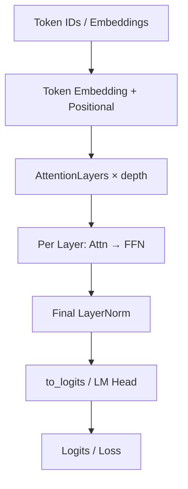

# 第 1 章：架构骨架（zeta.structs）

## 1. 模块边界

`zeta/structs` 提供**可堆叠的 Transformer 级架构**，是连接底层积木（`nn`）与端到端模型（`models`）的骨架层。

| 文件 | 公开符号 | 职责 |
|------|----------|------|
| `transformer.py` | `Transformer`, `Encoder`, `Decoder`, `Attention`, `AttentionLayers`, `ViTransformerWrapper` | 核心 Transformer 实现（2300+ 行） |
| `transformer_block.py` | `TransformerBlock` | 单层 Pre-Norm Transformer Block |
| `auto_regressive_wrapper.py` | `AutoRegressiveWrapper` | 自回归采样与生成 |
| `encoder_decoder.py` | `EncoderDecoder` | 编解码器组合 |
| `local_transformer.py` | `LocalTransformer` | 局部注意力 Transformer |
| `simple_transformer.py` | `SimpleTransformer`, `ParallelTransformerBlock` | 简化/并行 Transformer |
| `clip_encoder.py` | `CLIPVisionTower`, `build_vision_tower` | CLIP 视觉塔 |
| `multi_modal_projector.py` | `build_vision_projector`, `IdentityMap` | 视觉投影器 |
| `simple_vision_encoder.py` | `VisionEncoder` | 轻量视觉编码器 |
| `efficient_net.py` | `EfficientNet`, `MBConv` *(未导出)* | EfficientNet 骨干 |
| `hierarchical_transformer.py` | `HierarchicalTransformer` *(未导出)* | 分层压缩 Transformer |

---

## 2. 标准 Transformer 数据流



### 2.1 `Transformer` 类

**是什么**：完整的 Token 级 Transformer，支持因果/非因果、交叉注意力、多种位置编码与高效注意力后端。

**关键参数**：

| 参数 | 含义 | 典型值 |
|------|------|--------|
| `num_tokens` | 词表大小 | 32000–200000 |
| `max_seq_len` | 最大序列长 | 2048–32768 |
| `attn_layers` | `Encoder` 或 `Decoder` 实例 | 自定义 depth/heads |
| `use_abs_pos_emb` | 绝对位置嵌入 | False（多用 RoPE） |
| `emb_dropout` / `post_emb_norm` | 嵌入后处理 | 正则化选项 |

**为什么需要**：将 tokenization 之后的离散序列映射为上下文表示，是自回归 LM 与 Encoder 的核心。

```python
import torch
from zeta.structs import Transformer, Decoder

model = Transformer(
    num_tokens=32000,
    max_seq_len=2048,
    attn_layers=Decoder(
        dim=512,
        depth=6,
        heads=8,
        rotary_xpos=True,
        attn_flash=True,
        qk_norm=True,
    ),
)
x = torch.randint(0, 32000, (2, 128))
logits = model(x)
print(logits.shape)  # (2, 128, 32000)
```

### 2.2 `Encoder` vs `Decoder`

| | Encoder | Decoder |
|---|---------|---------|
| **注意力** | 双向（非因果） | 因果（自回归） |
| **交叉注意力** | 无 | 可选 `cross_attend=True` |
| **用途** | 编码图像 patch、文本理解 | 语言生成、条件生成 |
| **位置编码** | 绝对/sinusoidal | RoPE/ALiBi/XPOS 更常见 |

**数学**：Decoder 第 $l$ 层：

$$\begin{aligned}
\tilde{h}^{(l)} &= h^{(l-1)} + \text{SelfAttn}(\text{LN}(h^{(l-1)})) \\
\hat{h}^{(l)} &= \tilde{h}^{(l)} + \text{CrossAttn}(\text{LN}(\tilde{h}^{(l)}), \text{context}) \quad \text{(若启用)} \\
h^{(l)} &= \hat{h}^{(l)} + \text{FFN}(\text{LN}(\hat{h}^{(l)}))
\end{aligned}$$

### 2.3 `Attention` 与 `AttentionLayers`

定义于 `structs/transformer.py`，被 `nn.attention` 再导出。

**`Attend` 模块**（注意力计算核心）支持：

- `flash`：Flash Attention 2 后端
- `causal`：因果掩码
- `talking_heads`：头间通信卷积
- `sparse_topk`：稀疏 Top-K 注意力
- `qk_norm`：Query-Key 归一化（稳定训练）

**注意力分数**：

$$\text{sim}(q_i, k_j) = \frac{q_i^\top k_j}{\sqrt{d}} + b_{i-j}$$

其中 $b_{i-j}$ 可来自 ALiBi、相对位置偏置等（见第 4 章）。

### 2.4 `ViTransformerWrapper`

**是什么**：将 2D 图像转为 patch 序列并送入 `Encoder`。

**流程**：

1. `VisionEmbedding`：图像 → `(B, N_patches, D)`
2. 可选 CLS token
3. `Encoder` 堆叠
4. 返回 logits 或 embeddings

```python
import torch
from zeta.structs import ViTransformerWrapper, Encoder

encoder = ViTransformerWrapper(
    image_size=256,
    patch_size=32,
    attn_layers=Encoder(dim=512, depth=6, heads=8),
)
img = torch.randn(1, 3, 256, 256)
emb = encoder(img, return_embeddings=True)
print(emb.shape)  # (1, num_patches, 512)
```

---

## 3. `TransformerBlock`

**文件**：`structs/transformer_block.py`

独立的 Pre-Norm 块，适合手动堆叠：

```python
from zeta.structs import TransformerBlock

block = TransformerBlock(dim=512, heads=8, ff_mult=4)
x = torch.randn(2, 64, 512)
out = block(x)
```

**结构**：`Attention → FFN`，均带残差与 LayerNorm（或 RMSNorm，取决于配置）。

---

## 4. `AutoRegressiveWrapper`

**是什么**：在 `Transformer` 外包装自回归生成逻辑。

**功能函数**（`auto_regressive_wrapper.py`）：

| 函数/方法 | 作用 |
|-----------|------|
| `forward` | 常规模型前向 |
| `generate` | 自回归 token 生成 |
| `beam_search` / `nucleus_sample` 等 | 多种解码策略 |

**为什么需要**：训练和推理使用同一模型权重，生成时需维护 KV cache、处理因果掩码与停止条件。

```python
from zeta.structs import AutoRegressiveWrapper, Transformer, Decoder

decoder = Transformer(
    num_tokens=1000,
    max_seq_len=512,
    attn_layers=Decoder(dim=256, depth=4, heads=4),
)
model = AutoRegressiveWrapper(decoder)

prompt = torch.randint(0, 1000, (1, 10))
# generated = model.generate(prompt, seq_len=50)
```

---

## 5. 其他骨架模块

### 5.1 `EncoderDecoder`

组合独立 Encoder 与 Decoder，适合 Seq2Seq、多模态（图像编码→文本解码）。

### 5.2 `LocalTransformer`

基于 `local-attention` 库的局部窗口注意力，适合长序列且不想用全局 $O(n^2)$ 开销的场景。

### 5.3 `SimpleTransformer` / `ParallelTransformerBlock`

简化 API；`ParallelTransformerBlock` 将 Attention 与 FFN **并行**计算（GPT-J / NeoX 风格）：

$$h = x + \text{Attn}(\text{LN}(x)) + \text{FFN}(\text{LN}(x))$$

比串行 Pre-Norm 减少一次同步，利于大规模训练。

### 5.4 `CLIPVisionTower` / `build_vision_projector`

为 LLaVA 类架构提供 CLIP 视觉骨干与 MLP 投影器，将视觉特征对齐到 LLM 嵌入空间。

### 5.5 `VisionEncoder`

轻量视觉编码器封装，适合快速多模态实验。

### 5.6 内部模块（未公开导出）

- **`EfficientNet`**：MBConv + SE 模块的 EfficientNet 实现
- **`HierarchicalTransformer`**：分层压缩（`Compress` 模块降低序列长度）

---

## 6. 与 models 层的关系

```
PalmE = ViTransformerWrapper(Encoder) + Transformer(Decoder) + AutoRegressiveWrapper
GPT4  = Transformer(Decoder) + 多模态扩展
ViT   = ViTransformerWrapper 的特化封装
```

详见 [10-models.md](./10-models.md)。

---

## 7. 参考论文与开源实现

| 主题 | 论文 | 开源参考 |
|------|------|----------|
| Transformer | [Attention Is All You Need](https://arxiv.org/abs/1706.03762) | [lucidrains/x-transformers](https://github.com/lucidrains/x-transformers) |
| Flash Attention | [FlashAttention-2](https://arxiv.org/abs/2307.08691) | [Dao-AILab/flash-attention](https://github.com/Dao-AILab/flash-attention) |
| Parallel Block | [GPT-J](https://github.com/kingoflolz/mesh-transformer-jax) | — |
| ViT | [An Image is Worth 16x16 Words](https://arxiv.org/abs/2010.11929) | — |
| PalmE | [PaLM-E](https://arxiv.org/abs/2303.07854) | — |

---

上一章：[01-overview.md](./01-overview.md) | 下一章：[03-attention.md](./03-attention.md)
