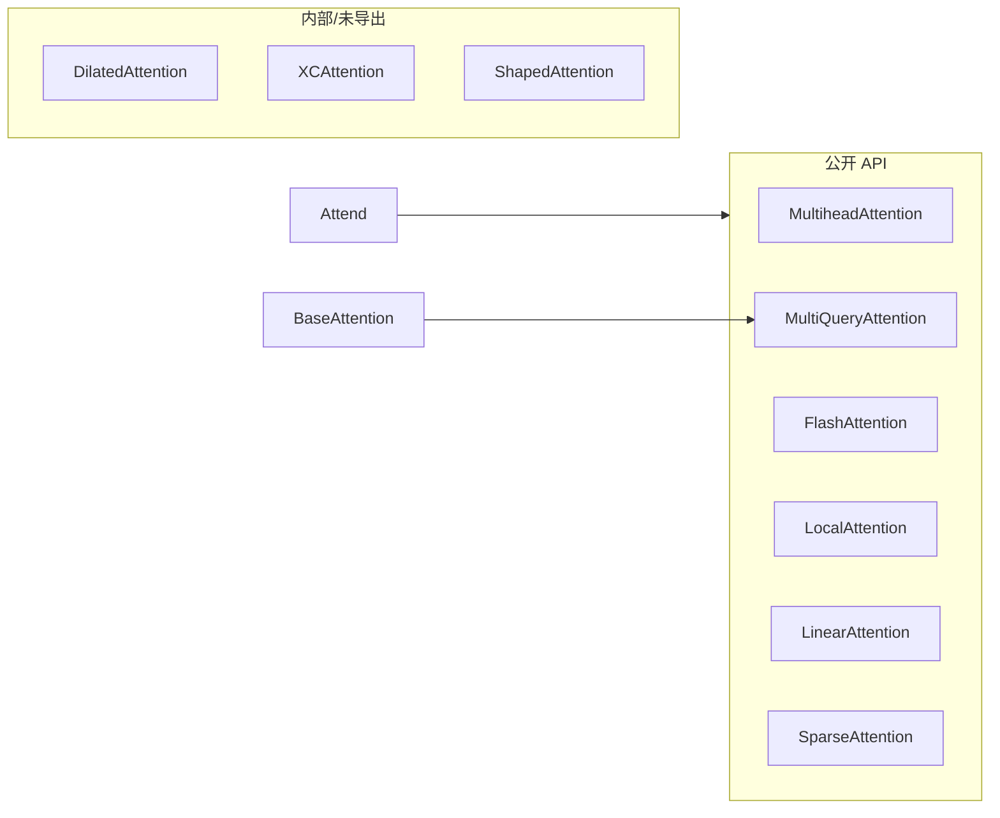

# 第 2 章：注意力机制（zeta.nn.attention）

## 1. 模块边界

`zeta/nn/attention/` 共 **24 个文件**，公开导出 **22 个类/模块**（见 `attention/__init__.py`）。



---

## 2. 标准多头注意力（MHA）

### 2.1 数学原理

给定输入 $X \in \mathbb{R}^{B \times L \times D}$，$H$ 个头：

$$Q_h = XW_Q^h,\; K_h = XW_K^h,\; V_h = XW_V^h$$

$$\text{head}_h = \text{softmax}\!\left(\frac{Q_h K_h^\top}{\sqrt{d_h}} + M\right) V_h$$

$$\text{MHA}(X) = \text{Concat}(\text{head}_1, \ldots, \text{head}_H) W_O$$

其中 $M$ 为注意力掩码（因果、填充、块对角等）。

### 2.2 `MultiheadAttention`

**文件**：`multihead_attention.py`

**关键方法**：
- `__init__(dim, heads, dim_head, dropout, ...)`
- `forward(x, mask=None, context=None)` → `(output, intermediates)`

```python
import torch
from zeta.nn.attention import MultiheadAttention

attn = MultiheadAttention(dim=512, heads=8)
x = torch.randn(2, 64, 512)
out, _ = attn(x)
print(out.shape)  # (2, 64, 512)
```

**复杂度**：$O(L^2 \cdot D)$ 时间，$O(L^2)$ 显存（存储注意力矩阵）。

---

## 3. 多查询注意力（MQA / GQA）

### 3.1 为什么需要

标准 MHA 中每个头有独立 $W_K, W_V$，推理时 KV cache 随头数线性增长。MQA **所有头共享一组 K/V**；GQA（分组查询）折中共享。

**显存节省**：KV cache 从 $O(H \cdot L \cdot d)$ 降至 $O(L \cdot d)$（MQA）。

### 3.2 `MultiQueryAttention`

**文件**：`multiquery_attention.py`

继承 `BaseAttention`，内部使用 `Attend` 模块。

| 组件 | 说明 |
|------|------|
| `LPLayerNorm` | 低精度友好的 LayerNorm |
| `RMSNorm` | 可选 RMS 归一化 |
| `forward` | 返回 `(output, kv_cache, intermediates)` |

```python
import torch
from zeta import MultiQueryAttention

model = MultiQueryAttention(dim=512, heads=8)
x = torch.randn(2, 128, 512)
out, kv, _ = model(x)
```

### 3.3 `MultiGroupedQueryAttn`

**文件**：`multi_grouped_attn.py`

GQA 实现：$G$ 组 KV，$H$ 个 Q 头，每组服务 $H/G$ 个头。

**论文**：[GQA: Training Generalized Multi-Query Transformer Models](https://arxiv.org/abs/2305.13245)

---

## 4. Flash Attention

### 4.1 原理

Flash Attention 通过 **分块计算 + 在线 softmax** 避免物化完整 $L \times L$ 注意力矩阵：

$$\text{softmax}(S) V = \text{分块累积}\left(\exp(S_{ij} - m_i)\right)$$

IO 复杂度从 $O(L^2)$ 降至 $O(L^2 / M)$（$M$ 为 SRAM 大小），其中 $M$ 为片上内存。

### 4.2 `FlashAttention`

**文件**：`flash_attention.py`

封装 `torch.nn.functional.scaled_dot_product_attention` 的 flash 后端。

**参考**：
- 论文：[FlashAttention-2](https://arxiv.org/abs/2307.08691)
- 实现：[Dao-AILab/flash-attention](https://github.com/Dao-AILab/flash-attention)

---

## 5. 线性注意力

### 5.1 原理

利用核技巧或特征映射，将 softmax 注意力近似为：

$$\text{Attention}(Q,K,V) \approx \phi(Q)\left(\phi(K)^\top V\right)$$

复杂度 $O(L \cdot D^2)$，适合极长序列。

### 5.2 实现类

| 类 | 文件 | 特点 |
|----|------|------|
| `LinearAttention` | `linear_attn_l.py` | 通用线性注意力 |
| `LinearAttentionVision` | `linear_attention.py` | 视觉优化版 |
| `LinearizedAttention` | `linearized_attention.py` | 线性化近似 |
| `SpatialLinearAttention` | `spatial_linear_attention.py` | 2D 空间线性注意力 |

**论文**：[Transformers are RNNs](https://arxiv.org/abs/2006.16236)（线性 Transformer）

---

## 6. 局部注意力

### 6.1 `LocalAttention` / `LocalMHA`

**文件**：`local_attention.py`, `local_attention_mha.py`

将序列分为窗口，每个 token 只 attend 窗口内 token：

$$\text{Attn}(x_i) = \sum_{j \in \mathcal{W}(i)} \alpha_{ij} v_j$$

**复杂度**：$O(L \cdot w)$，$w$ 为窗口大小。

依赖 `local-attention` 包。

**适用**：长文档、基因组、高分辨率特征图展平序列。

---

## 7. 稀疏注意力

### 7.1 `SparseAttention`

**文件**：`sparse_attention.py`

仅保留 Top-K 注意力分数，其余置 $-\infty$：

$$\alpha_{ij} = \begin{cases} \text{softmax}(s_{ij}) & s_{ij} \in \text{TopK}(s_{i,:}) \\ 0 & \text{otherwise} \end{cases}$$

**适用**：极长序列的近似全局注意力。

---

## 8. 混合注意力

### 8.1 `MixtureOfAttention` / `MixtureOfAutoregressiveAttention`

**文件**：`mixture_attention.py`

多个注意力「专家」加权组合，类似 MoE 但在注意力层：

$$\text{out} = \sum_k g_k(x) \cdot \text{Attn}_k(x)$$

---

## 9. 多模态注意力

| 类 | 文件 | 作用 |
|----|------|------|
| `MultiModalCrossAttention` | `cross_attn_images.py` | 图像-文本交叉注意力 |
| `MultiModalCausalAttention` | `multi_modal_causal_attention.py` | 多模态因果自注意力 |
| `SimpleMMCA` | 同上 | 简化版 MMCA |

**交叉注意力**：

$$\text{CrossAttn}(Q_{\text{text}}, K_{\text{img}}, V_{\text{img}})$$

文本 query 查询图像 key/value，是 VLM 的核心操作。

---

## 10. 其他注意力变体

### 10.1 `AgentSelfAttention`

**文件**：`agent_attn.py`

Agent token 聚合全局信息，减少全序列 attend 开销（Agent Attention 范式）。

### 10.2 `ScalableImgSelfAttention`

**文件**：`scalable_img_self_attn.py`

面向高分辨率图像的可扩展自注意力（可能结合下采样或稀疏模式）。

### 10.3 `SigmoidAttention`（在 `nn.modules`）

用 sigmoid 替代 softmax：

$$\alpha_{ij} = \sigma(s_{ij}), \quad \text{out}_i = \sum_j \alpha_{ij} v_j$$

无需归一化约束，论文声称约 18% 加速。见 `sigmoid_attn.py`。

### 10.4 内部模块（直接导入）

| 类 | 文件 | 说明 |
|----|------|------|
| `DilatedAttention` | `dilated_attention.py` | 膨胀窗口注意力 |
| `XCAttention` | `xc_attention.py` | 跨通道注意力 |
| `ShapedAttention` | `shaped_attention.py` | 形状约束注意力 |
| `CrossAttention` | `cross_attention.py` | 通用交叉注意力 |
| `BaseAttention` | `base.py` | MQA 等基类 |

---

## 11. 核心计算模块 `Attend`

**文件**：`attend.py`

**类 `Attend`** — 被几乎所有注意力模块复用。

| 方法/属性 | 功能 |
|-----------|------|
| `forward(q, k, v, mask, ...)` | 执行缩放点积注意力 |
| `flash` | 启用 Flash 后端 |
| `causal` | 因果掩码 |
| `talking_heads` | 头间 1×1 卷积混合 |
| `sparse_topk` | Top-K 稀疏 |
| `qk_norm` | QK 归一化 |

**类 `Intermediates`**：保存 `qk_similarities`, `pre_softmax_attn`, `post_softmax_attn` 用于可视化/蒸馏。

**类 `CascadingHeads`**：级联头结构（高级用法）。

---

## 12. 选型对比表

| 机制 | 时间复杂度 | 显存 | 长序列 | 质量 | 典型场景 |
|------|-----------|------|--------|------|----------|
| MHA | $O(L^2D)$ | 高 | 差 | 最好 | 通用 LM ≤4K |
| MQA/GQA | $O(L^2D)$ | **低 KV** | 中 | 接近 MHA | 推理优化 |
| Flash MHA | $O(L^2D)$ | **低** | 中 | 最好 | 训练/推理默认 |
| Linear | $O(LD^2)$ | 低 | **好** | 近似 | >32K 序列 |
| Local | $O(LwD)$ | 低 | **好** | 窗口依赖 | 长文档 |
| Sparse Top-K | $O(LKD)$ | 中 | 好 | 近似 | 极长序列 |

---

## 13. 可运行综合示例

```python
import torch
from zeta.nn.attention import (
    MultiheadAttention,
    MultiQueryAttention,
    LocalMHA,
    FlashAttention,
)

B, L, D, H = 2, 256, 512, 8
x = torch.randn(B, L, D)

# 1. 标准 MHA
mha = MultiheadAttention(dim=D, heads=H)
out_mha, _ = mha(x)

# 2. 多查询注意力（省 KV cache）
mqa = MultiQueryAttention(dim=D, heads=H)
out_mqa, kv, _ = mqa(x)

# 3. 局部注意力 MHA
local = LocalMHA(dim=D, heads=H, window_size=64)
out_local = local(x)

print(out_mha.shape, out_mqa.shape, out_local.shape)
# 均为 (2, 256, 512)
```

---

## 14. 参考文献

| 算法 | 论文 | 博客/实现 |
|------|------|-----------|
| Transformer | [1706.03762](https://arxiv.org/abs/1706.03762) | [The Annotated Transformer](http://nlp.seas.harvard.edu/annotated-transformer/) |
| MQA | [1911.02150](https://arxiv.org/abs/1911.02150) | — |
| GQA | [2305.13245](https://arxiv.org/abs/2305.13245) | — |
| FlashAttention | [2205.14135](https://arxiv.org/abs/2205.14135), [2307.08691](https://arxiv.org/abs/2307.08691) | [Dao-AILab](https://github.com/Dao-AILab/flash-attention) |
| Linear Attention | [2006.16236](https://arxiv.org/abs/2006.16236) | — |
| Sigmoid Attention | 见 Zeta README | `nn.modules.sigmoid_attn` |

---

上一章：[02-structs.md](./02-structs.md) | 下一章：[04-embeddings-biases-masks.md](./04-embeddings-biases-masks.md)
