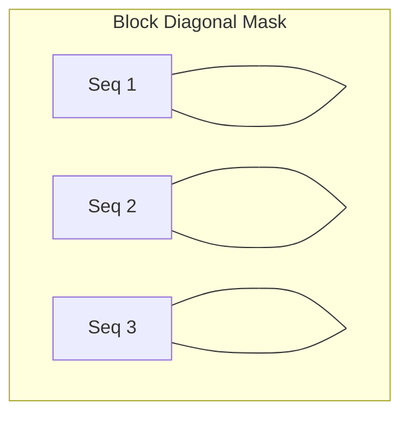
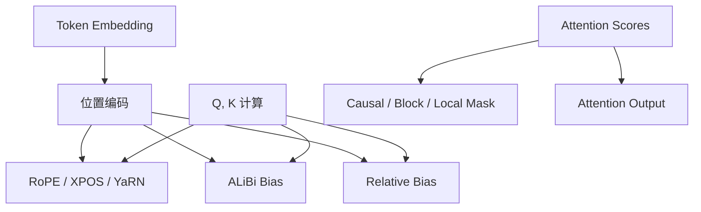

# 第 3 章：嵌入、位置偏置与掩码

涵盖 `zeta/nn/embeddings`、`zeta/nn/biases`、`zeta/nn/masks` 三个子包。

---

## 1. 嵌入层（embeddings）

### 1.1 模块清单

| 文件 | 公开类/函数 | 作用 |
|------|-------------|------|
| `embedding.py` | `BaseEmbedding`, `Embedding`, `TextEmbedding` | 通用 token 嵌入 |
| `abc_pos_emb.py` | `AbsolutePositionalEmbedding` | 可学习绝对位置 |
| `positional.py` | `PositionalEmbedding` | 正弦/可学习位置 |
| `sinusoidal.py` | `SinusoidalEmbeddings` | 固定正弦编码 |
| `scaled_sinusoidal_embeddings.py` | `ScaledSinusoidalEmbedding` | 缩放正弦 |
| `sine_positional.py` | `SinePositionalEmbedding` | 正弦位置变体 |
| `rope.py` | `RotaryEmbedding` | 旋转位置编码 RoPE |
| `truncated_rope.py` | `TruncatedRotaryEmbedding` | 截断 RoPE（长上下文外推） |
| `xpos_relative_position.py` | `XPOS`, `apply_rotary_pos_emb`, `rotate_every_two` | 扩展位置外推 XPOS |
| `yarn.py` | `YarnEmbedding` | YaRN 长上下文缩放 |
| `mi_rope.py` | `MIRoPE` | 多模态交错 RoPE |
| `positional_interpolation.py` | `PositionInterpolationEmbeddings` | 位置插值（PI） |
| `vision_emb.py` | `VisionEmbedding` | 图像 patch 嵌入 |
| `vis_lang_emb.py` | `VisionLanguageEmbedding` | 视觉-语言联合嵌入 |
| `multiway_network.py` | `MultiwayNetwork`, `MultiwayEmbedding`, `MultiwayWrapper`, `set_split_position` | 多路径嵌入（双语等） |
| `nominal_embeddings.py` | `NominalEmbedding` | 标称/类别嵌入 |
| `qft_embeddings.py` | `QFTSPEmbeddings` | 量子傅里叶特征嵌入 |
| `qfsp_embeddings.py` | `QFTSPEmbedding` | QFT 单嵌入变体 |
| `patch_embedding.py` | `PatchEmbeddings` *(未导出)* | Patch 嵌入 |

### 1.2 RoPE（Rotary Position Embedding）

**是什么**：将位置信息编码为 Q/K 的旋转变换，保持相对位置不变性。

**公式**：对维度对 $(2i, 2i+1)$：

$$\begin{pmatrix} q'_{2i} \\ q'_{2i+1} \end{pmatrix} = \begin{pmatrix} \cos m\theta_i & -\sin m\theta_i \\ \sin m\theta_i & \cos m\theta_i \end{pmatrix} \begin{pmatrix} q_{2i} \\ q_{2i+1} \end{pmatrix}$$

其中 $m$ 为位置，$\theta_i = 10000^{-2i/d}$。

**为什么需要**：比绝对位置嵌入更好地泛化到更长序列；已成为 LLaMA、Mistral 等主流选择。

```python
import torch
from zeta.nn.embeddings import RotaryEmbedding, apply_rotary_pos_emb

rope = RotaryEmbedding(dim=64)
x = torch.randn(2, 128, 64)
positions = torch.arange(128)
rotated = rope(x, positions)
```

**论文**：[RoFormer](https://arxiv.org/abs/2104.09864)

### 1.3 XPOS / YaRN（长上下文外推）

**XPOS**：指数衰减的位置缩放，缓解 train-short / infer-long 的性能下降。

**YaRN**：分段频率插值 + 温度缩放：

$$\theta'_i = \theta_i \cdot \left(\alpha \cdot \frac{L_{\text{train}}}{L_{\text{target}}} + (1-\alpha)\right)$$

- XPOS 论文：[2311.05637](https://arxiv.org/abs/2311.05637) 相关
- YaRN 论文：[2309.00071](https://arxiv.org/abs/2309.00071)

### 1.4 `VisionEmbedding`

将图像分割为 patch 并线性投影：

$$z_0 = [x_{\text{cls}}; x_p^1 E; \ldots; x_p^N E] + E_{\text{pos}}$$

```python
import torch
from zeta.nn import VisionEmbedding

emb = VisionEmbedding(img_size=224, patch_size=16, embed_dim=768)
img = torch.rand(1, 3, 224, 224)
out = emb(img)
print(out.shape)  # (1, num_patches+1, 768) 若含 CLS
```

---

## 2. 注意力偏置（biases）

### 2.1 模块清单

| 文件 | 类 | 作用 |
|------|-----|------|
| `base.py` | `BaseBias` | 偏置基类 |
| `alibi.py` | `AlibiPositionalBias`, `LearnedAlibiPositionalBias` | ALiBi 线性偏置 |
| `relative_position_bias.py` | `RelativePositionBias` | T5 风格相对位置桶 |
| `dynamic_position_bias.py` | `DynamicPositionBias` | 动态生成位置偏置 |

### 2.2 ALiBi（Attention with Linear Biases）

**公式**：对第 $h$ 个头，距离为 $d = |i - j|$：

$$b_{ij}^{(h)} = -m_h \cdot d$$

其中 $m_h$ 为头特定斜率（几何序列）。

**优点**：无需位置嵌入；外推性较好。  
**论文**：[Train Short, Test Long](https://arxiv.org/abs/2108.12409)

```python
import torch
from zeta.nn import RelativePositionBias

bias = RelativePositionBias()
b = bias(1, 10, 10)  # (heads, 10, 10)
```

### 2.3 `RelativePositionBias`

将相对距离分桶，查嵌入表得偏置（T5/BART 风格）：

$$b_{ij} = \text{Embed}(\text{bucket}(i - j))$$

---

## 3. 注意力掩码（masks）

### 3.1 模块清单（`masks/attn_masks.py`）

| 类/函数 | 作用 |
|---------|------|
| `_materialize_causal_mask` | 物化因果掩码 |
| `LowerTriangularMask` | 下三角因果掩码 |
| `LowerTriangularFromBottomRightMask` | 右下对齐因果掩码 |
| `LocalAttentionFromBottomRightMask` | 局部+右下对齐 |
| `LowerTriangularMaskWithTensorBias` | 带张量偏置的因果掩码 |
| `BlockDiagonalMask` | 块对角（多序列打包） |
| `BlockDiagonalCausalMask` | 块对角+因果 |
| `BlockDiagonalCausalFromBottomRightMask` | 块对角因果右下 |
| `BlockDiagonalCausalWithOffsetPaddedKeysMask` | 带偏移填充 |
| `BlockDiagonalCausalLocalAttentionMask` | 块对角+局部 |
| `BlockDiagonalCausalLocalAttentionFromBottomRightMask` | 组合掩码 |
| `AttentionBias` | 通用偏置封装 |
| `_SeqLenInfo` / `_PaddedSeqLenInfo` | 序列长度元信息 |

**`block_diagonal.py`**（未导出）：`get_mask` 辅助函数。

### 3.2 因果掩码

防止位置 $i$ 看到 $j > i$：

$$M_{ij} = \begin{cases} 0 & j \leq i \\ -\infty & j > i \end{cases}$$

$$\text{Attn} = \text{softmax}(S + M) V$$

### 3.3 块对角掩码

将多个独立序列打包为一个 batch 维度的长序列，块对角确保序列间不互看：



**用途**：Flash Attention 变长序列高效训练（类似 `cu_seqlens` 打包）。

---

## 4. 概念关系图



---

## 5. 选型指南

| 场景 | 推荐 |
|------|------|
| 现代 LLM（LLaMA 类） | `RotaryEmbedding` + 因果掩码 |
| 需训练短/推理长 | `YaRN` / `XPOS` / `ALiBi` |
| Encoder（BERT 类） | `SinusoidalEmbeddings` 或 `RelativePositionBias` |
| 视觉 Transformer | `VisionEmbedding` + 2D 正弦位置 |
| 多模态 | `MIRoPE` / `VisionLanguageEmbedding` |
| 变长打包训练 | `BlockDiagonalCausalMask` |

---

上一章：[03-attention.md](./03-attention.md) | 下一章：[05-ssm-mamba.md](./05-ssm-mamba.md)
