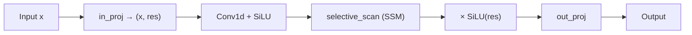

# 第 4 章：状态空间模型（SSM / Mamba）

涵盖 `ssm.py`、`simple_mamba.py`、`p_scan.py`、`h3.py`、`u_mamba.py`、`s4.py`、`vision_mamba.py` 等。

---

## 1. 连续状态空间模型基础

### 1.1 连续时间 SSM

$$\dot{h}(t) = A h(t) + B x(t), \quad y(t) = C h(t) + D x(t)$$

- $h \in \mathbb{R}^N$：隐状态
- $A, B, C, D$：系统矩阵

### 1.2 离散化（Zero-Order Hold）

步长 $\Delta_t$：

$$\bar{A}_t = \exp(\Delta_t A), \quad \bar{B}_t = (\Delta_t A)^{-1}(\exp(\Delta_t A) - I) \cdot \Delta_t B$$

简化为：

$$h_{t+1} = \bar{A}_t h_t + \bar{B}_t x_t, \quad y_t = C_t h_t + D x_t$$

### 1.3 与 RNN / Transformer 对比

| 特性 | RNN | Transformer | SSM/Mamba |
|------|-----|-------------|-----------|
| 训练并行 | 差 | **好** | **好**（扫描算法） |
| 推理复杂度 | $O(1)$/步 | $O(L)$ KV | $O(1)$/步 |
| 长程依赖 | 梯度消失 | 全局 | 结构化状态 |
| 内容感知 | 是 | 是 | Mamba：**选择性** |

---

## 2. 核心模块

### 2.1 `selective_scan` / `selective_scan_seq`

**文件**：`ssm.py`

| 函数 | 作用 |
|------|------|
| `selective_scan(x, delta, A, B, C, D)` | 并行扫描版选择性扫描 |
| `selective_scan_seq(...)` | 顺序循环版（调试/对照） |

**算法**（Mamba 论文 Algorithm 2）：

$$\delta A_t = \exp(\Delta_t \otimes A)$$
$$\delta B_t = \Delta_t \otimes B_t$$
$$h_t = \delta A_t \odot h_{t-1} + \delta B_t \odot x_t$$
$$y_t = C_t^\top h_t + D \odot x_t$$

```python
import torch
from zeta.nn.modules.ssm import selective_scan, selective_scan_seq

B, L, ED, N = 2, 128, 64, 16
x = torch.randn(B, L, ED)
delta = torch.randn(B, L, ED)
A = torch.randn(ED, N)
Bv = torch.randn(B, L, N)
C = torch.randn(B, L, N)
D = torch.randn(ED)

y_parallel = selective_scan(x, delta, A, Bv, C, D)
y_seq = selective_scan_seq(x, delta, A, Bv, C, D, ED, N)
```

### 2.2 `PScan` / `pscan`

**文件**：`p_scan.py`

并行前缀扫描（Parallel Scan），将递推 $h_t = a_t h_{t-1} + b_t$ 在 $O(\log L)$ 深度并行计算。

| 符号 | 作用 |
|------|------|
| `PScan` | `nn.Module` 封装 |
| `pscan` | 函数式 API |

**参考**：[Parallel Prefix Sum (Blelloch)](https://www.cs.cmu.edu/~guyb/papers/pdf/BlellochPrefix.pdf)

### 2.3 `SSM`

**文件**：`ssm.py`

| 类/方法 | 作用 |
|---------|------|
| `SSM.__init__` | 初始化投影层与状态参数 |
| `SSM.forward` | 完整 SSM 前向 |

### 2.4 `MambaBlock`

**文件**：`simple_mamba.py`

单块 Mamba，结构（论文 Figure 3）：



| 方法 | 作用 |
|------|------|
| `__init__` | 配置 dim, depth, d_state, expand, d_conv |
| `forward(x)` | `(B,L,D) → (B,L,D)` |
| `ssm(x)` | 计算 Δ, A, B, C 并调用 selective_scan |
| `selective_scan(u, delta, A, B, C, D)` | 离散化 + 扫描 |

```python
import torch
from zeta.nn import MambaBlock

block = MambaBlock(dim=64, depth=1)
x = torch.randn(1, 128, 64)
y = block(x)
print(y.shape)  # (1, 128, 64)
```

### 2.5 `Mamba`

**文件**：`simple_mamba.py`

完整 Mamba LM：嵌入 + 多层 `MambaBlock` + 输出头。

| 方法 | 作用 |
|------|------|
| `forward(x, img_features=None)` | 支持可选图像特征融合 |

### 2.6 `H3Layer`

**文件**：`h3.py`

H3（Hungry Hungry Hippos）层：SSM + 局部卷积混合，Mamba 的前身之一。

**论文**：[Hungry Hungry Hippos](https://arxiv.org/abs/2203.04947)

### 2.7 `UMambaBlock`

**文件**：`u_mamba.py`

U-Net 风格的 Mamba 块，用于视觉分割等编码器-解码器结构。

### 2.8 `VisionMambaBlock`（未导出）

**文件**：`vision_mamba.py`

面向 2D 视觉的 Mamba 变体（可能含双向扫描）。

### 2.9 `s4d_kernel`（未导出）

**文件**：`s4.py`

S4 对角化核函数，结构化状态空间经典方法。

**论文**：[Efficiently Modeling Long Sequences with Structured State Spaces](https://arxiv.org/abs/2111.00396)

---

## 3. 数学推导：选择性机制

标准 LTI SSM 中 $A, B, C$ 固定，无法做内容相关的信息过滤。Mamba 令：

$$\Delta_t = \text{softplus}(\text{Linear}(\bar{x}_t))$$
$$B_t = \text{Linear}(\bar{x}_t), \quad C_t = \text{Linear}(\bar{x}_t)$$

使模型能 **选择** 将信息写入状态或忽略（类似输入门）。

**直觉**：$\Delta_t$ 大 → $\bar{A}_t \approx 0$ → 重置状态，关注当前输入；$\Delta_t$ 小 → 保留历史。

---

## 4. 与 Transformer 组合

常见混合架构：

```
[Transformer Block] × N₁ → [Mamba Block] × N₂ → [Transformer Block] × N₃
```

Zeta 中可手动交替 `TransformerBlock` 与 `MambaBlock`。

---

## 5. 参考文献与开源

| 资源 | 链接 |
|------|------|
| Mamba 论文 | [Mamba: Linear-Time Sequence Modeling with Selective State Spaces](https://arxiv.org/abs/2312.00752) |
| 官方实现 | [state-spaces/mamba](https://github.com/state-spaces/mamba) |
| Annotated S4 | [The Annotated S4](https://srush.github.io/annotated-s4/) |
| H3 | [2203.04947](https://arxiv.org/abs/2203.04947) |
| S4 | [2111.00396](https://arxiv.org/abs/2111.00396) |
| 代码对照 | `mamba_simple.py`, `selective_scan_interface.py` |

---

上一章：[04-embeddings-biases-masks.md](./04-embeddings-biases-masks.md) | 下一章：[06-moe.md](./06-moe.md)
